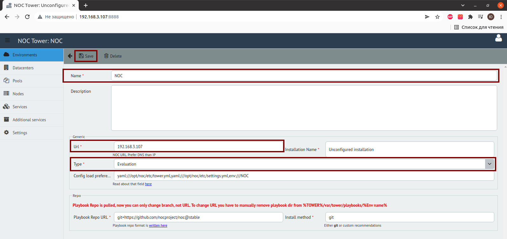

# Деплоим NOC

## Необходимо сменить пароль администратора

1. Навести курсор в правый верхний угол и нажать `Change Password…`

## Cоздать окружение (Environment)

1. `Environments` → `Create new`
2. В поле Url вводим днс имя, если его нет, то вводим IP адрес сервера где будет находиться NOC
3. В поле Type — указываем Evaluation или Production  
4. Дальше сохраняем, нажав кнопку Save

## Создать датацентр(Datacenters)

1. `Datacenters` → `Create new`
2. Вводим в поле Name имя dc1 и нажимаем `Save`

## Скачать новые файлы плейбуков для установки [(Pools)](https://code.getnoc.com/noc/noc/-/edit/master/docs/en/docs/user/reference/concepts/pool/index.md)

1. `Environments` → `Pull`
2. Дожидаемся уведомления `Pull complete`

## Добавить машины (Nodes)

1. `Nodes` → `Create new`
2. В поле Name вводим имя сервера которое станет его хостнеймом,например centos7-02
3. В поле Datacenter выбрать dc1
4. В поле Node Type выбрать Linux, если ставите NOC на сервер с ОС семейства Linux, если ОС FreeBSD, то выбираем FreeBSD
5. В поле IP Address вводим ip-адрес сервера куда будет задеплоен NOC
6. В поле Login As вводим ansible
7. Нажимаем `Save`

## Выбираем сервисы, которые необходимо задеплоить (Services)

### Singlenode installation

1. Ставим флажки напротив следующих сервисов:
	* [activator](https://docs.getnoc.com/master/en/admin/reference/services/activator/)
	* [bi](https://docs.getnoc.com/master/en/admin/reference/services/bi/)
	* [card](https://docs.getnoc.com/master/en/admin/reference/services/card/)
	* [ch_datasource](https://docs.getnoc.com/master/en/admin/reference/services/datasource/)
	* [chwriter](https://docs.getnoc.com/master/en/admin/reference/services/chwriter/)
	* [classifier](https://docs.getnoc.com/master/en/admin/reference/services/classifier/)
	* clickhouse
	* consul
	* consul-template
	* [correlator](https://docs.getnoc.com/master/en/admin/reference/services/correlator/)
	* [datastream](https://docs.getnoc.com/master/en/admin/reference/services/datastream/)
	* [discovery](https://docs.getnoc.com/master/en/admin/reference/services/discovery/)
	* [escalator](https://docs.getnoc.com/master/en/admin/reference/services/escalator/)
	* goss
	* grafana
	* [grafanads](https://docs.getnoc.com/master/en/admin/reference/services/grafanads/)
	* liftbridge
	* [login](https://docs.getnoc.com/master/en/admin/reference/services/login/)
	* [mailsender](https://docs.getnoc.com/master/en/admin/reference/services/mailsender/)
	* [mib](https://docs.getnoc.com/master/en/admin/reference/services/mib/)
	* mongod
	* [mrt](https://docs.getnoc.com/master/en/admin/reference/services/mrt/)
	* nats
	* nginx
	* noc
	* [ping](https://docs.getnoc.com/master/en/admin/reference/services/ping)
	* postgres
	* [sae](https://docs.getnoc.com/master/en/admin/reference/services/sae/)
	* [scheduler](https://docs.getnoc.com/master/en/admin/reference/services/scheduler/)
	* [selfmon](https://docs.getnoc.com/master/en/admin/reference/services/selfmon/)
	* [syslogcollector](https://docs.getnoc.com/master/en/admin/reference/services/syslogcollector/)
	* [trapcollector](https://docs.getnoc.com/master/en/admin/reference/services/trapcollector/)
	* [web](https://docs.getnoc.com/master/en/admin/reference/services/web/)

2. Нажимаем кнопку Save

### Multinode installation

1. todo!

## 7)Деплоим сервисы NOC

1. Переходим во вкладку `Environments`, нажимаем на кнопку `Deploy` и устанавливаем сервисы NOC’а на сервер

