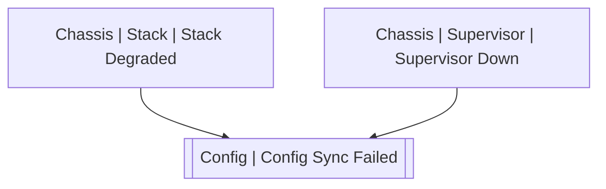

# Config | Config Sync Failed

## Symptoms

## Probable Causes

## Recommended Actions

## Variables

Variable | Description | Default
--- | --- | ---
config | Config type | {{ no }}

## Alarm Correlation

Scheme of correlation of `Config | Config Sync Failed` alarms with other alarms is on the chart. 
Arrows are directed from root cause to consequences.

### Root Causes
`Config | Config Sync Failed` alarm may be consequence of

Alarm Class | Description
--- | ---
[Chassis \| Stack \| Stack Degraded](../chassis/stack/stack-degraded.md) | Stack Degraded
[Chassis \| Supervisor \| Supervisor Down](../chassis/supervisor/supervisor-down.md) | Supervisor Down
