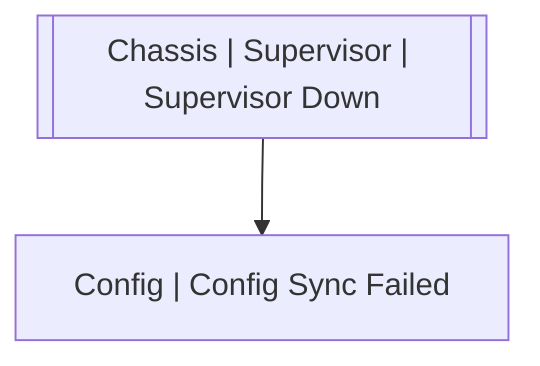

# Chassis | Supervisor | Supervisor Down

## Symptoms

## Probable Causes

## Recommended Actions

## Variables

Variable | Description | Default
--- | --- | ---
name | Supervisor name | {{ no }}
reason | Reason | {{ no }}

## Alarm Correlation

Scheme of correlation of `Chassis | Supervisor | Supervisor Down` alarms with other alarms is on the chart. 
Arrows are directed from root cause to consequences.

### Consequences
`Chassis | Supervisor | Supervisor Down` alarm may be root cause of

Alarm Class | Description
--- | ---
[Config \| Config Sync Failed](../../config/config-sync-failed.md) | Supervisor Down

## Events

### Opening Events
`Chassis | Supervisor | Supervisor Down` may be raised by events

Event Class | Description
--- | ---
[Chassis \| Supervisor \| Supervisor Down](../../../event-classes/chassis/supervisor/supervisor-down.md) | dispose

### Closing Events
`Chassis | Supervisor | Supervisor Down` may be cleared by events

Event Class | Description
--- | ---
[Chassis \| Supervisor \| Supervisor Up](../../../event-classes/chassis/supervisor/supervisor-up.md) | dispose
