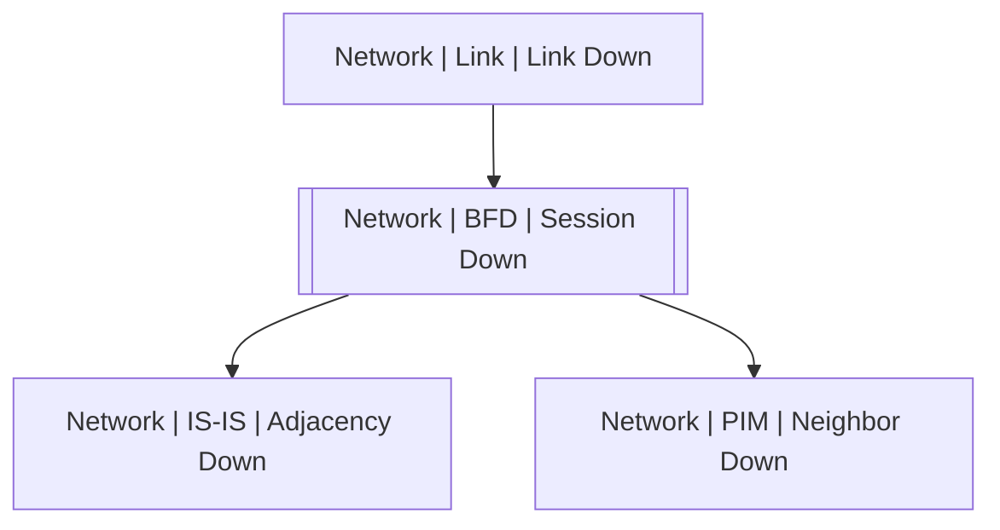

# Network | BFD | Session Down

## Symptoms

## Probable Causes

## Recommended Actions

## Variables

Variable | Description | Default
--- | --- | ---
interface | BFD interface | {{ no }}
peer | BFD Peer | {{ no }}
description | Interface description | `=InterfaceDS.description`

## Alarm Correlation

Scheme of correlation of `Network | BFD | Session Down` alarms with other alarms is on the chart. 
Arrows are directed from root cause to consequences.

### Root Causes
`Network | BFD | Session Down` alarm may be consequence of

Alarm Class | Description
--- | ---
[Network \| Link \| Link Down](../link/link-down.md) | Link Down

### Consequences
`Network | BFD | Session Down` alarm may be root cause of

Alarm Class | Description
--- | ---
[Network \| IS-IS \| Adjacency Down](../is-is/adjacency-down.md) | Link Down
[Network \| PIM \| Neighbor Down](../pim/neighbor-down.md) | Link Down

## Events

### Opening Events
`Network | BFD | Session Down` may be raised by events

Event Class | Description
--- | ---
[Network \| BFD \| Session Down](../../../event-classes/network/bfd/session-down.md) | dispose

### Closing Events
`Network | BFD | Session Down` may be cleared by events

Event Class | Description
--- | ---
[Network \| BFD \| Session Up](../../../event-classes/network/bfd/session-up.md) | dispose
