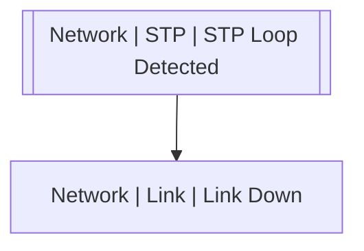

# Network | STP | STP Loop Detected

## Symptoms

## Probable Causes

## Recommended Actions

## Variables

Variable | Description | Default
--- | --- | ---
interface | interface | {{ no }}
description | Interface description | `=InterfaceDS.description`

## Alarm Correlation

Scheme of correlation of `Network | STP | STP Loop Detected` alarms with other alarms is on the chart. 
Arrows are directed from root cause to consequences.

### Consequences
`Network | STP | STP Loop Detected` alarm may be root cause of

Alarm Class | Description
--- | ---
[Network \| Link \| Link Down](../link/link-down.md) | STP Loop Detected

## Events

### Opening Events
`Network | STP | STP Loop Detected` may be raised by events

Event Class | Description
--- | ---
[Network \| STP \| STP Loop Detected](../../../event-classes/network/stp/stp-loop-detected.md) | dispose

### Closing Events
`Network | STP | STP Loop Detected` may be cleared by events

Event Class | Description
--- | ---
[Network \| STP \| STP Loop Cleared](../../../event-classes/network/stp/stp-loop-cleared.md) | dispose
