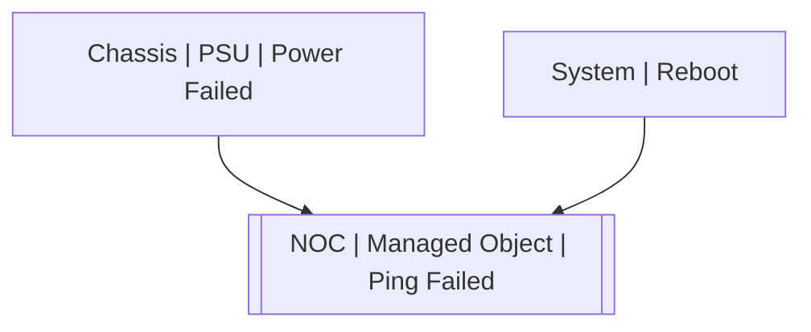

# NOC | Managed Object | Ping Failed

## Symptoms

Cannot execute SA tasks on the object

## Probable Causes

The object is not responding to ICMP echo-requests

## Recommended Actions

Check object is alive. Check routing to this object. Check firewalls

## Alarm Correlation

Scheme of correlation of `NOC | Managed Object | Ping Failed` alarms with other alarms is on the chart. 
Arrows are directed from root cause to consequences.

### Root Causes
`NOC | Managed Object | Ping Failed` alarm may be consequence of

Alarm Class | Description
--- | ---
[Chassis \| PSU \| Power Failed](../../chassis/psu/power-failed.md) | Power Failed
[System \| Reboot](../../system/reboot.md) | System Reboot

## Events

### Opening Events
`NOC | Managed Object | Ping Failed` may be raised by events

Event Class | Description
--- | ---
[NOC \| Managed Object \| Ping Failed](../../../event-classes/noc/managed-object/ping-failed.md) | dispose

### Closing Events
`NOC | Managed Object | Ping Failed` may be cleared by events

Event Class | Description
--- | ---
[NOC \| Managed Object \| Ping OK](../../../event-classes/noc/managed-object/ping-ok.md) | dispose
