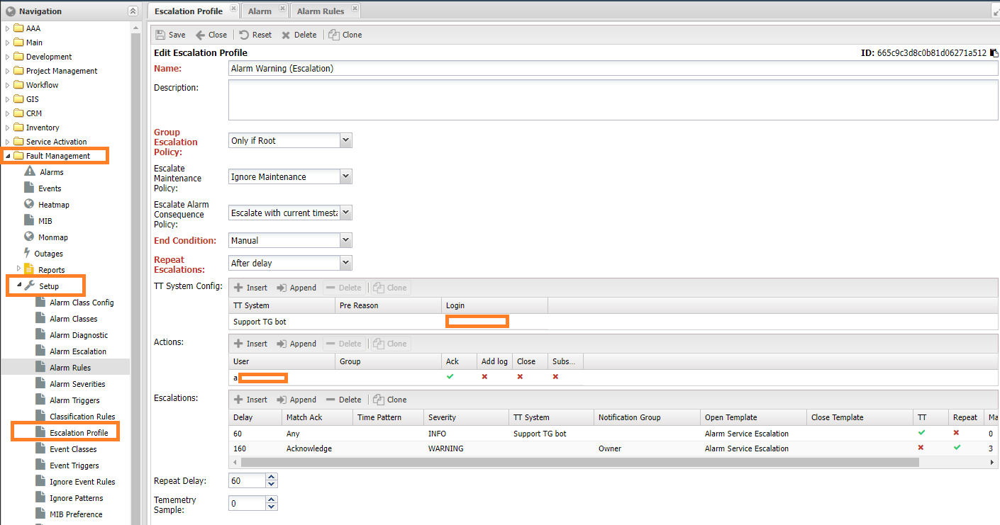
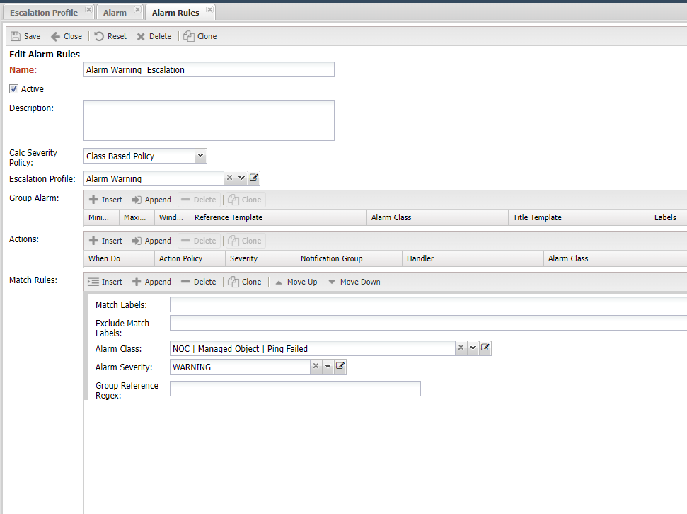
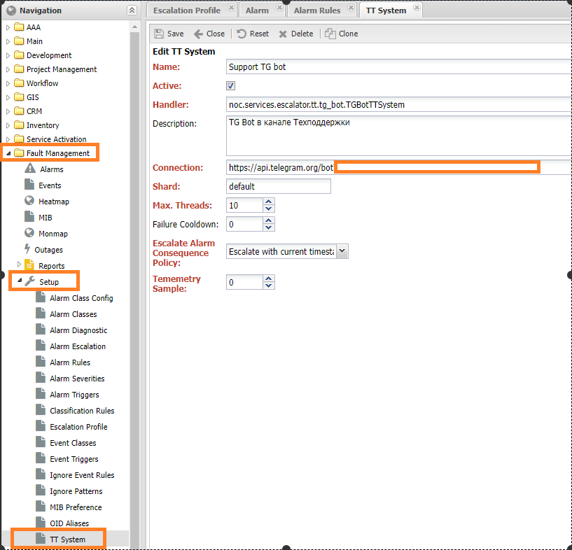
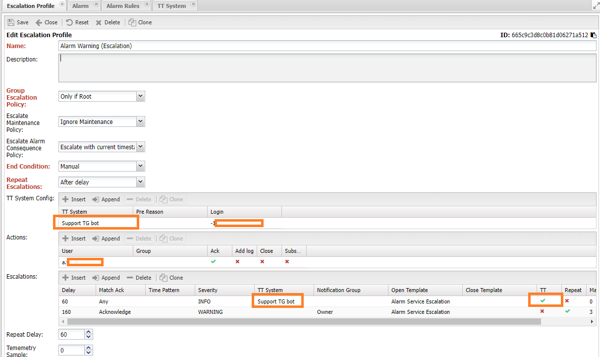
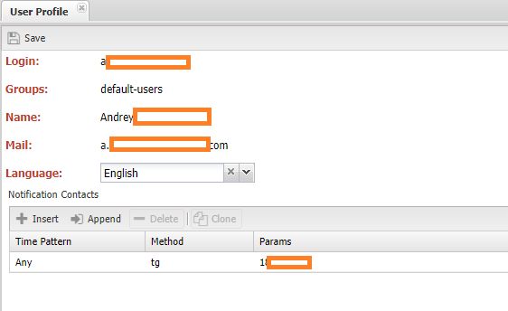
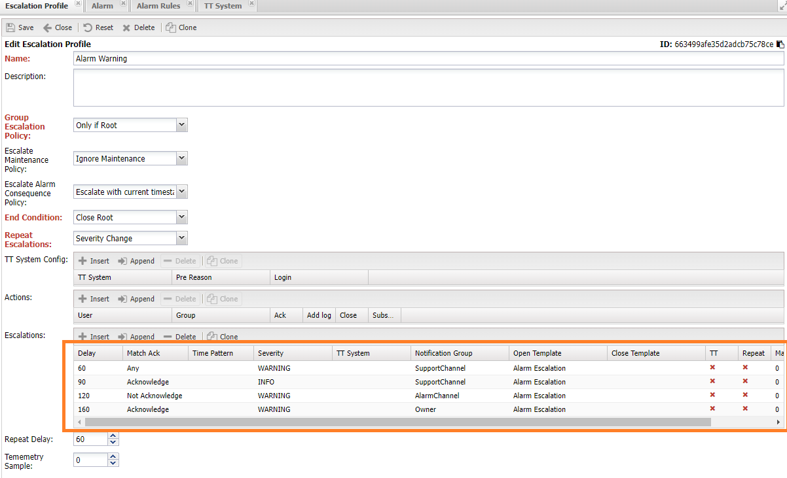

# Описание настройки эскалации аварий

Механизм эскалации позволяет передать сведения об *аварии* (*Alarm*) внешнему адресату. Это может быть человек (контакт) или внешняя система (*TT Система* в терминах НОКа), что позволяет организовать работу с аварией без доступа к системе. В общем виде *эскалация* (*Escalation*) представляет собой цепочку *действий* (*Action*), разделённые временным интервалом. В дополнении к интервалу доступны условия по *Важности* (*Severity*) и *Зона ответственности* (*Administrative Domain*) аварии. При наступлении времени доступно одно из следующих действий:

* Отправка уведомления
* Создание документа во внешней системе
* Подтверждение (*Ack*) аварии

После успешного выполнения действия эскалация приостанавливается до наступления следующего шага (*step*) и так до конца цепочки. По окончании эскалации возможно выполнение финального действия:

* Завершить эскалацию
* Закрыть аварию
* Повторить эскалацию

## Начало работы с эскалациями

Для работы с эскалациями в НОКе выделен отдельный сервис - **Эскалатор** (*Escalator*), необходимо проверить что он установлен и корректно функционирует. ~~ссылка на инструкцию~~ Настройки эскалации описываются в разделе  **Профили эскалации** (*Escalation Profile*), а назначение его аварии в разделе **Правила аварии** (*Alarm Rules*), оба раздела расположены в **Управление авариями** (*Fault Management*) -> **Настройка** (*Setup*).

!!! warning
    
    В версии до 25.1 настройки эскалации применялись в разделе *Alarm Escalation* подробности можно прочитать ~~тут~~

## Профиль эскалации (Escalation Profile)

Процедура эскалации описывается в разделе **Профиль эскалации** (*Escalation Profile*). В нём доступны следующие настройки:

* **Имя** (*Name*) - наименование, для отображения в системе
* *Описание* (*Description*)
* **Политика эскалации Группы** (*Group Escalation Policy*) - порядок эскалации устройств (*Managed Object*) в *групповой аварии*
  * *Never Items* - не эскалировать
  * (*Start From Root*) - начинать с первопричины
  * (*Only If Root*) - эскалировать только если известна первопричина
  * (*From First*) - начать с первой аварии (считается по времени)
  * (*Current Alarm*) - эскалировать только текущую (первую)
* **Политика работы под РНР** (*Escalate Maintenance Policy*) - политика эскалации устройства под РНР
  * (*Wait End Maintenance*) - ожидать окончания РНР
  * (*Ignore Maintenance*) - игнорировать РНР
  * (*End Escalation*) - завершить эскалацию
* **Условие завершения** (*End Condition*) - условие завершения эскалации
  * (*Close Root*) - закрытие первопричины аварии
  * (*Close All*) - закрытие всех аварий
  * (*End Escalation*) - завершение цепочки эскалаций
  * (*Close TT*) - закрытие документа во внешней системе
  * (*Manual*) - ручное завершение эскалации
* **Повтор эскалации** (*Repeat Escalation*) - повтор эскалации
  * (*Never*) - не повторять эскалацию
  * (*Severity change*) - изменение важности (!при изменении важности эскалация перезапускается с первого шага, при этом время начала не изменяется)
  * (*After Delay*) - после задержки (указывается отдельной настройкой)
* **Настройки ТТ системы** (*TT System Config*) - настройки внешней системы для данного *профиля эскалации*
  * *TT System* - ссылка на ТТ систему
  * *Pre Reason* - предварительная диагностика. Настройка передаётся в адаптер интеграции с ТТ системой
  * *Login* - идентификатор пользователя
* **Действия** (*Actions*) - набор действий, разрешённый в рамках эскалации
  * Пользователь (*User*) - ссылка на пользователя
  * Группа (*Group*)- ссылка на группу
  * (*Ack*) - право подтверждать аварию
  * (*Add Log*) - добавлять лог аварии
  * (*Close*) - закрывать аварию
  * (*Subscribe*) - подписка на аварию
* (*Escalation*) - цепочка эскалации
  * *Задержка* (*Delay*) - зедержка (в секундах), считается от начала эскалации
  * *Подтверждение* (*Match Ack*) - подтверждена авария или нет
  * *Маска времени* (*Time Pattern*) - условие по времени срабатывания шага
  * *Важность* (*Severity*) - важность аварии (не меньше)
  * *Внешняя система* (*TT System*) - ссылка на внешнюю систему
  * *Группа уведомления* (*Group Notification*) - 
  * *Шаблон эскалации* (*Open Template*) - шаблон сообщения для отправки
  * *Шаблон завершения* (*Close Template*) - шаблон сообщения при завершении эскалации
  * (*TT*)- создать документ во внешней системе
  * *Повторять* (*Repeat*) - выполнять шаг при неудаче
  * (*Max. repeats*) - максимальное число повторов
  * *Остановить* (*Stop*) - остановиться на данном шаге
* **Задержка повтора** (*Repeat Delay*), в секундах. Через данных интервал эскалация будет запущена повторно, если в **Повторе эскалации** (*Repeat Escalation*) выставлено *после повтора*
* *Telemetry Sample* от 0 до 1 - частота отправки телеметрии по эскалации, где 0 - никогда не отправлять, 1 - отправлять всегда.

Как видно из раздела *Escalation*, есть набор шагов, разделённых временными интервалами и условиями. Отсчёт времени начинается либо с создания аварии, либо с заведения эскалации (имеет смысл если создаётся отложенная эскалация). Если во время эскалации авария была закрыта, то по *уже пройденным шагам* будет отправлено сообщение о закрытии аварии.

## Alarm Rule

Назначение профиля эскалации *аварии* (*Alarm*) происходит в разделе *правил обработки аварий* (*Alarm Rule*), в разделе **Управление авариями** (*Fault Management*) -> **Настройка** (*Setup*). В правиле описывается критерии применимости к авариями (*Match Rules*) и указывается *профиль эскалации* (*Escalation Profile*) который будет назначен аварии.

## Работа с внешней ТТ системой

Внешняя ТТ (*Trouble Ticket*) система позволяет передать работу над аварией другой системе, при этом сохранив обратную связь. В этом её отличие от уведомления, при котором обратная связь невозможна. Для взаимодействия необходимо написания *адаптера* на питоне, в котором реализовать логику создания документа и завершения эскалации. В поставке системы доступны 2 адаптера:

* Тестовый адаптер: `noc.services.escalator.tt.stub.StubTTSystem` при работе возвращает номер документа, может используется для целей проверки работы с эскалацией
* Адаптер для *Телеграмм* (*Telegram*): `noc.services.escalator.tt.tg_bot.TGBotTTSystem` реализация телеграм-бота для отправки сообщений в чат

Для использования адаптер необходимо добавить в раздел **ТТ система** (*TT System*):

### Настройка ТТ системы

* **Имя** (*Name*) - наименование, для отображения в системе
* **Действующая** (*Active*) - флаг действующей ТТ системы. В случае снятия операции по ней проводиться не будут
* **Обработчик** (*Handler*) - ссылка на реализацию работы с ТТ системой
* *Описание* (*Description*)
* **Строка подключения** (*Connection*) - адрес внешней системы
* **Шард** (*Shard*) - имя части процесса обработки взаимодействия с ТТ системой. Шарды с разными именами обрабатываются отдельно друг от друга
* *Число потоков* (*Max Threads*) - число потоков обработки задач эскалации.
* *Failure Cooldown* - время повтора при сбое работы ТТ системы
* *Частота телеметрии* (*Telemetry Sample*) - частота сбор телеметрических данных по работе процесса эскалации. Число от 0 до 1, где 0 - никогда не собирать, 1 - собирать всегда. Данная настройка перекрывается таковой в *Профиле эскалации* (*Escaltion Profile*)

### Добавление чата телеграмм как ТТ систему

В НОКе есть встроенный адаптер для использования Телеграмма как ТТ системы. Он расположен в `noc.services.escalator.tt.tg_bot.TGBotTTSystem`. Для его использования необходим зарегистрированный бот: есть множество описаний это операции, по итогу которых необходимо получить ключ. После этого необходимо добавить бота как ТТ систему, разместив в поле *Connection* ссылку (`https://api.telegram.org/bot<bot_id>`). Пример настройки показан на скриншоте в предыдущем разделе.

После этого его можно использовать в настройках *Профиля эскалации* (*Escalation Profile*), прописав идентификатор чата в логин (*Login*). В необходимом шаге, заполняется `TT System` и отмечается галочка `TT`.

### Действия со стороны ТТ системы

Сервис эскалации позволяет внешней системе взаимодействовать над аварией, для этого необходима реализация поддержки со стороны адаптера *ТТ системы* и пользователь (*User*). Доступны следующие *действия* (*Action*):

* Подтвердить аварию (*Ack*)
* Добавить сообщение в лог аварии (*Add Log*)
* Закрыть аварию (*Close*)
* Подписаться на обновления по аварии (*Subscribe*)

Управление разрешениями пользователя на совершение действий находится в разделе *Actions* профиля эскалации. Для работы данной функции в рамках интеграции с телеграммом в контактах пользователя необходимо заполнить контакт пользователя:

## Шаблоны сообщения

Шаблоны сообщения добавляются в разделе *Template*, а указывается в пунктах *Шаблон эскалации* (*Open Template*) и *Шаблон завершения* (*Close Template*). Для шаблонов используется пакет [Jinja2](https://jinja.palletsprojects.com/en/3.0.x/templates/), доступны следующие переменные:

| Название               | Описание                                          | Пример                                                       |
| ---------------------- | ------------------------------------------------- | ------------------------------------------------------------ |
| alarm                  | Объект аварии                                     |                                                              |
| alarm.timestamp        | Время создания аварии                             |                                                              |
| alarm.subject          | Заголовок аварии                                  |                                                              |
| alarm.body             | Тело аварии                                       |                                                              |
| alarm.severity         | Важность аварии (числом)                          |                                                              |
| alarm.ack_user         | Имя пользователя, подтвердившего аварию           |                                                              |
| alarm.alarm_class      | Класс аварии                                      |                                                              |
| alarm.alarm_class.name | Имя класса аварии                                 |                                                              |
| managed_object         | Устройство на которое открыта авария              |                                                              |
| managed_object.name    | Имя устройства                                    |                                                              |
| managed_object.address | IP адрес устройства                               |                                                              |
| service                | Объект сервиса, на который происходит эскалация   |                                                              |
| alarm.iter_grouped()   | Список аварий группы                              | !заменить встроенным методом,  для учёта закрытых аварий |
| tt                     | Номер документа во внешней системе                |                                                              |
| total_objects          | Общее число устройств подпавших под группу аварий |                                                              |
| total_subscribers      | Общее число абонентов подпавших под группу аварий |                                                              |
| total_services         | Общее число сервисов подпавших под группу аварий  |                                                              |
| affected_objects       |                                                   |                                                              |
| affected_subscribers   |                                                   |                                                              |
| affected_services      |                                                   |                                                              |
| cons_escalated         |                                                   |                                                              |
| lost_redundancy        |                                                   |                                                              |

В системе есть набор встроенных шаблонов, они расположены в разделе `Main -> Setup -> Template`:

* *Alarm Escalation* - шаблон эскалации
* *Alarm Clear* - шаблон закрытия

## Пример сценариев эскалации

**Сценарий 1**:

1. *60 секунд* - любая авария уровня выше `WARNING` отправляется на почту технической поддержки
2. *90 секунд* - подтверждённая авария уровня выше `INFO` отправляется на почту технической поддержки
3. *120 секунд* - не подтверждённая аварий выше `WARNING` отправляется в аварийный канал
4. *160 секунд* - подтверждённая аварий выше `WARNING` направляется владельцу

**Сценарий 2**:

1. *60 секунд* - сообщение с уровнем выше *INFO* отправляется в общий чат ТГ
2. *120 секунд* - подтверждённая авария с уровнем выше `WARNING` отправляется на почту владельцу

## Отладка эскалации

Для отладки работы эскалации используется *Телеметрию* (*Telemetry*), при её активации система фиксирует каждую операцию и отправляет отчёт в таблицу `span`. Результат можно посмотреть по ссылке на карточке аварии.

Для включения телеметрии необходимо включить её в настройке сервиса *Эскалатор* (*Escalator*) а также выставить настройку *частота телеметрии* (*Telemetry Sample*) в значение отличное от 0.

Любой из *профилей эскалации* можно проверить в работе запустив команду `./noc escalation test --profile '<profile_name>' <alarm_id>`