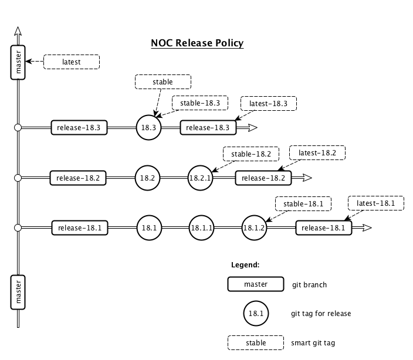

# New Release Policy

In order to finalize 3 years of microservices development and
to switch from rolling release to more common release practice
we introduce a new release policy.
<!-- more -->

Further NOC releases will be organized into _Generations_ - milestones
on NOC platform evolution. Generation is versioned by two or three
numbers: _X.Y[.Z]_, where _X_ - is two last letters of year,
_Y_ - is sequental number of generation within year (starting from 1).
Z - is an optional number of _hotfix_ release (starting with 1)
The distance between generations is about one month. Each generation
holds first release, X.Y, followed by hotfix releases X.Y.Z.

You can think of _master_ branch as a tree's trunk, while each generation
is a separate tree's branch (release-X.Y git branch). Particular
releases are denoted by git tags.

_Generation_ denote non-functional evolution of generation start release
with following bugfixes in new hotfix releases.
No new features, data migrations, incompatibilities or significant
behaviour changes may be introduced during single generation.

Bugfixes are backported to last 3 generations. Hotfixes are released
in case of serious problems discovered or as cumulative releases
when next generation is started. So each generation will get around
two hotfix releases until the end of support.

We strongly recommend to use git tags as deploy target. Several tags
are available to cover common deploy scenarios:

* *latest* - points to the top of _master_ branch. Consider it as a bleeding
edge of _NOC_ development. _latest_ tag is volatile and can be changed
over the time. Deploying _latest_ again and again you can get significant
changes in system
* *X.Y*, *X.Y.Z* - particular releases. This tags are stable. Deploying same
release will lead you to same system
* *latest-X.Y* - bleeding edge of generation _X.Y_. Usually includes
fresh bugfixes still not bundled in future hotfix release. This tag is volatile,
though not as strong as for _latest_.
* *stable-X.Y* - last hotfix release in X.Y generation. This tag is volatile,
though not introduces behavior changes or incompatiblities.
* *stable* - last release in last generation. This tag is volatile
and can change to new generation during consequent deployments.

So follow the simple rules:

* Use *stable-X.Y* for production deployments. Deploy with new hotfix releases. (~1 per month).
* Use *X.Y* if you bound to particular version. Deploy only for reconfigurations.
* Use *latest-X.Y* in case you badly need bugfix still not packet to hotfix. Deploy on demand
* Use *stable* for demonstration purposes
* Use *latest* if you support [DevTeam](/devteam/)

See [Release Policy](../../../release-policy/index.md) documentation
for more details.

