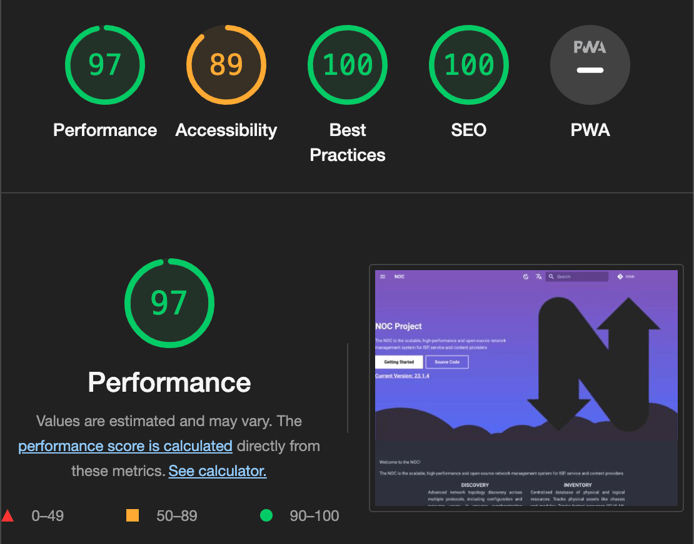

# Hosting a Mkdocs-generated Site Using Nginx

Creating exceptional software documentation is a pivotal ingredient for product success. The NOC Team has been on a relentless journey with [Project Aegeus](../project-augeas.md) to make our documentation truly shine. While top-notch content is essential, the delivery process plays a crucial role in shaping the user experience. In this post, we're shifting our focus to delivery, where we'll reveal some tricks that can take your documentation from good to great.

Mkdocs, especially when adorned with the stylish mkdocs-material theme, is an outstanding tool for crafting project documentation. The outcome is a directory brimming with polished HTML files and static assets. Unlike popular CMS platforms like Joomla or WordPress, your output is a self-contained directory that doesn't rely on additional runtime services or databases. This independence makes it incredibly easy to serve your documentation directly to your audience. While services like "GitHub Pages" and "Read the Docs" have their allure, there's a compelling case for hosting your documentation independently. We, for instance, rely on the rock-solid Nginx web server. In the following sections, we'll offer you a glimpse into our setup and share some simple yet highly effective tweaks to enhance performance.
<!-- more -->

Let's take a glance at our setup. Here and after we consider that `<site>` should
be replaced with your domain name. We also consider you have Nginx installed and running.

## Checking mkdocs.yml

Check the `mkdocs.yml` file and ensure, your `site_url` setting is valid:

``` yaml
site_url: https://<site>/
```

!!! warning

    The `https://` prefix is viable for our setup.

## DNS Setup

Add `A` record to your DNS Zone to reach your site

``` txt
@   IN  A  <ip>
```

Where `<ip>` is the IP address of your Nginx server.

## Nginx Configuration

Let's take a closer look at our configuration. We are creating two virtual servers, one for HTTP on port 80, and the other for HTTPS on port 443. Each virtual server has its configuration
file. I.e. `<site>:80.conf` and `<site>:443.conf`, though you can use every other name to your pleasure.

## HTTP Setup

Create a first configuration file, named `<site>:80.conf`, replacing `<site>` with your domain name.

``` txt title="site:80.conf" linenums="1"
--8<-- "docs/blog/posts/nginx-serving-mkdocs-site/http.conf"
```

Place it into one of the following paths, depending on your system:

* `/etc/nginx/conf.d/<site>.conf`
* `/etc/nginx/sites-available/<site>.conf`

If you choose to place config in the `sites-available` directory, do not
forget to create a symlink to enable config:

``` shell
# cd /etc/nginx/sites-enabled/
# ln -s /etc/nginx/sites-available/<site>:80.conf .
```

Then check the configuration:

``` shell
# nginx -T
...
# echo $?
0
```

If you do all correctly, the command will complete without errors and you will
see `0` as a result of the `echo`.

Reload configuration:

``` shell
# service nginx reload
```

Let's examine the configuration:

``` txt title="site:80.conf" linenums="1" hl_lines="2 3"
--8<-- "docs/blog/posts/nginx-serving-mkdocs-site/http.conf"
```

Listen for virtual site `<site>` on default HTTP port 80.

``` txt title="site:80.conf" linenums="1" hl_lines="5 6"
--8<-- "docs/blog/posts/nginx-serving-mkdocs-site/http.conf"
```

Set up logging.

``` txt title="site:80.conf" linenums="1" hl_lines="8 9 10 11"
--8<-- "docs/blog/posts/nginx-serving-mkdocs-site/http.conf"
```

We using Certbot to obtain TLS certificates from Letsencrypt.
We're creating a well-known entrypoint to process a
certificate request.

``` txt title="site:80.conf" linenums="1" hl_lines="13 14 15"
--8<-- "docs/blog/posts/nginx-serving-mkdocs-site/http.conf"
```

We forcing our users to use HTTPS, redirecting all other requests
to the HTTPS version of the site.

## Certbot Setup

Before passing to the HTTPS section we need to receive a TLS certificate.
We're using Certbot to request certificates via Letsencrypt.

To request the certificate:

```
# certbot --nginx -d <site>
```

Check that our certificates are present in place:

```
# ls /etc/letsencrypt/live/<site>/
fullchain.pem
privkey.pem
```

## HTTPS Setup

If all is correct, create a file named `<site>:443.conf`, replacing `<site>` with your domain name.

``` txt title="site:443.conf" linenums="1"
--8<-- "docs/blog/posts/nginx-serving-mkdocs-site/https.conf"
```

Place it into one of the following paths, depending on your system:

* `/etc/nginx/conf.d/<site>.conf`
* `/etc/nginx/sites-available/<site>.conf`

If you choose to place config in the `sites-available` directory, do not
forget to create a symlink to enable config:

``` shell
# cd /etc/nginx/sites-enabled/
# ln -s /etc/nginx/sites-available/<site>:443.conf .
```

Then check the configuration:

``` shell
# nginx -T
...
# echo $?
0
```

If you do all correctly, the command will complete without errors and you will
see `0` as a result of the `echo`.

Reload configuration:

``` shell
# service nginx reload
```

Let's examine the configuration:

``` txt title="site:443.conf" linenums="2" hl_lines="1 2"
--8<-- "docs/blog/posts/nginx-serving-mkdocs-site/https.conf:1:14"
```

Listen for virtual site `<site>` on default HTTPЫ port 443
and enable HTTP/2.

``` txt title="site:443.conf" linenums="2" hl_lines="4"
--8<-- "docs/blog/posts/nginx-serving-mkdocs-site/https.conf:1:14"
```
Enable TLSv1.3 and TLSv1.2, do not use older versions.

``` txt title="site:443.conf" linenums="2" hl_lines="5 6"
--8<-- "docs/blog/posts/nginx-serving-mkdocs-site/https.conf:1:14"
```
Use TLS certificates, prepared by Certbot.

``` txt title="site:443.conf" linenums="2" hl_lines="7"
--8<-- "docs/blog/posts/nginx-serving-mkdocs-site/https.conf:1:14"
```
Always set `Strict-Transport-Security` header to enable HSTS.
The HSTS informs browsers that the site should only be accessed using HTTPS and that any future attempts to access it using HTTP should automatically be converted to HTTPS.

``` txt title="site:443.conf" linenums="2" hl_lines="8 9"
--8<-- "docs/blog/posts/nginx-serving-mkdocs-site/https.conf:1:14"
```
Enable Online Certificate Status Protocol (OSCP) stapling to check
the revocation status of the certificates in an efficient manner.

``` txt title="site:443.conf" linenums="2" hl_lines="11 12"
--8<-- "docs/blog/posts/nginx-serving-mkdocs-site/https.conf:1:14"
```

Set up logging.

``` txt title="site:443.conf" linenums="15" hl_lines="1"
--8<-- "docs/blog/posts/nginx-serving-mkdocs-site/https.conf:15:22"
```
Serve static files from `/www/<site>/` directory. We use Minio's
S3 endpoint to deliver our documentation, though you can simple
put your files in place using any available method.

``` txt title="site:443.conf" linenums="15" hl_lines="2"
--8<-- "docs/blog/posts/nginx-serving-mkdocs-site/https.conf:15:22"
```

To enhance the user experience, replace Nginx's default 404 page with the stylish page provided by mkdocs-material. This step is crucial as the customized page offers standard navigation and search functionalities, enabling users to easily access all the information they need.

``` txt title="site:443.conf" linenums="15" hl_lines="4"
--8<-- "docs/blog/posts/nginx-serving-mkdocs-site/https.conf:15:22"
```
Configure the X-Content-Type-Options header for all responses to specify that the advertised MIME types in the Content-Type headers should be strictly followed and not altered. This header helps prevent MIME type sniffing by explicitly stating that the MIME types are intentionally set and should not be modified.

``` txt title="site:443.conf" linenums="15" hl_lines="6 7"
--8<-- "docs/blog/posts/nginx-serving-mkdocs-site/https.conf:15:22"
```
Activate gzip compression for all web browsers. This feature will automatically compress HTML, CSS, JSON, and XML files for all modern browsers. Data compression plays a vital role in reducing network traffic, offering substantial advantages to mobile users, and boosting page loading speed. We have fine-tuned the compression settings to work seamlessly with content generated by mkdocs-material, ensuring an optimized user experience.

``` txt title="site:443.conf" linenums="23" hl_lines="1 2 3 4"
--8<-- "docs/blog/posts/nginx-serving-mkdocs-site/https.conf:23"
```

For even more efficient file serving, we've implemented some additional optimizations, specifically targeting the minified CSS and JS content generated by the mkdocs-material theme. To improve caching efficiency, mkdocs-material appends a unique hash to the file names.

Here's what we've done:

* `Cache-Control`` Header: We've configured the `Cache-Control`` header to instruct the browser to store these minified files for a week, reducing the need for additional requests as users navigate through our documentation.
* `Surrogate-Control` Header: We've added the `Surrogate-Control` header to notify upstream CDNs (Content Delivery Networks) to cache these replies whenever possible.

Efficient file caching is yet another step we've taken to enhance the user experience, ensuring that your documentation loads swiftly and reliably.


``` txt title="site:443.conf" linenums="23" hl_lines="6 7 8 9"
--8<-- "docs/blog/posts/nginx-serving-mkdocs-site/https.conf:23"
```
Mkdocs-material maintains a database for online search, stored in the search_index.json file. For complex documentation, like NOC's, this JSON file can become quite large, roughly around 4 megabytes. Since we frequently update our content, long-term caching isn't practical. Therefore, we've established a reasonable default of one hour for caching this file.

Just like with minified files, we've configured the Cache-Control and Surrogate-Control options for the search_index.json file. These settings help optimize the caching of this file, ensuring that users can perform online searches effectively without compromising the freshness of the data.

``` txt title="site:443.conf" linenums="23" hl_lines="11 12 13"
--8<-- "docs/blog/posts/nginx-serving-mkdocs-site/https.conf:23"
```
Since we're utilizing Minio for content uploads, it's crucial to safeguard Minio's internal database from accidental exposure. To achieve this, we take the straightforward approach of denying access to the internal directory. This ensures that the inner workings of Minio remain protected and inaccessible to unauthorized parties.

## Adding robots.txt

Last but not least, we want to simplify the lives of search engine bots. You can achieve this by simply including a robots.txt file in your docs/ directory to ensure it's generated alongside your documentation. Don't forget to replace `<site>` with your domain name in the file. This step ensures that search engine crawlers can efficiently navigate and index your content, contributing to its discoverability on the web.

``` txt title="robots.txt" linenums="1"
--8<-- "docs/blog/posts/nginx-serving-mkdocs-site/robots.txt"
```

Let's look closer:

``` txt title="robots.txt" linenums="1" hl_lines="1 2"
--8<-- "docs/blog/posts/nginx-serving-mkdocs-site/robots.txt"
```

Allow all bots to index our documentation.

``` txt title="robots.txt" linenums="1" hl_lines="4"
--8<-- "docs/blog/posts/nginx-serving-mkdocs-site/robots.txt"
```

Let's also inform search engine bots that we have a sleek sitemap generated by mkdocs-material. This will help the bots efficiently crawl and index our content, making it more discoverable on the web.

## Results

We utilized Google Chrome's Lighthouse tool to evaluate the user experience of our home page, https://getnoc.com/.

Before implementing the changes and using the standard boilerplate for serving static files, we had an overall performance score of 75.

However, after applying all the tweaks we've discussed in this post, we significantly improved our performance, achieving an outstanding overall score of 97.



These methods are not limited to our use case; anyone looking to host mkdocs-material sites with only the default set of Nginx features can benefit from them. We hope that our insights and experience will help you enhance the user experience of your documentation.