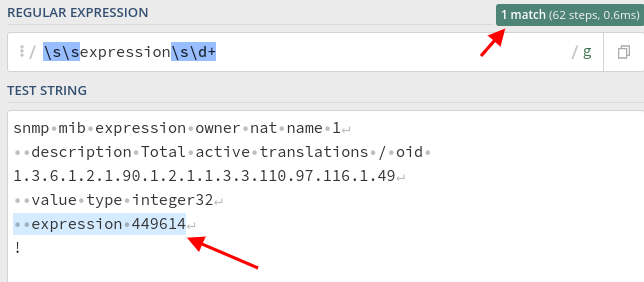
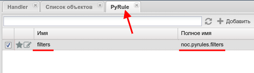
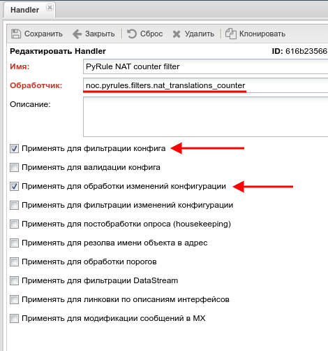
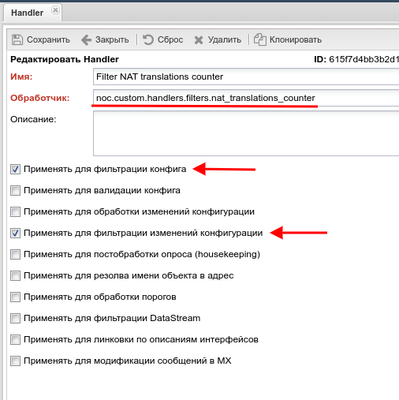

# Cleaning False Config Changes

One of the many functional capabilities of the NOC Project is the collection and storage of equipment settings (configuration files). To achieve this, an intelligent system is used that polls equipment at specified intervals (by default, once a day for a full "box" poll) and saves the configuration to the database only if there have been any changes. This allows you to immediately see when changes were made and, at the same time, save space, unlike the common method of saving configuration files on a schedule, regardless of whether there were any changes. However, in some cases, the operation of this algorithm may be disrupted due to the specific features of the equipment or any specific settings on it. For example:

1. With each configuration request, the equipment provides some data that is informational in nature: the time the configuration display request was made, a UID assigned to that specific request, and so on. In general, these are any displayed parameters that do not affect the operation of the equipment and are mostly informational in nature. Such data is a feature of specific equipment or its software.
2. The equipment's configuration may contain counters, labels, or other data constantly introduced by an external system for its functioning. The specific values have no value; they can be replaced with basic values or completely ignored when reserving equipment configuration. However, these changes occur only in certain cases when configuring the equipment for a specific situation.

All of this data returns an "altered" configuration file during the next poll, even though these changes have no value. The first case is taken into account and corrected when creating a profile for this equipment. As for the second case, the [Handler](../concepts/handler/index.md) is a great solution.

As an example, let's take the Cisco ASR, where the count of active NAT sessions is stored in the running-config and is automatically updated every 5 minutes. If you look at the list of changes in configurations, they exist for every day, and most of them look like this:

```diff
--- 
+++ 
@@ -1939,7 +1939,7 @@
 snmp mib expression owner nat name 1
   description Total active translations / oid 1.3.6.1.2.1.90.1.2.1.1.3.3.110.97.116.1.49
   value type integer32
-  expression 249614
+  expression 216982
 !
 tftp-server system:running-config 8
 !
```

We are not interested in these counter values because they make it difficult to find when and what actually changed in the equipment settings. Let's try to filter them after NOC receives the configuration file but before comparing it with what is already in the database.

To do this, open the equipment's configuration file (whether it's the last one in the NOC or on the equipment) and find this block:
```
snmp mib expression owner nat name 1
  description Total active translations / oid 1.3.6.1.2.1.90.1.2.1.1.3.3.110.97.116.1.49
  value type integer32
  expression 449614
!
```

To find these parameters, specifically `expression 449614`, and then replace it, we will use regular expressions, which are very convenient to test beforehand on [regex101](https://regex101.com).

<!-- prettier-ignore -->
!!! info  ""

    When composing a regular expression, you need to select a pattern that will guarantee to find only the data that needs to be changed and nothing else.

After successfully composing the regular expression, in our test sample, 101regex will highlight the required parameters:


For preliminary testing on the NOC Project server, we will prepare a file `test_handler.py` with the `nat_translations_counter` function, into which we will insert the previously obtained regular expression and the value to be replaced:

<!-- prettier-ignore -->
!!! info ""  

    You can create it in the user's home directory or any other directory except for the `/opt/noc` directory because there may be issues during updates.

```python  
import re

# Testing block
cfg_sample = """
snmp mib expression owner nat name 1
  description Total active translations / oid 1.3.6.1.2.1.90.1.2.1.1.3.3.110.97.116.1.49
  value type integer32
  expression 259773
"""

def nat_translations_counter(managed_object, config):
    data =  re.sub(r"\s\sexpression\s\d+", "  expression 0", config)
    return data


result = nat_translations_counter("", cfg_sample)

print (result)
```

Run it:

```bash
python3 /opt/noc_custom/test_handler.py
```

You should get the desired result on the output:


Now you need to configure the NOC Project itself, and there are two options:

1. Pyrule (the easiest) - the function is stored in the NOC database and does not require any additional settings.
2. A handler in the form of a file, from which the required function is called, must have the [Custom](../custom/index.md) role configured.

## PyRule

In the NOC Project, open PyRule settings: `Main` > `Configuration` > `PyRule`, and create a new rule with the prepared `nat_translations_counter` function.

<!-- prettier-ignore -->
!!! warning ""
    
    When naming the rule, you can only use Latin alphabet characters, numbers, and underscores.


  


After that, in `Main` - `Configuration` - `Handlers`, create a new handler as shown in the image below:



The Handler field has the format `noc.pyrules.filters.nat_translations_counter`, where:

- `noc.pyrules.` - indicates that our handler is located in PyRule.
- `filters.` - is the name of our PyRule where the required function is stored.
- `nat_translations_counter` - is the name of the function itself, which will be called to remove unnecessary data.

Save it and specify it in the settings of the required Management Object: `Rules` - `Handler for Connection Filtering`. After that, be sure to save this Management Object.

Run a full poll on this Management Object, and in the execution report, there should be no errors related to the handler and our file or function. Also, check the collected configuration for the required changes.

## Separate File

!!! info ""
    
    To use this method, you need to configure a separate directory for local modifications through NOC Tower in advance. In the example, this will be `/opt/noc_custom`.

Create a file `filters.py`, as well as empty `__init__.py` files:

```bash
mkdir /opt/noc_custom/handlers
touch /opt/noc_custom/handlers/__init__.py
touch /opt/noc_custom/__init__.py
touch /opt/noc_custom/handlers/filters.py
```

The resulting structure should look like this:

```
/opt/noc_custom
├── handlers
│   ├── filters.py
│   └── __init__.py
└── __init__.py
```

Copy the previously prepared function and import the necessary modules into the `filters.py` file:

```python
import re

def nat_translations_counter(managed_object, config):
    data =  re.sub(r"\s\sexpression\s\d+", "  expression 0", config)
    return data
```

In NOC, open: `Main` > `Configuration` > `Handlers`, and create a new handler as shown in the image below:



The Handler field should be in the format `noc.custom.handlers.filters.nat_translations_counter`, where:

- `noc.custom.handlers.` - indicates that our handler is located in the [custom](../custom/index.md) directory.
- `filters.` - is the name of our file, `filters.py`, where the required function is stored.
- `nat_translations_counter` - is the name of the function itself, which will be called to remove unnecessary data.

Save it and specify it in the settings of the required Management Object: `Rules` - `Handler for Connection Filtering`. After that, be sure to save this Management Object.

Run a full poll on this Management Object, and in the execution report, there should be no errors related to the handler and our file or function. Also, check the collected configuration for the required changes.
