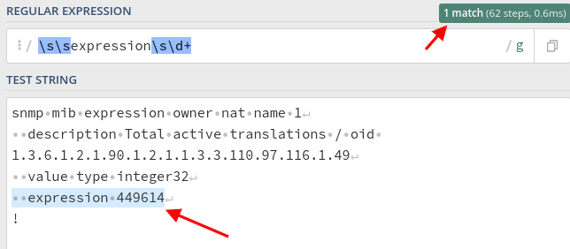
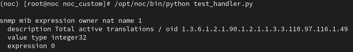
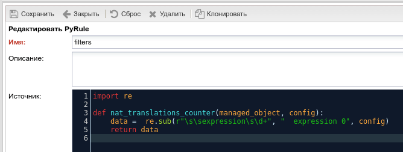
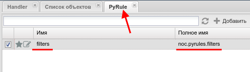
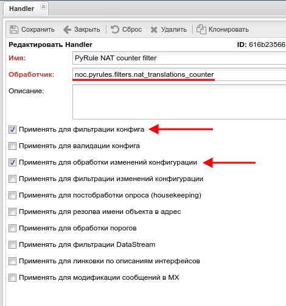
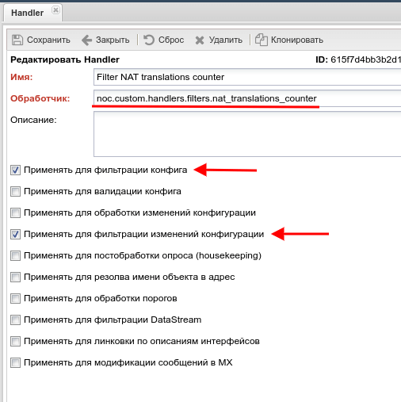

# Очистка конфигурации устройсва от ложных изменений

Одной из многочисленных функциональных возможностей NOC Project является сбор и хранение настроек (конфигурационных файлов) оборудования. Для этого применяется умная система, которая опрашивает оборудование через заданный период времени (по умолчанию раз в сутки для полного "box" опроса) и сохраняет конфигурацию в базу только, если были какие-то изменения. Позволяет сразу увидеть, когда были изменения и попутно экономить место, в отличии от распространенного метода сохранения конфигурационного файла по расписанию, не зависимо от того были ли изменения. Но в некоторых случаях работа этого алгоритма может нарушится из-за особенностей оборудования или каких-либо специфических настроек на нем. Например: 

  1. При каждом запросе конфигурации, оборудование подставляет какие-либо данные, которые носят информационный характер: время когда был произведен запрос на отображение конфигурации, UID назначенный этому конкретному запросу и т.д. В общем это любые отображаемые параметры, которые ни как не влияют на работу оборудования и носят в большинстве случаев информационный характер. Такие данные являются особенностью конкретного оборудования или его ПО.  
  2. В конфигурации оборудования могут хранится каке-то счетчики, метки или другие данные постоянно вносимые внешней системой для своего функционирования. Конкретные значения не имеют ценности, их можно заменить на базовые или вообще игнорировать при резервировании конфигурации оборудования. Но эти изменения есть только в определенных случаях настройки оборудования под конкретную ситуацию.

Все эти данные при очередном опросе возвращают "измененный" конфигурационный файл, хотя эти изменения не имеют никакой ценности. Первый случай учитывается и исправляется при создании профиля данного оборудования. А для второго отлично подойдет [Handler](../concepts/handler/index.md).  

Для примера возьмем Cisco ASR, у которого счетчик количества активных nat сессий хранится в runing-config и обновляется автоматически раз в 5 минут. Если посмотреть список изменений в конфигурациях, то они есть за каждый день, и большая часть из них выглядит вот так:  

```diff
--- 
+++ 
@@ -1939,7 +1939,7 @@
 snmp mib expression owner nat name 1
   description Total active translations / oid 1.3.6.1.2.1.90.1.2.1.1.3.3.110.97.116.1.49
   value type integer32
-  expression 249614
+  expression 216982
 !
 tftp-server system:running-config 8
 !
```

Нам эти значения счетчика не интересны, т.к. из-за них сложно найти, когда и что действительно менялось в настройках оборудования. Попробуем их отфильтровать после того, как NOC получил конфигурационный файл, но до момента сравнения его с тем, что уже есть в базе.

Для этого открываем конфигурационный файл оборудования (не важно, последний в ноке или на оборудовании) и находим там этот блок:   
```
snmp mib expression owner nat name 1
  description Total active translations / oid 1.3.6.1.2.1.90.1.2.1.1.3.3.110.97.116.1.49
  value type integer32
  expression 449614
!
```

Что бы найти эти параметры, а конкретно `expression 449614` и потом его заменить будем использовать регулярные выражения, которые очень удобно предварительно тестировать на [regex101](https://regex101.com). 

<!-- prettier-ignore -->
!!! info  ""  
   При составлении регулярного выражения нужно выбрать шаблон, который гарантированно найдет только те данные, которые необходимо изменить и ничего другого.

После удачного составления регулярного выражения - в нашем тестовом образце 101regex подсветит нужные параметры:  
  

Для предварительной проверки, на сервере с NOC Project подготовим файл `test_handler.py` с функцией `nat_translations_counter`, в которую подставим полученное ранее регулярное выражение и значение, на которое будет производиться замена: 

<!-- prettier-ignore -->
!!! info ""  
  Его можно создать в домашнем каталоге пользователя или любом другом, кроме каталога `/opt/noc`, т.к. могут возникнуть проблемы при обновлении.

```python  
import re

# тестовый блок конф. файла
cfg_sample = """
snmp mib expression owner nat name 1
  description Total active translations / oid 1.3.6.1.2.1.90.1.2.1.1.3.3.110.97.116.1.49
  value type integer32
  expression 259773
"""

def nat_translations_counter(managed_object, config):
    data =  re.sub(r"\s\sexpression\s\d+", "  expression 0", config)
    return data


result = nat_translations_counter("", cfg_sample)

print (result)
```

Запускаем его:

```bash
python3 /opt/noc_custom/test_handler.py
```

На выводе должны получить желаемый результат:  




Теперь необходимо настроить сам NOC Project, для этого есть два варианта:  

1. Pyrule (самый простой) - функция хранится в базе нока, не требует каких-либо дополнительных настроек.
2. Handler в виде файла, из которого вызывается нужная функция, должна быть настроена роль [Сustom](../custom/index.md)  


## PyRule

В Noc Project открываем настройки PyRule: `Основное` - `Настройка` - `PyRule` и там создаем новое правило с заготовленной функцией `nat_translations_counter`:   

<!-- prettier-ignore -->
!!! warning ""

   В имени правила можно использовать только символы латинского алфавита, цифры и символ нижнего подчеркивания.



  


После этого в `Основное` - `Настройка` - `Обработчики`(Handlers) создаем новый обработчик, как на изображении ниже:  

  

Поле обработчик имеет вид `noc.pyrules.filters.nat_translations_counter`, где:  

- `noc.pyrules.` - указывает, что наш обработчик расположен в PyRule  
- `filters.` - имя нашего PyRule, в котором хранится нужная функция  
- `nat_translations_counter` - имя самой функции, которая будет вызываться для удаления лишних данных

Сохраняем его, и указываем в настройках нужного Мanagement Object:  `Правила` - `Обработчик для фильтрации кон-ии:`, после этого обязательно сохраняем этот Мanagement Object.

Запускаем полный опрос на данном Мanagement Object, в отчете выполнения не должно быть каких-либо ошибок связанных с handler и нашим файлом или функцией. Так же проверяем собранную конфигурацию на наличие необходимых изменений.


## Отдельный файл  

<!-- prettier-ignore -->
!!! info ""

   Для использования данного метода необходимо заранее настроить через NOC Tower отдельный каталог для локальных правок. Далее в примере это будет `/opt/noc_custom`.

Создаем файл filters.py, а так же пустые `__init__.py` файлы:   

```bash
mkdir /opt/noc_custom/handlers
touch /opt/noc_custom/handlers/__init__.py
touch /opt/noc_custom/__init__.py
touch /opt/noc_custom/handlers/filters.py
```

По итогу структура должна выглядеть так:  
```
/opt/noc_custom
├── handlers
│   ├── filters.py
│   └── __init__.py
└── __init__.py
```

В файл filters.py копируем ранее заготовленную функцию и импорт необходимых модулей:  

```python
import re

def nat_translations_counter(managed_object, config):
    data =  re.sub(r"\s\sexpression\s\d+", "  expression 0", config)
    return data
```

В NOC открываем: `Основное` > `Настройка` > `Обработчики`(Handlers) и там создаем новый обработчик, как на изображении ниже:   




Поле обработчик имеет вид `noc.custom.handlers.filters.nat_translations_counter`, где:  

- `noc.custom.handlers.` - указывает, что наш обработчик расположен в [сustom](../custom/index.md) каталоге  
- `filters.` - имя нашего файла `filters.py` , в котором хранится нужная функция  
- `nat_translations_counter` - имя самой функции, которая будет вызываться для удаления лишних данных

Сохраняем его, и указываем в настройках нужного Мanagement Object:  `Правила` - `Обработчик для фильтрации кон-ии:`, после этого обязательно сохраняем этот Мanagement Object. 

Запускаем полный опрос на данном Мanagement Object, в отчете выполнения не должно быть каких-либо ошибок связанных с handler и нашим файлом или функцией. Так же проверяем собранную конфигурацию на наличие необходимых изменений.


