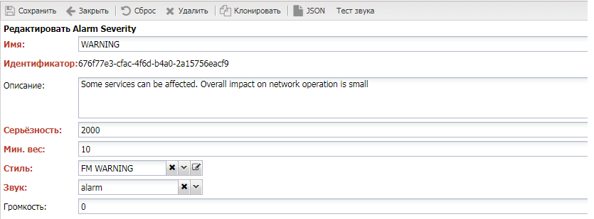

# Alarm Severity

Важность аварии 

## Настройки

* **Имя** (`Name`) - наименование важности. Должно быть уникальным, отображается в аварии
* **Описание** (`Description`) - краткое описание 
* **Серьёзность** (`Severity`) - числовой уровень важности (`Severity`)
* **Мин. Вес** (`Min Weight`) - минимальный вес [Weight](../../fault-management/index.md#Серьёзность%20и%20Вес), который должна набрать авария для присвоения важности
* **Звук** (`Sound`) - звук воспроизводимый при появлении аварии данного веса
* **Громкость** () - громкость звука (0 - отключить)

## Описание работы

Базовый уровень аварии определяет *минимальное* и *максимальное* значение веса аварии. 
При обнаружении аварии система должна определять количество объектов мониторинга, 
услуг и пользователей, попавших под влияние аварии. Максимальное значение уровня аварии является минимальным значением для следующего уровня. 
После обнаружения аварии на конкретном оборудовании, система вычисляет вес аварии и в какой интервал базовых значений важности попадает авария.
