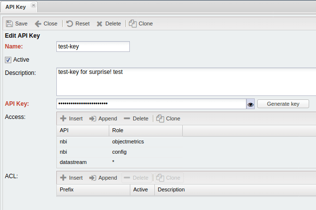
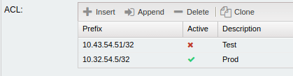

# API Key

## Usage

Client **MUST** set `Private-Token` HTTP Request header and set it
with proper _Key_ in order to get access to protected API

Example:

```
curl  -s -D - -k -H 'Private-Token: 12345'  https://noc_url/datastream-api-referencemanagedobject`
```

where `12345` is an API token key.

## Roles

### DataStream API

Access to [DataStream API](../../datastream-api-reference/index.md)

| API:Role                          | Description                                                                               |
| --------------------------------- | ----------------------------------------------------------------------------------------- |
| `datastream:administrativedomain` | [administrativedomain DataStream](../../datastream-api-reference/administrativedomain.md) |
| `datastream:alarm`                | [administrativedomain DataStream](../../datastream-api-reference/alarm.md)                |
| `datastream:resourcegroup`        | [resourcegroup DataStream](../../datastream-api-reference/resourcegroup.md)               |
| `datastream:managedobject`        | [managedobject DataStream](../../datastream-api-reference/managedobject.md)               |
| `datastream:dnszone`              | [dnszone DataStream](../../datastream-api-reference/dnszone.md) access                    |
| `datastream:cfgmetrics`           | [cfgmetrics DataStream](../../datastream-api-reference/cfgmetrics.md) access              |
| `datastream:cfgping`              | [cfgping DataStream](../../datastream-api-reference/cfgping.md) access                    |
| `datastream:cfgsyslog`            | [cfgsyslog DataStream](../../datastream-api-reference/cfgsyslog.md) access                |
| `datastream:cfgtrap`              | [cfgtrap DataStream](../../datastream-api-reference/cfgtrap.md) access                    |
| `datastream:vrf`                  | [vrf DataStream](../../datastream-api-reference/vrf.md) access                            |
| `datastream:prefix`               | [prefix DataStream](../../datastream-api-reference/prefix.md) access                      |
| `datastream:address`              | [address DataStream](../../datastream-api-reference/address.md) access                    |

### NBI API

| API:Role              | Description                                                                  |
| --------------------- | ---------------------------------------------------------------------------- |
| `nbi:config`          | [NBI config API](../../nbi-api-reference/config.md) access                   |
| `nbi:configrevisions` | [NBI configrevisions API](../../nbi-api-reference/configrevisions.md) access |
| `nbi:getmappings`     | [NBI getmappings API](../../nbi-api-reference/getmappings.md) access         |
| `nbi:objectmetrics`   | [NBI objectmetrics API](../../nbi-api-reference/objectmetrics.md) access     |
| `nbi:objectstatus`    | [NBI objectstatus API](../../nbi-api-reference/objectstatus.md) access       |
| `nbi:path`            | [NBI path API](../../nbi-api-reference/path.md) access                       |
| `nbi:telemetry`       | [NBI telemetry API](../../nbi-api-reference/telemetry.md) access             |

## Web interface example

You should fill `Name` and `API key` as required fields.
Also in `API` rows should be `nbi` or `datastream`. In `Role` row should be a role from tables above or `*` (asterisk)



You can fill the ACL section or may leave it empty.
Prefix field should be in a IP/net way.



Also there is an opportunity to allow requests to API only from whitelist IPs.
You can find this option in Tower, in `nbi`/`datastream` service respectively.

## Best Practices

- Grant separate API Keys for every connected system
- Grant separate API Keys for every developer, Restrict key lifetime
- Grant separate API Keys for every external tester, Restrict key to short lifetime
