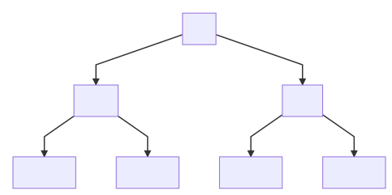

# Administrative Domain

`Administrative Domain` is a part of administrative division of
`Managed Object`. It answers to the question: "Who is responsible for
Managed Object?". Another synonym for `Administrative Domain` is
`Area of Responsibility`.

`Administrative Domains` are hierarchical by nature. Management
functions may be delegated to underlying branches. Consider example:

```mermaid
graph TD
    West --> Branch1
    West --> Branch2
    East --> Branch3
    East --> Branch4
```

Group `West` delegates management function to branches `Branch1` and `Branch2`
while group `East` - to `Branch3` and `Branch4` accordingly. Note
that `East` and `West` is not obliged to delegate all their objects
to underlying branches. Some of objects may remain on direct `East` and `West`
maintenance

## Managed Object Access

NOC limits access to `Managed Objects` on per-administrative domain basis.
[User](../user/index.md) or [Group](../group/index.md) may be granted to
zero-or-more `Administrative Domains`. Granting access to `Administrative Domain`
means that [User](../user/index.md) gets access to Managed Objects of
`Administrative Domain` and all of its descendants.

Access Limiting means [User](../user/index.md) will get access to
appropriate `Managed Objects`, their `Cards`, `Configs`, `Alarms` and `Reports`.

Consider example:

```mermaid
graph TD
    style West fill:#0f0,stroke-width:4px
    style Branch1 fill:#0f0
    style Branch2 fill:#0f0
    West --> Branch1
    West --> Branch2
    East --> Branch3
    East --> Branch4

```

Granting access to `West` automatically grants access to `Branch1` and `Branch2`
as well.

## Best Practices

Though you mileage may vary, consider several common practices

### Single Administrative Domain

```mermaid
graph TD
    Default

```

Single administrative domain is good start for small installation
where all management functions carried by single department

### Functional Division

```mermaid
graph TD
    Transport
    IT
    Telephony

```

If network is maintained by several functional departments, they are
may be represented as `Administrative Domains`. Such scheme considers
`IT` need no knowledge about `Transport` and vise-versa

### Regional Division

```mermaid
graph TD
    West --> Branch1
    West --> Branch2
    East --> Branch3
    East --> Branch4

```

`Administrative Domain` reflects organizational branch structure. Regional
branches are responsible for their parts of network, while their head
branches fully remains control over branches and own infrastructures.

Sometimes top-level `Administrative Domain` makes sense if head office
has own infrastructure and wish to remain control on over all network.

If HQ has own infrastructure but not controls all network following scheme
is possible

```mermaid
graph TD
    HQ
    West --> Branch1
    West --> Branch2
    East --> Branch3
    East --> Branch4

```

You always has option to grant access to `HQ` and `West` and `East` to user
when necessary

### Regional-Functional division

Following scheme considers each regional branch has separate divisions
for parts of their networks

```mermaid
graph TD
    W/Transport[Transport]
    W/IT[IT]
    E/Transport[Transport]
    E/IT[IT]
    1/Transport[Transport]
    1/IT[IT]
    2/Transport[Transport]
    2/IT[IT]
    3/Transport[Transport]
    3/IT[IT]
    4/Transport[Transport]
    4/IT[IT]
    West --> Branch1
    West --> Branch2
    West --> W/Transport
    West --> W/IT
    East --> Branch3
    East --> Branch4
    East --> E/Transport
    East --> E/IT
    Branch1 --> 1/Transport
    Branch1 --> 1/IT
    Branch2 --> 2/Transport
    Branch2 --> 2/IT
    Branch3 --> 3/Transport
    Branch3 --> 3/IT
    Branch4 --> 4/Transport
    Branch4 --> 4/IT

```

### Functional-Regional Division

Following scheme differs from previous in fact that appropriate regional
structural departments are managed by appropriate structural departments,
not by regional branches

```mermaid
graph TD
    Transport
    IT
    T/West[West]
    T/East[East]
    T/Branch1[Branch1]
    T/Branch2[Branch2]
    T/Branch3[Branch3]
    T/Branch4[Branch4]
    IT/West[West]
    IT/East[East]
    IT/Branch1[Branch1]
    IT/Branch2[Branch2]
    IT/Branch3[Branch3]
    IT/Branch4[Branch4]
    Transport --> T/West
    Transport --> T/East
    T/West --> T/Branch1
    T/West --> T/Branch2
    T/East --> T/Branch3
    T/East --> T/Branch4
    IT --> IT/West
    IT --> IT/East
    IT/West --> IT/Branch1
    IT/West --> IT/Branch2
    IT/East --> IT/Branch3
    IT/East --> IT/Branch4

```

