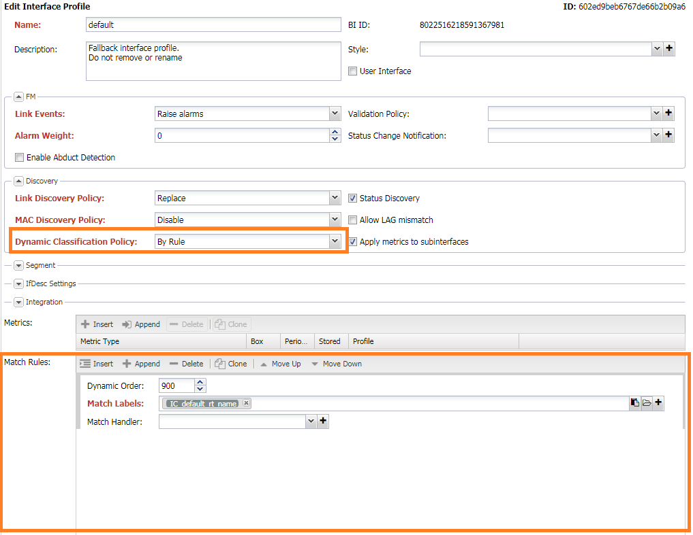
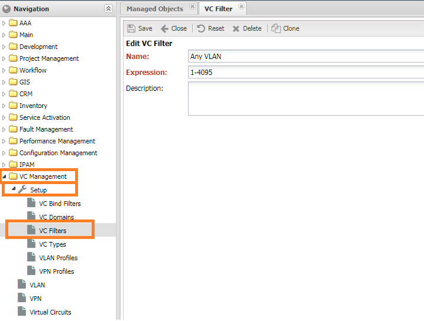
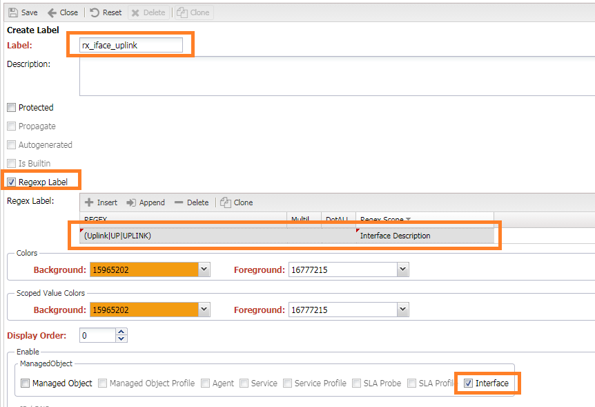

# Dynamic Profile Classification

Наиболее часто встречающаяся задача при работе с НОКом это назначение групповых настроек - профилей (`Profile`).
Для автоматизации этого процесса есть возможность задавать критерии, по которым система будет при сохранении присваивать правильный профиль (`Profile`).

## Основные принципы работы

* в профилях добавляется **политика автоматического назначения профиля** (`Dynamic Classification Policy`)
* в профилях (`Profile`) добавляются список правил (`Match Rules`)
* если выставлена политика по правилу (`By Rules`) происходит определение подходящего профиля при сохранении сущности 
* правила проверяются в порядке возрастания поля `order`, ***исключая те, где order равен 0***
* при наличии всех `labels` из правила в действующих метках (`effective labels`) [Labels](../label/index.md) сущности, считаем подходящим профиль, из которого совпало правило
* если указанный в правилах обработчик (`handler`) вернул истину (`True`), считаем подходящим профиль, из которого совпало правило

<!-- prettier-ignore -->
!!! info
    Правила срабатывают при сохранении инстанса (нажатии кнопки **Сохранить** (`Save`)). 

## Настройки правил назначения профиля

В профилях (`Profile`) с поддержкой автоматического назначения есть набор правил (`Match Rules`). Критерием совпадения является наличие всех указанных меток (`Match Labels`) в действующих метках сущности либо результат `Истина` работы обработчика.

Работа правил регулируется политикой (`Dynamic Classification Policy`):

* **Отключить** (`Disabled`) - не использовать правила назначения профиля
* **На основе правил** (`By Rule`) - назначать профиль согласно правилам

<!-- prettier-ignore -->
!!! info
    При выставленном `Disabled` автоматическое назначения профиля происходить не будет.
 

* **Порядок** - (`Dynamic Order`) порядок проверки критерия (сквозная нумерация по всем профилям). ***Если значение равно 0, то правило пропускается.***
* **Набор меток** (`Match Labels`) - набор меток.
* Обработчик (`Match Handler`) - ссылка на обработчик [Handler](../handler/index.md)

## Примеры

В правилах можно использовать любые метки, в том числе [Match Labels](../label/index.md#Match Labels), это позволяет комбинировать вручную назначенные метки со встроенными.

В системе присутствует 4 профиля интерфейса:

* `default`. Профиль интерфейсов по умолчанию. Должен назначаться, если остальные не подошли
* `Клиентский порт` - Профиль назначается на все порты доступа.
* `Транковый порт` - Профиль назначается на все транковые порты.
* `Аплинк`. Транковый порт в описании которого встречается слова `Uplink`, `UP`, `UPLINK`

Для условий с `Портом доступа` и `Транковый портом` понадобятся условия по совпадению с вланами. Для этого необходимо создать [VC Filter](../vc-filter/index.md). 
 

Для условия с Аплинков нам понадобится создать [Regex Label](../label/index.md#Regex Labels) `rx_iface_uplink` с заданным регулярным выражением `(Uplink|UP|UPLINK)` для `Interface Description`:

После создания в правилах станут доступны метки: `rx_iface_uplink`, `noc::vcfilter::Any VLAN::untagged::&`, `noc::vcfilter::Any VLAN::tagged::&`

Правило для назначения профиля интерфейса получается следующий набор правил. 

| Профиль           | Порядок (`Order`) | Метки (`Labels`)                                        |
| ----------------- | ----------------- | ------------------------------------------------------- |
| `default`         | 999               | `noc::adm_domain::default<`                             |
| `Клиентский порт` | 100               | `noc::vcfilter::Any VLAN::untagged::&`                  |
| `Транковый порт`  | 100               | `noc::vcfilter::Any VLAN::tagged::&`                    |
| `Аплинк`          | 90                | `noc::vcfilter::Any VLAN::tagged::&`, `rx_iface_uplink` |
