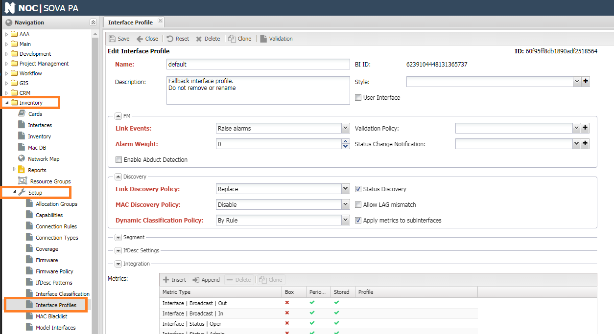

# Interface Profile

Interface profiles allow you to modify the system's behavior and provide additional classification for interfaces.

## Settings

The reference for labels is located in the 'Inventory' section -> 'Setup' -> 'Interface Profile.'

* **Description** - Text explanation.
* **Labels** - A set of profile labels.
* **Style** - The style for displaying in the Managed Object Grid table. The table row is formatted according to this style.
* **Link Events** - Actions for events ('Event') on the interface:
    * Ignore - Ignore events.
    * Log - Log events.
    * Raise - Raise alarms.
* **Discovery Policy** - Policy for discovery during polling:
    * Ignore
    * Create new
    * Replace
    * Cloud
* **Alarm Weight** - Weight coefficient for calculating alarm weight (Alarm Weight).
* **MAC Discovery Policy** - Policy for collecting MAC addresses:
    * Transit - Collect MAC addresses on the interface (Setting for MAC polling).
    * Disable - Do not collect MAC addresses on the interface (Setting for MAC polling).
    * Management VLAN - Collect MACs from the Management VLAN (Setting for MAC polling).
    * Direct Downlink - Port toward the neighboring device (Setting for xMAC).
    * Chained Downlink - Port toward an intermediate device on the path to the end device (Setting for xMAC).
    * Direct Uplink - Port toward the Direct Downlink upstream device.
    * Cloud Downlink - Port toward multiple Direct Uplink connections forming a cloud.
* **Validation Policy** - Reference to the interface configuration validation policy.
* **Allow LAG mismatch** - Allow linking an aggregated LAG port to a physical port.
* **Status Discovery** - Enable status polling on the interface (Status Discovery).
* **Status Change Notification** - Reference to the notification group for sending messages about port status changes (based on Interface Status polling).
* **User Interface** - UNI (User Network Interface) indication. Can be used for selecting user ports.
* **Allow Automatic Segment Change**
* **Allow Vacuum Bulling**
* **Enable Port in Discovery**
* **Collect Metrics from Subinterfaces** - Add subinterfaces to the list of collected metrics.
* **Dynamic Classification Policy** - Policy for assigning profiles:
    * Disable - Do not assign a profile upon saving.
    * By Rule - Assign according to specified rules (Match Rules).
* **Match Rules** - Rules for profile assignment. Allows dynamic assignment.
* **ifDesc Policy** - Settings for linking based on interface descriptions (ifDesc):
    * Symmetric Check - Require symmetric (two-way) link confirmation.
    * Patterns - List of regular expressions.
* **Integration** - Data for integration with an external system. Filled when the ETL (Extract, Transform, Load) mechanism is used:
    * **External System** - Reference to the external system from which the object profile came.
    * **External System ID** - Identifier of the object profile in the external system.
