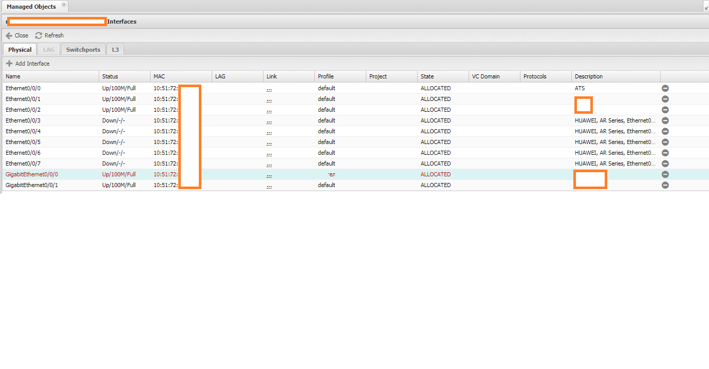
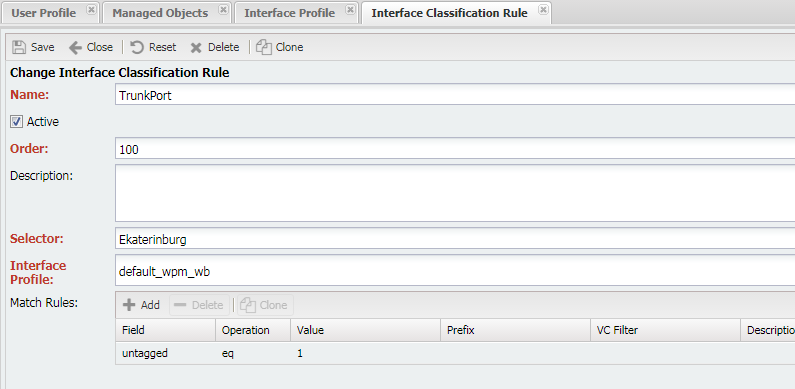

# Interface

Изначально НОК это учет сетевой инфраструктуры и важная часть сети это интерфейсы (`Interfaces`). Основные возможности по работе с интерфейсами:

* Интерфейс является **Ресурсом** (`Resource`)
* Интерфейсы появляются в системе при сборе (`Discovery`). Сбор интерфейсов происходит в рамках опроса [`Interface Discovery`](../../discovery-reference/box/interface.md)
* Между интерфейсами строятся линки (`Link`)
* К интерфейсу могут быть применены групповые настройки [`Interface Profile`](../interface-profile/index.md):
    * Можно настраивать набор собираемых метрик
    * Настройку обработки событий FM
    * Валидировать конфигурацию
* С интерфейсом могут быть связаны:
    * Проект [Project]()
    * Сервис [Service](../service/index.md)
    * `L2 Domain` [VC Domain]()
* Поддерживается назначение групп ресурсов (`Resource Group`)

## Управление интерфейсами

Интерфейсы расположены в меню `Управление устройствами (Service Activation) -> Список объектов (ManagedObjects) -> <Объект> -> Интерфейсы (Interfaces)`

На форме доступно несколько вкладок:

* Физический (`Physical`) - отображаются интерфейсы с типом `Physical`
* LAG (`LAG`) - агрегирующие интерфейсы
* (`Switchport`) - сабинтерфейсы с `AFI` - `BRIDGE`
* L3 - сабинтерфейсы с `AFI` - `IPv4` или `IPv6`

### Групповые настройки

Групповые настройки для Интерфейсов (`Interfaces`) сосредоточены в профилях интерфейса [Interface Profile](../interface-profile/index.md).

## Interface Classification

<!-- prettier-ignore -->
!!! info

  В версии 21.1 механизм классификации интерфейсов заменён механизмом автоматического назначения профилей [Dynamic Classification Policy](../dynamic-profile-classification/index.md)

В определённый момент интерфейсов становится очень много и ручное назначение профилей может быть утомительно. Для автоматизации процесса назначение профилей есть правила классификации интерфейсов. Позволяют по нескольким критериям назначить профиль интерфейса. Отрабатывают во время дискавери интерфейсов.

Правила классификации интерфейсов расположены в меню `Учёт объектов (Inventory) -> Настройки (Setup) → Правила классификации интерфейсов (Interface Classification Rules)`

Внутри правило состоит из:

* **Активный** (`Active`) - статуса правила (Активно/отключено)
* **Приоритет** (`Order`) - номер в цепочке правил
* **Селектор** (`Selector`) - селектор, определяет, какие объекты подпадают под правило (Служат для группировки ManagedObject по какому-либо признаку/признакам. Расположены в разделе `Управление устройствами (Service Activation) -> Настройки (Setup) → Селекторы (Selectors)`)
* **Профиль интерфейса** [Interface profile](../interface-profile/index.md) - профиль интерфейса, назначаемый при совпадении
* Список критериев (`Match rule`) - условия, по которым определяется совпадение правила. Действует правило **И**: т.е. для срабатывания правила необходимо совпадение ВСЕХ перечисленных условий.

<!-- prettier-ignore -->
!!! info 
  Необходимо быть внимательным при заполнении таблицы `Match rule`. Не оставлять пустые строки, это может привести к некорректной работе дисквавери.

### Принципы работы

* Правила объединяются в **цепочки** в порядке возрастания поля **Order**
* Отработка правил идёт по восходящей (начиная с 0), прекращается при ***первом совпадении***.
* Правила по умолчанию нет, т.е. если интерфейс не попал ни под одно из правил, то профиль остаётся неизменным (но можно его создать, для этого достаточно добавить правила с условием `Interface Name regex .*` в конец)
* **Lock** - При ручном назначении профиля на интерфейс устанавливается блокировка и он пропускается при классификации. Это сделано для того чтобы классификация не перекрывала ручные настройки.

### Доступные условия

Условия (`Match Rules`) состоят из указания Поля интерфейса по которому идёт проверка, операции и значения, к которому применяется операция

* **Поле** (`Field`) - признак интерфейса используемый для проверки
  * `Name` - имя интерфейса
  * `Description` - описание интерфейса
  * `IP Address` - IP адрес интерфейса
  * `Tagged VLAN` - тэгированный VLAN
  * `Untagged VLAN` - нетэгированный VLAN
* **Операция** `Operation` - операция, используемая для сравнения
  * `eq` - равенство Field равно
  * `regexp` - совпадение (match) по регулярному выражению
  * `in` - вхождение (может использоваться только с полями `IP Address`, `Tagged VLAN`, `Untagged VLAN`)
* Значение (`Value`) - значение для сравнения операциями `eq` и `regex`
* Префикс (`Prefix`) - Таблица префиксов (`IP Prefix`), поддерживается только для операции `in` и поля `IP Address`. Настраивается в `Основные (Main) -> (Настройки) Setup -> Prefix Tables`
* Фильтр `VLAN`ов (`VC Filter`) - [Фильтр вланов](../vc-filter/index.md), поддерживается только для операции `in` и полей `Tagged VLAN` и `Untagged VLAN`. Настраивается в `VC -> Настройки (Setup) -> VC Filters`
* Описание (`Description`) - пояснения к правилу

Таблица совместимости операция и значений.

| Field         | eq  | regex | in                                                 |
| ------------- | --- | ----- | -------------------------------------------------- |
| Name          | V   | V     | X                                                  |
| Description   | V   | V     | X                                                  |
| IP Address    | X   | X     | V (cо значением `Prefix`)                          |
| Tagged VLAN   | X   | X     | V (cо значением [VC Filter](../vc-filter/index.md) |
| Untagged VLAN | V   | X     | V (cо значением [VC Filter](../vc-filter/index.md) |

<!-- prettier-ignore -->
!!! Info
  Необходимо использовать только совместимые поля и операции. В случае несоблюдения классификация будет заканчиваться ошибкой **NotImplemented Error**

