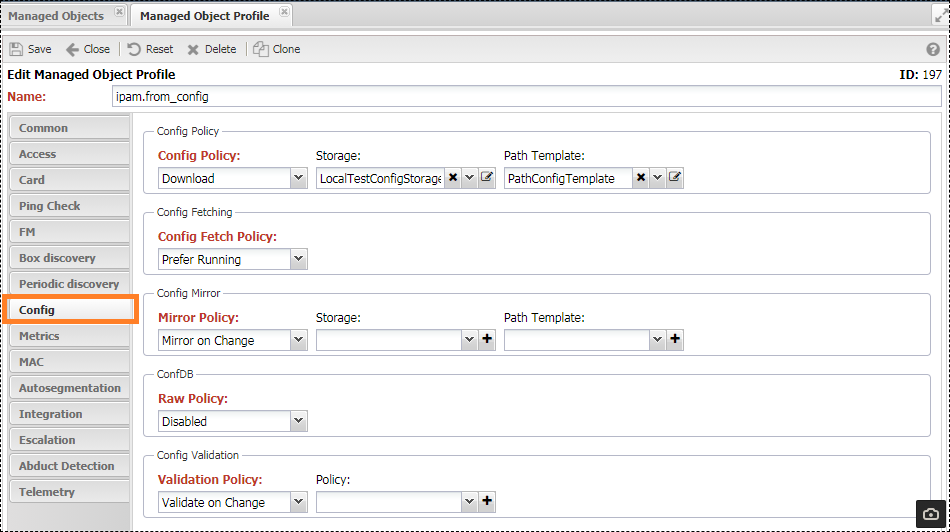

# Managed Object Profile

Group settings applied to all devices assigned to the profile. The main part of the settings is related to Device Discovery and is common to all devices, configured only through the profile. Other settings duplicate device settings.

## Settings

Located in `Device Management (Service Activation) -> Settings (Setup) -> Managed Object Profiles (ManagedObjectProfile)`, grouped by tabs, depending on their purpose.

### Common

* **Description** - text explanation.
* **Level** - numerical designation of the device's position in the topological hierarchy [levels](#hierarchy-levels).
* **Labels** - a set of [labels](../label/index.md) for the profile.
* **Style** - the style of the entry in the device table (`Managed Object Grid`), the table row is formatted according to it.
* **Image** - an icon on the topological map.
* **Glyph** - icon settings on the image.
    * **Image** - image for the glyph.
    * **Position** - position for the glyph.
        * `N` - north (top).
        * `S` - south (bottom).
        * `W` - west (left).
        * `E` - east (right).
    * **Shape** - arrange glyphs in a circle (`circle`) or square (`square`) shape.
* **Address Resolution Policy** - Allows the system to update the device's IP address according to the specified `FQDN`. Useful if devices are assigned dynamic IP addresses.
    * **Resolver Handler** - handler [Handler](../handler/index.md), implements a custom algorithm for updating the IP address.
    * **Address Resolution Policy**.
        * Disabled - do not run IP address updates.
        * Only Once - do not run after a successful address update.
        * Enable - run every poll.
* **IPAM Templates** (`IPAM Template`)
    * `FQDN Suffix` - added to the device name when creating a record in the `DNS` reverse zone.
    * **Name Template** - DNS record name template.
* **Dynamic Classification Policy** - Profile assignment policy.
    * (`Disable`) - Do not assign the profile on save.
    * (`By Rule`) - Assign according to specified rules (`Match Rules`).
* **Match Rules** - profile assignment rules [Profile Assignment Rules](../dynamic-profile-classification/index.md). Allows dynamic assignment.

### Access

* **Access Preference** - Which access protocol to prefer when working with the device. Requires adapter support. If you use `Only` settings and the adapter does not support them, the script will not run.
    * SNMP Only - Use only SNMP; the script will not run if not supported.
    * CLI Only - Use only CLI; the script will not run if not supported.
    * CLI, SNMP - Use CLI, switch to SNMP on error.
    * SNMP, CLI - Use SNMP, switch to CLI on error.
* **CLI Session Policy** - Execute all scripts within a single CLI session.
    * Enable - Enable sessions.
    * Disable - Run a separate session for each script.
* **CLI Privilege Policy** - Elevate privileges when entering CLI.
    * Do not raise - Do not elevate privileges, work in the current mode.
    * Raise Privileges - Elevate privileges.
* (`SNMP Rate Limit`) - Limit the frequency of SNMP requests. Set the number of requests per second, with a minimum of one per second.

### Card

* Card - the name of the [Card](../../services-reference/card.md) template opened for `ManagedObject`.
* Card Title Template - template for the title of the `ManagedObject` device card.

### Ping (Availability Check)

* **Enable Ping Check** - enable availability check (ICMP) for the device (!description).
* *Interval Settings*
    * **Interval** - check interval (in seconds).
    * (Ping Off Hours) - behavior of the check during non-working hours. Used if it is necessary not to stop the check but still see the RTT graph.
        * (Disable Ping) - disable the check.
        * (Enable Ping but Don't Follow Status) - do not disable the check but do not signal unavailability.
* *Series Settings (Ping Series Settings)* - configuration.
    * **Availability Determination Policy (Ping Policy)** - (Explanation of how availability is checked).
        * First Successful - the first packet returned in a series indicates device availability.
        * All Successful - all returned packets indicate availability.
    * **Packet Size, bytes** - ICMP packet size.
    * **Number of Packets** - number of packets in the check.
    * **Timeout, msec** - timeout after which the packet is considered lost.
* Collect RTT for Ping (Report Ping RTT) - collect RTT metric for availability check.
* Save Errors in Series (Report Ping Attempts) - save the number of lost packets in the series.

### FM (Fault Management)

* **Event Policy** - FM message processing policy for the device.
    * (Enable) - process FM messages for the device.
    * (Disable) - do not process FM messages for the device.
* **Alarm Weight** - configuration for calculating the alarm weight [Alarm Weight](../../fault-management/index.md#Severity%20and%20Weight).
* **Syslog Archiving Policy** - send received Syslog messages to archival storage.
* Merge Downlink - activate the Merge Downlink mechanism (!description).

### Box (Full Discovery)

Settings for schedule and composition of discovery.

* **Enable** - enable full discovery on the equipment.
* **Running Policy** - conditions for starting the discovery.
    * Require Up - require availability (ICMP).
    * Require Up if Ping Enabled - require availability (if ICMP check is enabled).
    * Always Run - always run.
* **Interval** - discovery interval (in seconds).
* **Failed Interval** - interval for retrying in case of failure.
* **Check on System Start After** - check on system start after.
* **Check on Config Change After** - check on config change after.
* Discovery - composition of the discovery.
    * [**Profile**](../../discovery-reference/box/profile.md) - determine the working profile (`SA Profile`) of the device. Based on SNMP rules from the section.
    * [**Version**](../../discovery-reference/box/version.md) - collect software and platform version from the device.
    * ([**Caps**](../../discovery-reference/box/caps.md)) - collect device capabilities (SNMP support, functionality support); information is available in the `Capabilities` section.
    * [**Interface**](../../discovery-reference/box/interface.md) - collect network interfaces of the device.
    * ([**ID**](../../discovery-reference/box/index.md)) - collect device identifiers: hostname and MAC address.
    * [**Config**](../../discovery-reference/box/config.md) - collect device configuration.
    * ([**Asset**](../../discovery-reference/box/asset.md)) - collect device components: boards, chassis, SFP.
    * ([**VLAN**](../../discovery-reference/box/vlan.md)) - collect VLANs.
    * ([**MAC**](../../discovery-reference/periodic/mac.md)) - collect MAC addresses. Collect dynamic (D) MAC addresses that meet the criteria from the MAC section.
    * ([**CPE Status**](../../discovery-reference/periodic/cpestatus.md))
    * **Alarm** - synchronize with alarms on the device.
    * ([**Metrics**](../../discovery-reference/periodic/metrics.md)) - collect configured metrics.
* Topology - composition of collected link-building methods (topology).
    * [**NRI**](../../discovery-reference/box/nri.md)
    * [**BFD**](../../discovery-reference/box/bfd.md)
    * [**CDP**](../../discovery-reference/box/cdp.md)
    * [**Huawei NDP**](../../discovery-reference/box/huawei_ndp.md)
    * MikroTik NDP
    * [**FDP**](../../discovery-reference/box/fdp.md)
    * [**LLDP**](../../discovery-reference/box/lldp.md)
    * [**OAM**](../../discovery-reference/box/oam.md)
    * [**REP**](../../discovery-reference/box/rep.md)
    * [**STP**](../../discovery-reference/box/stp.md)
    * [**UDLD**](../../discovery-reference/box/udld.md)
    * [**LACP**](../../discovery-reference/box/lacp.md)
    * xMAC
    * [**ifDesc**](../../discovery-reference/box/ifdesc.md)
    * Cache Neighbor - the system saves neighbors of the device at the specified interval. Until the interval for checking neighborliness expires, the information saved during the previous discovery will be used.
* ifDesc Policy - settings for linking by interface descriptions (ifDesc).
    * (Symmetric Check) - require symmetric (two-way) link confirmation.
    * (Patterns) - list of regular expressions.
* (Platform & Version)
    * (On New Platform) - discovery behavior when an unregistered model is detected in the system.
        * Create - add the model to the system.
        * Alarm - stop the discovery and create an alarm.
    * (On Denied Firmware) - behavior when a prohibited firmware version is detected. Prohibited versions are specified in [Firmware Policy](../firmware-policy/index.md).
        * Ignore - ignore and continue the discovery.
        * Ignore & Stop - ignore and stop the discovery.
        * Raise Alarm - raise an alarm (!Alarm Class).
        * Raise Alarm & Stop - raise an alarm and stop the discovery.
* [IPAM (VPN)](../../discovery-reference/box/vrf.md) - Populate `VRF` in `IPAM`, activated if one of the options is selected.
    * Interface - use `VRF` from `Interface` discovery (must be enabled).
    * MPLS - use `VRF` directly from the device.
    * ConfDB - use `VRF` from device configuration (ConfDB support required).
* IPAM (Prefix) - Populate prefixes in `IPAM`, activated if one of the options is selected.
    * Interface - use prefixes obtained during `Interface` discovery.
    * Neighbor - use data from the device's `ARP` table.
    * ConfDB - use prefixes from device configuration (ConfDB support required).
* IPAM (Address)
    * Interface - use addresses obtained during `Interface` discovery.
    * Management - use the device's (`ManagedObject`) management IP address from settings.
    * DHCP - use data from the DHCP pool (requires `get_dhcp_pool` script support).
    * Neighbor - use data from the device's `ARP` table.
    * ConfDB - use addresses (`Address`) from device configuration (ConfDB support required).
* Clear Links
    * On Platform Change - delete device links when the platform changes.
* [SLA](../../discovery-reference/box/sla.md) - collect SLA probes from the device (adapter support required).
* [CPE Status](../../discovery-reference/periodic/cpestatus.md) - collect operational CPE status from the controller.
* (CPE) - collect `CPE` devices from the controller.
* NRI - Integration queries with an external system.
    * Port Mapping [Portmapper](../../etl/index.md#portmapper) - mapping network interfaces with ports in an external system (adapter implementation required).
    * Service Binding - bind services to interfaces.
* Housekeeping - activate the [HK Check](../../discovery-reference/box/hk.md) mechanism.
* Discovery Alarm
    * Box Alarm
        * Enable - enable alarm creation for full discovery.
        * Disable - disable alarm creation for full discovery.
    * (Fatal Alarm Weight)
    * (Alarm Weight)

### Periodic (Periodic Discovery)

* **Enable** - enable periodic discovery on the equipment.
* **Running Policy** - conditions for starting the discovery.
    * Require Up - require availability (ICMP).
    * Require Up if Ping Enabled - require availability (if ICMP check is enabled).
    * Always Run - always run.
* **Interval** - discovery interval (in seconds).
* Discovery - composition of the discovery.
    * [Uptime](../../discovery-reference/periodic/uptime.md)
    * [Interface Status](../../discovery-reference/periodic/interfacestatus.md)
    * [CPE Status](../../discovery-reference/periodic/cpestatus.md)
    * [MAC](../../discovery-reference/periodic/mac.md)
    * [Alarms](../../discovery-reference/periodic/alarms.md)
    * [Metrics](../../discovery-reference/periodic/metrics.md)
* Discovery Alarm
    * Box Alarm
        * Enable - enable alarm creation for full discovery.
        * Disable - disable alarm creation for full discovery.
    * (Fatal Alarm Weight)
    * (Alarm Weight)

### Config (Configuration)

Settings for collecting and processing equipment configuration.

> Description (Configuration Mechanism)

* Config Policy - configuration collection source settings
    * **Configuration Collection Policy** (`Config Policy`) - source of device configuration retrieval
        * `Script` - use script
        * `Script, Download` - script first, external storage in case of failure
        * `Download, Script` - external storage first, script in case of failure
        * `Download` - external storage
    * **Storage** (`Storage`) - link to the used [Storage](../external-storage/index.md)
    * **Path Template** (`Path Template`) - [Template](../template/index.md) for the configuration file path. Specified in the template body.
* Config Fetching - 
    * **Configuration Collection Policy** (`Config Fetch Policy`) - adapter support is required
        * **Prefer Startup** (`Prefer Startup`) - collect startup configuration of the equipment
        * **Prefer Running** (`Prefer Running`) - collect running configuration of the equipment
* Config Mirror
    * (`Mirror Policy`) - activate the configuration mirroring mechanism
        * Disable `Disabled` - turn off
        * Always `Always Mirror` - always mirror
        * On Change `Mirror on Change` - mirror configuration only on changes
    * (`Storage`) - link to the used [Storage](../external-storage/index.md)
    * (`Path Template`) - [Template](../template/index.md) for the configuration file path. Specified in the template body.
* (`Raw Policy`) - include the `raw` section in `ConfDB` - configuration without normalization
    * Disable (`Disabled`) - do not include the `raw` section in `ConfDB`
    * Enable (`Enabled`) - add the `raw` section to `ConfDB`
* Config Validation - configuration validation policy
    * (`Validation Policy`) - configuration validation behavior
        * (`Disabled`) - do not validate configuration
        * (`Always Validate`) - always validate (every poll)
        * (`Validate on Change`) - validate only on change
    * (`Policy`) - link to validation policy
* Beef
    * (`Beef Policy`)
    * (`Storage`)
    * (`Path Template`)

### Metrics

Table of configured metrics. The assigned metric must be supported by the profile (`SA Profile`).

* [**Metric Type**](../../metrics-reference/index.md) - the collected metric
* (`Box`) - collect the metric during full discovery (`Box Discovery`)
* (`Periodic`) - collect the metric during periodic discovery (`Periodic Discovery`)
* (`Is Stored`) - store the metric in the database
* [**Threshold Profile**](../threshold-profile/index.md)

### MAC

Configuration of MAC address filtering after collection.

* **Collect All** - collect all MAC addresses
* **Collect if permitted by interface profile** - collect MAC addresses from interfaces permitted in the interface profile (`Interface Profile`)
* **Collect from management VLAN** - collect MAC addresses only from the management VLAN. Set in the network segment settings (`Network Segment`)
* **Collect from multicast VLAN** - collect MAC addresses only from the multicast VLAN. Set in the network segment settings (`Network Segment`)
* **Collect from VLAN matching VC Filter** - collect according to the VLAN filter matching VC Filter

### Autosegmentation

Automatic segmentation settings.

### Integration

Data for integration with an external system. Filled in when the ETL mechanism is in operation.
* **Remote System** - link to the external system from which the object profile came
* **Remote ID** - identifier of the object profile in the external system

### Escalation

Configuration for escalating alarms based on the device.
* **Escalation Policy**
    * Enable - allow escalation of alarms based on the device
    * Disable - disable escalation of alarms based on the device
    * As Depended - escalate only as part of a higher-level alarm

## MatchLabel

The object profiles create a service label `noc::managedobjectprofile::<name>::=`

## Hierarchy Levels

| Role                   | Level     |
| ---------------------- | --------- |
| **Client's Equipment** | **10-19** |
| CPE                    | 15        |
| **Access Level**       | **20-29** |
| VPN Server             | 22        |
| WiFi Access Point      | 22        |
| Media Gateway          | 23        |
| Access Switch          | 25        |
| **Aggregation Level**  | **30-39** |
| WiFi Controller        | 35        |
| Aggregation Switch     | 38        |
| **City Core**          | **40-49** |
| L3 switch/router       | 42        |
| BRAS                   | 44        |
| MPLS PE                | 44        |
| MPLS P                 | 46        |
| ASBR                   | 48        |
| **Regional Core**      | **50-59** |
| L3 switch/router       | 52        |
| MPLS PE                | 54        |
| MPLS P                 | 56        |
| ASBR                   | 58        |
| **Macroregional Core** | **60-69** |
| L3 switch/router       | 62        |
| MPLS PE                | 64        |
| MPLS P                 | 66        |
| ASBR                   | 68        |
| **National-wide Core** | **70-79** |
| L3 switch/router       | 72        |
| MPLS PE                | 74        |
| MPLS P                 | 76        |
| ASBR                   | 78        |
| **World-wide Core**    | **70-79** |
| L3 switch/router       | 82        |
| MPLS PE                | 84        |
| MPLS P                 | 86        |
| ASBR                   | 88        |
