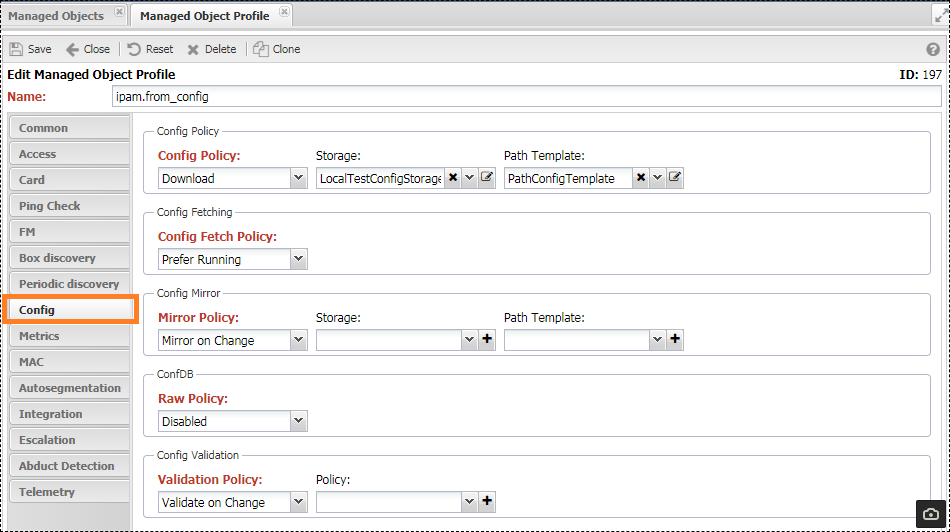

# Managed Object Profile

Групповые настройки, применяемые ко всем устройствам, которым назначен профиль. Основная часть настроек связана с Опросом (`Discovery`) устройства, они общие для всех устройств и настраиваются только через профиль. Остальные настройки дублируют настройки устройства.

## Настройки

Расположены в `Управление устройствами (Service Activation) -> Настройки (Setup) -> Профили объекта (ManagedObjectProfile)` Сгруппированы по вкладкам, в зависимости от назначения

### Common(Общие)

* **Описание** (`Description`) - текстовое пояснение
* **Уровень** (`Level`) - числовое обозначение положения устройства в топологической (`Topology`) [иерархии](#уровни-иерархии)
* **Метки** (`Labels`) - набор [Меток](../label/index.md) профиля
* **Стиль** (`Style`) - стиль записи в таблице устройств (`Managed Object Grid`), в соответствии с ним оформляется строка в таблице
* **Изображение** (`Shape`) - иконка на топологической карте
* *Значок* (`Glyph`) - настройки значка на изображении
    * **Картинка** (`Glyph`) - изображение для значка
    * **Позиция** (`Position`) - позиция для значка.
        * `N` - север (верх)
        * `S` - юг (низ)
        * `W` - запад (лево)
        * `E` - восток (право)
    * **Форма** (`Form`) - распологать значки по форме - круг (`circle`) или квадрат (`square`)
* *Политика определения адреса управления* (`Address Resolution Policy`) - Позволяет системе обновлять IP адрес устройства по указанному `FQDN`. Полезно если устройствам выдаётся динамический IP адрес.
    * **Обработчик резолва адреса** (`Resolver Handler`) - обработчик [Handler](../handler/index.md), реализует собственный алгоритм обновления IP адреса.
    * **Политика определения адреса управления** (`Address Resolution Policy`). 
        * Отключить (`Disabled`) - не запускать обновление IP адреса
        * Единожды (`Only Once`) - после усешного обновление адреса больше не запускать
        * Включить (`Enable`) - запускать каждый опрос
* *Шаблоны IPAM* (`IPAM Template`)
    * `FQDN Suffix` - добавляется к имени устройству при формировании записи в обратной зоне `DNS`
    * **Шаблон имени** (`Name template`) - шаблон имени DNS записи
* **Dynamic Classification Policy** -  Политика назначения профиля 
    * (`Disable`) - Не назначать профиль при сохранении
    * (`By Rule`) - Назначать согласно указанным правилам (`Match Rules`)
* **Match Rules** - правила назначения профиля [Правила назначение профиля](../dynamic-profile-classification/index.md). Позволяется динамически назначать

### Access(Доступ)

* **Приоритет протокола доступа** (`Access Preference`) - Какому протоколу отдать предпочтение при работе с устройством. !Требует поддержки со стороны адаптера. Если использовать `Only` настройки, то при отсутствии поддержки со стороны адаптера скрипт запускаться не будет
    * Только SNMP (`SNMP Only`) - Использовать только `SNMP`, при отсутствии поддержки скрипт выполнен не будет.
    * Только CLI (`CLI Only`) - Использовать только `CLI`, при отсутствии поддержки скрипт выполнен не будет.
    * CLI, SNMP - Использовать `CLI`, при ошибке переключиться на `SNMP`
    * SNMP, CLI - Использовать `SNMP`, при ошибке переключиться на `CLI`
* **Политика работы в CLI** (`CLI Session Policy`) - Выполнять все скрипты (`scripts`) в рамках одной сессии `CLI`
    * `Enable` - включить сессии
    * `Disable` - запускать отдельную сессию для каждого скрипта
* **Политика работы с привилегиями в CLI** (`CLI Privilege Policy`) - поднимать привилегии при заходе в CLI
    * `Do not raise` - не поднимать привилегии, работать в текущем режиме
    * `Raise Privileges` - поднимать привилегии
* (`SNMP Rate Limit`) - Ограничить частоту SNMP запросов. Задаётся число запросов в секунду - минимуму один в секунду.

### Card(Карточка)

* Карточка (`Card`) - название шаблона [Карточки (`Card`)](../../services-reference/card.md), открываемой для `ManagedObject`
* Шаблон заголовка карточки (`Card Title Template`) - шаблон для заголовка карточки Устройства `ManagedObject`

### Ping(Проверка доступности)

* **Включить** (`Ping Check`) - включить проверку доступности (`ICMP`) для устройства (!описание)
* *Настройки интервала*
    * **Интервал** (`Ping discovery intervals`) - интервал проверки (в секундах)
    * (`Ping Off Hours`) - поведение проверки в нерабочие часы. Используется если есть необходимость не останавливать проверку, при этом видеть график `RTT`
        * (`Disable ping`) - отключить проверку
        * (`Enable ping but dont follow status`) - не отключать проверку, но не сигнализировать о недоступности
* *Настройки серии* (`Ping series settings`) - настройка 
    * **Политика определения доступности** (`Ping Policy`) - (Объяснение как проверять доступность)
        * Первый успешный (`First Success`) - первый вернувшийся пакет из серии обозначает доступность устройства
        * Все успешные (`All Success`) - все вернувшиеся пакеты обозначают доступность
    * **Размер пакета, байт** (`Packet size, bytes`) - размер пакета ICMP
    * **Количество пакетов** (`Packets count`) - число пакетов в проверке
    * **Таймаут, мсек** (`Timeout, msec`) - таймаут после которого пакет считается потерянным
* Собирать RTT по Ping (`Report ping RTT`) - собирать метрику `RTT` для проверки доступности
* Сохранять ошибки в серии (`Report ping attempts`) - сохранять число потерянных пакетов в серии

### FM

* **Политика событий** (`Event Policy`) - политика обработки сообщений FM для устройства
    * (`Enable`) - обрабатывать сообщения FM для устройства
    * (`Disable`) - не обрабатывать сообщения FM для устройства
* **Вес аварии** (`Alarm Weight`) - настройка для расчёта веса аварии [Alarm Weight](../../fault-management/index.md#Серьёзность%20и%20Вес)
* **Политика архивирования Syslog** (`Syslog Archive Policy`) - отправлять принятые сообщения `Syslog` в архивное хранилище
* `Merge Downlink` - активировать механизм `Merge Downlink` (!описание)

### Box(Полный_опрос)

Настройки расписания и состава опроса.

* Включить (`Enable`) - включить полный опрос на оборудовании
* **Политика запуска опроса** (`Running Policy`) - условие запуска опроса.
    * Требуется доступность (ICMP) (`Require Up`)
    * Требуется доступность (если активирована проверка ICMP) (`Require Up if ping enabled`)
    * Всегда (`Always Run`)
* **Интервал** (`Interval, sec`) - интервал запуска опроса
* **Интервал при сбое** (`Failed Interval, sec`) - интервал повторного запуска при сбое
* **Проверять при загрузке** (`Check on system start after`) ????????
* **Проверять при смене конфига** (`Check on config change after`)
* *Опросы* (`Discovery`) - состав опроса.
    * [**Профиль** (`Profile`)](../../discovery-reference/box/profile.md) - определение рабочего профиля (`SA Profile`) устройство. Ведётся на основе правил `SNMP` из раздела
    * [**Версия** (`Version`)](../../discovery-reference/box/version.md) - сбор версии ПО и платформы с устройства
    * [(`Caps`)](../../discovery-reference/box/caps.md) - сбор возможностей устройства (поддержка SNMP, функционала), информация доступна в разделе `Возможности`
    * [**Интерфейс** (`Interface`)](../../discovery-reference/box/interface.md) - сбор сетевых интерфейсов устройства. 
    * [(`ID`)](../../discovery-reference/box/index.md) - сбор идентификаторов устройства: `hostname` и `MAC` адрес
    * [**Конфиг** (`Config`)](../../discovery-reference/box/config.md) - сбор конфигурации
    * [(`Asset`)](../../discovery-reference/box/asset.md) - сбор состава устройства: платы, шассы, SFP
    * [(`VLAN`)](../../discovery-reference/box/vlan.md) - сбор вланов
    * [(`MAC`)](../../discovery-reference/periodic/mac.md) - сбор MAC адресов. Собираются динамические (`D`) MAC адреса, подпадающие под критерии из раздела `MAC`
    * [(`CPE Status`)](../../discovery-reference/periodic/cpestatus.md)
    * **Аварии** (`Alarm`) - синхронизация с авариями на устройстве
    * [**Метрики** (`Metrics`)](../../discovery-reference/periodic/metrics.md) - сбор настроенных метрик
* *Топология* (`Topology`) - состав собираемых методов построения связи (топологии)
    * [**NRI**](../../discovery-reference/box/nri.md)
    * [**BFD**](../../discovery-reference/box/bfd.md)
    * [**CDP**](../../discovery-reference/box/cdp.md)
    * [**Huawei NDP**](../../discovery-reference/box/huawei_ndp.md)
    * **MikroTik NDP**
    * [**FDP**](../../discovery-reference/box/fdp.md)
    * [**LLDP**](../../discovery-reference/box/lldp.md)
    * [**OAM**](../../discovery-reference/box/oam.md)
    * [**REP**](../../discovery-reference/box/rep.md)
    * [**STP**](../../discovery-reference/box/stp.md)
    * [**UDLD**](../../discovery-reference/box/udld.md)
    * [**LACP**](../../discovery-reference/box/lacp.md)
    * **xMAC**
    * [**ifDesc**](../../discovery-reference/box/ifdesc.md)
    * **Cache Neighbor** - система сохраняет на заданный интервал соседей устройства. Пока не пройдёт интервал для проверки соседства будет использоваться сохранённая во время предыдущего опроса информация
* *ifDesc Policy* - настройки для линковки по Дескрипшенам интерфейсов (`ifDesc`)
    * (`Symmetric Check`) - требовать симметричного (двухстороннего) подтверждения линка
    * (`Patterns`) - список регулярных выражений
* (`Platform & Version`)
    * (`On New Platform`) - поведение опроса при обнаружении не зарегистрированной в системе модели
        * Создать `Create` - добавить модель в систему
        * Авария `Alarm` - остановить опрос и создать аварию
    * (`On Denied Firmware`) - поведение при обнаружении запрещённой к использованию версии ПО. Запрещенные версии указываются в [FirmwarePolicy](../firmware-policy/index.md)
        * `Ignore` - игнорировать и продолжить опрос
        * `Ignore&Stop` - игнорировать и остановить опрос
        * `Raise Alarm` - поднять аварию (!Alarm Class)
        * `Raise Alarm&Stop` - поднять аварию и остановить опрос
* [*IPAM (VPN)*](../../discovery-reference/box/vrf.md) - Наполнение `VRF` в `IPAM`, активируется если отмечена одна из опций
    * Интерфейс (`Interface`) - использовать `VRF` из опроса `Interface` (должен быть активирован)
    * MPLS - использовать `VRF` напрямую с устройства
    * ConfDB - использовать `VRF` из конфигурации устройства (должна быть поддержка (`ConfDB`))
* *IPAM (Prefix)* - Наполнение префиксов (`Prefix`) в `IPAM`, активируется если отмечена одна из опций
    * Интерфейс (`Interface`) - использовать префиксы, полученные при сборе интерфейсов (`Interface`)
    * Соседи (`Neighbor`) - использовать данные таблицы `ARP` устройства
    * ConfDB - использовать префиксы (`Prefix`) из конфигурации устройства - должна быть поддержка (`ConfDB`)
* *IPAM (Address)*
    * Интерфейс (`Interface`) - использовать адреса, полученные при сборе интерфейсов (`Interface`)
    * Management - использовать IP адрес управления устройства (`ManagedObject`) из настроек
    * DHCP - ипользовать данные DHCP пула (необходимо поддержка скрипта `get_dhcp_pool`)
    * Neighbor - использовать данные таблицы `ARP` устройства
    * ConfDB - использовать адреса (`Address`) из конфигурации устройства - должна быть поддержка (`ConfDB`)
* *Clear links*
    * **On platform change** - удалять линки устройства при изменении платформы (`Platform`)
* [SLA](../../discovery-reference/box/sla.md) - собирать SLA пробы с устройства (необходима поддержка со стороны адаптера)
* [CPE Status](../../discovery-reference/periodic/cpestatus.md) - собирать оперативный статус CPE с контроллера
* (`CPE`) - собирать устройства `CPE` с контроллера
* *NRI* - Опросы по интеграции с внешней системой
    * **Привязка портов** [Portmapper](../../etl/index.md#portmapper) - маппинг сетевых интерфейсов с портами внешней системы (необходима реализация адаптера)
    * **Привязка сервисов к портам** (`Service Binding`) - осуществлять привязку сервисов к интерфейсам
* *Housekeeping* - активировать механизм [HK Check](../../discovery-reference/box/hk.md)
* *Discovery Alarm* - 
    * **Аварий при опросе** (`Box Alarm`)
        * Включить (`Enable`) - включить создание аварий по полному опросу
        * Отключить (`Disable`) - выключить создание аварий по полному опросу
    * (`Fatal Alarm Weight`)
    * (`Alarm Weight`)

### Periodic(Периодический опрос)

* Включить (`Enable`) - включить полный опрос на оборудовании
* **Политика запуска опроса** (`Running Policy`) - условие запуска опроса.
    * Требуется доступность (ICMP) (`Require Up`)
    * Требуется доступность (если активирована проверка ICMP) (`Require Up if ping enabled`)
    * Всегда (`Always Run`)
* **Интервал** (`Interval, sec`) - интервал запуска опроса
* *Опросы* (`Discovery`) - состав опроса
    * [Uptime](../../discovery-reference/periodic/uptime.md)
    * [Interface status](../../discovery-reference/periodic/interfacestatus.md)
    * [CPE status](../../discovery-reference/periodic/cpestatus.md)
    * [MAC](../../discovery-reference/periodic/mac.md)
    * [Alarms](../../discovery-reference/periodic/alarms.md)
    * [Metrics](../../discovery-reference/periodic/metrics.md)
* *Discovery Alarm* - 
    * **Аварий при опросе** (`Box Alarm`)
        * Включить (`Enable`) - включить создание аварий по полному опросу
        * Отключить (`Disable`) - выключить создание аварий по полному опросу
    * (`Fatal Alarm Weight`)
    * (`Alarm Weight`)

### Config(Конфигурация)

Настройки сбора и обработки конфигурации оборудования

> Описание (Механизм работы с конфигурацией)

* *Config Policy* - настройки источника сбора конфигурации
    * **Политика сбора конфигурации** (`Config Policy`) - источник получения конфигурации устройства
        * `Script` - использовать скрип
        * `Script, Download` - вначале скрипт, в случае неудачи - внешнее хранилище
        * `Download, Script` - вначале внешнее хранилище, в случае неудачи - скрипт
        * `Download` - внешнее хранилище
    * **Хранилище** (`Storage`) - ссылка на используемое [Xранилище](../external-storage/index.md)
    * **Шаблон пути** (`Path Template`) - [Шаблон](../template/index.md) пути к файлу конфигураци. Задаётся в `body` шаблона
* *Config Fetching* - 
    * **Политика сбора конфигурации** (`Config Fetch Policy`) - необходима поддержка со стороны адаптера
        * **Предпочитать Startup** (`Prefer Startup`) - собирать startup config оборудования 
        * **Предпочитать Running** (`Prefer Running`) - собирать running config оборудования 
* *Config Mirror*
    * (`Mirror Policy`) - активировать механизм зеркалирования конфигурации
        * Выключить `Disabled` - отключить
        * Всегда `Always Mirror` - всегда зеркалировать
        * При изменении `Mirror on Change` - зеркалировать конфигурацию только при изменениях
    * (`Storage`) - ссылка на используемое [Xранилище](../external-storage/index.md)
    * (`Path Template`) - [Шаблон](../template/index.md) пути к файлу конфигураци. Задаётся в `body` шаблона
* (`Raw Policy`) - включать в `ConfDB` секцию `raw` - конфигурацию без нормализации
    * Отключить (`Disabled`) - не включать секцию `raw` в `ConfDB`
    * Включить (`Enabled`) - добавить секцию `raw` в `ConfDB`
* *Config Validation* - политика валидации конфигурации
    * (`Validation Policy`) - работа валидации конфигурации
        * (`Disabled`) - не валидировать конфигурацию
        * (`Always Validate`) - всегда валидировать (каждый опрос)
        * (`Validate on Change`) - валидировать только при изменении
    * (`Policy`) - ссылка на политику валидации
* *Beef*
    * (`Beef Policy`)
    * (`Storage`)
    * (`Path Template`)

### Metrics

Таблица настроенных метрик. Назначенная метрика должна быть поддержана профилем (`SA Profile`)

* [**Тип метрики** (`Metric Type`)](../../metrics-reference/index.md) - собираемая метрика
* (`Box`) - собирать метрику во время полного опроса (`Box Discovery`)
* (`Periodic`) - собирать метрику во время периодического опроса (`Periodic Discovery`)
* (`Is Stored`) - сохранять метрику в базу
* [**Профиль порога** (`Threshold Profile`)](../threshold-profile/index.md)

### MAC

Настройка фильтрации MAC адресов после сбора

* **Собирать все** (`Collect All`) - собирать все MAC адреса
* **Собирать разрешённые профилем интерфейса** (`Collect if permitted by interface profile`) - собирать MAC адреса с интерфейсов, разрешённых в профиле интерфейса (`Interface Profile`)
* **Собирать с влана управления** (`Collect from management VLAN`) - собирать MAC адреса только с влана управления (`Management VLAN`). Выставляется в настройках сегмента (`Network Segment`)
* **Собирать из мультикаст влана** (`Collect from multicast VLAN`) - собирать MAC адреса только с мультикаст влана (`Management VLAN`). Выставляется в настройках сегмента (`Network Segment`)
* **Собирать согласно фильтру вланов** (`Collect from VLAN matching VC Filter`)

### Autosegmentation

Настройки автоматической сегментации

### Integration

Данные для интеграции с внешней системой. Заполняются при работе механизма `ETL`
* **Внешняя система** (`Remote Syste`) - ссылка на внешнюю систему из которой поступил профиль объекта
* **ID внешней системы** (`Remote ID`) - идентификатор профиля объекта во внешней системе

### Escalation

Настройка для эскалации аварий по устройству.
* **Политика эскалации** (`Escalation Policy`) 
    * Включить (`Enable`) - разрешить эскалацию аварий по устройству
    * Отключить (`Disable`) - запретить эскалацию аварий по устройству
    * Как зависимое устройство (`As Depended`) - эскалировать только как часть вышестоящей аварии

## MatchLabel

Профили объекта создаёт служебную метку `noc::managedobjectprofile::<name>::=`

## Уровни иерархии

| Role                   | Level     |
| ---------------------- | --------- |
| **Client's Equipment** | **10-19** |
| CPE                    | 15        |
| **Access Level**       | **20-29** |
| VPN Server             | 22        |
| WiFi Access Point      | 22        |
| Media Gateway          | 23        |
| Access Switch          | 25        |
| **Aggregation Level**  | **30-39** |
| WiFi Controller        | 35        |
| Aggregation Switch     | 38        |
| **City Core**          | **40-49** |
| L3 switch/router       | 42        |
| BRAS                   | 44        |
| MPLS PE                | 44        |
| MPLS P                 | 46        |
| ASBR                   | 48        |
| **Regional Core**      | **50-59** |
| L3 switch/router       | 52        |
| MPLS PE                | 54        |
| MPLS P                 | 56        |
| ASBR                   | 58        |
| **Macroregional Core** | **60-69** |
| L3 switch/router       | 62        |
| MPLS PE                | 64        |
| MPLS P                 | 66        |
| ASBR                   | 68        |
| **National-wide Core** | **70-79** |
| L3 switch/router       | 72        |
| MPLS PE                | 74        |
| MPLS P                 | 76        |
| ASBR                   | 78        |
| **World-wide Core**    | **70-79** |
| L3 switch/router       | 82        |
| MPLS PE                | 84        |
| MPLS P                 | 86        |
| ASBR                   | 88        |
