# Network Segment

Large networks tend to be hierarchical by nature, separating to various
layers. i. e. core, aggregation, access e.t.c. Therefore the network can
be considered as hierarchy of interconnected parts, called `Network Segments`

Network Segment is a group of [Managed Objects](../managed-object/index.md)
taking specific part in network hierarchy. Each Managed Object **MUST**
belong to one Network Segment. Typical Network Segment hierarchy:

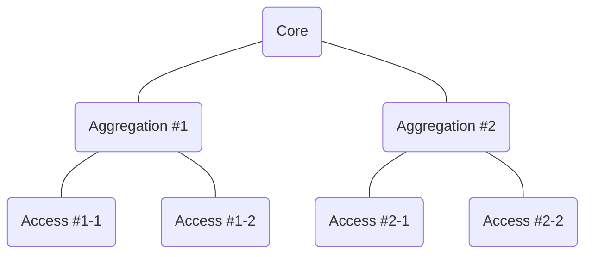

<!-- prettier-ignore -->
!!! note
    NOC considers that is Managed Object belongs to segment, not the link.
    So in terms of network separation NOC uses IS-IS approach, not OSPF one.

Each segment except top-level ones has exactly one _Parent_ and has
zero-or-more _Children_ segments. So segment provides connectivity
between its children and the rest of network.

Proper segmentation is the key concept for various areas:

- [Root-Cause Analysis](../../glossary/index.md#root-cause-analysis) ([RCA](../../glossary/index.md#rca)) for Fault Management
- Network Maps
- VLAN management
- Configuration generation and checking

<!-- prettier-ignore -->
!!! note
    NOC considers that proper segmentation is performing during network
    design and planning stage. Sometimes it's not true and segmentation
    is *implicit* or *ad-hoc*. Despite it considered *Bad Practice*
    NOC offers various methods for [Automatic Segmentation](#autosegmentation)

## Group Settings

Group settings for Network Segments are contained in [Network Segment Profiles](../network-segment-profile/index.md)

## Segment Topology

Segment is the set of _Managed Objects_ and links between them so
it can be considered a _Graph_. NOC extends Graph with all _Managed Objects_
from adjacent segments, connected to given segment to build
_Segment Topology_. NOC automatically recognizes following topologies

### Tree

Tree topology contains exactly one path between any Object.

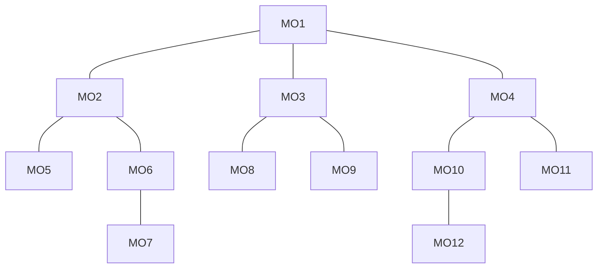

_Tree_ offers no redundancy. Any failed Object makes its children
unavailable. Following example shows failed _MO3_ makes _MO8_ and _MO9_
unavailable.

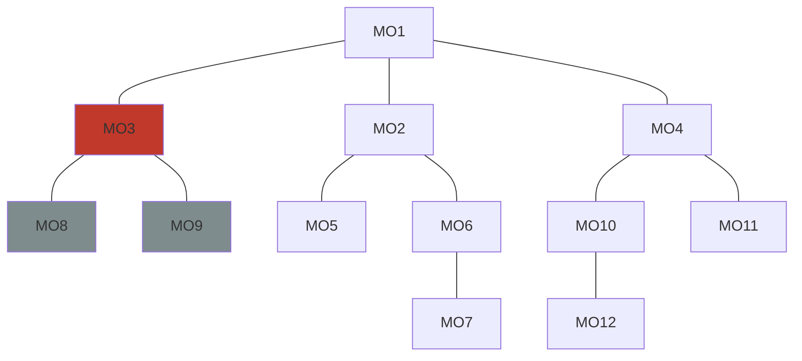

NOC performs auto-layout of _Tree_ segment maps and proper [RCA](../../glossary/index.md#rca)

### Forest

_Forest_ is common case with two-or-more independent trees. Like a _Tree_

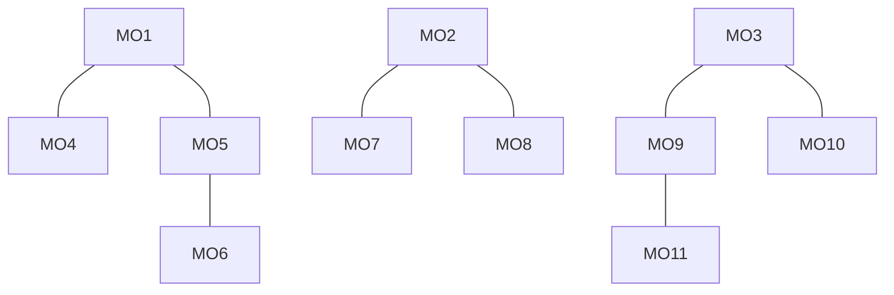

_Forest_ offers no redundancy. Any failed Object makes its children
unavailable.
NOC performs auto-layout of _Forest_ segment maps and proper [RCA](../../glossary/index.md#rca)

<!-- prettier-ignore -->
!!! note
    *Forest* segments should be split to several *Tree* segment
    unless you have explicit reason to use *Forest*

### Ring

Common _Ring_ topology considers each object connected with exactly two
neighbors

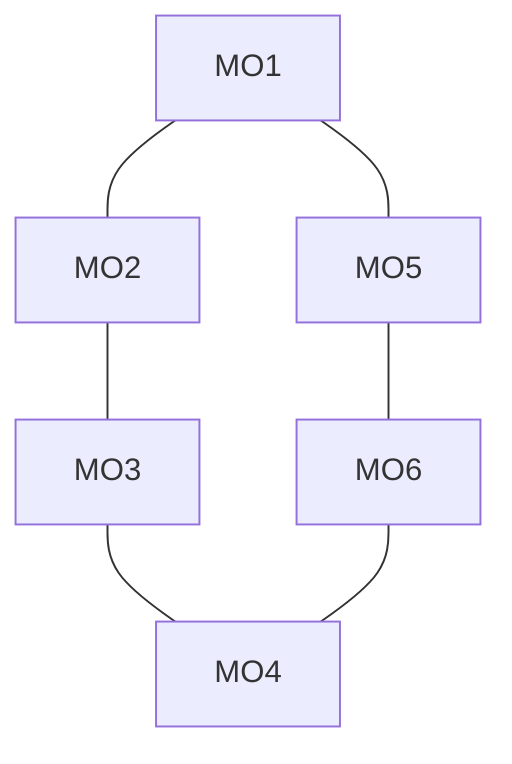

_Ring_ offers protection against single node failure. Following example
shows _MO3_ failure not affects other objects

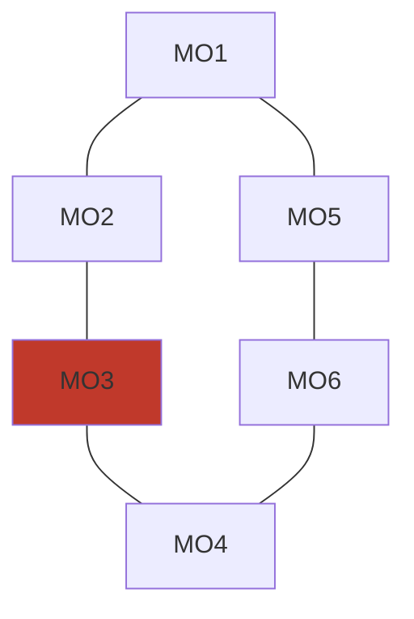

Though additional failure of _MO6_ leads to _MO4_ unavailability

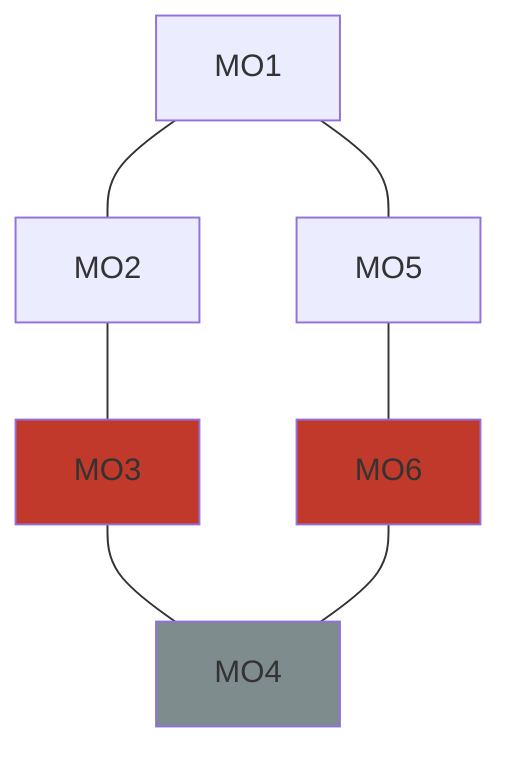

Pure _Ring_ topology is rather expensive, as any Object must be
capable of forwarding all ring's traffic and is not very flexible
to expanding port space. So real networks tends to use combined _Ring_ and
_Tree_ topology, while segment's backbone is the common _Ring_ combined
with small _expansion trees_, attached to _Ring_ nodes. Port expansion
is performed with cheap switches contained within same PoP with backbone nodes.

<!-- prettier-ignore -->
!!! todo
     Show Ring-and-Tree topology and describe fault propagation

NOC performs neat auto-layout of _Ring_ segment maps and proper [RCA](../../glossary/index.md#rca)

### Mesh

_Mesh_ is the common graph which is not _Tree_, _Forest_ or _Ring_

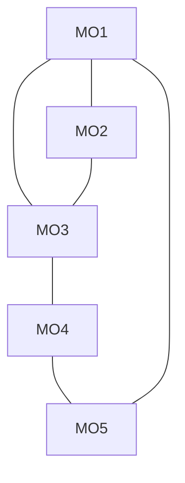

NOC performs probabilistic spring layout for mesh networks which may
require manual correction and performs proper [RCA](../../glossary/index.md#rca) in most cases

## Object Uplinks

Except in rare cases _Managed Objects_ should have one or more _Paths_
to upper levels of network (to establish _Connectivity_ with all network)
or to the NOC's probes (to be monitored and managed at all).

Those paths are called _Uplink Paths_ and all direct _Neighbors_ on the
_Uplink Paths_ are called _Uplinks_. The role of _Uplink_ is to provide
_Connectivity_ for its _Downlink_. For reserved topologies object's _Uplink_ may be
its _Downlink_ at the same time.

_Uplinks_ are key concept for [RCA](../../glossary/index.md#rca). _Managed Object_ with all unavailable
uplinks looses _Connectivity_ and problem lies somewhere on the _Uplink Paths_.

NOC perform automatic uplinks calculation on topology changes. The proccess
can be configured via [Network Segment Profiles](../network-segment-profile/index.md)
[Uplink Policy](../network-segment-profile/index.md#uplink-policy) setting.

It is advised to avoid very large segments (>100 Objects)

## Segment Uplinks

_Segment Uplinks_ is the objects providing _Connectivity_ for any of
Segment's objects. _Segment Uplinks_ can belong to segment itself,
or may belong to any neighbor segment

## Horizontal Transit

Sometimes network segments of same level connected together
for backup purposes. So in case of uplink failure one segment
can use other as temporary uplink (_S2_ - _S3_ dotted link).

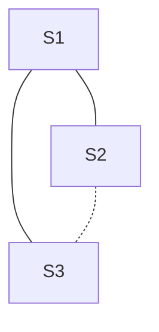

NOC offers additional Network Segment setting to specify whether
such horizontal traffic flow is acceptable. _Horizontal Transit Policy_
configured on per-segment and per- Network Segment Profile basis via
_Horizontal Transit Policy_ setting. Possible values are:

- **Profile** (default): Use _Horizontal Transit Policy_ from Network Segment Profile.
- **Always Enable**: _Horizontal Transit_ is always enabled.
- **Disable**: _Horizontal Transit_ is always disabled.
- **Calculate**: _Horizontal Transit_ is enabled if horizontal link is present

NOC adjust RCA behavior in according to _Horizontal Transit Policy_,
considering neighbor segment as additional _Uplink Path_.

## Sibling Segments

Network topology may change over time. Consider typical scheme
of broadband access network:

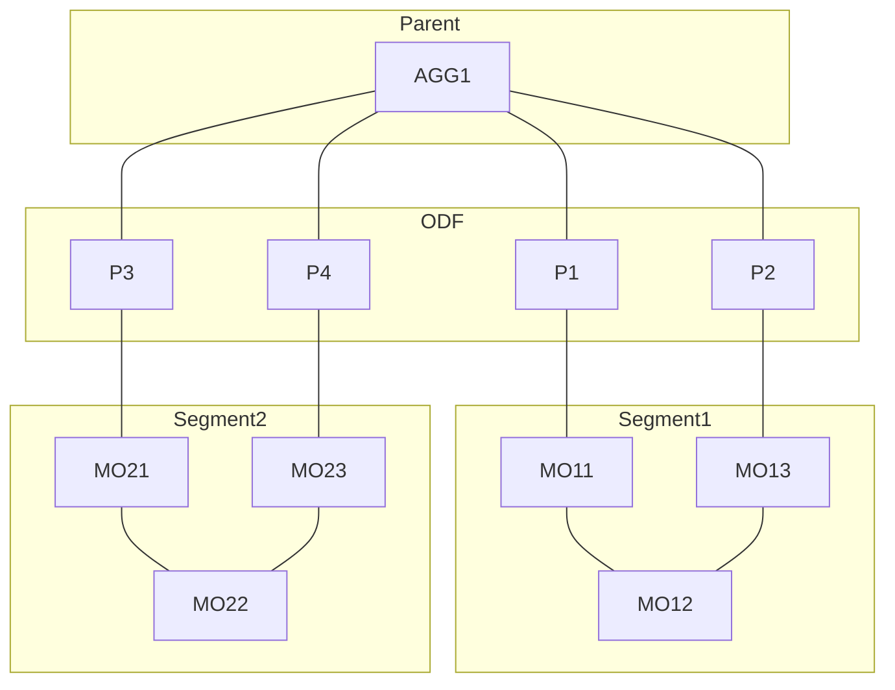

Two separate optic cables build two access ring and terminated on
four ports on aggregation switch. Consider we'd overestimated
demands on _Segment1_ or on _Segment2_ or on both of them and total
load on segments remains relatively low. Then we became short of
ports in _AGG1_. We'd decided to connect _MO13_ and _MO21_ directly
bypassing _AGG1_, so we'd disconnected two ports on _AGG1_ and shorted
ports _P2_ and _P3_ on _ODF_ by optical patch-cord:

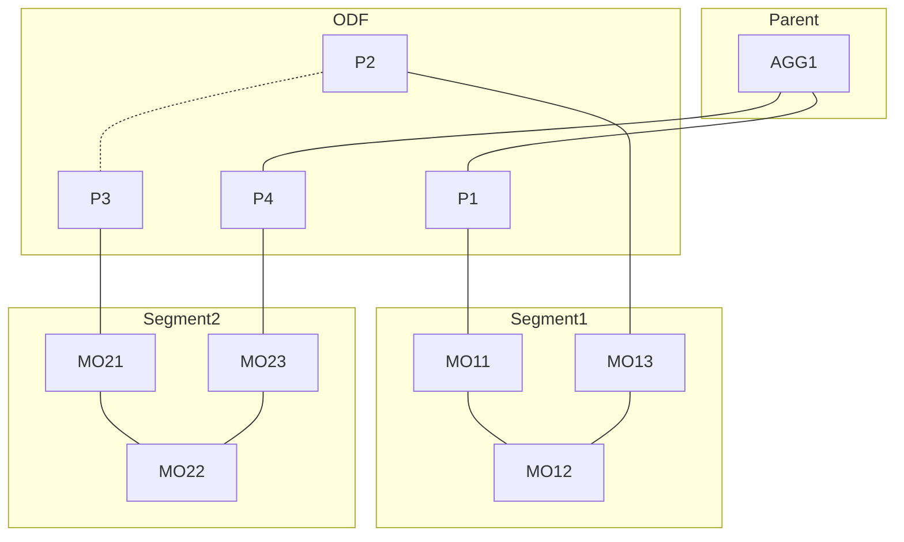

Technically, we'd merged _Segment1_ and _Segment2_ building larger
segment. We can simple move _MO21_, _MO22_ and _MO23_ to _Segment1_
and eliminate _Segment2_. But sometimes is necessary to leave
_Segment1_ and _Segment2_ separation (lots of printed documentation,
maintenance service's habbits, reporting and direct links). NOC allows
to declare _Segment1_ and _Segment2_ as the _Sibling Segments_.
_Sibling Segments_ considered as single segment in hierarchy,
processed as one in _Uplinks_ calculations and shown as a single
map, though remaining two separate segments in database and reporting.

## VLAN Domains

_Network Segments_ are closely tied with _VLAN_ concept. VLANs are
not obliged to be network-wise, so VLAN 100 in one part of network
may not be same VLAN 100 from other part so VLAN space may be _overlapped_.
Unlike IPv4/IPv6 address space, which uses _VRF_ to deal with address
space overlaps, 802.1 set of standards do not introduce global
distinguisher for VLAN space. So NOC uses concept of _VLAN Domain_.
_VLAN Domain_, shortly, is an area with unique VLAN space.
So VLAN 100 from different domains is not same VLAN 100, while
VLAN 100 on differen _Managed Objects_ from same VLAN domain may
be considered same VLAN 100

For clearance and ease of maintenance NOC considers _VLAN Domain_
as a part of segment hierarchy. NOC uses _VLAN border_ mark on segment
to split segments tree to _VLAN Domain_. _VLAN Domain_ covers
_VLAN border_ segment and all its descendants until next VLAN border.

Consider example:

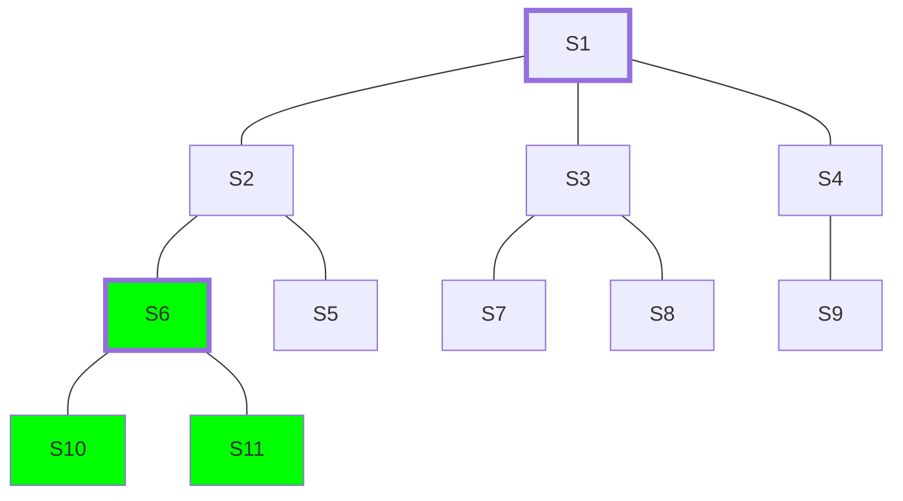

VLAN borders marked by thick frame: S1 and S6. First VLAN domain (blue)
consist of S1, S2, S3, S4, S5, S7, S8 and S9. Second VLAN domain (green):
S6, S10 and S11. Though S6 is descendant of S1 it is marked as VLAN border,
so it starts its own domain.

<!-- prettier ignore -->
!!! note
    Though _VLAN domains_ are groups of _Network Segments_ and
    _VLAN domain_ is a set of _Managed Object_, empty network segments
    can be attached to _Subinterfaces_, so one _Managed Object_ can
    still handle multiple _VLAN domains_

For ease of maintenance NOC automatically attaches all _VLAN domain's_
VLANs to appropriate _VLAN border_.

## VLAN Translation

NOC consider any implicit VLAN passing stops at _VLAN border_. Though it
possible to propagate VLAN further via _VLAN Translation Rules_.
Consider scheme:

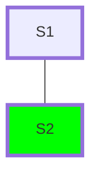

S1 and S2 both _VLAN borders_. _Managed Objects_ MO1 and MO2 belongs to
S1 and S2 respectively.

_VLAN Translation Rules_ are defined at _VLAN border_ segments as a list
of rules. Each rule contains following fields:

- filter: [VC Filter](../vc-filter/index.md)
- rule: king of operation
- parent_vlan: reference to VLAN from parent segment

Rules are processed in definition order. First matching rule wins.

NOC supports two kind of rules: _Map_ and _Push_.

### Map

_Map_ rule converts VLAN 802.1Q tag from target _VLAN domain_ to
802.1Q tag from parent's segment.

VLANs can be either _rewritten_

`filter=2-200,rule=map,parent_vlan=200`

Or _extended_ (rewritten to same tag)

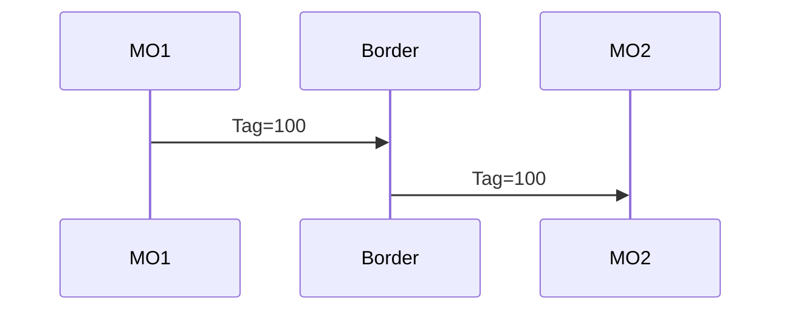

`filter=2-200,rule=map,parent_vlan=100`

### Push

_Push_ rule appends additional 802.1Q tag in top of existing 802.1Q tag,
allowing Q-in-Q tunneling.

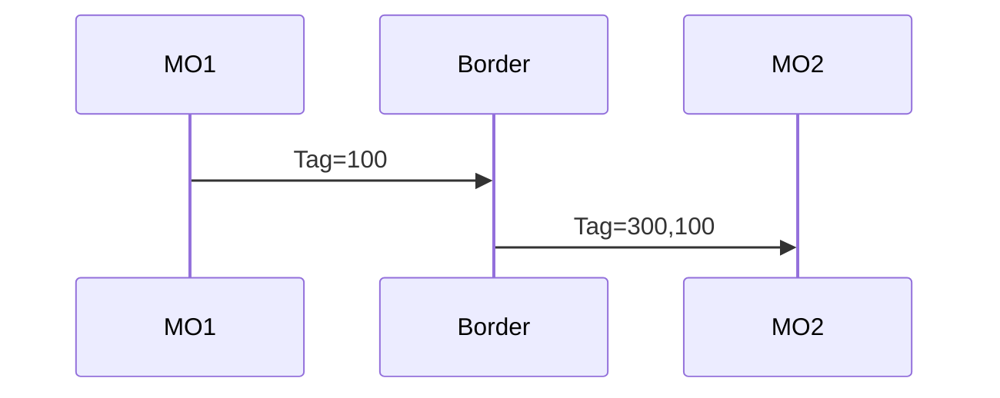

`filter=2-200,rule=push,parent_vlan=300`

## VLAN Allocation Group

## MAC Discovery

MAC topology discovery can be used as last resort when other
methods are failed. Contrary to other per-object methods MAC
discovery performed is per-segment basis using previously collected
MAC addresses. See [Discovery Segment MAC](../../discovery-reference/segment/index.md) for details.

## Autosegmentation

Segmentation may be performed automatically during box discovery.
See [Discovery Box Segmentation](../../discovery-reference/box/segmentation.md) for details

## Redundancy

[Network Segment Topology Ring](#ring) and [Network Segment Topology Mesh](../network-segment/index.md#mesh)
offer path redundancy. NOC detects segment redundancy automatically.
Outages in redundant segments can leave to _Lost of Redundancy_.
_Lost of Redundancy_ means that currently working services are left
without proper redundancy and are at risk in case of following outage.
During the outage NOC calculates affected services and services
with _Lost of Redundancy_ and provides information to escalated
_Trouble Tickets_.

## Object Settings

Segments can hold Managed Object's recommended settings for config generation
and validation Settings can be either scalar (defined once)
or list (can be declared multiple times).
Omitted settings are inherited from parent segment, allowing to define
global settings at top level and refine them on lower levels

| Key               | Multi | Description                                          |
| ----------------- | ----- | ---------------------------------------------------- |
| domain_name       | No    | Default domain name                                  |
| dns               | Yes   | DNS server's address                                 |
| ntp               | Yes   | NTP server's address                                 |
| default_gw        | No    | Default gateway for management network               |
| syslog_collector  | Yes   | SYSLOG collector's address                           |
| snmp_collector    | Yes   | SNMP Trap collector's address                        |
| aaa_radius        | Yes   | RADIUS AAA server's address used for authentication  |
| radius_collector  | Yes   | RADIUS collector's address                           |
| aaa_tacacs        | Yes   | TACACS+ AAA server's address used for authentication |
| tacacs_collector  | Yes   | TACACS+ collector's address                          |
| netflow_collector | Yes   | NetFlow collector's address                          |

## L2 MTU

Network Segment's L2 MTU is minimal ethernet payload size guaranteed
to pass via Segment. MTU is accounted without 802.3 ethernet header
(which is 14 bytes in length) but with all other encapsulation headers (802.1Q, MPLS, etc).

Common L2 MTU values:

| L2 MTU  | Description                     |
| ------- | ------------------------------- |
| `1500`  | Common untagged ethernet packet |
| `1504`  | 802.1Q VLAN tagged packet       |
| `1508`  | Q-in-Q packet                   |
| `1536`  | MPLS packet with up to 3 labels |
| `<1600` | Baby giant                      |
| `>1600` | Jumbo                           |

Understanding real segment's L2 MTU is viable part of providing effective|
ethernet transit services. Transit interface with improper MTU may lead|
to occasional packet drops. Such drops can lead to hard-to-diagnose|
disruption of services.

## Network Map Settings

NOC displays Network Map on per-segment basis. To provide seamless
navigation along segment hierarchy in additional to segment's objects
NOC shows all connected objects from adjacent segments. Sometimes is
necessary to suppress displaying very large amount of downlinks
on network map.

_Network Segment_ has following settings for network map tuning

| Name                | Default | Description                                                                  |
| ------------------- | ------- | ---------------------------------------------------------------------------- |
| max_shown_downlinks | 1000    | Collapse object's downlinks on network map when count is above the threshold |

<!-- prettier-ignore -->
!!! note
    When Network Map contains over 300 objects "Too many objects" message
    will be shown. Larger maps may cause browser freeze or crash.
