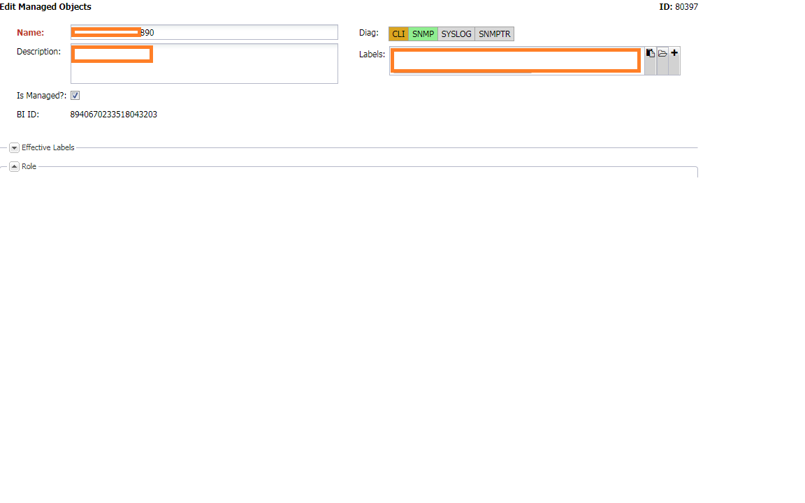
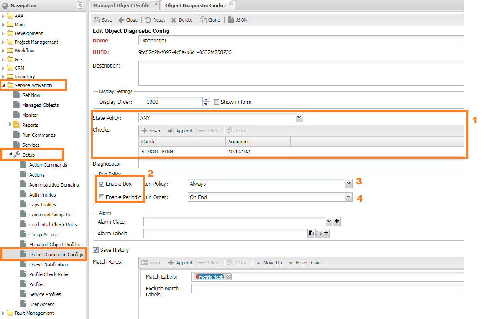

# Диагностика для устройства

При работе в системах с большим количеством настроек у пользователя часто возникают вопросы - почему не работает тот или иной функционал.
Особенно у новичков когда документация не полна и настройки не очевидны (распределены по нескольким местам).
Традиционно в этом случае с вопросами обращаются к другим пользователям или специалистам.
Обычно большинство обращений заканчивается рекомендациями включить ту или иную настройку и проверить лог на предмет магических строк.
В итоге простое действие занимает значительное время.
Для упрощения понимания работы системы предназначен функционал **Диагностики** (`Diagnostic`) для устройства. 

**Диагностика** - последовательность **проверок** (`Check`) для выяснения текущего использования функционала.
Итогом проверок может быть одно из 4 состояний (`State`):

* **Включён** (`Enabled`) - функционал успешно используется
* **Отключён** (`Blocked`) - функционал отключён настройками системы
* **Сбой** (`Failed`) - в ходе использования функционала произошёл сбой
* **Неизвестно** (`Unknown`) - функционал не задействован

## Интерфейс пользователя

В интерфейсе пользователя диагностики представлены **индикаторами** (`indicator`) отображающими текущее состояние.
На индикаторе выводится имя диагностики, а цвет кодирует состояния:

* *Включён* (`Enabled`) - зелёный
* *Сбой* (`Failed`) - оранжевый
* *Отключён* (`Blocked`) - серый
* *Неизвестно* (`Unknown`) - индикатор не выводится

## Диагностика

Диагностики в системе можно разделить на **внутренние** - занятые проверкой работы функций системы
и **пользовательские** -- добавляемые через интерфейс пользователя.
Отличие между ними только в настройках - у первых они вынесены в код,
а вторые доступны для изменения и находятся в меню `Управление устройствами (Service Activation) -> Настройки (Setup) -> (Конфигурация диагностик) Object Diagnostic Config`

* **Имя** (`Name`) - название диагностики. Отображается на индикаторе
* **Описание** (`Description`) - описание диагностики
* **Порядок показа** (`Display Order`) - приоритет вывода индикатора
* **Показывать индикатор** (`Show in form`) - показывать индикатор на форме устройства
* Политика проверки (`State policy`)
    * *Любая* (`ANY`) - для успеха достаточно прохождение любой проверки
    * *Все* (`ALL`) - для успеха необходимо прохождения всех проверок
* **Проверки** (`Checks`) - список проверок
    * *Проверка* (`Check`) - название проверки
    * *Аргумент* (`arg0`) - параметр для проверки. Интерпретация зависит от проверки
* **Зависимость от диагностик** (`Depended`) - зависимость от дигностик. В проверку будут включён результат перечисленных диагностик
* Параметры запуска
    * Запускать при полном опросе (`Enable Box`)
    * Заупскать при периодическом опросе (`Enable Periodic`)
    * **Политика запуска** `Run policy`)
        * *Always* - каждый опрос
        * *When failed* - первый раз, а затем при сбое
    * **Порядок запуска** (`Run order`)
        * *On start* в начале опроса
        * *On end* по окончании опроса
* **Класс аварии** (`Alarm Class`) - поднимать аварию при сбое диагностики (переход в  состояние `failed`)
* **Метки аварии** (`Alarm Labels`) - добавить в аварию метки
* **Сохранять историю** (`Save on history`) - сохранять результат проверок в историю
* **Правила проверки устройств** (`Match Rules`) - позволяют задавать на каких устройствах запускать диагностику

!!! note
    Для диагностик, запускаемых в **конце опроса**: если на предыдущем этапе произойдёт ошибка - диагностика запущена не будет!

### Встроенные диагностики

В составе системы уже добавлены несколько диагностик, запускаются *при старте* полного опроса (`Box Discovery`) и проверяют работу с оборудованием.

#### PROFILE

Проверяет правильность выбора `SA Profile` устройства. Настройки:

* Галочка `Profile` в настройках профиля объекта включает/выключает диагностику
* Правила проверки профиля SA находятся в (`Profile Check Rules`)

#### SNMP

Проверяет реквизиты доступа к SNMP. Может ипользовать несколько реквизитов при наличии правил подбора. Настройки:

* Приоритет протокола доступа `Access Preference`. Если `Access Preference - CLI Only` диагностика блокируется
* Разрешить подбор реквизитов. Разрешает использование правил подбора реквизитов при установлении доступа

#### CLI

Проверяет реквизиты доступа к TELNET/SSH. Может ипользовать несколько реквизитов при наличии правил подбора. Настройки:

* Приоритет протокола доступа `Access Preference`. Если `Access Preference - SNMP Only` диагностика блокируется
* Разрешить подбор реквизитов. Разрешает использование правил подбора реквизитов при установлении доступа

#### Access

Комплексная диагностика, включает в себя `CLI`, `SNMP` и `HTTP`. Для работоспособности требует всех входящих протоколов доступа.

#### SNMPTRAP и SYSLOG

Устанавливает факт приёма `SNMP Trap` или `Syslog` для устройства. Срабатывает при *первом получении* SNMP Trap'a или Syslog'а с устройства. Настройки:

* Источник Syslog/Trap (`Syslog Source/Trap Source`) в настройках устройства
* `Event Proccess Policy` в настройках устройства или профиля объекта

Таблица настроек встроенных диагностики 

| Name     | Run Policy        | Checks          | Alarm Class                                      |
| -------- | ----------------- | --------------- | ------------------------------------------------ |
| PROFILE  | Unknown or Failed | PROFILE         | `Discovery &#124 Guess &#124 Profile`            |
| SNMP     | Unknown or Failed | SNMPv1, SNMPv2c | `NOC &#124 Managed Object &#124 Access Lost`     |
| CLI      | Unknown or Failed | TELNET, SSH     | `NOC &#124 Managed Object &#124 Access Lost`     |
| Access   | `---`             | SNMP, CLI       | `NOC &#124 Managed Object &#124 Access Degraded` |
| SNMPTRAP | `---`             | `---`           | `---`                                            |
| SYSLOG   | `---`             | `---`           | `---`                                            |

## Проверки

Диагностики реализуются через проверки. В составе системы есть несколько проверок:

* **REMOTE_PING** - Проверить доступность IP адреса с устройства. Необходима реализация скрипта **ping**
* **SNMPv1,SNMPv2c** - Проверка реквизитов доступа `SNMP`. Используются реквизиты из настроек устройства.
* **TELNET, SSH** - Проверка реквизитов доступа `CLI` для `TELNET` и `SSH`. Используются реквизиты из настроек устройства.
* **PROFILE** - Проверка профиля устройства по правилам из меню 
* **LOCAL_PING** - Проверка доступности IP адреса с выноса НОКа (активатора).

Помимо встроенных проверок пользователь может добавить собственные. Для этого необходимо подключить кастом и разместить код в `core/checkers`.
После перезапуска системы они станут доступны для выбора.

