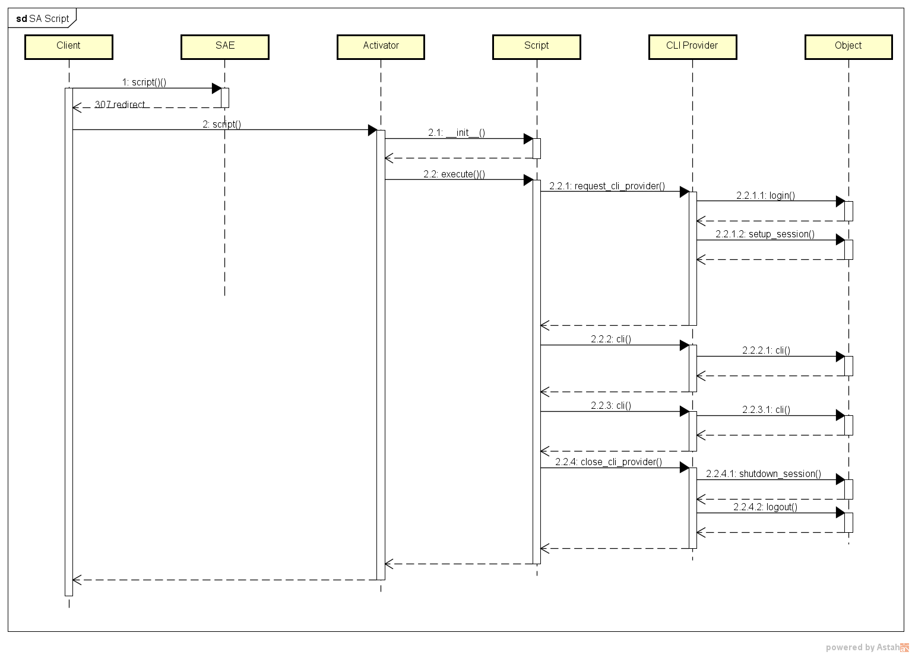

# Профили Oборудования

Взаимодействие с устройствами в NOC'е строится через профили (`SA Profile`). 

Можно описать `Профиль SA` (`SA Profile`) как посредника (адаптер). 
Он принимает необработанный поток данных от оборудования и преобразует его в данные, которые передаются NOC'у для последующей обработки системой. 
Профили жёстко привязаны к используемому на оборудовании программному обеспечению. 
Внутри профиля можно проверять версию ПО и модель, но это усложняет код скриптов, по этой причине профили совместимы между собой в рамках одной ОС производителя. 
Например, для `Cisco IOS` и `Cisco ASA` используются разные профили. 

<!-- prettier-ignore -->
!!! note

    `Профиль SA` (`SA Profile`) - это компонент NOC'а, скрывающий от остальной системы особенности взаимодействия с оборудованием.


Можно выделить следующие особенности профилей:

* Пишутся на языке программирования [Python](https://ru.wikipedia.org/wiki/Python)
* Подгружаются автоматически, при старте системы (для применения обновлений необходим перезапуск системы)
* Нет ограничений на использование каких-либо модулей `Python`
* Обязательным является скрипт `get_version`, остальные добавляются в зависимости от возможностей оборудования
* Собранные данные живут в рамах одной сессии 


## Структура и взаимодействие с системой

### Состав профиля

Профили расположены в директории `sa/profiles`. 
По соглашению имя профиля строится из названия производителя `VendorName` и имени ОС `OSName`: `Juniper.JUNOS`, `Cisco.IOS`. 

```
<noc_base>/sa/profiles/
├── <VendorName>
│   ├── __init__.py
│   ├── <OSName>
│   │   ├── __init__.py
│   │   ├── profile.py
│   │   ├── confdb
│   │   │   ├── __init__.py
│   │   │   └── normalizer.py
│   │   ├── middleware/
│   │   │   ├── __init__.py
│   │   │   └── ...
│   │   ├── get_version.py
│   │   ├── get_vlans.py
│   │   ├── ...
│   │   └── snmp_metrics
│   │       ├── cpu_usage_1min.json
│   │       └── ...

```

<!-- prettier-ignore -->
!!! note
    Имена являются регистрозависимыми!

Сам профиль состоит из:

* `profile.py` - Класс реализует настройки работы с оборудованием, наследуется от `noc.core.profile.base.BaseProfile` 
* Набор [скриптов](../../scripts-reference/index.md), реализующих один из доступных *интерфейсов SA* (`SA Interface`)
* `snmp_metrics/` - папка с перечнем `SNMP OID` для скриптов
* `confdb/` - папка с парсерами конфигурации для [ConfDB](../../confdb-reference/index.md)
* `middleware/` - папка для обработчиков `HTTP` запросов к оборудованию

<!-- prettier-ignore -->
!!! note
    `Интерфейс SA` (`SA Interface`) описывает формат и состав данных, которые необходимо передать в сторону NOC'а.

### Взаимодействие с NOC'ом

Взаимодействие с НОКом стоится на вызове скриптов профиля из других компонентов системы: [discovery](../../discovery-reference/box/index.md), 
полученная информация используется для сбора информации об оборудовании. Возвращаемая скриптом информация должна соответствовать заявленному интерфейсу (`SA Interface`). 
В самой системе профили назначаются устройству ([ManagedObject](../../concepts/managed-object/index.md) по этой причине нет необходимости явно указывать вызываемый профиль, он берётся из настроек. 
Схема вызова выглядит следующим образом:



1. Вызов скрипта для устройства `ManagedObject`. Пример вызова скрипта `get_version`:
    ```python
    
        from noc.core.mongo.connection import connect
        connect()
        from noc.sa.models.managedobject import ManagedObject
    
        mo = ManagedObject.objects.get(name="<MONAME>")
        r = mo.scripts.get_version()
        r
        {'vendor': 'Huawei',
         'platform': 'S2326TP-EI',
         'version': '5.70 (V100R006C05)',
         'image': 'V100R006C05',
         'attributes': {'Serial Number': '21',
          'Patch Version': 'V100R006SPH031'}}
    
    ```

2. После вызова система делает `RPC` запрос к сервису [SAE](../../services-reference/sae.md) для получения параметров вызова скрипта:
    * Учётные данные оборудования (пользователь, пароль, Community)
    * Возможности (`Capabilities`)
    * Настройки работы профиля ([Access Policy](../../concepts/managed-object-profile/index.md#Access(Доступ)))

3. SAE отвечает кодом переадресации на подходящий активатор [Activator](../../services-reference/activator.md)
4. Активатор создаёт сессию и запускает на исполнение вызываемый скрипт с переданными параметрами.
5. Если в скрипте реализованы методы `execute_cli` или `execute_snmp`, то их вызов происходит согласно приоритетам. При наличии метода `execute` всегда запускается он. 
6. Результаты работы скрипта проверяются интерфейсом и возвращаются вызвавшему
7. Если при выполнении произошла ошибка, то возвращается её код


### Интерфейсы SA

 Для передачи результатов применяются интерфейсы SA. 
    
    :term:`Интерфейс SA` - это специальная сущность NOC'а, предназначенная для обеспечение взаимодействия между компонентами. 

Интерфейсы `SA` расположены в директории `sa/interfaces`. Они доступны для указания скриптов профиля. 
Есть возможность определять собственные интерфейсы через [Custom](../../custom/index.md)

В *Интерфейсе SA* описывается структура данных передаваемая и возвращаемая скриптом. Передаваемая - это параметры скрипта, а возвращаемая, результат работы. Описывается:

* Имена полей 
* Тип данных
* Значения по умолчанию
* Обязательность поля

Если данные не прошли проверку поднимется исключение. В качестве примера возьмём интерфейс `noc.sa.interfaces.igetversion.IGetVersion`

::: noc.sa.interfaces.igetversion:IGetVersion
    selection:
        docstring_style: restructured-text
        members: true
    rendering:
        heading_level: 4
        show_source: true
        show_root_heading: true
        show_if_no_docstring: true
        show_signature_annotations: true

Описание достаточно наглядно показывает какой результат ожидать от скрипта. 
В данном случае, для успешной передачи нам необходимо сформировать словарь (`dict`) с ключами:

* `vendor` - текстовое поле `StringParameter()`
* `version` - текстовое поле `StringParameter()`
* `platform` - текстовое поле `StringParameter()` 
* `attributes` (необязательный параметр) - Словарь, при этом список ключей не ограничен. Это означает, что разработчик может самостоятельно выбрать что в нём передавать.

Итог выглядит как-то так:

```json
    {
    "vendor": "Cisco",
    "version": "12.4(5)",
    "platform": "IOS",
    "attributes":
                {
                "image": "image.bin",
                "type": "type1",
                "count": 2
                }
    }
```

Через консоль разработчика можно проверять данные:

```python
r = {
    "vendor": "Cisco",
    "version": "12.4(5)",
    "platform": "IOS",
    "attributes":
                {
                "image": "image.bin",
                "type": "type1",
                "count": 2
                }
    }

from noc.sa.interfaces.igetversion import IGetVersion
IGetVersion().clean_result(r)
{'vendor': 'Cisco',
 'version': '12.4(5)',
 'platform': 'IOS',
 'attributes': {'image': 'image.bin', 'type': 'type1', 'count': 2}}


```

### Настройки взаимодействия с оборудованием

<!-- prettier-ignore -->
!!! note

    До версии 19.1 настройки находились в файле `__init__.py`

Настройки взаимодействия с оборудованием сосредоточены в файле `profile.py` профиля. 
Большинство настроек описаны в базовом классе - `noc.core.profile.base` и доступны для переопределения в классе профиля. Они включают в себя следующие группы:

* Имя профиля. Должно совпадать со структурой - `cisco/ios` - `Cisco.IOS`
* Настройки работы с `CLI`. Методы и аттрибуты, описывающие работу с `CLI`
  * `pattern_prompt` - строка приглашения на оборудовании.
  * `pattern_syntax_error` - список строк ошибок команды (при совпадении поднимается исключение `CLISyntaxError`)
  * `command_more` - команда (или клавиша), которую необходимо передать оборудованию для продолжения постраничного вывода (`deprecated` вместо него используется `pattern_more`)
  * `command_disable_pager` - команда для отключения постраничного вывода информации
  * `command_enter_config` - команда для входа в режим настройки
  * `command_leave_config` - команда для выхода из режима настройки
  * `command_save_config` - команда для сохранения конфигурации
  * `command_exit` - команда для завершения сеанса `CLI`
  * `rogue_chars` - список символов, для фильтрации из вывода команды
* Настройки работы с `SNMP`
  * `snmp_metrics_get_chunk` - размер `SNMP` запроса метрик
  * `snmp_metrics_get_timeout` - таймаут при запросе `SNMP`  
* Методы нормализация выводимых данных
  * `convert_interface_name` - нормализует имя интерфейса, на вход получает имя интерфейса как оно может быть представлено на оборудовании, на выходе имя интерфейса в системе
  * `get_interface_type` - позволяет по имени интерфейса получить его тип
  * `config_volatile` - список строк в конфигурации, которые необходимо отфильтровать из него при сборе. Обычно используется, чтобы исключить строки, которые могут меняться в конфигурации (например изменение времени).
* Матчеры (`Matchers`) - выставляют аттрибут скрипта при совпадении условий (версия ПО, платформа). Используются для выполнения различных команд в зависимости от версии ПО/модели
* Настройки парсеров `ConfDB`:
  * `config_tokenizer` - применяемый токенизатор [Tokenizer](../../confdb-reference/tokenizer.md)
  * `config_normalizer` - применяемый нормализатор [Normalizer](../../confdb-reference/normalizer.md)
  * `config_applicators` - список аппликаторов [Applicators](../../confdb-reference/index.md)

Пример файла профиля `profile.py`: 

```python
from noc.core.profile.base import BaseProfile
import re


class Profile(BaseProfile):
    name = "Huawei.VRP"
    pattern_more = [
        (r"^  ---- More ----", " "),
        (r"[Cc]ontinue?\S+", "y\n\r"),
        (r"[Cc]onfirm?\S+", "y\n\r"),
        (r" [Aa]re you sure?\S+", "y\n\r"),
        (r"^Delete flash:", "y\n\r"),
        (r"^Squeeze flash:", "y\n\r")
    ]
    pattern_prompt = r"^[<#\[](?P<hostname>[a-zA-Z0-9-_\.\[/`\s]+)(?:-[a-zA-Z0-9/]+)*[>#\]]"
    pattern_syntax_error = r"(Error: |% Wrong parameter found at|% Unrecognized command found at|Error:Too many parameters found|% Too many parameters found at|% Ambiguous command found at)"

    command_more = " "
    config_volatile = ["^%.*?$"]
    command_disable_pager = "screen-length 0 temporary"
    command_enter_config = "system-view"
    command_leave_config = "return"
    command_save_config = "save"
    command_exit = "quit"
    rogue_chars = [
        re.compile(rb"\x1b\[42D\s+\x1b\[42D")
    ]

    matchers = {
        "is_kernel_3": {"version": {"$gte": "3.0", "$lt": "5.0"}},
        "is_kernelgte_5": {"version": {"$gte": "5.0"}},
        "is_bad_platform": {
            "version": {"$regex": r"5.20.+"},
            "platform": {"$in": ["S5628F", "S5628F-HI"]},
        }}
    config_tokenizer = "indent"
    config_normalizer = "VRPNormalizer"
    confdb_defaults = [
        ("hints", "interfaces", "defaults", "admin-status", True),
        ("hints", "protocols", "lldp", "status", True),
    ]
    config_applicators = ["noc.core.confdb.applicator.collapsetagged.CollapseTaggedApplicator"]

    def generate_prefix_list(self, name, pl, strict=True):
        ...

    def convert_interface_name(self, s):
        ...

```

Полный список доступных методов доступен в базовом классе профиля - `noc.core.profile.base.BaseProfile`


### Скрипты

Полное описание работы скриптов доступно в [Scripts Reference](../../scripts-reference/index.md). В разделе мы посмотрим взаимоувязку работы скриптов в профиле.

Самым полезным компонентом профиля является скрипт. Скрипты выполняют всю полезную работу по взаимодействию с оборудованием. 
Скрипт представляет собой файл (модуль `Python`) реализующий один интерфейс (`SA Interface`). Наследуется от класса `noc.core.script.base.BaseScript` 
и реализует метод `execute()`, вызываемый при запуске. Основные компоненты скрипта:

* `name` - имя скрипта. Строится по шаблону: `<profile_name>.<script_name>`
* `interface` - ссылка на класс реализуемого интерфейса
* `execute_snmp()` - вызывается если приоритет исполнения (`access_preference`) выставлен в `SNMP`
* `execute_cli()` - вызывается если приоритет исполнения (`access_preference`) выставлен в `CLI`
* `execute()` - вызывается при начале выполнения

<!-- prettier-ignore -->
!!! note
    Как и профиль, скрипты считываются при старте NOC'а и кэшируется. Поэтому, для того чтобы, NOC восприняла изменения необходим перезапуск. Правило не распространяется на отладку через `./noc script`

Обязательным является скрипт `get_version`, через него получается базовая информация об оборудовании: производитель, версия ПО, модель. 
Второй по важности скрипт - `get_capabilities` через него определяется поддержка устройством различных протоколов (`SNMP`) и технологий. 

<!-- prettier-ignore -->
!!! note
    В работе скриптов `get_version` и `get_capabilities` запрещено использовать вызов других скриптов, иначе может получиться циклическая зависимость.

Для того чтобы вызвать из скрипта метод профиля (`SA Profile`) применяется конструкция `self.profile.<method_name()`

### Отладка

Для отладки профиля используется инструмент ``./noc script``. Он позволяет запускать скрипты из профиля в режиме отладки. Делается это следующим образом:

``./noc script --debug <имя_скрипта> <имя_объекта> <параметры>``, где

* ``<имя_скрипта>`` - полное имя скрипта (в формате <папка1>.<папка2>.<имя_скрипта>
* ``<имя_объекта>`` - имя Объекта (из меню Объекты -> Список объектов)
* ``<параметры>`` - параметры (не обязательно, только если используются)

Для удобства, параметры, можно передавать в файле формата JSON, это не требует добавление объекта в систему.

`./noc script --debug <имя_скрипта> <путь_к_файлу_json>`

## Базовый класс профиля

::: noc.core.profile.base:BaseProfile
    selection:
        docstring_style: restructured-text
        filters:
          - "!add_script_method"
          - "!initialize"
          - "!get_telnet_naws"
          - "!allow_cli_session"
          - "!send_backspaces"
          - "!get_config_tokenizer"
          - "!get_config_normalizer"
          - "!get_confdb_defaults"
          - "!iter_config_applicators"
          - "!iter_collators"
          - "!get_http_request_middleware"
          - "!get_snmp_display_hints"
          - "!get_snmp_response_parser"
          - "!has_confdb_support"
          - "!_get_patterns"
          - "!_get_rogue_chars_cleaners"
          - "!get_snmp_rate_limit"
          - "!cleaned_input"
    rendering:
        heading_level: 3
        show_source: false
        show_category_heading: true
        show_root_toc_entry: false
        members_order: "source"
