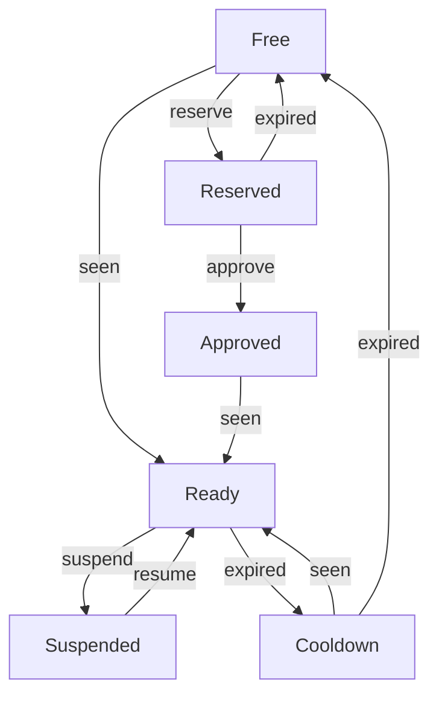

# Workflow

*Workflow* is an abstract representation of real *Work* or *Process*.
*Workflow* may refer to *Managed Object*, *Service*, *Physical* and
*Logical Resource* that is being transferred from one *State* to another.
*Workflow* describes lifetime cycle of given *Resource* as finite
set of *States*. Every time *Resource* must be exactly in one *State*,
referred as *Current State*. *Current State* cannot be changed in
arbitrary fashion. Instead, *Workflow* defines possible *Transitions*
between *States*. So *Workflow* may be considered as [Directed Graph](https://en.wikipedia.org/wiki/Directed_graph),
where *States* are vertices, and *Transitions* are edges.

*Workflows* are attached to *Resources* via *Profiles*. Resources
of same type may have different *Workflows*. i.e. "Customer VLAN"
and "Management VLAN" VLAN Profiles may use different *Workflows*.

## State
*State* is the single distingushed state in *Resource's* lifetime.

### Default State
One and only one *State* of *Workflow* must be marked as *Default State*.
NOC automatically assigns *Default State* to new *Resources* when *State*
is not given explicitly. Proper *Workflow* determined via *Resource's*
*Profile*.

### Productive State
*State* may be marked as *Productive*.

<!-- prettier-ignore -->
!!! note
    Further versions of NOC will use *Productive State* to indicate
    that *Managed Object* may be discovered and monitored

### Liveness Tracking

### Expiration

### Handlers

### Transition

### Event

### Handler

### Resource

* [Managed Object](../managed-object/index.md)
* Interface (WIP)
* Prefix (WIP)
* Address (WIP)
* SubInterface (WIP)
* [Phone Range](../phone-range/index.md)
* [Phone Number](../phone-number/index.md)
* [DNS Zone](../dns-zone/index.md)
* [VPN](../vpn/index.md)
* [VLAN](../vlan/index.md)
* Project (WIP)
* [Subscriber](../subscriber/index.md)
* Supplier (WIP)
* [Service](../service/index.md)

## Migration
<!-- prettier-ignore -->
!!! todo
    Describe Workflow Migrations

## Best Practices

### Free State

### Ready State

### Cooldown State

### Reserved State

### External Jobs

### Device Configuration

## Examples

### Default Workflow

When *Process* considers the *Resource* has no designated states,
simple *Workflow* with one "Ready" *State* may be used.
NOC provides "Default" workflow out-of-the box.

### Resource Default Workflow

