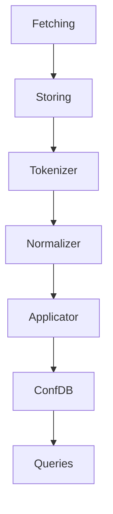

# ConfDB Overview

`ConfDB` is a common term for complex of measures for high-level device configuration
processing within NOC. Vendors tend to invent their own configuration
formats, often mimicking each other, and to introduce incompatibilities
between releases and platforms. Besides simple change tracking and
regular expression search, multi-vendor configuration processing
may be a very challenging task.

NOC addresses the challenge with the following approach:

* `Decomposition` - complex task may be split into simple steps
* `Reusability` - all tools may be reused whenever possible
* `Pipelining` - each step combined into configuration processing pipelines
* `Clean contract between steps` - each step performs its own task. Steps accept
  a predictable result from previous steps and pass a predictable result to following steps
* `Clean API` - each step must be understandable and easy to implement
* `Quick result` - First result must be reached easily and quickly. Then you can become to
  implement more complex things

To better understand the concept of `ConfDB` one should refer
to a widely-used concept in programming languages - `Virtual Machines`.
`Virtual Machine` (VM) is the fictional computer with its own `native assembly`
language (or machine codes). It's sometimes easier to break the
task of compiling the program from programming language to target
processor into two steps: to compile to fictional machine codes and
to compile from fictional codes to target ones. The benefits in a clear
separation of common functions, suitable for all target platforms,
and of specific functions, addressed for a single platform. Common functions
moved to the left (Code -> VM translation), while specific moved to
the right (VM -> Target platform translation). Hence VM represents
the clean contract between hardware-dependent and hardware independentent functions.

Device configuration is the programming language of target platform.
So we can split the task of configuration analysis by applying
clean barrier between hardware-dependent and hardware-independentent parts.
Just like `Virtual Machine` NOC introduces fictional configuration
language for non-existing (yet?) network equipment. All hardware-dependent
parts are moved to the left. All hardware-independentent parts are moved
to the right and may be reused.

## ConfDB pipeline stages
Config processing pipeline and stages are represented on the chart below

* [Fetching](fetching.md)
* [Storing](storage.md)
* [Tokenizer](tokenizer.md)
* [Normalizer](normalizer.md)
* Applicator
* ConfDB engine
* [ConfDB queries](query.md)