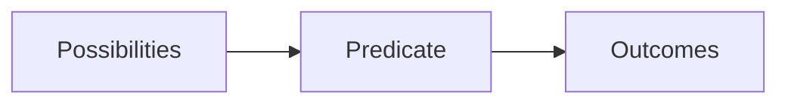
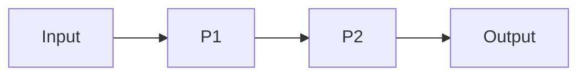
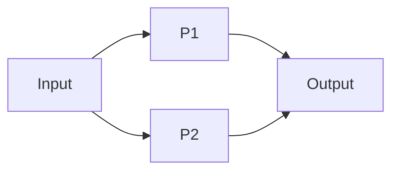

# ConfDB Query Language

ConfDB offers flexible query language based on predicate logic. ConfDB
queries may be used for config processing, including fetching, classification
and validation.

## Common Concepts

### Contexts

Query context is the couple of variables and their values. It is
a simple key-value structure implemented over python's `dict`.
Context represents a `possible state` of pipeline. Contexts are
grouped together representing `possibilities` on each stage of pipeline.
Within the possibilities, each context is independent on each other.

Variables can be either `bound` (known values) or `unbound` (superposition
of possible values).

### Predicates

`Predicate` is the logic function, defined by its arguments and accepting
`possibilities` on input, evaluating them and passing `outcomes` as output.
Predicates evaluate input context independently. Each input context
may be evaluated to one or more output context.



### Pipelining

`Predicates` may be combined together into sequential (`and`) and
parallel (`or`) chains. Chains can be grouped together by bracket
operator. Resulting chains build `pipeline` which is valid predicate too.

### Query

Query is the pipeline, which can be applied to exact ConfDB state and
input context to produce output contexts with possible `outcomes`

### Syntax

Query is the [Python expression](https://docs.python.org/2/reference/expressions.html)

### Variable

Variable is coded as plain python variables

### Predicate

Predicate is coded as python function call


```python
Match('interface', X, 'description', Y)
```

See [Query Builtin-predicates](#built-in-predicates) for possible predicates and examples

### Sequential chain

Sequential chain is the combination of two predicates when output of
first predicate serves as input to the second one



Sequential chain is coded by boolean `and` operator

```python
P1() and P2()
```

Sequential chain can contain more than two operators like

```python
P1() and P2() and P3() and P4()
```

### Parallel chain

Parallel chain consists of two or more predicates independentently accepting
same input and combining and deduplicating resulting outputs



Parallel chains are coded by `or` operator

```python
P1() or P2()
```

### Chain Grouping

Chains can be grouped using brackets

```python
(P1() and P2()) or P3() or (P4() and P5())
```


## Built-in predicates

### Simple Logic

#### True()

Always True, pass context unmodified

#### False()

Always False, breaks predicate chain

### Context Manipulation

#### Set(**kwargs)

Add or modify variables of context. If variable value is a list,
expand the list and apply production

```python
Set(X=2)
Set(X=[1, 2, 3])
```

#### Del(*args)

Delete variables from context. Deduplicate contexts when necessary

```python
Del(X)
```

### ConfDB Matching

#### Match(*args)

Match `*args` against ConfDB. Bind unbound variables on match

*args
: ConfDB path

```python
Match('interface', X, 'description', Y)
```

#### NotMatch(self, _input, *args)

Pass only if `*args` is not matched against ConfDB. Bind unbound
variables when possible

*args
: ConfDB path

```python
NotMatch('interface', X, 'description')
```

### ConfDB Manipulation

#### Fact(*args)

    Set Fact to database

    :param *args: ConfDB path of fact, eigther constants or bound variables

```python
Fact('interface', X, 'hints', 'test')
```

### Filtering and Checking

#### Filter(expr):

    Pass context only if `expr` is evaluated as True

:param expr: Python expression

```python
Filter(X % 2 == 0)
```

#### Re(pattern, name, ignore_case=None):

Match variable *name* against regular expression pattern.
Pass context further if matched. If regular expression contains
named groups, i.e. (?P<group_name>....), apply them as context variables

    :param pattern: Regular expression pattern
    :param name: Variable name
    :param ignore_case: Ignore case during match

```python
Re("a+", X)
Re("a+", X, ignore_case=True)
Re("-(?P<abs>\d+)", X)
```

#### HasVLAN(vlan_filter, vlan_id):

    Check `vlan_id` is within `vlan_filter` expression

    :param vlan_filter: VC Filter expression
    :param vlan_id: Vlan Id or bound variable

```python
HasVlan("1-99,200-299", X)
```

### Aggregation

#### Group(stack=None, *args, **kwargs):*

    Group input context on given variables

```python
(
    Match("interfaces", name)
    or Match("interfaces", name, "type", type)
    or Match("interfaces", name, "description", description)
    or Match("interfaces", name, "admin-status", admin_status)
) and Group("name")
```

#### Collapse(*args, **kwargs):

    Collapse multiple keys to a single one following rules

    :param kwargs: One of collapse operation should be specified
        * join=<sep> -- join lines with separator sep
        * joinrange=<sep> -- join lines with separator sep and apply range optimization

```python
Collapse("interfaces", X, "tagged-vlans", join=",")
Collapse("interfaces", X, "tagged-vlans", joinrange=",")
```

### Debugging


#### Dump(message=None):

    Dump current context to stdout and pass unmodified

    :param message: Optional message

```python
Dump()
Dump("Point1")
```

#### Sprintf(name, fmt, *args):

Perform string formatting and apply result to context variable

    :param name: Target variable name
    :param fmt: String format
    :param args: Values or bound variables


```python
Sprintf(y, 'x = %s, y = %s', x, '2')
```

### Examples

Fetch all interfaces descriptions

```python
Match("interfaces", name, "description", descr)
```
