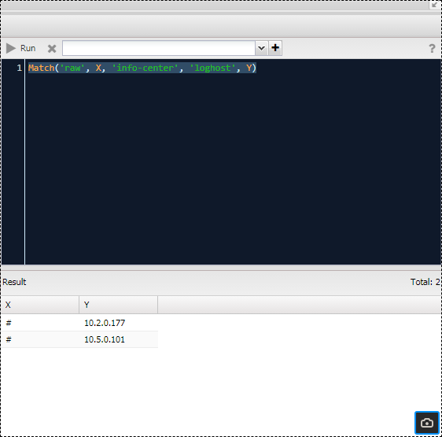

# Configuration Management

Working with equipment configuration is one of NOC's most developed components. It allows you to:

- Collect configuration from equipment
- Versioned storage of changes (ability to view change history with differences)
- Full-text search through configurations
- Data export to a disk storage
- Provides a common structure for storing facts for all manufacturers (requires implementation of a normalizer)
- Configuration validation (checking configuration for errors)
- Notifications of changes

The functionality is accessible through the web interface of the system. In the following sections, we will describe the mechanisms and operation of this functionality. The implementation details of scripts and parsers are documented in the developer's section and are available for review by users.

All configuration work takes place within the framework of the [Config Discovery](../discovery-reference/box/config.md), which is activated by the "config" checkbox in the [settings](../concepts/managed-object-profile/index.md#Box(Full_Discovery)). The sequence of the discovery process is as follows:

1. Collection
2. Calculation of differences between the latest and collected configuration
3. Saving configuration to the database
4. Mirroring (if configured)
5. Validation (handlers)

## Configuration Collection

During the initial stage of discovery (`Discovery`), the current configuration is collected. Depending on the [configuration](../concepts/managed-object-profile/index.md#Config(Configuration)) setting, the collection can occur from the device (`Script`) or from an external storage (`Download`). The following policies are available:

- `Script`: Request configuration from the device.
- `Script, Download`: First attempt to retrieve the configuration from the device, and in case of failure, try to download it from storage.
- `Download, Script`: First attempt to retrieve the configuration from storage, and in case of failure, try to download it from the device.
- `Download`: Request configuration from an external storage.

To implement configuration retrieval from an external storage, you need to configure:

- External file storage (`Storage`): A link to the [file storage](../concepts/external-storage/index.md).
- Path template (`Path template`): A link to the [template](../concepts/template/index.md) for the configuration file path.

The `Config Fetch Policy` setting allows you to specify preferences when collecting configuration from the device (requires adapter support):

- `Prefer Running`: Prefer the current running configuration.
- `Prefer Startup`: Prefer the saved startup configuration.

The action of the mechanism depends on the implementation on the script side of the `get_config` profile (`SA Profile`) for the equipment.

### Processing

After successfully retrieving the configuration from the device, it is compared to the last saved configuration in the system. If there is a difference, the collected configuration will be written to the database (becomes the latest). If there is no difference, it will not be saved to the database. This prevents storage space from being used to store identical data.

<!-- prettier-ignore -->
!!! info

    Customization of the processing procedure is available:

    - `Config Filter Handler`: Allows excluding lines from the configuration.
    - `Config Diff Handler`: Allows implementing a custom configuration difference calculation mechanism.

When `Mirror Policy` is set, the mirroring mechanism (`Config Mirroring`) is activated, which saves a copy of the collected configuration to an external file system. For its operation:

- Mirroring Policy (`Mirror Policy`):
    - Disable: Disable mirroring.
    - On Change: Run only if the configuration has changed.
    - Always: Always run.
- Storage (`Storage`): A link to the [storage](../concepts/external-storage/index.md).
- Path Template (`Path Template`): A link to the [template](../concepts/template/index.md) for the save path.

Variables available in the path template:

- `object`: A link to the device (`ManagedObject`).
- `datetime`: The `datetime` module.

[Link to template examples]

## Configuration Storage

Our own implementation of versioned storage, known as `GridVCS`, is used for configuration storage. It is based on an extension of MongoDB for file storage called `GridFS`. It serves as the foundation for...

## Working with Configuration - ConfDB

To interact with configurations, we've implemented the `ConfDB` mechanism—a comprehensive solution for configuration management. It can be described as:

- Vendor-agnostic representation of configuration in the form of a facts tree.
- Extension of the facts tree with manufacturer-specific fields.
- A unified query language—`ConfDB Query`.
- Enrichment of facts with data collected by other methods.

The result of `ConfDB`'s work is a facts tree. For a device, you can see it in the `ConfDB` section on the device's form (`ManagedObject`). The main sections visible at the top level are:

- `meta`: Data collected by the system.
- `raw`: The configuration representation before normalization (splitting into facts). By default, it is deleted from the database.
- `hints`: Hints for populating facts. Deleted from the database.
- `system`: Device's general settings.
- `interfaces`: Interface settings.
- `protocols`: Protocol settings.
- `virtual-router`: VRF, IP, subinterface settings.
- `media`: Video and audio settings (used for video surveillance representation).

Each item expands into a tree filled with the results of the mechanism's work. The completeness depends on the implementation of parsers for specific profiles (`SA Profile`). You can see the full set of available facts by using the `./noc confdb syntax` command. The completeness of `ConfDB` is not an end in itself; the most important thing is having the necessary parameters. Let's take a closer look at the tree items and query syntax.

[Link to screenshots]

### Building the Facts Tree

While the detailed mechanism is described in the [ConfDB Overview](../confdb-reference/index.md) for developers, we will cover the basics to understand where to navigate.

To build the `ConfDB`, the configuration goes through several sequential stages, each responsible for specific transformations. This prevents overcomplicating the implementation of functions responsible for a given stage. Let's go through the stages in the order of their execution and the transformations they perform.

#### Tokenization

The tokenizer receives a text file as input. Its task is to obtain a list of lines split into individual words—tokens. The main complexity here is dealing with sections. For example, we have an interface section:

```
interface gigabitethernet1/0/23
 description Description 1
exit
!
interface gigabitethernet1/0/24
 description Description-2
exit
```


If we convert it into a string, we should get:

```
interface gigabitethernet1/0/23
interface gigabitethernet1/0/23 description Description 1
interface gigabitethernet1/0/24
interface gigabitethernet1/0/24 description Description 2
```


Here, `exit` is the section termination, and `!` is a comment. You can see examples of output for different devices with the `./noc confdb tokenizer --object <MONAME>` command. The following tokenizers are available in the basic NOC package:

- `indent`: Sections are indicated by indentation—Cisco-like syntax.
- `curly`: Sections are enclosed in curly braces. Found in Juniper devices.
- `ini`: Sections are separated by an empty line and a title with hashtags.
- `line`: Simple line-by-line syntax—example from D-Link.
- `routeros`: Used for MikroTik devices.

The result of the tokenizer's work can be seen in the `raw` section. By default, it is removed from the final representation, but you can enable it with the [Raw Policy](../concepts/managed-object-profile/index.md#Config(Конфигурация)) setting.

#### Normalization

At this stage, the facts tree is populated based on the work with tokenized lines. To work, a normalizer (`normalizer`) is required for the [SA Profile](../concepts/sa-profile/index.md). Additionally, the hints section - `hints` is formed at this stage, which is used in the next stage.

If normalizers are absent, only the `raw` and `meta` sections will be available in the tree. You can view the result obtained after normalization with the `./noc confdb normalizer --object <MONAME>` command.

#### Application

At the application stage, the tree takes on its final form through manipulation:

* the `meta` section is filled with data from the system
* defaults are filled based on settings
* branch movement is performed
* branches are enriched with information based on data from the system

You can see the final result in the `ConfDB` menu or with the `./noc confdb dump --object <MONAME>` command.

### Query Syntax

Queries are a standardized way of working with the `ConfDB` structure. In terms of syntax, they are somewhat reminiscent of [Prolog](https://en.wikipedia.org/wiki/Prolog) (in this case, execution proceeds one after the other) and/or `or` (executed together). For simplicity, you can think of a query as a "pipeline" with data at the input and query results or emptiness at the output. Execution proceeds from left to right, with each stage passing the results to the next.

* **Predicate** - a construct of the form `<FUNC_NAME>(args)`, where `FUNC_NAME` is the name of the applied function, and `args` is a list of arguments. In the example: `Match`, `Filter`, `Del`.
* **Path** (`confdb path`) - the contents of the predicate (specified in parentheses). It consists of a list of tree elements. If it is specified in quotes (`'interfaces'`, `'description'`), an exact match is sought. If it is without quotes (`X`, `Y`), it denotes a variable to which an element is assigned.
* **Context** - where variables are stored. After all the predicates in a query have been executed, the query becomes the *result*. You can view the result with the `Dump` predicate.

You can work with queries in the `ConfDB` interface (button `Query`) or with the `./noc confdb query` command.

For example, let's query the interface with the name `GigabitEthernet0/0/1` that has a `description`:

```
Match('interfaces', X, 'description', Y) and Filter(X=="GigabitEthernet0/0/1")
```

Let's break down the execution of the query step by step:

1) At the beginning of the query, the *context* is empty. Executing it will result in emptiness. Therefore, the first predicates are usually:

   * `Match` and `NotMatch`: These queries are executed in `ConfDB`. If there are variables in the path, they are filled with values.
   * `Set`: It sets the specified value to a variable.

```
./noc confdb query --object "200" --query "Match('interfaces', X, 'description', Y)"
```
the result:
``` python
{'Y': 'description to_11_2.1', 'X': 'GigabitEthernet0/0/1'}
{'Y': 'description to_AGG1', 'X': 'GigabitEthernet0/0/2'}
```

In this case, we obtained a list of interfaces with descriptions filled in. Their names are in the variable `X`, and the descriptions are in the variable `Y`.

2) Context Operations:

   * `Filter` - checking the context against certain conditions.
   * `Re` - checking for compliance with a regular expression.
   * `HasVLAN` - checking if a VLAN is in the filter.
   * `Group` - collapsing contexts.
   * `Collapse` - expanding the context into multiple.

```
./noc confdb query --object "200" --query "Match('interfaces', X, 'description', Y) and Filter(X=='GigabitEthernet0/0/1')"
```
the result:
``` python
{'Y': 'description to_11_2.1', 'X': 'GigabitEthernet0/0/1'}
```

We have retained only the interface with the name `GigabitEthernet0/0/1`.

3) Context Output:

   * `Dump` - print the context. Convenient for debugging queries, but you can also execute them step by step.
   * `Fact` - set a value in the database.
   * `Sprintf` - print a variable.

```
./noc confdb query --object "200" --query "Match('interfaces', X, 'description', Y) and Dump("Stage2") and Filter(X=='GigabitEthernet0/0/1')" 
Stage2: {'Y': 'description to_SSNSK_60OKTBR_11_2.1', 'X': 'GigabitEthernet0/0/1'}
{'Y': 'description to_SSNSK_60OKTBR_11_2.1', 'X': 'GigabitEthernet0/0/1'}
```
the result:
```
Stage2: {'Y': 'description to_SSNSK_AGG1', 'X': 'GigabitEthernet0/0/2'}
```

Full description is available in [ConfDB Query](../confdb-reference/index.md).

### Query Testing

In addition to the CLI for queries, there is also the ability to execute queries in the graphical web interface in the `ManagedObject` form via the `ConfDB` button.

Writing and testing queries is convenient in the device interface: `Service Activation (Object Management)` -> `Managed Object (List of Objects)` -> Select the object of interest. In it, go to `ConfDB`.

On the left side, the `ConfDB` tree will be displayed. By clicking the `Query` button, a text field with the `Run` button will open. You can enter the query text into it and view the results (at the bottom after clicking `Run`).


<!-- prettier-ignore -->
!!! info

    To execute queries on the `raw` section, you need to enable it in the [ManagedObjectProfile](../concepts/managed-object-profile/index.md#Config(Configuration)) settings.

For example, a query to display interfaces and their types looks like: `Match('interfaces', X, 'type', Y)`.

Queries in the `raw` section to display all `Huawei` syslog server addresses: `Match('raw', X, 'info-center', 'loghost', Y)`


Since the content of the `raw` section depends on the configuration format (i.e., the equipment manufacturer), queries to it work within the scope of one profile. However, the configuration syntax is practically identical. In contrast, queries in the main section will be the same for all.

## Configuration Validation

- Validation policy: a set of rules used to compare facts obtained by parsing equipment configuration with a standard. In case of a discrepancy between a fact and the standard, an alert is raised.
- Facts database query: a text string created according to specific rules that allows operations to be performed on facts.
- Facts Database (ConfDB): an entity containing data (facts) obtained by parsing equipment configuration.

### Preparing Queries

Queries must be created in advance for use in the system. Query management can be found in the menu "Configuration Management" -> "Settings" -> "ConfDB Queries." Here, you can add a new query or modify an existing one. The query editing form consists of the following fields:


- Query Name (`Name`): unique name
- Description (`Description`)
- Source (`Source`): query text
- Parameters (`Parameters`): a list of variables for passing to the query. Variables are accessible in the query by their names.
  - Name (`Name`): variable name. It will be accessible in the query by this name.
  - Type (`Type`): variable type, used for proper condition handling.
  - Default (`Default`): variable value if not set by the user.
  - Description (`Description`): brief description.
- Allowed Usage (`Allow`): how the query can be used:
  - `Object Filter`: for device filtering
  - `Object Validation`: for fact validation by object
  - `Interface Filter`: for interface filtering
  - `Interface Validation`: for fact validation by interface
- `Require RAW`: raw section is required for the query (facts before normalization)

The result of filter queries (`Object Filter`, `Interface Filter`) must be a non-empty context. An empty context is considered as `False`, meaning the device does not meet the condition. For interface-related queries, the `ifname` variable is passed in the context, representing the interface name.

A validation query **looks for errors in the configuration**. If a discrepancy is found, the `error` variable must be set with a description of the detected error. If the `error` variable is found as a result of the query, it is considered that the configuration did not pass the validation.

For example:

- A query to validate an NTP server address might look like this: `Match('raw', 'ntp',  'server', address)) and Filter(address != ntp_server_address) and Set(error="NTP server error")`.
- A query to check the SSH version: ` Match('raw', 'ip', 'ssh', 'version', ssh)) and Filter(ssh != ssh_just) and Set(error="Version SSH error")`.

### Creating Validation Policies Based on ConfDB Queries

The interface for working with validation policies is located in the menu "Configuration Management" -> "Setup" -> "Object Validation Policies." The form for adding/editing a policy looks like this:


- Name: a descriptive name for the policy.
- Description: text description.
- Filter Query: the overall policy filter query (must be marked as `Object Filter`).
- Rules: a list of validation rules, consisting of:
  - Query: the validation query (must be marked for use in Object Validation).
  - Query Parameters: values of parameters passed to the query as variables (the list is taken from the query settings).
  - Rule Filter: a filter query for the rule (must be marked as Object Filter). It is used when the rule needs to be applied to a limited set of objects (e.g., specific models).
  - Active: whether the rule is active or not.
  - Code: an alert code used when handling alerts by an external system.
  - Error Template: a reference to the error message [template](../concepts/template/index.md).
  - Alarm Class: a reference to the alarm class triggered when the rule is violated.
  - `Fatal`: in case of violation, stop polling the device.

### Enabling the Policy

Validation policies are executed as part of the [configvalidation](../discovery-reference/box/config.md) discovery. It is triggered if a policy is associated with the Managed Object Profile. The settings can be found in the Managed Object Profile on the "Config" tab under "Config Validation":

- Validation Policy: Configuration of the validation policy:
  - Always: The policy will be checked with every poll.
  - Validate on Change: It will be applied only if there is a change in the configuration.
  - Disable: Validation is turned off.
- Action: The selected policy.

To test the policy's functionality, you need to initiate a full discovery on the device. To do this without waiting for the scheduled polling time, you can force it. In the Managed Object interface, navigate to "Service Activation" -> "Managed Objects" -> select the object. Use the "Discovery" button in the top panel.

!!! info

    By default, the policy is applied only when there is a change in the configuration. The behavior is determined by the setting in "Managed Object Profile -> Config Tab -> Validation Policy: Always."

When you select the row with the device, a log of the discovery will appear on the right. Click the "Run" button to start it. After the discovery is complete, you should refresh the log. Entries about problems found will be in the [configvalidation] section, and records about raised alarms will be at the bottom.

### Config Validation Handler

It is possible to implement custom validation logic with your own validation approaches. This is done by writing a handler and binding it in the "ManagedObject" form. The configuration is passed to the handler, and it returns any errors found.
