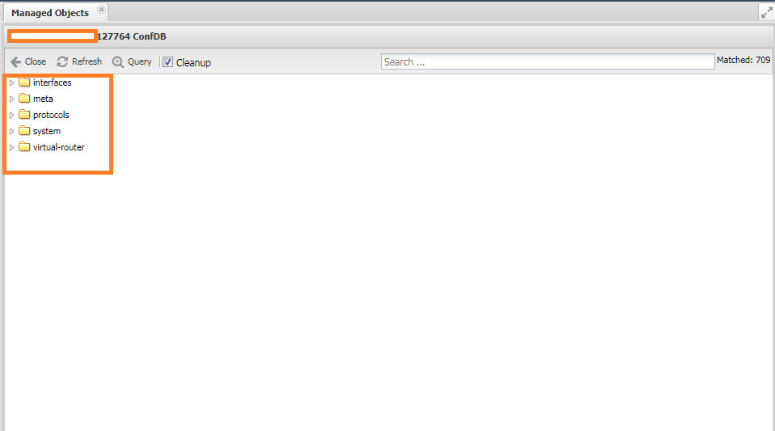
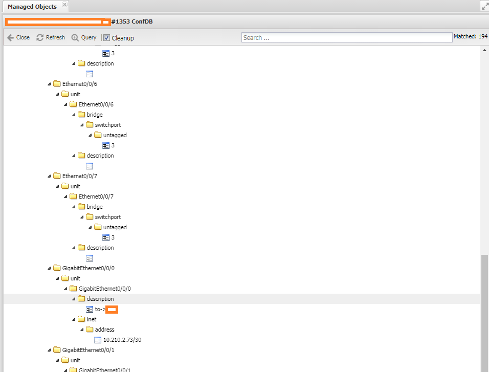
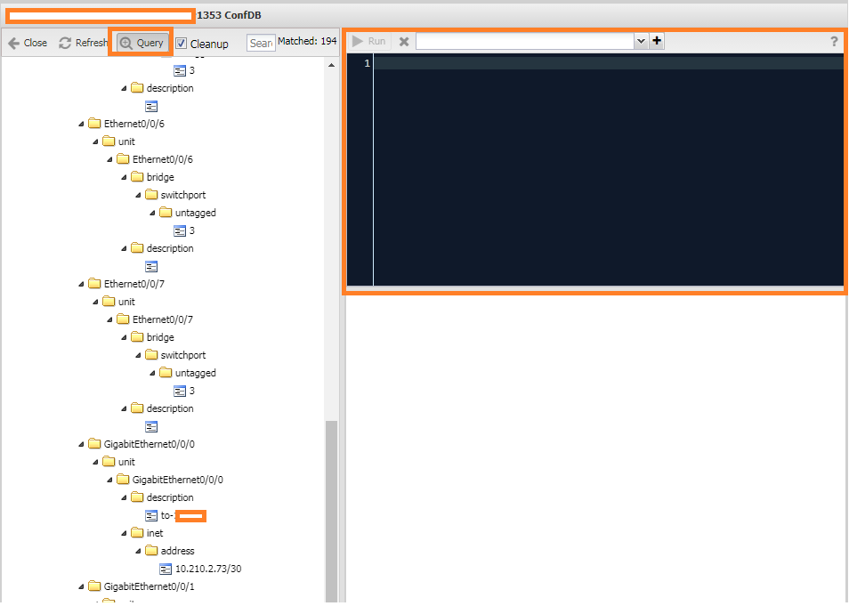
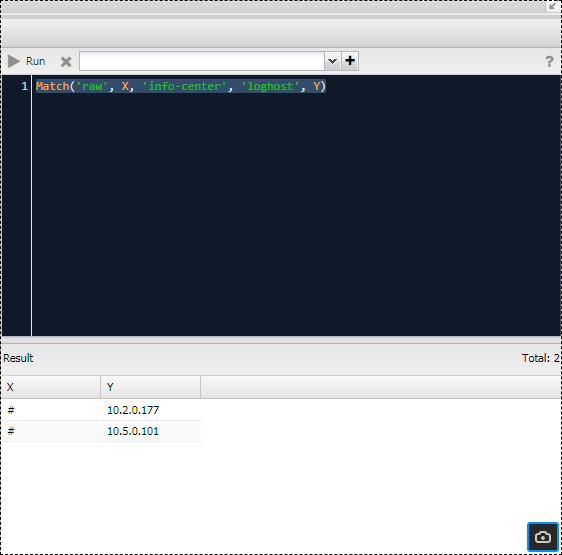
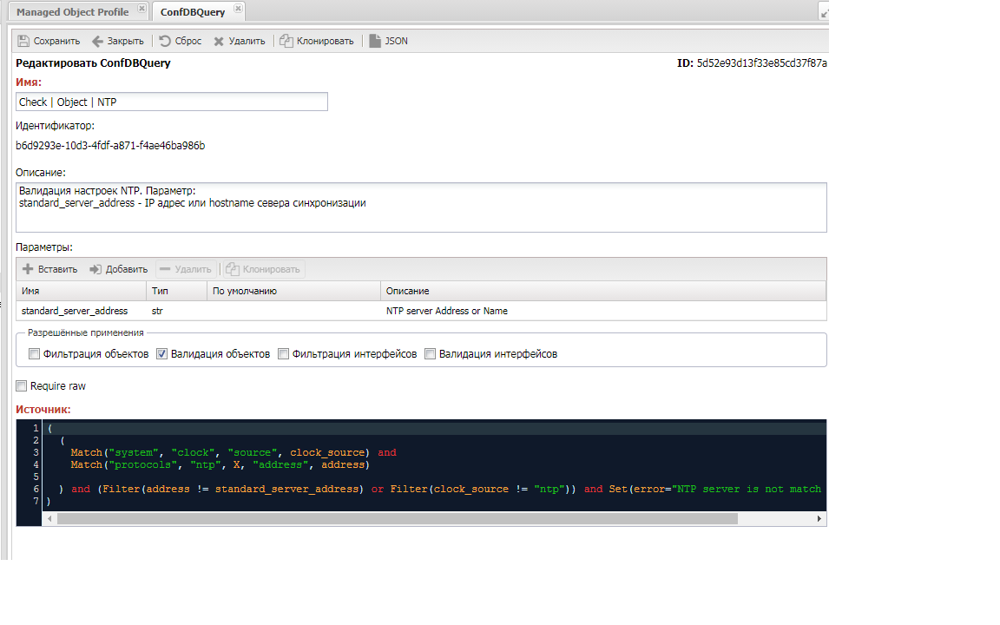
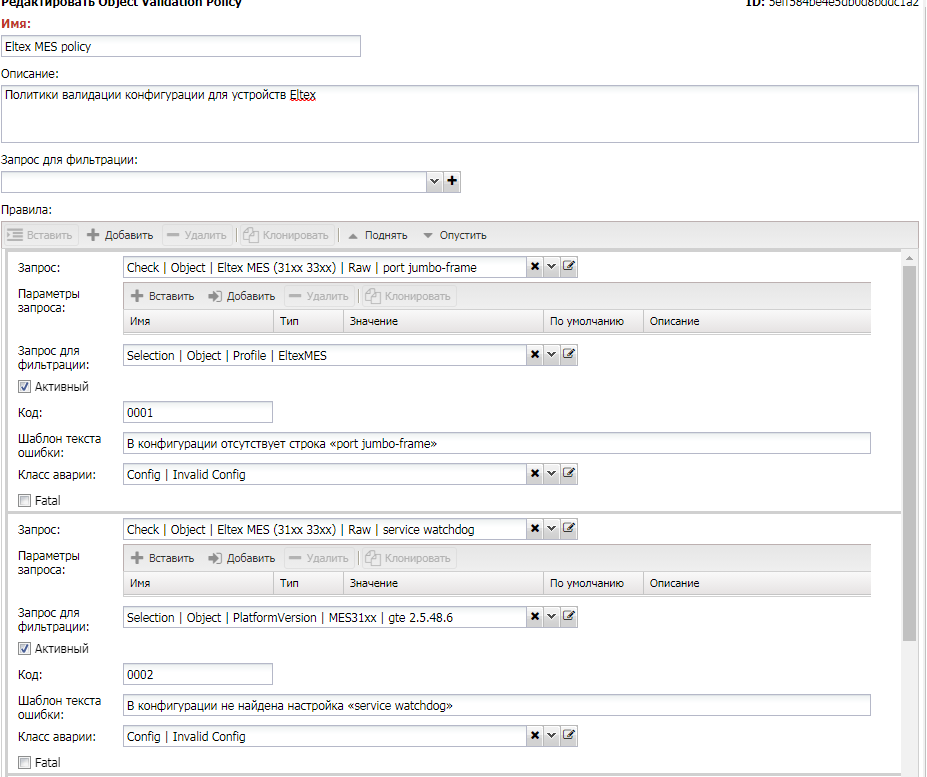

# Управление конфигурацией

Работа с конфигурацией оборудования один из самых развитых компонентов НОКа. Он позволяет:

* Сбор конфигурации с оборудования
* Версионированное хранение изменений (возможность посмотреть историю изменений с получением разницы)
* Полнотекстовый поиск по конфигурации
* Выгрузка информации на дисковое хранилище
* Предоставляет общую для всех производителей структуру хранения фактов (необходима реализация нормализоватора)
* Валидация конфигурации (проверка конфигурации на наличие ошибок)
* Уведомления об изменениях

Управление функционалом доступно через веб интерфейс системы. В следующих пунктах раскроем механизмы, работы функционала. Описание реализации скриптов и парсеров раскрывается в разделе документации для разработчиков и пользователям доступно для ознакомления.

Вся работа с конфигурацией происходит в рамках опроса [Config Discovery](../discovery-reference/box/config.md), он активируется галочкой `config` в [настройках](../concepts/managed-object-profile/index.md#Box(Полный_опрос)). Порядок прохождения опроса следующий:

1. Сбор
2. Расчёт разницы между последним и собранным конфигом
3. Сохранение конфигурации в базу
4. Зеркалирование (если настроено)
5. Валидация (handlers)

## Сбор конфигурации

На первом этапе опроса (`Discovery`) происходит сбор текущей конфигурации. В зависимости от [настройки](../concepts/managed-object-profile/index.md#Config(Конфигурация)) `Config Policy` сбор может происходить с устройства (`Script`), либо с внешнего хранилища (`Download`). Доступны следующие политики:

* `Script` - запрашивать конфигурацию с устройства
* `Script, Download` - вначале пробуем получить конфигурация с устройства, в случае провала пробуем загрузить с хранилища
* `Download, Script` - вначале пробуем получить конфигурация с хранилища, в случае провала пробуем загрузить с устройства 
* `Download` - запрашивать конфигурацию с внешнего хранилища

Для реализации запроса конфигурации с внешнего хранилища необходимо задать настройки:

* Внешнее хранилище файлов `(`Storage`) - ссылка на [хранилище](../concepts/external-storage/index.md) файлов 
* Шаблон пути (`Path template`) - ссылка на [шаблон](../concepts/template/index.md) пути к файлу конфигурации

Через настройку `Config Fetch Policy` можно указать предпочтения при сборе конфигурации с устройства (`требуется поддержка со стороны адаптера оборудования`):

* `Prefer Running` (Предпочитать текущий)
* `Prefer Startup` (Предпочитать сохранённый)

Действие механизма зависит от реализации на стороне скрипта `get_config` профиля (`SA Profile`) оборудования.

### Обработка

После успешного получения конфигурации с устройства, происходит её сравнение с последней сохранённой в системе. При наличии разницы - собранная конфигурация запишется в базу (станет последней), если разницы нет, то сохранения в базу не произойдёт. Это позволяет не тратить место, храня одинаковые данные.

<!-- prettier-ignore -->
!!! info

    Доступна возможность кастомизации процедуры обработки:

    * `Config Filter Handler` - позволяет исключать строки из конфигурации
    * `Config Diff Handler` - позволяет реализовать собственный механизм расчёта разницы конфигурации

При выставленной `Mirror Policy` запускается механизм зеркалирования (`Config Mirroring`), он сохраняет копию собранной конфигурации на внешнюю файловую систему. Для его работы 

* Политика зеркалирования (`Mirror Policy`)
    * Отключить (`Disable`) - отключить зеркалирование
    * При изменении (`On Change`) - запускать только если конфигурация менялась
    * Всегда (`Always`) - всегда запускать
* Хранилище (`Storage`) - ссылка на [хранилище](../concepts/external-storage/index.md)
* Шаблон пути (`Path Template`) - ссылка на [шаблон](../concepts/template/index.md) пути для сохранения.

В шаблоне пути доступны переменные:

* `object` - ссылка на устройство (`ManagedObject`)
* `datetime` - модуль `datetime`

[Ссылка на примеры шаблонов]


## Хранение конфигурации

Для хранения конфигурации используется собственная реализация версионированного хранилища - `GridVCS`. Оно основано на расширении MongoDB для хранения файлов - `GridFS`. Поверх него построена 


## Работа с конфигурацией - ConfDB

Для взаимодействия с конфигурацией реализован механизм `ConfDB` - комплексное решение для работы с конфигурацией. Описывается как:

* Вендоронезависимое представление конфигурации в виде дерева фактов
* Расширение дерева фактов специфичными для производителя полями
* Единый язык запросов - `ConDB Query`
* Обогащение фактами собранными другими методами

Результатом работы `ConfDB` является дерево фактов. Для устройства его можно увидеть в пункте `ConfDB` на панели инструментов формы устройства (`ManagedObject`). Основные секции, которые можно увидеть на верхнем уровне:

* `meta` - данные, собранные системой
* `raw` - представление конфигурации до нормализации (разбиения по фактам). По умолчанию удаляется из базы
* `hints` - подсказки для заполнения фактов. Удаляется из базы
* `system` - общесистемные настройки устройства
* `interfaces` - настройки интерфейсов
* `protocols` - настройки протоколов
* `virtual-router` - настройки VRF, IP, сабинтерфейсов
* `media` - настройки видео и аудио (используется для представления видеонаблюдения)



Каждый пункт раскрывается в дерево заполненное результатами работы механизма. Полнота зависит от реализации парсеров для конкретных профилей (`SA Profile`). Полный набор доступных фактов можно посмотреть командой `./noc confdb syntax`. Полнота заполнения `ConfDB` не является самоцелью, главное - это наличие необходимых параметров. Рассмотрим подробнее пункты дерева и синтаксис запросов



### Формирование дерева фактов

Подробно механизм описан в документации для разработчиков [ConfDB Overview](../confdb-reference/index.md), мы же ознакомимся с основами, чтобы понимать куда тыкать.

Для формирования `ConfDB` конфигурация проходит несколько последовательных этапов, каждый из них отвечает строго за один тип преобразований. Это позволяет не переусложнять реализацию отвечающих за данный этап функций. Рассмотрим этапы в последовательности их выполнения и реализуемых ими преобразований.

#### Токенизация

На вход токенизатору подаётся текстовый файл. Его задача получить список строк, разбитых на отдельные слова - токены. Основная сложность здесь в преобразовании секций. Например, у нас есть секция интерфейсов:

```
interface gigabitethernet1/0/23
 description Description 1
exit
!
interface gigabitethernet1/0/24
 description Description-2
exit
```
Если преобразовать его в строку, должны получить:

```
interface gigabitethernet1/0/23
interface gigabitethernet1/0/23 description Description 1
interface gigabitethernet1/0/24
interface gigabitethernet1/0/24 description Description 2
```
Здесь `exit` - это обозначение окончания секции, а `!` - комментарий. Посмотреть примеры вывода для разных устройств можно командой `./noc confdb tokenizer --object <MONAME>`. В базовой поставке НОКа доступны токенизаторы для следующих синтаксисов:

* `indent` - Секции выделяются отступами - Cisco-like синтаксис.
* `curly` - Секции выделены фигурными скобками. Встречается у `Juniper`
* `ini` - Секции выделены пустой строкой и заголовком с решётками. 
* `line` - Простой построчный синтаксис - пример `Dlink`
* `routeros` - устройства `Mikrotik`

Результат работы токенизатора можно увидеть в секции `raw`. По умолчанию она удаляется из итогового представления. Включить её можно настройкой [Raw Policy](../concepts/managed-object-profile/index.md#Config(Конфигурация))


#### Нормализация

На этом этапе происходит наполнение дерева фактами на основе работы с токенизированными строками. Для работы необходим написанный нормализатор (`normalizer`) для профиля [SA Profile](../concepts/sa-profile/index.md). Также на этом этапе формируется секция подсказок - `hints`, которая используется на следующем этапе.

Если нормализаторы отсутствуют, то в дереве будут доступны только секции `raw` и `meta`. Просмотреть результат полученный после нормализации можно командой `./noc confdb normalizer --object <MONAME>`


#### Применение

На этапе применение дерево приобретает законченный вид. Путём выполнения с ним манипуляций:

* секция `meta` заполняется данными из системы
* на основе настроек заполняются умолчания
* производится перемещение веток
* ветки обогащаются информацией по данным из системы

Увидеть окончательный результат можно в меню `ConfDB` или командой `./noc confdb dump --object <MONAME>`.

### Синтаксис запросов

Запросы представляют собой унифицированный способ работы со структурой `ConfDB`. По синтаксису они чем-то напоминают [Prolog](https://ru.wikipedia.org/wiki/Пролог_(язык_программирования)). Сам запрос состоит из **Цепочки предикатов**, разделённых словами `and` (в этом случае исполнение идёт друг за другом) и/или `or` (исполняются вместе). Для простоты запрос можно представить в виде `конвеера` на входе которого данные, на выходе результат запросов, либо пустота. Выполнение проходит слева направо, каждая стадия передаёт результаты работы следующей.

* **Предикат** - конструкция вида `<FUNC_NAME>(agrs)`, где `FUNC_NAME` - название применяемой функции, `args` - список аргументов. В примере: `Match`, `Filter`, `Del`
* **Путь** (`confdb path`) - содержимое предиката (указывается в скобках). Состоит из списка элементов дерева. Если оный указан в кавычках (`'interfaces'`, `'description'`) - то ищется точное совпадение, а если без (`X`, `Y`) обозначает переменную, которой присваивается элемент
* **Контекст** - место хранения переменных. После выполнения всех предикатов в запросе становится *результатом*. Можно посмотреть предикатом `Dump`.

Работать с запросами можно в интерфейсе `ConfDB` (кнопка `Query`) или командой `./noc confdb query`



Для примера запросим интерфейс с именем `GigabitEthernet0/0/1` у которого есть `description`:

```Match('interfaces', X, 'description', Y) and Filter(X=="GigabitEthernet0/0/1")```


Разберём выполнение запроса шаг за шагом:

1) В самом начале запроса *контекст* пуст. И если выполнить, получим пустоту в результате. Поэтому с первым предикатом, обычно, идут:

  * `Match` и `NotMatch`. Выполняется запрос к `ConfDB`. Если в пути есть переменные - они заполняются значениями.
  * `Set` - устанавливает переменной указанное значение

```
./noc confdb query --object "200" --query "Match('interfaces', X, 'description', Y)"
```
Результат:
``` python
{'Y': 'description to_11_2.1', 'X': 'GigabitEthernet0/0/1'}
{'Y': 'description to_AGG1', 'X': 'GigabitEthernet0/0/2'}
```
В данном случае мы получили список интерфейсов у которых заполнено описание. Их имена в переменной `X`, а описания в переменной `Y`

2) Операции над контекстом:

  * `Filter` - проверка контекста над определёнными условием
  * `Re` - проверка на соответствие регулярному выражению
  * `HasVLAN` - проверка попадания VLANa в фильтр
  * `Group` - схлопывание контекстов
  * `Collapse` - разворачивание контекста в несколько

```
./noc confdb query --object "200" --query "Match('interfaces', X, 'description', Y) and Filter(X=='GigabitEthernet0/0/1')"
```
результат:
``` python
{'Y': 'description to_11_2.1', 'X': 'GigabitEthernet0/0/1'}
```
Мы оставили только интерфейс с именем `GigabitEthernet0/0/1`

3) Вывод контекста 

  * `Dump` - распечатать контекст. Удобно использовать для отладки запросов, в прочем никто не мешает просто выполнять их поэлементно.
  * `Fact` - установить значение в базе
  * `Sprintf` - распечатать переменную

```
./noc confdb query --object "200" --query "Match('interfaces', X, 'description', Y) and Dump("Stage2") and Filter(X=='GigabitEthernet0/0/1')" 
Stage2: {'Y': 'description to_SSNSK_60OKTBR_11_2.1', 'X': 'GigabitEthernet0/0/1'}
{'Y': 'description to_SSNSK_60OKTBR_11_2.1', 'X': 'GigabitEthernet0/0/1'}
```
результат:
```
Stage2: {'Y': 'description to_SSNSK_AGG1', 'X': 'GigabitEthernet0/0/2'}
```

Полное описание доступно в [ConfDB Query](../confdb-reference/index.md).

### Тестирование запросов

Помимо `CLI` для запросов в графическом Веб интерфейсе в форме `ManagedObject` по кнопке `ConfDB` доступна возможность выполнения (кнопка `query`).


Написание и проверку запросов удобно проводить в интерфейсе устройства: `Service Activation (Управление объектами)` -> `Managed Object (Список объектов)` -> Выбрать интересующий объект. В нём зайти в `ConfDB`


В левой части отобразится дерево `ConfDB`. По нажатии на копку `Query` откроется текстовое поле с кнопкой `Запуск`. В него можно вписать текст запроса и посмотреть результат (снизу после нажатия Запуск).


<!-- prettier-ignore -->
!!! info

    Для выполнения запросов к секции `raw` необходимо включить её в настройках [ManagedObjectProfile](../concepts/managed-object-profile/index.md#Config(Конфигурация)).

Например, запрос для вывода интерфейсов и их типов выглядит как: `Match('interfaces', X, 'type', Y)`.

Запросы в секцию `raw` для вывода всех адресов `syslog` серверов `Huawei`: `Match('raw', X, 'info-center', 'loghost', Y)`


Поскольку наполнение секции `raw` зависит от формата конфига (т.е. производителя оборудования), то запросы к ней работают в рамках одного профиля. Разве что синтаксис конфигурации практически идентичен. В отличие от этого запросы в основную секцию будут одинаковы для всех.

## Валидация конфигурации

* Политика валидации - набор правил по которым происходит сравнение фактов, полученных путём разбора конфигурации, с эталоном. В случае расхождения факта и эталона поднимается авария.
* Запрос к базе фактов - текстовая строка составленная по определённым правилам, позволяющая производить операции над фактами.
* База фактов (ConfDB) - сущность, содержащая в себе данные (факты), полученные на основе разбора конфигурации оборудования.

### Подготовка запросов

Для использования в системе запросы должны быть заранее созданы. Управление запросами находится в меню `Управление конфигурацией` -> `Настройки` -> `ConfDB Queries`. В нём можно добавить новый запрос или изменить назначение существующего. Форма редактирования запроса состоит из следующих полей:



* Имя запроса (`Name`) - уникальное имя
* Описание (`Description`)
* Исходник (`Soure`) - текст запроса
* Параметры (`Parameters`) - перечень переменных, для передачи в запрос. Переменные доступны в запросе по именам
    * Имя (`Name`) - имя переменной. По этому имени она будет доступна в запросе
    * Тип (`Type`) - тип переменной. Используется для корректной работы условий
    * По умолчанию (`Default`) - значение переменной, если не выставлено значение пользователем
    * Описание (`Description`) - краткое описание
* Разрешённые назначения (`Allow`) - в каком качестве можно использовать запрос:
    * `Object Filter` - фильтр устройств
    * `Object Validation` - для валидации фактов по объекту
    * `Interface Filter` - для фильтрации интерфейсов
    * `Interface Validation` - для валидации фактов по интерфейсу
* `Requiere RAW` - для запроса необходима секция raw (факты до нормализации)

Результатом работы запросов на фильтрацию (`Object Filter`, `Interface Filter`) должен быть не пустой контекст. Пустой контекст считается как`False`, т.е. устройство не попало под условие. Для запросов работы с интерфейсом в контексте передаётся переменная `ifname` - имя интерфейса.

Запрос на валидацию **ищет ошибки в конфигурации**. При нахождении несоответствия должна быть выставлена переменная `error`, в которую заносится описание обнаруженной ошибки. Если в результате запроса обнаружена переменная `error`, считается что конфигурация не прошла проверку.

Например:

* запрос на валидацию адреса `NTP` сервера может выглядеть так: `Match('raw', 'ntp',  'server', address)) and Filter(address != ntp_server_address) and Set(error="NTP server error")`
* запрос на проверку версии `SSH`: ` Match('raw', 'ip', 'ssh', 'version', ssh)) and Filter(ssh != ssh_just) and Set(error="Version SSH error")`


### Создание политики валидации на основе запросов ConfDB

Интерфейс работы с политиками валидации находится в меню `Configuration Management (Управление конфигурацией) -> Setup (Настройки) -> Object Validation Policies (Политики валидации объекта)`. Форма добавления/изменения политики выглядит так



* Name (Имя) - говорящее имя политики
* Description (Описание) - текст описания
* Filter Query - запрос фильтрации политики в целом (должен быть отмечен как `Object Filter`)
* Правила - список правил валидации. Состоит из
    * Запрос (`Query`) - запрос валидации (должен быть отмечен для применения в Object Validation)
    * Параметры запроса (`Query Parameters`) - значения параметров, передающихся в запрос в качестве переменных (список берётся из настроек запроса)
    * Фильтр правила (`Filter Rule`) - запрос для фильтрации правила (должен быть отмечен как Object Filter). Используется при необходимости применения правила к ограниченному перечню объектов (н-р конкретных моделям)
    * Активно (`Active`) - рабочее или не рабочее правило
    * Код (`Code`) - код аварии, применяется при необходимо обработке аварий внешней системой
    * Шаблон ошибки (`Error Template`) - ссылка на [шаблон](../concepts/template/index.md) сообщения аварии
    * Alarm Class (`Класс аварии`) - ссылка на класс аварии открываемой при нарушении правила
    * `Fatal` - в случае нарушения опроса остановить опрос устройства


### Включение политики в работу

Политики валидации отрабатывают в рамках опроса [configvalidation](../discovery-reference/box/config.md). Он запускается, если к профилю объекта (`ManagedObject Profile`) привязана политика. Настройки находятся в Профиле объекта (`Managed Object Profile`) на вкладке Конфиг (`Config`), блок [Config Validation](../concepts/managed-object-profile/index.md#Config(Конфигурация)): 

* Политика применения валидации (`Validation Policy`) - настройка валидации:
  * Всегда (`Always`) - политика будет проверяться при каждом опросе
  * При изменении (`Validate on Change`) - применяться только при изменении конфигурации 
  * Отключить (`Disable`) - валидация отключена
* Действие (`Action`) - выбранная политика

Для проверки работы политики необходимо запустить полный опрос на оборудовании. Чтобы не дожидаться времени опроса можно сделать это принудительно. В интерфейсе Объекта `Service Activation (Управление объектами) -> Managed Objects (Список объектов) -> выбранный объект`. Кнопка Discovery (Опрос) на панели сверху.

<!-- prettier-ignore -->
!!! info

    По умолчанию Политика применяется только при изменении конфигурации. Поведение определяется настройкой в `Managed Object Profile -> Вкладка Config -> Validation Policy: Always`

При выборе строки с box справа покажется лог опроса. Необходимо нажать Run (Запуск). После окончания опроса необходимо Обновить лог. Записи о найденных проблемах будут в строке [configvalidation], Записи о поднятых авариях внизу.

### Обработчик Config Validation Handler

Есть возможность реализации собственной логики валидации собственных подходов валидации. Это делается через написание обработчика и привязки его в форме `ManagedObject`, ему на вход передаётся конфигурация и он возвращает найденные ошибки.
