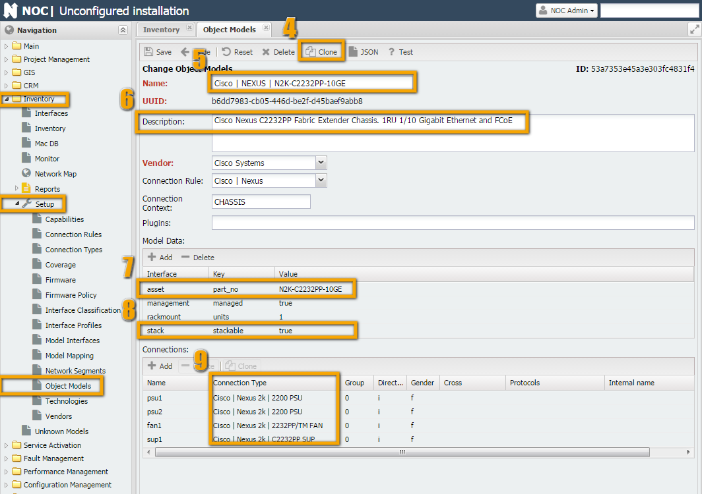

# How to Create Object Models

An object model represents a description of some real-world entity for NOC. The model includes:

* **Attributes** ([Model Data](../model-interfaces-reference/index.md)) - various parameters and properties of the model (size in RU, weight, PartNumber...), both built-in and external.
* **Connections** ([Connections](../connection-types-reference/index.md)) - responsible for connecting models to each other. For example, inserting a card into a chassis or plugging a wire into a connector.
* **Connection Rules** ([Connections Rule](connection-rule.md)) - describe the rules by which models will connect to each other.

So, to create a equipment model, you need to follow these steps:

1. There should be models for all equipment components.
2. When creating a model, the connections should be described correctly.
3. It is necessary to describe the rules by which these connections will be connected to each other.

## Terms and Definitions

### Model (Object Model)

The description in this section mostly repeats the description from the [ObjectModel](../object-models-reference/index.md) page.

In general, an object model consists of *Attributes* and *Connections*. The attributes of the model in NOC can include:

* **Name** - digit 4
* **Description** (digit 5)
* **Built-in** (isBuiltin) - A model supplied with NOC or created by the user (indicated in the general list with a checkbox).
* **Vendor** (digit 6)
* Optional model attributes (e.g., Context, PartNo, dimensions (Dimension), rack unit size, power consumption, etc.) (digit 7)

To create a model, it is sufficient to fill in its name and vendor. The name can have an arbitrary format, but standard names have the form:
"`Vendor | ... | ... | PartNo`" (e.g., "`Cisco | 7600 | WS-F6700-DFC3C`", "`DLink | Modules | DEM-420X`").
Defining the name in this format allows for the correct use of filters (digit 3).

Optional model attributes (digit 7) can be set to any value, but specific names are used by NOC for service purposes (e.g., `part_no`).

At the end, there is a list of connections (the `Connection` block). It lists the ways in which an object connects to the external world. The following parameters are used to describe a connection:

1. **Connection Name** - this serves as its identifier and is involved in connecting objects (the names must match during connection).
2. **Connection Type** - indicates the type of connection (discussed below) and is also involved in establishing the connection.
3. **Direction** - the direction of the connection's attachment. It is considered from the object's perspective.
   * Inner - the connected object will be inside this object (e.g., a line card will be inserted into this connector).
   * Outer - this object will be inside the connected object (e.g., connecting a module will place it inside a device, connecting a line card with such a connection will place it inside a chassis, a transceiver with such a connection will be placed inside an SFP connector).
   * Connection - cross-connection without placing an object. Suitable for connecting various patch cords and similar items when object insertions do not occur.
4. **Socket Type** - determines what can enter where and what cannot.
   * female - "mother"
   * male - "father"
   * genderless - neutral
5. **Protocols** - protocols supported by the connection. Available protocols.

!!! info

    Currently, protocols do not affect the establishment of a connection. However, they must be specified because this behavior will change in the future.

### Connection (Connection Type)

For a more detailed description, refer to the [ConnectionType](../connection-types-reference/index.md) page.

Connection types, in a sense, are also objects, but special kinds of objects - **connections**. An analogy for this is the "RJ45" type. To establish a connection, both objects must have the same connection type. In the case of "RJ45," this would be the connector and socket, both of which have the "RJ45" type.

Additionally, boards, electrical wires, transceivers, and other devices for connecting use various connections, often involving a hypothetical plug and socket.

For objects to connect to each other, they must have a connection with the same connection type, meaning they should be compatible. Here's an example of two compatible devices - an SFP connector and a transceiver:


In the first screenshot, a connection named "**Transceiver | SFP**" is displayed.

In the second screenshot, when filling out the object "**Carelink | Transceiver | 1G | CL-SFP-WDM-10-55**," we specify two connections in the connection table:

1. On one side, it connects to an SFP connector on the equipment. For SFP connections, we've created a connection type "`Transceiver | SFP`."
   * Since it is inserted into the connector rather than connected to it with a cable (as would be the case with a media converter), we set the direction (Direction) to Outer.
   * Socket Type: Male
   * Protocols ([Protocols](../inventory-protocols-reference/index.md)) and its specifications indicate that it can only support 1 protocol: `TransEth1G`.
2. On the other side, it has an optical port, let's call it `rxtx` (since it's a bidirectional transceiver). For optical LC connections, we've created a connection type "`Optical | LC`."
   * Since no object is placed in its connector (a patch cord is directly connected), we set the direction (Direction) to Connection.
   * Socket Type: Female
   * Protocols: Since it implements the Bidirectional protocol, we specify that transmission (greater than sign) is done using the `1000BASELX-1310` protocol, and reception (less than sign) uses `1000BASELX-1550`.

In the third screenshot, we fill out the other side of the connection (a switch with 2 SFP ports).

1. The connection is one-way (the other end of the connector is soldered onto the board, making it an integral part of the chassis). The connection is the same, so we specify "`Transceiver | SFP`."
   * Since another object is placed in the connector, we specify the direction (Direction) as Inner.
   * Socket Type: Female
   * Protocols: According to the [Protocols](../inventory-protocols-reference/index.md) list: `TransEth100M, TransEth1G`

### Connection Rules (Connection Rule)

For a more detailed description, refer to the [ConnectionRule](connection-rule.md) page.

"Connection rules are used to convert a linear list of objects provided by the `get_inventory` script into a tree by establishing the appropriate connections." In other words, by using the `Type` and `Number` fields returned by the `get_inventory` script, as well as the order of elements. The main terms used by the rule are "Scope" and "Context."

* **Context** - a specific area within the equipment where a component is located. For example, chassis, expansion cards, etc. This is filled in by the `get_inventory` script during operation.
* **Scope** - the area in the object model where the connection is searched. The search is based on the name, with up to 1 match.

Some explanations are required :smile:. In general, a rule is a converter for a list of equipment components into a three-dimensional model. For example, imagine you received a construction set instead of assembled and packaged hardware. The chassis is the box, the motherboard has connectors where you can insert cards and boards. The boards themselves may have SFP ports into which you can insert transceivers. Here's an instruction on how to assemble it all correctly, and that's where connection rules (**Connection Rules**) come in.

Let's take the example of a simple switch, such as "**Cisco | ME3600 | ME-3600X-24FS-M**." As shown in the screenshot, "**ME-3600X-24FS-M**" has a large number of SFP ports, plus there are 2 slots for power supplies (1 and 2).


If you look at `show interfaces` from the switch's perspective, you'll see that the command returns a simple list of components but indicates numbers and locations occupied by power supplies. During the operation of the `get_interfaces` script, power supplies are assigned the type `PSU`, the chassis is assigned `CHASSIS`, and transceivers are assigned `XCVR`. Along with these types, numbers indicating the slots they occupy are returned (1 and 2 for `PSU` and some numbers for transceivers, e.g., 2 and 3).

```shell title="show inventory ME-3600"

Switch#show inventory

NAME: "1", DESCR: "ME-3600X-24FS-M"

PID: ME-3600X-24FS-M   , VID: V01  , SN: FOC1446XXXX

 

NAME: "Power Supply 1", DESCR: "FRU Power Supply"

PID: PWR-ME3KX-AC      , VID: V01  , SN: LIT1433XXXX

 

NAME: "Power Supply 2", DESCR: "FRU Power Supply"

PID: PWR-ME3KX-AC      , VID: V01  , SN: LIT1433XXXX
```

Based on the `PartNo`, NOC will find the model with `PartNo "ME-3600X-24FS-M"` within the context of `CHASSIS` (this context is defined in the model's `Context` field, as shown in the screenshot). Then, in the "**Connection Rule**" field, the rule "`Generic | Switch SFP Prefixed`" will be found, according to which the type `PSU` should be searched for in the `CHASSIS` scope, and the name of the sought PSU will be `psu{N}`, where `{N}` will be replaced by the component number (in our case, they will be psu1 and psu2).

As a result, objects "**PWR-ME3KX-AC**" will be installed in the places `psu1` and `psu2`.

## Instructions (Technology)

### Viewing Model Information

The first question to answer is whether the necessary model exists in NOC (or its close analog). You can view information about the models loaded into NOC in the "Inventory -> Reports -> Part Numbers" report, in the "Name" column. You can also check for objects that lack models in the "Inventory -> Reports -> Unknown Models Summary" report.


### Source Data

Ideally, the source data for creating models is the output of the `get_inventory` script. If this data is not available, for example, if the script has not been written yet or its output is incomplete (in which case changes should be made to the script), you can use the output of hardware component display commands (e.g., `show inventory` for Cisco devices). You can also attempt to create a model based on data from the manufacturer's website (e.g., for Cisco, the documentation type is 'Hardware Guide'). This is suitable for non-modular devices (switches, simple routers, line cards) because they contain only stationary components (non-replaceable) or transceivers (SFP).

You can view the output of the `get_inventory` script either through the debugging mechanism (debug script) or through the menu "Service Activation" -> "Managed Object" -> <MO> -> Scripts. Double-clicking on the script name (`get_inventory`) will display its output.


The script returns a table with the following fields (columns):

| Field Name  | Description                                                                               | Example |
| ----------- | ----------------------------------------------------------------------------------------- | ------- |
| Type        | Component type. This field is defined in the script                                       |         |
| Number      | Component number within the device (e.g., slot number for a line card, SFP module number) |         |
| Builtin     |                                                                                           |         |
| Vendor      | Component manufacturer (e.g., manufacturers of switches and SFP modules may differ)       |         |
| Part No     | Model name                                                                                |         |
| Revision    | Revision number of the component                                                          |         |
| Serial No   | Serial number                                                                             |         |
| Description | Description                                                                               |         |

!!! info

    Among the required fields are Type, Number (which together participate in the connection rule), and Part No and/or Serial No (which participate in data-to-model matching).

### Pen and Paper

After obtaining the source data, it's useful to sit down and assess what can be achieved in the future. Several questions can help in this regard:

1. How complete is the data returned by the script?
   * The answer to this question will help understand what can be obtained in the end. Data like Type and Number are generated in the script itself, which means the device may not directly return them. However, these can often be inferred from indirect data (component order, part numbers). Part No and Serial No cannot be generated by the script (they can be hardcoded in the script, but this is highly discouraged, as it defeats the purpose of inventory - reflecting the real situation). Therefore, if the device cannot provide Part No and Serial No for a component, they should be included in the model, but in reality, they will not be available until the manufacturer fixes the issue or provides proper component data.
2. Are there any analogs of the device or its components in NOC?
   * If someone has already done half the work for us, does it make sense to redo it? This especially applies to non-modular devices, where manufacturers often make them indistinguishable from each other. Only the number and position of SFP ports may change. This means that you can simply find a suitable model, clone it, make corrections/additions (such as changing the number of ports and/or SFP slots), adjust the Part No, and save time.
3. Is the device modular?
   * The answer to this question often determines whether a connection rule (`Connection Rule`) needs to be written. If the device is not modular (e.g., a switch with SFP ports), you can use a standard rule (e.g., "Generic | Switch SFP Prefixed", "Generic | Switch SFP", etc.). However, if the device is modular, you cannot avoid writing your own connection rule (Connection Rule) unless the unknown component is part of a modular device and is not modular itself (e.g., a line card with ports).
4. Are there ready-made models and connections for the components of the device in NOC?
   * If the device turns out to be modular, check if there are models for the components of this device in NOC (based on `Part No`). The complexity here is that vendors often create their own connection interfaces, and it would be fine if they were common for all equipment. Often, they are common for a product line, which is okay. But sometimes, interfaces for different components within the same product line can be different. If there are no models, consider yourself lucky - you can create the model, connection rules, and everything else you need from scratch. However, if there are some existing components, you will inevitably encounter something called a "connection type" (`Connection Type`). We'll discuss this term separately in the section on writing rules (Connection Rule). (maybe here)
   
The point is that vendors often like to create their own connection interfaces. It would be fine if they were common for all equipment. Often, they are common for a product line, which is okay. But sometimes, interfaces for different components within the same product line can be different. Cisco, in particular, is notorious for this, primarily due to the large nomenclature of components it produces.

### Example 1: Cisco Nexus 3048

After all that lengthy introduction, we've now arrived at the main course - cooking up models. As is customary in cooking, we'll start by going through the recipe and preparing the ingredients. For this example, we'll take the device `Cisco Nexus 3048TP` (see the screenshot in the Source Data section). Let's go through the steps from the previous section and fill in the final table:

#### Check Script Data

We'll fill in the Source Data in the table. As we can see, the script returns a complete set of data. We'll cross-reference it with the manufacturer's website documentation (or take it at face value) for `Cisco Nexus 3048 Switch Data Sheet`. According to it, the equipment includes (Specification -> Physical):

* 1RU fixed form-factor switch
* 48 10/100/1000-Mbps RJ-45 ports
* 4 1/10 Gbps SFP+ uplink ports
* 2 redundant power supplies
* 1 fan tray with redundant fans
* 1 I/O module with management, console, and USB flash memory ports

As we can see, it doesn't quite match what we see in the table (smile). Let's compare:

|                                                                   |                                                                                                      |
| ----------------------------------------------------------------- | ---------------------------------------------------------------------------------------------------- |
| 1RU fixed form-factor switch                                      | This is the chassis (N3K-C3048TP-1GE) based on the script data. Everything else is inserted into it. |
| 48 10/100/1000-Mbps RJ-45 ports                                   | 48 ports. These physical ports are part of the supervisor (N3K-C3048TP-1GE-SUP)                      |
| 4 1/10 Gbps SFP+ uplink ports                                     | 4 SFP ports. These physical ports are part of the supervisor (N3K-C3048TP-1GE-SUP)                   |
| 2 redundant power supplies                                        | The script returned 2 PSUs based on the source data.                                                 |
| 1 fan tray with redundant fans                                    | Present in the source data.                                                                          |
| 1 I/O module with management, console, and USB flash memory ports | These are built-in, so the script didn't return them.                                                |

Overall, it looks logical. So, we consider that everything is good in this regard.

#### Look for Analogues

This point can be combined with the last one. We are looking for analogs and, at the same time, matches - perhaps everything has already been thought of before us. Open Inventory -> Setup -> "Object Model." At the top, in the filter, select Cisco -> Nexus (digit 8) and start looking at what's here.


We observe models for Nexus series 2K (digits 5 and 6): *Chassis* and *supervisor*. Most likely, they will suit us. Go inside the chassis and supervisor and see what's there.


1. In the chassis "Cisco | NEXUS | N2K-C2232PP-10GE," in the connections section (number 2), we see 4 connections (supervisor, fan tray, and 2 for power supplies) - exactly what is specified in the documentation. We conclude that it suits us as an analogue.
2. In the supervisor "Cisco | NEXUS | N2K-C2232PP-10GE-SUP" (middle screenshot), there are 38 SFP+ ports, while we have 48 built-in Ethernet plus 4 SFP+. Additionally, it does not mention USB, console, and management ports. It can serve as an analog but something closer with fewer edits would be better.
3. In the Nexus section, there is a supervisor "Cisco | NEXUS | N5K-C5596UP-SUP" (right screenshot) that already includes console and USB ports. However, all interfaces are SFP+. We could have taken a regular 48-port switch, but its interface naming is different (Nexus uses Ethernet, while IOS-based devices use GigabitEthernet, FastEthernet, etc.).
4. In the end, it's simpler to take "Cisco | NEXUS | N5K-C5596UP-SUP" and remove the unnecessary parts (smile).

For the fan tray, it's relatively simple. It has only one connection, and there are no ports. So, we can take the first suitable one - "Cisco | NEXUS | N2K-C2232-FAN."

As for power supply models, we already have them: "Cisco | NEXUS | N2200-PAC-400W." It's relatively straightforward to use the required connection.

#### Modularity

After we have thoroughly examined NOC for analogs and the manufacturers' documentation for information on equipment composition (in case it's missing, everything becomes more complicated, but you can always look inside the hardware and/or ask knowledgeable people), we have enough information to determine modularity or non-modularity.

The question, in the context of modern equipment, is not always straightforward. For example, in our case, on one hand, there is a monolithic case, with no apparent way to disconnect anything (except with makeshift tools). On the other hand, the inventory clearly indicates the existence of a chassis into which a supervisor module is inserted. And from the interface numbering, it's evident that they do not belong to the chassis (Eth1/X, etc.).

In this case, it's better to rely on the output from the actual equipment. This is easier than inventing how it should be (smile) in an ideal world.

The result of this reasoning is a checkmark next to the modularity of the chassis (case) and non-modularity of everything else. 

As a result, we conclude that we will need to start writing a connection rule for the chassis (even though it's just a 1U switch, things always turn out this way...)

#### Ready-Made Components and Connections

During step 2, we already found one ready-made model for the power supply "N2200-PAC-400W".
From this, we can draw two conclusions:

1. We won't have to create a model for it. Hooray, thanks to many users!
2. Somehow, we will have to explain to NOC that the power supply for the Nexus 2K can be used in Nexus 3K... But more on that in the next step.

For components "N3K-C3048TP-1GE-SUP" and "N3K-C3048-FAN," there are no suitable connections. We'll need to create them.

Here's the table that resulted from the investigation of one piece of hardware. In principle, it makes sense to use these methods in complex cases. After all, NOC already has models for quite a large number of basic types of equipment. (Thanks to NOC users!) And the chance that you will encounter a truly unique case for which you can't find analogs is relatively small (smile).

| Type    | Number | Vendor | Part No             | Serial No | Analogues                                                                                          | Modularity | Ready-Made Models                        | Ready-Made Connections |
| ------- | ------ | ------ | ------------------- | --------- | -------------------------------------------------------------------------------------------------- | ---------- | ---------------------------------------- | ---------------------- |
| CHASSIS | None   | Cisco  | N3K-C3048TP-1GE     | XXXXX     | Cisco &#124; NEXUS &#124; N2K-C2232PP-10GE                                                         | Yes        | None                                     | -                      |
| SUP     | 1      | Cisco  | N3K-C3048TP-1GE-SUP | XXXXX     | Cisco &#124; NEXUS  &#124; N2K-C2232PP-10GE-SUP , Cisco &#124; &#124; NEXUS &#124; N5K-C5596UP-SUP | No         | None                                     | None                   |
| FAN     | 1      | Cisco  | N3K-C3048-FAN       | XXXXX     | Cisco &#124; NEXUS &#124; N2K-C2232-FAN                                                            | No         | None                                     | None                   |
| PSU     | 1      | Cisco  | N2200-PAC-400W      | XXXXX     |                                                                                                    | No         | Cisco &#124; NEXUS &#124; N2200-PAC-400W | Yes, but can't be used |
| PSU     | 2      | Cisco  | N2200-PAC-400W      | XXXXX     |                                                                                                    | No         | Cisco &#124; NEXUS &#124; N2200-PAC-400W | Yes, but can't be used |

### Preparing Connections

To connect the created models together, we need to use connections. We will need three connections: one for the power supply, one for the fan tray, and one for the supervisor module. However, we need to allow the power supplies for Nexus 2K to use the power supply connection for Nexus 3K, while power supplies for Nexus 3K cannot use the connection for Nexus 2K.

#### Connection for the Fan Tray

We will use the connection for the Nexus 2K fan tray: `Inventory -> Setup -> "Connection Type" -> "Cisco | Nexus 2k | 2232PP/TM FAN"`.

We will modify the **Name** and **Description** of the connection type. The parent-child relationships remain the same, so we will leave them as they are.


#### Connection for Supervisor Module

Similarly, we create a connection type for the supervisor module. To do this, we **clone** the connection type for `Nexus 2K`: `Inventory -> Setup -> "Connection Type" -> "Cisco | Nexus 2k | C2232PP SUP"` and rename it to "`Cisco | Nexus 3k | C3048 SUP`".


#### Connection for Power Supply

Also, following the same pattern, we clone the connection type from Nexus 2k: `Inventory -> Setup -> "Connection Type" -> "Cisco | Nexus 2k | 2200 PSU"`. Then, we rename it to "`Cisco | Nexus 3k | PSU`".


To enable the connection of power supplies from Nexus 2k, we extend (`Extend`) the connection type "`Cisco | Nexus 2k | 2200 PSU`" with the type "`Cisco | Nexus 3k | PSU`" (number 5).


### Preparing Models

As we discovered in the previous section, we need to create three models: "`N3K-C3048TP-1GE`," "`N3K-C3048TP-1GE-SUP`," and "`N3K-C3048-FAN`." We can use analogs to help with this.

#### N3K-C3048TP-1GE

Let's go to the model `Inventory -> Setup -> "Object Models" -> "Cisco | NEXUS | N2K-C2232PP-10GE,"` then click the Clone button (number 4) and see what needs to be adjusted.




* **Name** (number 5), change the Part No from `N2K-C2232PP-10GE` to `N3K-C3048TP-1GE`.
* **Description** (number 6), replace it.
* **Model Data** (number 7)
    * `asset`, change the part_no to `N3K-C3048TP-1GE`.
    * `stack` - since 3048TP does not support stacking, delete it or set it to False.
* **Connections** (number 7), change the connection types. `Direction` and `Gender` remain the same.

After making these changes, save the new model by clicking the **Save** button. On the screenshot to the right, you can see the changes already made to the original model.

!!! attention

    Be attentive when cloning objects. It's quite common to forget to click the **Clone** button!
    Before saving a newly cloned object, check that the Clone button is not active (grayed out). If it's active, your changes will be applied to the original object, and you need to click the Clone button before saving.

#### N3K-C3048-FAN

Go to the model `Inventory -> Setup -> "Object Models" -> "Cisco | NEXUS | N2K-C2232-FAN,"` then click the Clone button (number 4) and see what needs to be adjusted.


#### N3K-C3048TP-1GE-SUP

Go to the model `Inventory -> Setup -> "Object Models" -> "Cisco | NEXUS | N5K-C5596UP-SUP,"` then click the Clone button (number 4) and see what needs to be adjusted. Besides the usual fields like Name, Description, and part_no, you'll need to edit the large table of interfaces.


In the `N3K-C3048TP-1GE-SUP` model, unlike `N5K-C5596UP-SUP`, there are 48 Ethernet interfaces of type RJ-45 + 4 SFP interfaces (instead of 48 SFP ports on `N5K-C5596UP-SUP`). So, you'll need to make changes to all of them, except for the Name and Gender. Here's what you should do:

1. Keep only the Eth1 interface - remove the rest (from Eth1/2 to Eth1/48).
2. In the interface row, make the following changes:
   - Change ConnectionType to "Electrical | RJ45"
   - Change Direction to s (Connection)
   - In Protocols, enter "10BASET,100BASETX,1000BASETX"
   - In Description, write the full interface names like "Ethernet1/48."
3. After that, select the row and click the Clone button above the list (number 8) 48 times. You should have 48 interfaces plus 1.
4. Next, adjust the Name and Description.
5. Then select the 49th row and change it to SFP:
   - Change ConnectionType to "Transceiver | SFP+"
   - Change Direction to i (Inner)
   - In Protocols, enter "TransEth1G,TransEth10G"
6. Clone the row 3 times (create interfaces from Eth1/50 to Eth1/52).

The result should match the screenshots on the right.

### Writing Rules

The last step in preparing the model for use is to write rules. I recommend refreshing your knowledge of ConnectionRule.

Rules are necessary for connecting **Directions** (`Inner` and `Outer`). In our case, we need to describe the connection of connections of type: `psu` (1 and 2), `fan`, and `sup`. Also, SFP modules (type `xcvr`) can be connected to the supervisor.

When we created the model for the chassis, the rules were already filled in it. So, we will use them.

1. First, fill in the Context section.
   - The **TYPE** field should match the TYPE returned by the `get_inventory` script, and something should be connected to it. In our case, this is done for the chassis (power supplies and the supervisor are connected to it) and for the supervisor (SFP modules are connected to it). There is no GEM in Nexus 3K.
   - The **Scope**, for convenience, is made from TYPE in lowercase.
   - **Reset Scopes** is necessary for NCS to revert to the previous level when traversing the outputs of `get_inventory`. Otherwise, it will look for everything in the chassis.
2. Fill in the rules.
   - In the first column, list all possible TYPE elements (Specify what we will connect).
   - **Match connection** is the Name in the object's connection table that we are connecting.
   - **Scope** (Area) is where it will be searching for options, i.e., where the component will be plugged in (e.g., the power supply will be plugged into the chassis, so for the CHASSIS type, the scope is chassis, and we specify it here; transceivers will be inserted into the supervisor - SUP, so we write sup in the Scope).
   - **Target Type** is the type of object with which the connection will occur. This field will match the Connection Context field in the model.
   - **Target connection** shows where we will be plugging in, and it will match the Name field in the connection table.

As we can see, the rule fits our needs. We can ignore the extra connection types (GEM). Go to "`Cisco | NEXUS | N3K-C3048TP-1GE`" and assign the [Connection Rule](connection-rule.md) (number 1).


## Testing

To check the functionality of the model in NOC (Network Orchestration and Control), there is a built-in testing feature. In each model or connection rule, there is a "Test" button in the top panel (as shown in Figure 5). When clicked, NOC will compile the object model according to the configured settings and display possible connections.


In the screenshot, NOC shows us the possible connections. In the power supply slot, you can connect: "Cisco | NEXUS | N2200-PDC-400W", "Cisco | NEXUS | N2200-PDC-400W-B", "Cisco | NEXUS | N2200-PAC-400W", "Cisco | NEXUS | N2200-PAC-400W-B". In other words, it supports all power supplies from Nexus 2K, as required. In the fan slot, only the fan block for N3K can be connected, as well as with the supervisor slot.

Looking at the situation from the supervisor's perspective, it can be seen that it connects to the chassis. Additionally, in the 4 interfaces, transceivers can be installed.


Testing is also available from the command line.

```shell title="Output Example"
/opt/noc$ ./noc verify-model
Cisco | ASR901 | A901-6CZ-FT-D errors:
    TOD: RJ45 must have at least one protocol
    BITS: RJ45 must have at least one protocol
```
