# How-to Create Object Models

Модель объекта представляет собой описание некой сущности реального мира для NOC'а.
В модель входят:

* **атрибуты** ([Model Data](../model-interfaces-reference/index.md)) - различные параметры и свойства модели (размер в RU, масса, PartNumber ...) 
  встроенные и внешние;
* **соединения** ([Connections](../connection-types-reference/index.md)) - отвечают за стыковку моделей друг с другом.
  Например: воткнуть плату в шасси, подключить провод в разъём;
* **правила для соединений** ([Connections Rule](connection-rule.md)) - описывают правила, 
  по модели будут стыковаться между собой;

Итак, для создания модели оборудования необходимо выполнить следующие шаги:

1. Должны быть модели для всех компонентов оборудования.
2. При создании модели должны быть правильно описаны связи.
3. Необходимо описать правила, по которым эти связи будут стыковаться друг с другом.

## Термины и определения.

### Модель (Object Model)

Описание в данном разделе, в основном, повторяет описание со страницы [ObjectModel](../object-models-reference/index.md).

В общем виде, модель объекта состоит из *Атрибутов* и *Связей*. 
К аттрибутам модели в НОКе можно отнести:

* **Имя** (Name) - цифра 4
* **Описание** (Description) (цифра 5)
* **Встроенная** (isBuiltin) Модель поставляемая с НОКом или созданная пользователем (показывается в общем списке галочкой)
* **Производитель** (Vendor) (цифра 6)
* Опциональные аттрибуты модели (например Context, PartNo, размеры (Dimension), занимаемое место в единицах стойки, энергопотребление и т.д.) (цифра 7)


Для создания модели достаточно заполнить её имя и производителя.
Имя может иметь произвольный формат, но стандартно, имена имеют форму:
"`Vendor | ... | ... | PartNo`" (н-р: "`Cisco | 7600 | WS-F6700-DFC3C`", "`DLink | Modules | DEM-420X`")
задание имени в таком формате позволяет корректно пользоваться фильтрами (цифра 3).


Опциональные аттрибуты модели (цифра 7) можно задавать любые, 
но определённые имена используются НОКом для служебных нужд (н-р `part_no`)

В конце идёт список связей (блок `Connection`). 
В нём перечисляются способы, которыми объект соединяется с внешним миром.
Для описания связи используются следующие параметры:

1. **Имя связи** (Name) - является её идентификатором и участвует в соединении объектов
   (имена при соединении должны совпадать)
2. **Тип соединения** (Connection Type) - указывает на тип соединения (рассматривается ниже)
   и, также, участвует при установке связи.
3. **Направление** (Direction) - направление подключения связи. Считается от объекта.
   * Inner - подключаемый объект окажется внутри данного объекта 
    (например в этот разъём включится линейная карте)
   * Outer - данный объект окажется внутри объекта подключения
     (например подключение модуля окажется внутри устройства, линейная карта с таким подключением окажется внутри шасси,
     Трансивер с таким подключением окажется внутри разъёма SFP)
   * Connection - коммутация без размещения объекта.
    Подойдёт для подключения различных патч-кордов и прочего, когда вставки объектов не происходит.
4. **Тип сокета** (Gender) - определяет что куда может входить, а что не может 
   * female - "мама"
   * male - "папа"
   * genderless - нейтральный
5. **Протоколы** - протоколы, которые поддерживает связь Доступные протоколы

!!! info

    На данный момент протоколы не влияют на установление соединения.
    Но их необходимо указывать, т.к. в будущем это поведение изменится


### Соединение (Connection Type)

Более подробное  описание доступно по ссылке [ConnectionType](../connection-types-reference/index.md)

Типы соединений, в каком-то роде, тоже представляют собой объекты, 
только объекты особого рода - **соединения**. Одна из аналогий это тип `RJ45`.
Для того чтобы связь состоялась у обоих объектом должен совпадать тип соединения,
в случае `RJ45` это коннектор и разъём. Они оба имеют тип RJ45.

Также платы, электрические провода, Трансиверы и пр. устройства для подключения 
с собой используют различные соединения в которых,
зачастую, участвует условная вилка и условная розетка.

Для того чтобы состыковаться друг с другом разным объектам они должны обладать связью с 
одинаковым типом соединения, т.е. должны подходить друг другу (быть совместимыми). 
Вот пример двух совместимых устройств - разъёма SFP и Трансивера:


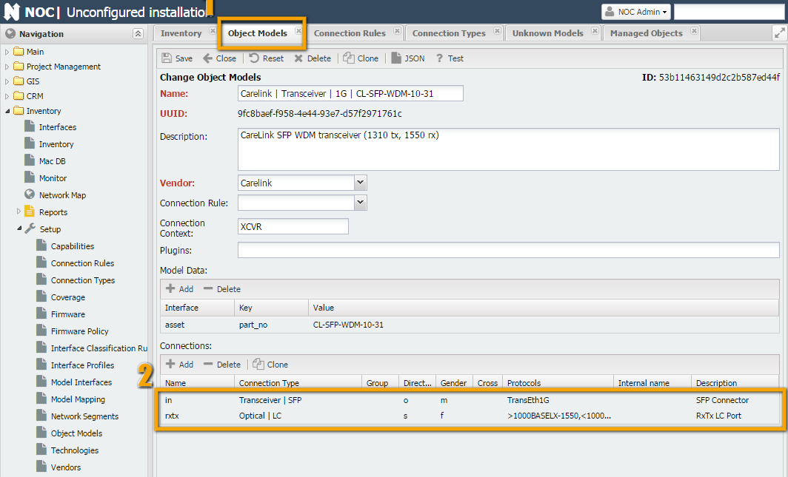


На 1 скриншоте отображается созданная связь "**Transceiver | SFP**".

На скриншоте 2. При заполнении объекта "**Carelink | Transceiver | 1G | CL-SFP-WDM-10-55**"
мы в таблице связей мы указываем 2 связи:

1. С одной стороны он подключается в SFP разъём на обоудовании, 
      для SFP подключения создали тип связи "`Transceiver | SFP`". 
    * Поскольку, он помещается в разъём, а не подключается в него проводом 
      (как было бы в случае н-р медиаконвертера) направление (Direction) берём Outer. 
    * Тип сокета: Male
    * Протоколы ([Protocols](../inventory-protocols-reference/index.md)) и его спецификации обслуживать он может
      только 1 протокол: `TransEth1G`
2. С другой стороны у него оптический порт - назовём его `rxtx` (т.к. это bidirectional трансивер).
      Для оптических LC подключений создали тип сязи "`Optical | LC`"
    * Поскольку в его разъём никакой объект не помещается (в него включается, непосредственно патч-корд)
      **направление** (Direction) зададим `Connection`
    * Тип сокета: `Female`
    * Протоколы. Поскольку реализуется протокол Bidirectional мы указываем - передача (знак больше)
      идёт по протоколу `1000BASELX-1310`, а приём (знак меньше) - `1000BASELX-1550`.

На скриншоте 3. Мы заполняем другую сторону связи (коммутатор с 2 - мя SFP портами).

1. Связь у нас только в одну сторону (вторым краем разъём впаян в плату,
    т.е. является неотъемлимой частью шасси). Связь та же, поэтому указываем "`Transceiver | SFP`"
    * Поскольку в разъём помещается другой объект, указываем **направление** (Direction) - Inner
    * Тип сокета: **Female**
    * Протоколы: согласно списка [Protocols](../inventory-protocols-reference/index.md): **TransEth100M, TransEth1G**

### Правила соединения (Connection Rule)

Более подробное описание доступно по ссылке [ConnectionRule](connection-rule.md).

"Правила соединения служат для преобразования линейного списка объектов,
выдаваемых скриптом `get_inventory` в дерево путем организации соответствующих связей" © 
Перефразируя, используя поля `Type` и `Number`, выдаваемые скриптом `get_inventory`,
а также порядок элементов. Основные термины, которыми оперирует правило это область (`Scope`)
и контекст (Context).

* **Context** - некая область в оборудовании где находится компонент.
  Например шасси, карта расширения и пр. Заполняется скриптом get_inventory при работе.
* **Scope** - область поиска подключения в модели объекта.
  Поиск производится по имени, до 1 совпадения.

Требуются пояснения :smile:. В общем-то, правило - это конвертер списка компонентов оборудования
в трёхмерную модель. Для примера, можно представить что вам пришёл конструктор,
вместо собранной и упакованной железки. Шасси - коробка, материнская плата, на ней разъёмы,
куда можно вставлять компоненты карточки, платы.
В самих платах могут быть SFP порты, в которые можно вставлять Трансиверы.
Вот инструкция - как это всё правильно собирается и есть правила соединения (**Connection Rule**).

Посмотрим на примере простого коммутатора н-р "**Cisco | ME3600 | ME-3600X-24FS-M**".
Как видно на скриншоте у "**ME-3600X-24FS-M**" большое число SFP портов, плюс,
есть 2 места под блоки питания (1 и 2). 

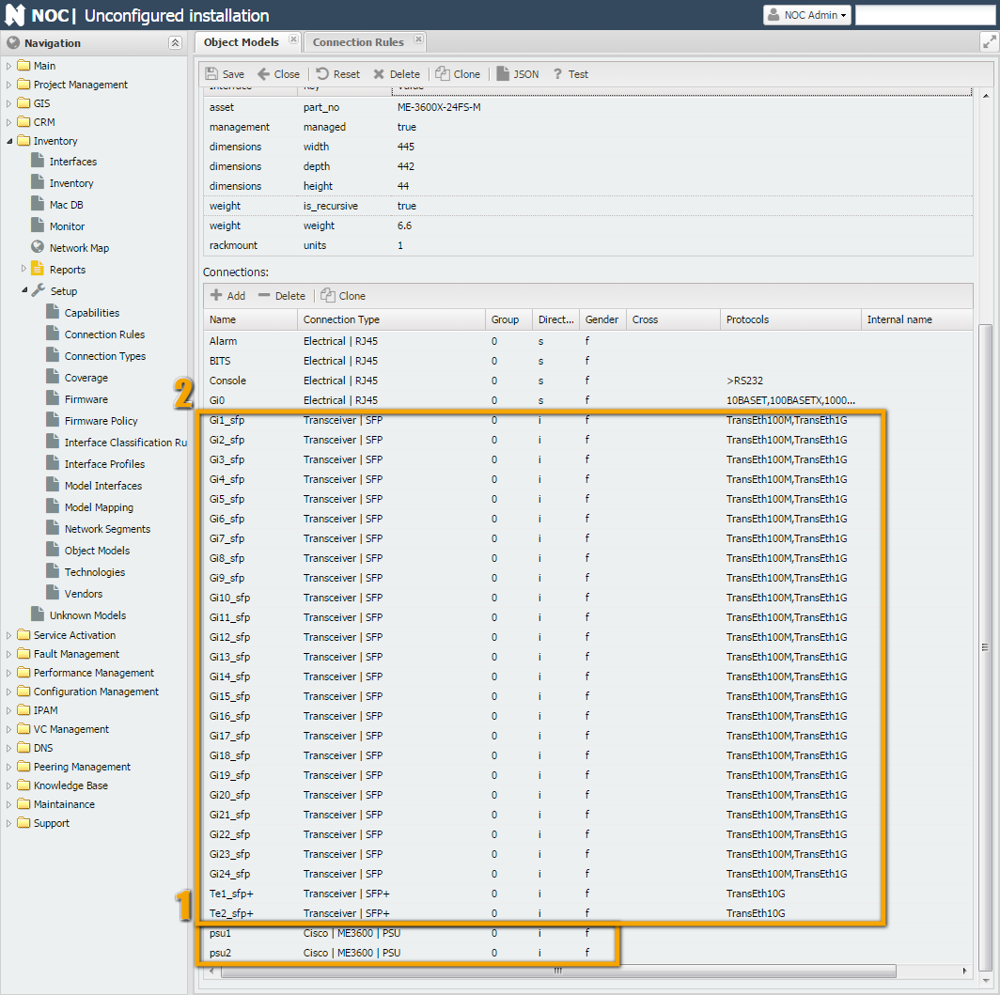
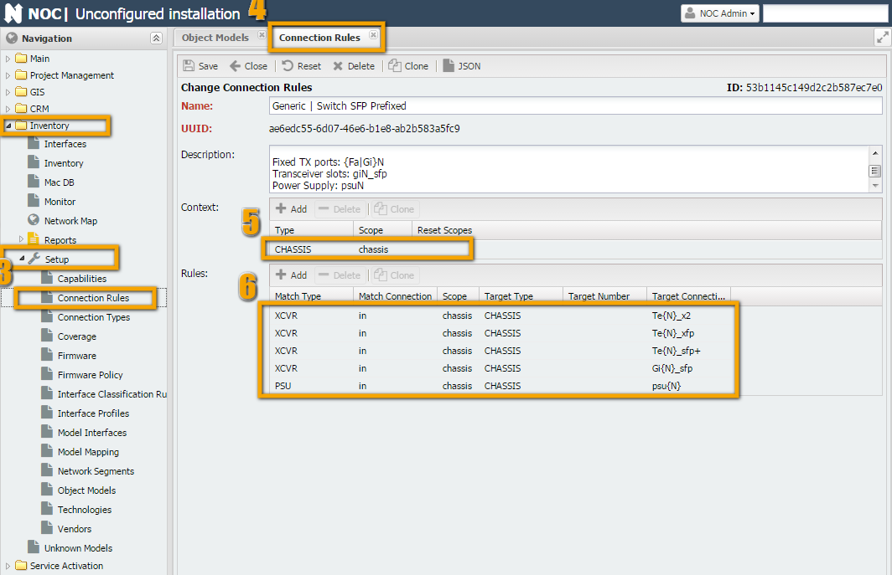

Если взглянуть на `show interfaces` со стороны коммутатора,
то увидим что команда возвращает просто список компонентов,
но указывает номера, мест, которые занимают блоки питания.
Во время работы скрипта `get_interfaces` *блокам питания* присвоится тип тип `PSU`,
*шасси* - `CHASSIS`, *трансиверам* - `XCVR`.
И вместе с ними вернутся цифры, занимаемых ими слотов (1 и 2 для `PSU` и 
какие-то для трансиверов н-р 2 и 3).

```shell title="show inventory ME-3600"

Switch#show inventory

NAME: "1", DESCR: "ME-3600X-24FS-M"

PID: ME-3600X-24FS-M   , VID: V01  , SN: FOC1446XXXX

 

NAME: "Power Supply 1", DESCR: "FRU Power Supply"

PID: PWR-ME3KX-AC      , VID: V01  , SN: LIT1433XXXX

 

NAME: "Power Supply 2", DESCR: "FRU Power Supply"

PID: PWR-ME3KX-AC      , VID: V01  , SN: LIT1433XXXX
```

Исходя из `PartNo` NOC найдёт модель с `PartNo "ME-3600X-24FS-M"` в контексте `CHASSIS`
(этот контекст задаётся в поле `Context` модели и на скриншоте показан).
Далее, в поле "**Connection Rule**" обнаружится правило "`Generic | Switch SFP Prefixed`"
согласно ему тип `PSU` необходимо искать в области (**Scope**) chassis,
а имя искомого PSU будет `psu{N}`, где `{N}` - заменится на номер компонента
(в нашем случае будут psu1 и psu2).

В результате на места `psu1` и `psu2` установятся объекты "**PWR-ME3KX-AC**".


## Инструкция (технология)


### Просмотр информации о моделях

Первый вопрос, на который необходимо получить ответ:
*есть ли в НОКе необходимая модель* (или её близкий аналог).
Информацию о загруженных в NOC моделях можно просмотреть в отчёте 
`Inventory -> Reports -> "Part Numbers"`, столбец `Name`.
Информацию по объектам, для которых отсутствуют модели можно посмотреть в отчёте 
`Inventory -> Reports -> "Unknown Models Summary"`.


### Исходные данные

Исходными данными для создания моделек, в идеальном случае, является вывод 
((ссылка на тушёнку)"тушёнка") скрипта `get_inventory`. 
В случае их отсутствия, например скрипт ещё не написан или его вывод неполон
(в этом случае необходимо внести изменения в скрипт, иначе НОК не сможет скомпоновать объект),
можно воспользоваться выводом команд показа аппаратных компонентов оборудования
((ссылка на таблицу)"`show inventory`" - Cisco, ...).
Можно попробовать создать модельку по данным с сайта производителя
(н-р для Cisco тип документации `Hardware Guide`), это хорошо подходит для не модульных устройсв
(коммутаторов, простых маршрутизаторов, линейные карты) 
т.к. они содержат только стационарные компоненты (не заменяемые) или трансиверы (SFP).

Посмотреть вывод скрипта `get_inventory` можно или через механизм отладки
(debug script (ссылка на отладку)) или через меню `"Service Activation" -> "Managed Object" -> <MO> -> Scripts`.
По двойному клику на имени скрипта (`get_inventory`) отобразится его вывод.

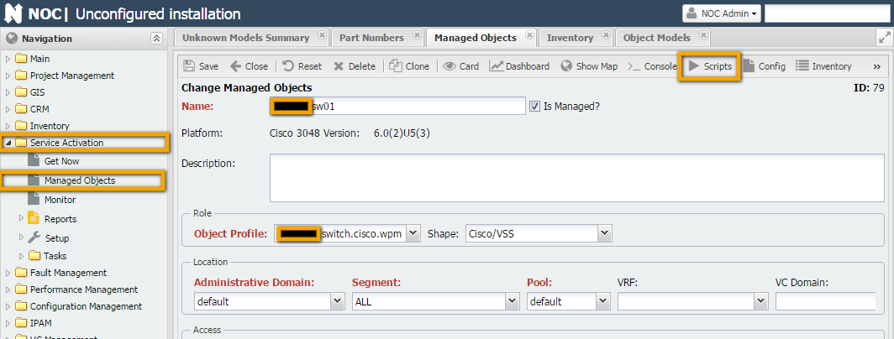


Скрипт возвращает таблицу со следющими полями (столбцами):

| Имя поля    | Описание                                                                                   | Пример |
| ----------- | ------------------------------------------------------------------------------------------ | ------ |
| Type        | Тип компонента. Поле задаётся в скрипте (на основе данных, возвращаемых оборудованием)     |
| Number      | Номер компонента в устройстве (например номер слота для линейной карты, номер SFP модуля). |
| Builtin     |                                                                                            |
| Vendor      | Производитель компонента (н-р производители коммутатора и SFP модуля могут отличаться)     |
| Part No     | Название модели                                                                            |
| Revision    | Номер ревизии компонента                                                                   |
| Serial No   | Серийный номер                                                                             |
| Description | Описание                                                                                   |

!!! info
    Среди полей обязательные - это Тип, Number: вместе участвуют в работе правила соединения (Connection Rule)), Part No и/или Serial No - участвуют в сопоставлении данных и модели.

### Бумага и ручка

После получения исходных данных, бывает, полезно сесть и посмотреть - что получится в дальнейшем. В этом могут помочь несколько вопросов:

1. Насколько полные данные вернул скрипт?
   * Ответ на этот вопрос позволит понять, что можно получить в конце. Такие данные, как Type и Number, формируются в самом скрипте, т.е. устройство напрямую их может не возвращать, но, часто, их можно определить по косвенным данным (порядок следования компонентов, парт номера). А вот Part No и Serial скрипт сам придумать не сможет (на самом деле, их можно "захардкодить в скрипте, но так делать крайне не рекомендуется, т.к. теряется смысл инвентори - отражение реальной ситуации). Исходя из этого - если из устройства нет возможности вытащить Part No и Serial компонента - в модель его включить нужно, но в реальности он туда не попадёт (пока производитель не исправит баг или не доделает нормальный вывод по компонентам).
2. Есть ли в НОКе аналоги данного устройства или его компонентов.
   * Тут всё логично - если кто-то уже сделал половину работы за нас - смысл её переделывать? Особенно, это касается немодульного оборудования, скорее всего, пользуясь такой же логикой, производители делают их не отличимыми друг от друга. Меняются только число и положение SFP портов. Это значит что можно просто найти подходящую модель, клонировать (Clone), исправить/дополнить (также методом Клонирования (Clone) число портов и/или SFP дырок, поправить Par No и обрести счастье, в лице сэкономленного времени.
3. Является ли устройство модульным?
   * Ответ на этот вопрос является (в большинстве случаев) ответом на вопрос: "Надо ли писать правило соединения ([Connection Rule](connection-rule.md))?". Если устройство не модульное (н-р коммутатор с SFP портами) то можно просто воспользоваться стандартным правилом (н-р "Generic | Switch SFP Prefixed", "Generic | Switch SFP" и др.). Если же,устройство оказалось модульными, то без написания собственного правила соединения (Connection Rule) не обойтись (если только, например, неизвестный компонент не оказался компонентом модульного устройства и сам не является модульным (н-р линейная карта с портами))
4. Есть ли готовые модельки и соединения для компонентов устройства в НОКе?
   * И если устройство оказалось *модульным*, то необходимо посмотреть (по `Part No`), есть ли в НОКе модельки для компонентов этого устройства?
   Сложность тут состоит в следующем: если моделек нет, то, в общем-то, вам повезло - "Вы первый!". 
   Можете безгранично творить модельку, правила соединений и всё, что нужно, для работы модельки.
   Но если вам не повезло и какие-то компоненты уже есть, то вы обязательно столкнётесь
   с такой штукой как тип соединения ([Connection Type](../connection-types-reference/index.md)). 
   Пока, запомните этот термин. В разделе про Написание правил поговорим отдельно. (может быть тут)

Смысл в том, что Вендоры очень любят делать свои интерфейсы подключений
и ладно бы они были общие для всего оборудования.
Зачастую, общие они бывают для линейки оборудования, и это было бы ничего!
Но, бывает и так, что в новом оборудовании можно использовать какие-то компоненты от
старого (это называется совместимость), а компоненты от нового в старом использовать нельзя.
(Особенно этим славится `Cisco`, в основном, из-за большой номенклатуры выпускаемых компонентов).


### Пример 1. Cisco Nexus 3048.

После столько длительного введения, мы перешли к главному блюду (готовка моделек).
Как принято в кулинарии в начале разберём рецепт, и подготовим ингридиенты.
Для примера возьмём устройство `Cisco Nexus 3048TP` (см. скришнот в Исходных данных).
Пройдёмся по пунктам из предыдущего раздела и заполним в конце итоговую табличку:

#### Проверим данные скрипта

Заполним Исходные данные в табличке. Как мы видим, скрипт возвращает полный комплект данных.
Сверим его с документацией на сайте производителя (или поверим на слово) 
`Cisco Nexus 3048 Switch Data Sheet`. По нему в состав оборудования входит (Specification -> Physical):

* 1RU fixed form-factor switch
* 48 10/100/1000-Mbps RJ-45 ports
* 4 1/10 Gbps SFP+ uplink ports
* 2 redundant power supplies
* 1 fan tray with redundant fans
* 1 I/O module with management, console, and USB flash memory ports

Как видим, не очень сходится с тем, что мы видимо в таблице(smile) давайте сопоставлять:

|                                                                   |                                                                                                   |
| ----------------------------------------------------------------- | ------------------------------------------------------------------------------------------------- |
| 1RU fixed form-factor switch                                      | это шасси (N3K-C3048TP-1GE) судя по возвращаемым скриптом данным в него вставляется всё остальное |
| 48 10/100/1000-Mbps RJ-45 ports                                   | 48 портов. Это физические порты являются частью супервизора (N3K-C3048TP-1GE-SUP)                 |
| 4 1/10 Gbps SFP+ uplink ports                                     | 4 SFP порта. Это физические порты являются частью супервизора (N3K-C3048TP-1GE-SUP)               |
| 2 redundant power supplies                                        | по исходным данным нам вернулось 2 PSU                                                            |
| 1 fan tray with redundant fans                                    | в исходных данных есть                                                                            |
| 1 I/O module with management, console, and USB flash memory ports | Являются встроенными, поэтому скрипт их не вернул                                                 |

В общем, выглядит логично. Так что считаем что по этому вопроске всё хорошо.

#### Поищем аналоги

Данный пункт можно совместить с последним. Ищем аналоги и, заодно, и совпадения - возможно, всё уже придумано до нас. Открываем Inventory -> Setup -> "Object Model". Вверху в фильтре выбираем Cisco -> Nexus (цифра 8) и начинаем смотреть, что тут есть.


Наблюдаем модельки для Nexus'ов серии 2K (цифры 5 и 6): *Шасси* и *супервизор*.
Скорее всего, они нам подойдут. Заходим внутрь шасси и гипервизора и смотрим что там.

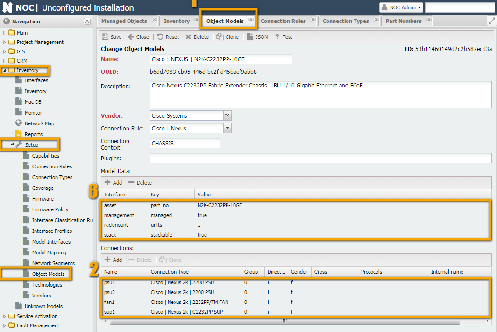
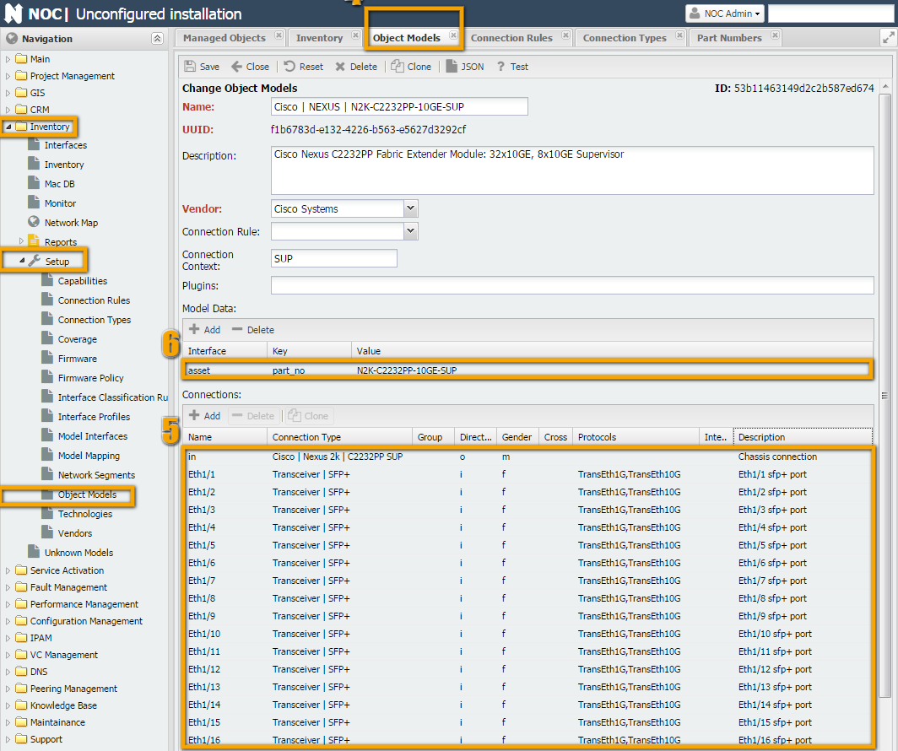
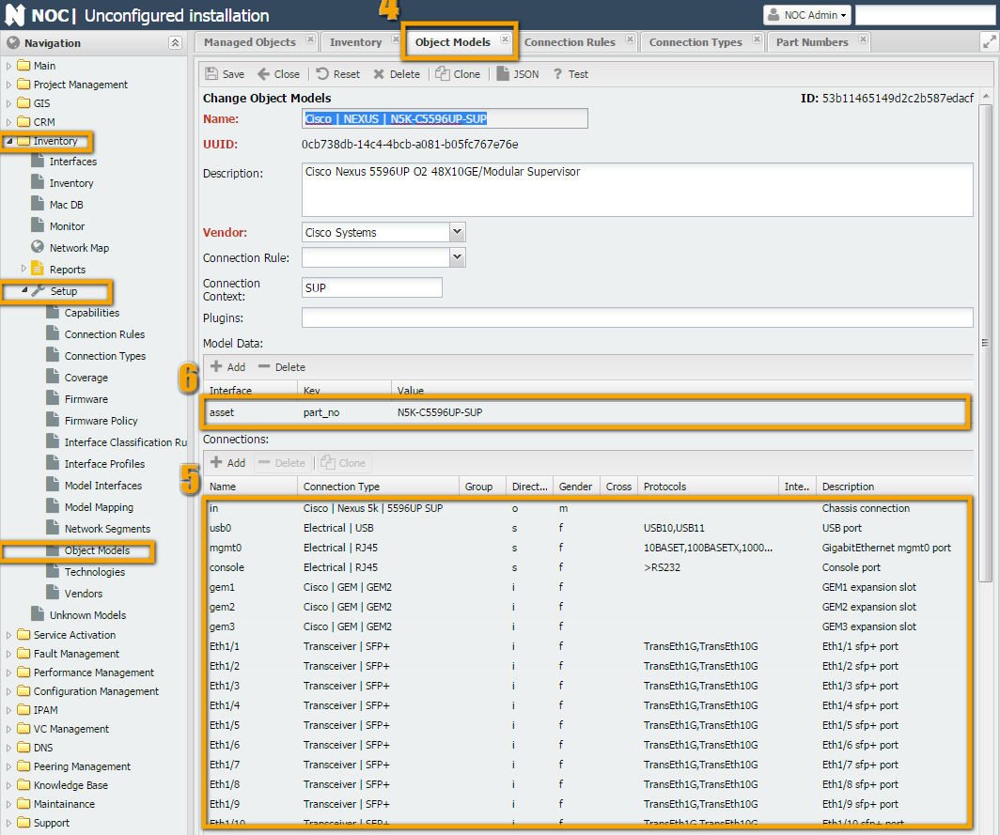

1. В шасси "Cisco | NEXUS | N2K-C2232PP-10GE" в разделе соединений (цифра 2) видим 4 соединения
   (супервизор, блок вентиляторов и 2 для блоков питания) у нас, как раз, столько и указано в документации.
   Делаем вывод - в качестве аналога нам подходит.
2. В супервизоре "`Cisco | NEXUS | N2K-C2232PP-10GE-SUP`" (скриншот посередине) 38 SFP+ портов,
   у нас же *48 встроенных Ethernet плюс 4 SFP+*. Плюс в нём не указаны USB, консольный и Management порты.
   В качестве аналога подходит, но лучше что-нибудь поближе, чтобы меньше править.
3. В разделе Nexus есть супервизор "`Cisco | NEXUS | N5K-C5596UP-SUP`" (скриншот справа),
    там уже присутствуют консольный, USB порты. Но все интерфейсы SFP+. 
    Можно было бы взять обычный коммутатор (на 48 портов), но у него отличается именование интерфейсов
   (у Nexus'ов - Ethernet, у IOS-based GigabitEthernet, FastEthernet и т.д.)
4. В итоге проще взять "`Cisco | NEXUS | N5K-C5596UP-SUP`" и удалить лишнее(smile)

Для блока вентиляторов всё, относительно просто, подключение у него одно, портов нет.
Поэтому можем взять первый подходящий - "`Cisco | NEXUS | N2K-C2232-FAN`"

Модели для блоков питания у нас уже есть: `Cisco | NEXUS | N2200-PAC-400W` 
достаточно просто воспользоваться необходимым подключением.

#### Модульность

После того как мы проштудировали НОК на предмет аналогов и документацию производителей 
на предмет сведений о составе оборудования (в случае её отсутствия всё усложняется но 
всегда можно посмотреть на внутренности железки и/или поспрашать у знающих людей) у нас 
достаточно информации чтобы сказать о модульности или немодульности.

Вопрос, применительно к современному оборудованию не всегда простой, например, 
в нашем случае, с одной стороны: монолитный корпус, никакой возможносты
отсоединить что-нибудь нет (кроме как с подручными средствами).
С другой стороны инвентори нам явно указывает, что есть шасси, в которое
вотктнут модуль супервизора. А по нумерации интерфейсов явно видно 
что принадлажат они не шасси (`Eth1/X` и т.д).

В данном случае, лучше довериться выводу с самого оборудования. Это проще чем выдумывать себе как должно быть(smile) в идеале.

Итогом рассуждений является галочка напротив модульности шасси (корпуса) и не модульности всего остального.
Из этого следует вывод, что нам придётся приступить к написанию правила соединения для шасси
(как всё удачно получается, а вроде бы... всего-то 1 юнитовый коммутатор...)

#### Гототовые компоненты и соединения

В ходе выполнения пункта 2 мы уже нашли 1 готовую модельку - для блока питания "`N2200-PAC-400W`".
Из этого можно сделать 2 вывода:

1. Нам не придётся делать для него модельку. Ура, хвала многим пользователям!
2. Нам, каким-то образом, придётся объяснять НОКу, что блок питания для `Nexus'a 2K` можно вставить в Nexus 3K... Но об этом в следующем пункте

Для компонентов "`N3K-C3048TP-1GE-SUP`" и "`N3K-C3048-FAN`" подходящих соединений нет. Необходимо создавать.

Вот такая табличка получилась по итогам разбирательства с одной железкой....
В принципе таким методам имеет смысл прибегать в сложных случаях.
Всё-таки в НОКе уже сделаны модели для, довольно, большого количества основных типов оборудования.
(Хвала пользователям НОКа!) И шанс, что вы встретитесь с каким-то, прямо, уникальным случаем,
для которого не удастся подобрать аналоги небольшой(smile)
Исходные данные	

| Type    | Number | Vendor | Part No             | Serial No | Аналоги                                                                                            | Модульность | Готовые модельки                         | Готовые соединения               |
| ------- | ------ | ------ | ------------------- | --------- | -------------------------------------------------------------------------------------------------- | ----------- | ---------------------------------------- | -------------------------------- |
| CHASSIS | None   | Cisco  | N3K-C3048TP-1GE     | XXXXX     | Cisco &#124; NEXUS &#124; N2K-C2232PP-10GE                                                         | есть        | нет                                      | -                                |
| SUP     | 1      | Cisco  | N3K-C3048TP-1GE-SUP | XXXXX     | Cisco &#124; NEXUS  &#124; N2K-C2232PP-10GE-SUP , Cisco &#124; &#124; NEXUS &#124; N5K-C5596UP-SUP | нет         | нет                                      | Нет                              |
| FAN     | 1      | Cisco  | N3K-C3048-FAN       | XXXXX     | Cisco &#124; NEXUS &#124; N2K-C2232-FAN                                                            | нет         | нет                                      | Нет                              |
| PSU     | 1      | Cisco  | N2200-PAC-400W      | XXXXX     |                                                                                                    | нет         | Cisco &#124; NEXUS &#124; N2200-PAC-400W | Есть, но использовать не удастся |
| PSU     | 2      | Cisco  | N2200-PAC-400W      | XXXXX     |                                                                                                    | нет         | Cisco &#124; NEXUS &#124; N2200-PAC-400W | Есть, но использовать не удастся |

(таблица соединений)

### Готовим соединения

Для связи созданных моделей между собой необходимо задействовать соединения.
Нам их понадобится 3: для блока питания, для блока вентиляторов и для супервизора.
При этом необходимо дать возможность блокам питания для N2K пользоваться соединением
для блоков питания N3K, при этом блоки питания для Nexus 3K не могут пользоваться соединением для Nexus 2K.

#### Подключение для блока вентиляторов

Воспользуемся подключением для блока вентиляторов Nexus 2k: `Inventory -> Setup -> "Connection Type" -> "Cisco | Nexus 2k | 2232PP/TM FAN"`.

Изменим **Name** (Имя) и **Description** (Описание) типа соединения.
Отношение родства не поменялись, так что оставим прежними.


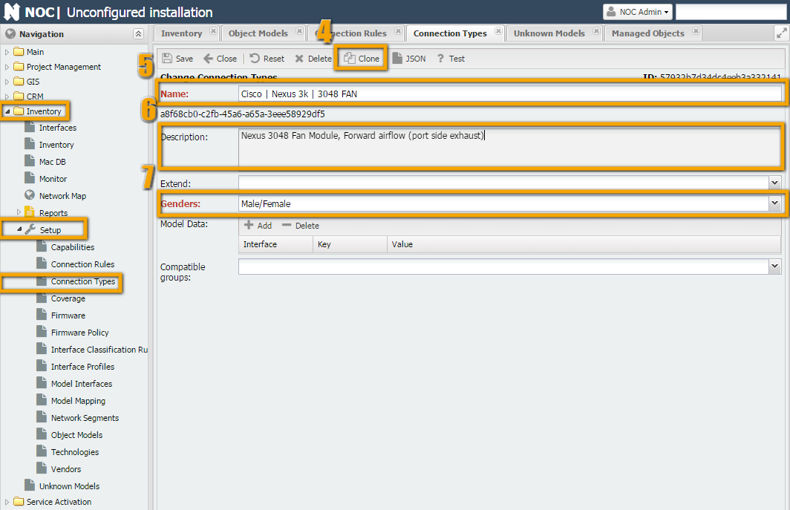

#### Подключение для супервизора

По аналогии создаём тип подключения для супервизора.
Для этого **клонируем** тип подключения для `Nexus 2K`: `Inventory -> Setup -> "Connection Type" -> "Cisco | Nexus 2k | C2232PP SUP"`
и переименуем его в "`Cisco | Nexus 3k | C3048 SUP`".

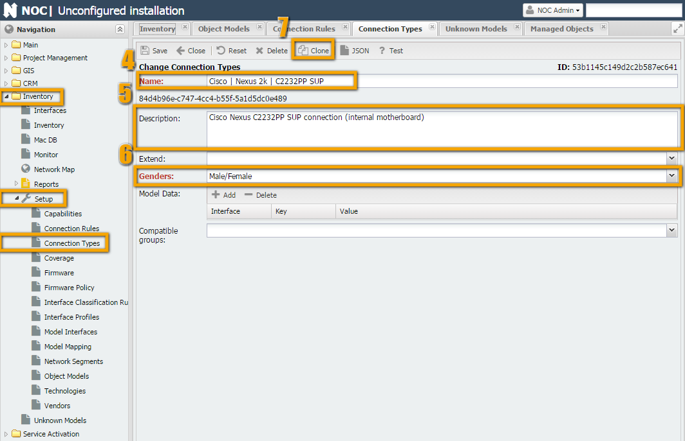
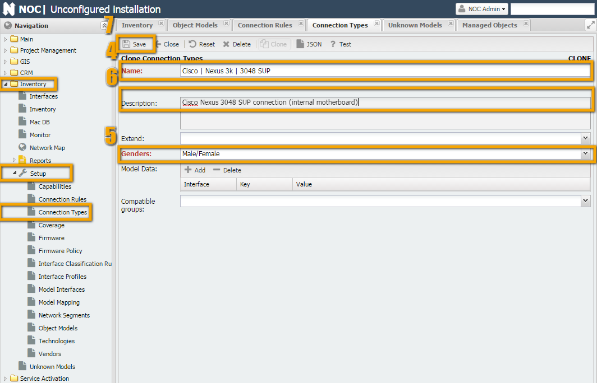

#### Подключение для блока питания

Также по аналогии клонируем тип подключения от Nexus 2k: `Inventory -> Setup -> "Connection Type" -> "Cisco | Nexus 2k | 2200 PSU"`.
И переименуем его в "`Cisco | Nexus 3k | PSU`"


Для возможности подключения Блоков питания от Nexus 2k дополним (`Extend`)
тип подключения "`Cisco | Nexus 2k | 2200 PSU`" типом "`Cisco | Nexus 3k | PSU`" (цифра 5).


### Готовим модели

Как мы выяснили в прошлом разделе, нам необходимо создать 3 модели: 
"`N3K-C3048TP-1GE`", "`N3K-C3048TP-1GE-SUP`", "`N3K-C3048-FAN`".
При этом есть возможность пользоваться аналогами, что и сделаем.

#### N3K-C3048TP-1GE

Заходим в модель `Inventory -> Setup -> "Object Models" -> "Cisco | NEXUS | N2K-C2232PP-10GE"`,
Нажимаем кнопочку Clone (цифра 4) и смотрим - что необходимо поправить.


* **Name** (Имя) (цифра 5), необходимо сменить Part No `N2K-C2232PP-10GE` на `N3K-C3048TP-1GE`
* **Description** (Описание) (цифра 6), необходимо заменить
* **Model Data** (Параметры модели)
    * `asset` (цифра 7) part_no необходимо изменить на `N3K-C3048TP-1GE`
    * `stack` - 3048TP не поддерживает стэкирование, поэтому необходимо удалить или исправить на False
* **Connections** (Соединения) (цифра 7) необходимо поменять типы соединений. `Направления` (Direction) и `разъём` (Gender) не меняеются.

После внесения изменения необходимо сохранить новую модель. Нажимаем кнопку **Save**.
На скиншоте справа от оригинального в модель уже внесены изменения.

!!! attention
    Будьте внимательны при клонировании объектов. Очень часто встречается ситуация,
    когда забывают нажать кнопку **Clone**!
    Перед сохранением нового объекта, который был клонирован - проверьте что кнопка Clone не активна! (серая). Если она активна - изменения вносятся в оригинальный объект! и перед сохранением необходимо нажать кнопку Clone.

#### N3K-C3048-FAN

Заходим в модель `Inventory -> Setup -> "Object Models" -> "Cisco | NEXUS | N2K-C2232-FAN"`,
Нажимаем кнопочку *Clone* (цифра 4) и смотрим - что необходимо поправить.
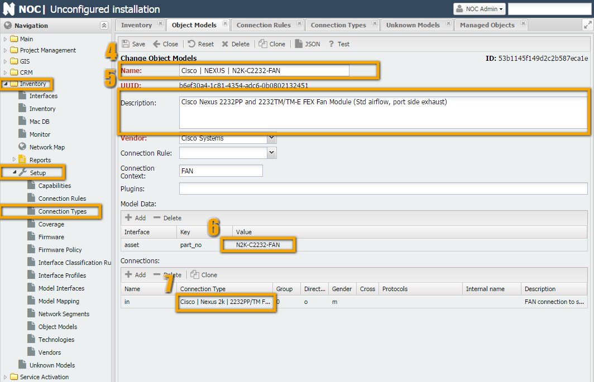
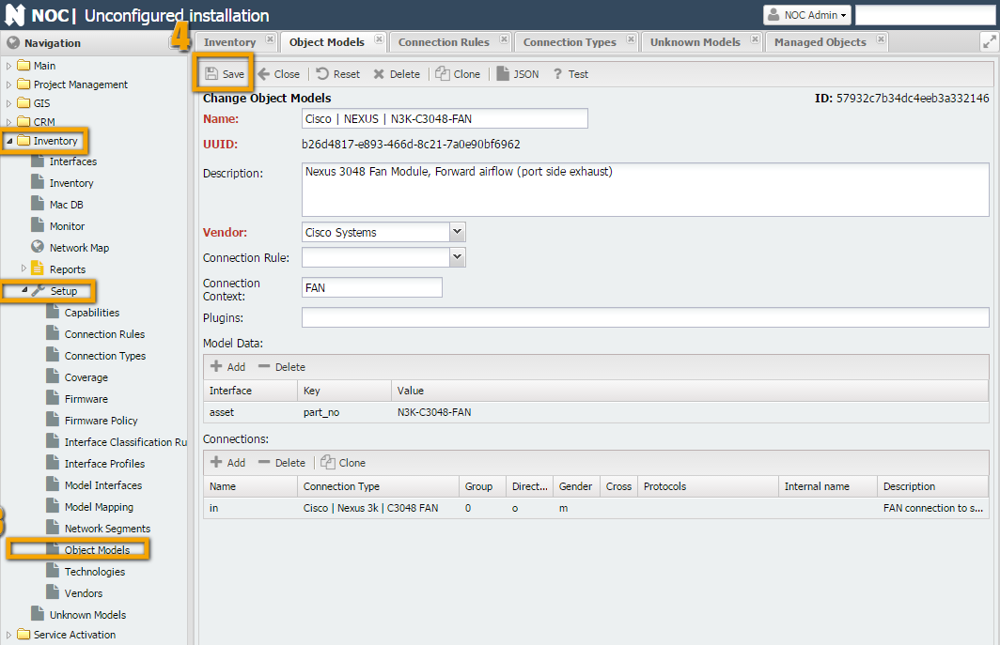

#### N3K-C3048TP-1GE-SUP

Заходим в модель `Inventory -> Setup -> "Object Models" -> "Cisco | NEXUS | N5K-C5596UP-SUP"`,
Нажимаем кнопочку *Clone* (цифра 4) и смотрим - что необходимо поправить.
Кроме обычных полей **Имя** (Name), **Описание** (Description), part_no. Необходимо править большую таблицу с интерфейсами.


В модели `N3K-C3048TP-1GE-SUP` в отличие от `N5K-C5596UP-SUP` 48 Ethernet интерфейсов типа
`RJ-45` + *4 Интерфейса SFP* (вместо 48 SFP дырок на `N5K-C5596UP-SUP`).
Поэтому менять придётся всё. За исключением *имени* и *Gender'a*. Поступаем слудующим образом:

1. Оставляем только интефейс Eth1 - остальный (с Eth1/2 до Eth1/48) удаляем.
2. В строчку интерфейса вносим следующие изменения:
    * ConnectionType меняем на "Electrical | RJ45"
    * Direction меняем на s (Connection)
    * Protocols - вписываем "10BASET,100BASETX,1000BASETX"
    * Description - будем писать полные имена интерфейсов "Ethernet1/48
3. После этого выделяем строчку и жмём кнопочку Clone над списком (цифра 8) 48 раз. Должно получиться 48 интерфейсов плюс 1
4. После выправляем Name (имена) и Description (Описания).
5. Далее выделяем 49 строчку и переделываем её под SFP
    * ConnectionType меняем на "Transceiver | SFP+"
    * Direction меняем на i (Inner)
    * Protocols - вписываем "TransEth1G,TransEth10G"
6. Клонируем строчку 3 раза (делаем интерфейсы с Eth1/50 по Eth1/52)

Результат должен совпасть со скриншотами справа.

### Написание правил

Остался последний пункт в программе готовки модели к использованию. Рекомендую освежить знания в ConnectionRule.

Правила необходимы для стыковки **Направлений** (Direction) `Inner` и `Outer`.
В нашем случае нам необходимо описать соединение связей типа: `psu` (1 и 2), `fan` и `sup`.
Также в супервизор могут подключаться SFP модули (тип `xcvr`).

Когда мы делали модель для шасси, то в ней уже было заполнено поле правила. Поэтому воспользуемся им.


1. Вначале заполняем секцию Context. 
    * Поле **TYPE** должно совпадать с TYPE, который возвращает скрипт get_inventory и в него должно что-то подсоединяться.
    В нашем случае это выполняется для шасси (в него подключаются блоки питания,
    супервизор) и для супервизора (в него подключаются SFP). GEM в Nexus 3K нет.
    * **Область** (Scope), для удобства, делают из TYPE, строчными буквами.
    * **Reset Scopes** - необходимо, чтобы НОК откатывался на уровень назад, при обходе выводы get_inventory. Иначе, он будет всё искать в chassis.
2. Заполняем правила
    * В первом столбце перечисляем все возможные элементы TYPE. (Указываем Что мы будем связывать)
    * **Match connection** Имя (Name) в таблице соединений объекта, который связываем
    * **Scope** (Область) сюда заносим область в которой будет поиск вариантов, т.е. ту, 
      куда будет включаться компонент (н-р БП будет включаться в шасси - для тип CHASSIS область chassis и указываем 
      её здесь, трансиверы будут вставляться в супервизор - SUP, значит пишем в Scope sup)
    * **Target Type** - тип объекта с которым будет происходить соединение. Поле будет совпадать с полем Connection Context в модели
    * **Target connection** - показываем куда мы будем втыкать - будет совпадать с полем Name в таблице соединений

Как мы видим - правило нам подходит. На лишние типы подключений (`GEM`) можно не обращать внимания.
Идём в "`Cisco | NEXUS | N3K-C3048TP-1GE`" и назначаем [Connection Rule](connection-rule.md) (цифра 1).


## Тестирование

Для проверки работоспособности модели в НОК встроена возможность тестирования.
В каждой модели или правиле соединений в верхней панели есть кнопка Test (цифра 5 на скриншоте выше).
При её нажатии НОК скомпонует модель объекта согласно выполненным настройкам. Покажет, возможные варианты.


На скриншоте НОК нам показывает варианты подключений.
В слот блока питания возможно подключить: "`Cisco | NEXUS | N2200-PDC-400W`",
"`Cisco | NEXUS | N2200-PDC-400W-B`", "`Cisco | NEXUS | N2200-PAC-400W`",
"`Cisco | NEXUS | N2200-PAC-400W-B`". Т.е. все блоки питания от Nexus 2K, что и требовалось.
В слот вентилятора подключается только вентиляторный блок для N3K, также со слотом супервизора.

Если взглянуть на ситуацию со стороны супервизора, то можно увидеть, что он подключается к шасси.
Также, в 4 интерфейса возможна установка Трансиверов.


Также доступно тестирование из командной строки
```shell title="Пример вывода скрипта"
/opt/noc$ ./noc verify-model
Cisco | ASR901 | A901-6CZ-FT-D errors:
    TOD: RJ45 must have at least one protocol
    BITS: RJ45 must have at least one protocol
```

## Отвечаем на вопросы

ASR

Cisco ISR (2901)

Модульная железка

 

Команды работы с Inventory оборудования

Таблица Вендор, пул команд, назначение, пример вывода

 
