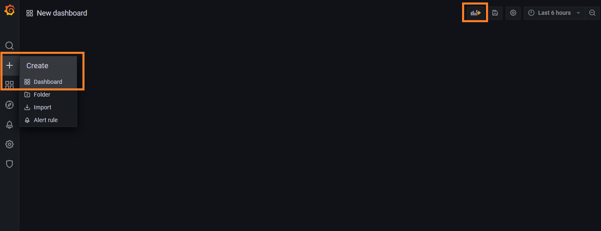
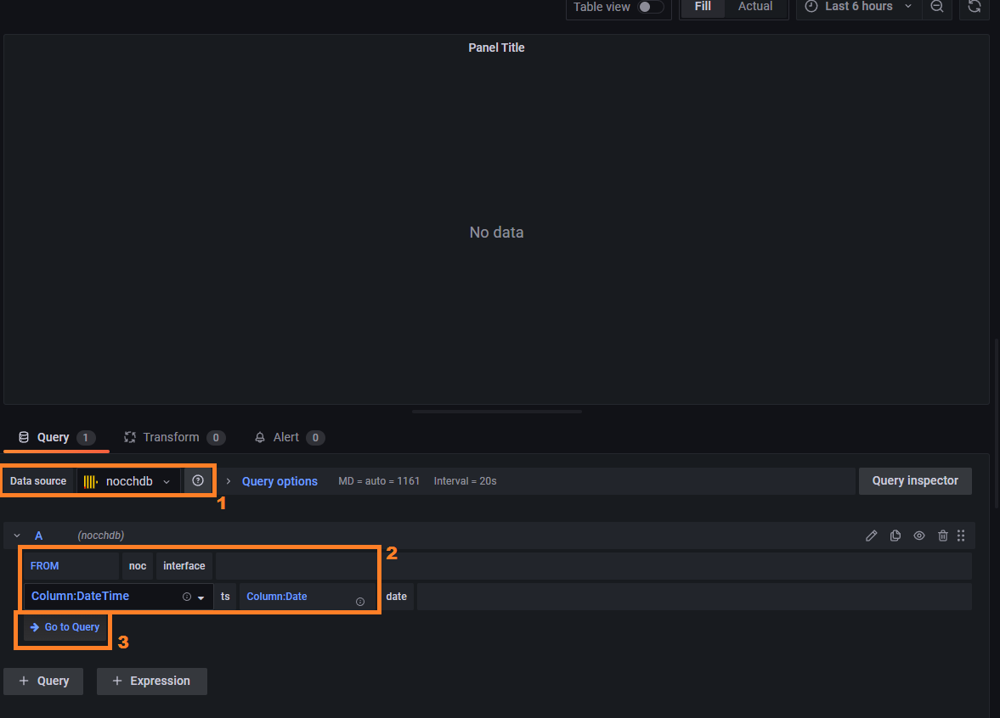
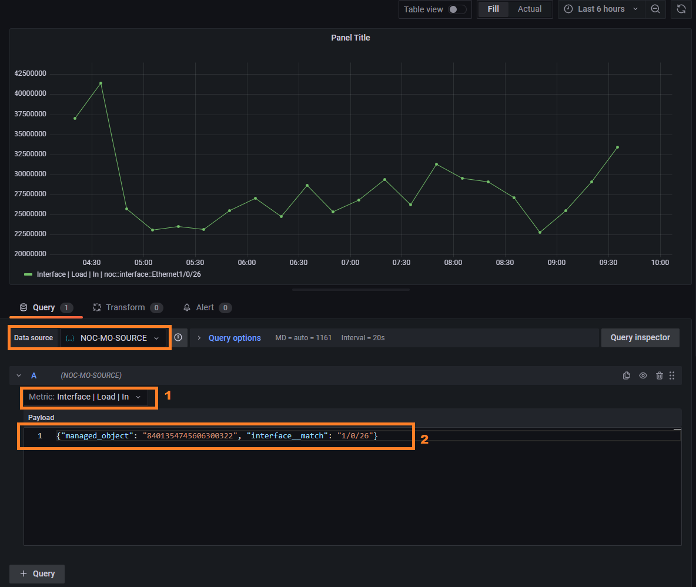
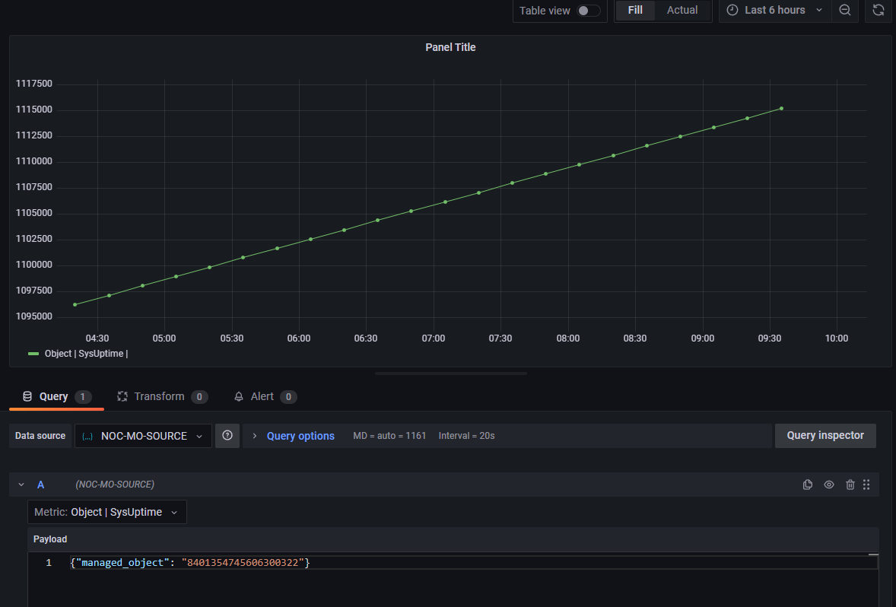
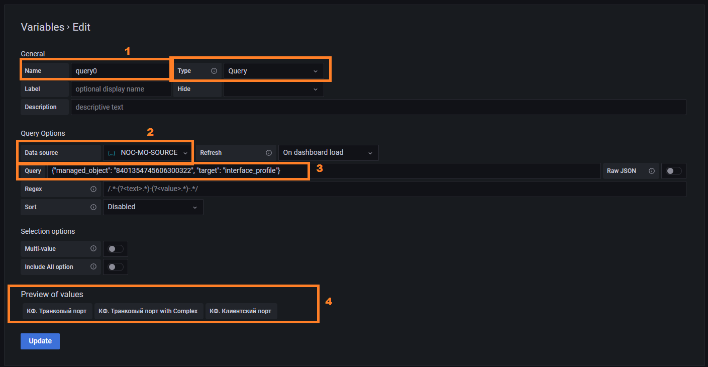
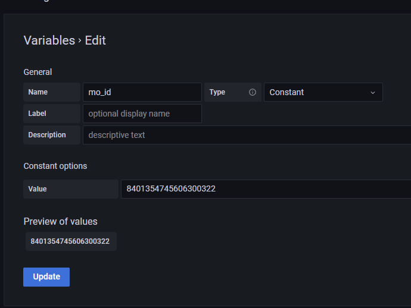
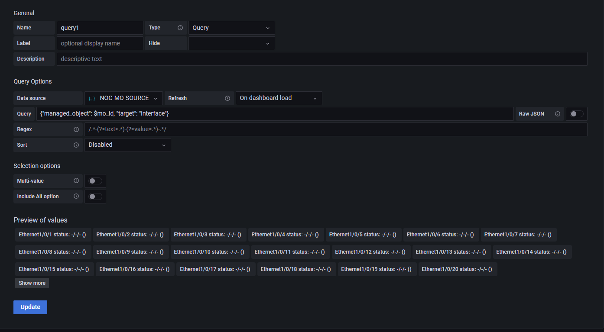

# Custom Static Dashbord with Device Charts

NOC uses [Grafana](https://grafana.com/) to display device dashboards.
All built-in dashboards are generated dynamically basing on the
inventory data. The only supported way to modify them is to
write a [Python](https://www.python.org) code. But NOC also
exposes raw data via Grafana Datasources, which can be used to
create own dashboard.

## Thesises

* Grafana provides functionality to create dashboards.
* NOC offers two datasource types:
  * `Clickhouse`: Allows to build direct queries to the 
    [Clickhouse](https://clickhouse.com/docs/en/intro/) metric database
  * `JSON`: NOC's special API to access data
* The NOC's users are exposed to Grafana, allowing to set up permissions.
* External Grafana can be used to access NOC's data

## Creating Dashboards

There are two ways to access Grafana:

1. Via `Graph` button in Managed Object's form.
2. Via direct link: `https://<noc host>/ui/grafana`



Press `plus` sign on a left panel. By default, this action is available to all users.
The empty dashboard will be open. Then add all necessary charts, variables, and strings.

When adding panel you must select proper datasource.

### Clickhouse Datasource

Performs direct queries into `Clickhouse` and allows to build graphs.
Internally uses [Vertamedia Clickhouse Datasource](https://grafana.com/grafana/plugins/vertamedia-clickhouse-datasource/) plugin.

!!! note

    It is mandatory to keep in mind ClickHouse table structures.
    Refer to the [Metric Types Reference](../metrics-reference/index.md) and
    [Metric Scopes Reference](../metrics-reference/index.md) for details.

When adding the panel:

1. Select datasource `nocchdb`
2. Fill `FROM` parameters:
   
   * Database: `noc`
   * Table: Select [Metric Scope](../metrics-reference/index.md)
   * Timestamp Column: `ts`

3. Press `Go to Query` button.



The simplest way to build a query is to copy it from existing dashboard.
The Managed Object is referred via `bi_id` identifier, which is seen in
the Managed Object's form. It must be placed in query as

``` sql
managed_object = <bi id>
```

The query may also contain plugin variables.

* `$timeSeries` - passes time in the proper format.
* `$timeFilter` - time range condition according graph interval.
* `$table` - table name from the panel's settings.

For example, query by interface may look as:

```sql title="Interface load query"
SELECT $timeSeries as t, argMax(load_in, t) as Input, argMax(load_out, t) as Output
FROM $table 
WHERE managed_object = $bi_id and interface='Eth 1/0/1' and subinterface == '' and queue = '' and traffic_class = '' and $timeFilter 
GROUP BY t ORDER BY t
```

Uptime data query:

```sql title="Uptime query"
SELECT $timeSeries as t, avg(sys_uptime) as `Uptime` 
FROM $table 
WHERE managed_object=$bi_id and $timeFilter 
GROUP BY t ORDER BY t
```

!!! note

    Refer to the [Metric Types Reference](../metrics-reference/index.md) and
    [Metric Scopes Reference](../metrics-reference/index.md) for the available
    tables and their structure.

### JSON Datasource

Uses [simpod-json](https://grafana.com/grafana/plugins/simpod-json-datasource/) plugin.
Data set is restricted by [GrafanaDS](../services-reference/grafanads.md) service,
but can be extended via custom targets.



When adding the panel:

1. Select datasource: `NOC-MO-SOURCE`
2. Select metric from drop-down list. Only one metric per query may be selected.
3. Fill query coditions, which will be passed to `WHERE` clause.

    !!! warning

        All values always must be enclosed in quotes

    !!! warning

        JSON format strips values over 32-bits

4. Fill `target` field which defines available conditions. Following targets are available:


| Target              | Query     | Variables | Description                                                          | Conditions                                                                                                                                     |
| ------------------- | --------- | --------- | -------------------------------------------------------------------- | ---------------------------------------------------------------------------------------------------------------------------------------------- |
| `labels`            | {{ no }}  | {{ yes }} | Available [Labels](../concepts/label/index.md)                       | -                                                                                                                                              |
| `managed_object`    | {{ yes }} | {{ yes }} | Queery by [ManagedObject](../concepts/managed-object/index.md)       | `labels`</br> `administrative_domain`                                                                                                          |
| `interface_profile` | {{ no }}  | {{ yes }} | Query by [Interface Profile](../concepts/interface-profile/index.md) | `managed_object` - Managed Object's Id                                                                                                         |
| `interface`         | {{ yes }} | {{ yes }} | Query interface names                                                | `managed_object` - Managed Object's Id</br>`name` - interface name (regular expression)</br>`interface_profile` - interface profile identifier |

Interface load query:

```json
{"managed_object": "8401354745606300322", "interface__match": "1/0/26"}
```



Uptime query:

```json
{"managed_object": "8401354745606300322"}
```

## Variables

The variables can be used to parametrise a dashboard. They can be added via `Variables`
menu and are available via dashboard settings (the cog icon to the right of the plus button)



1. Fill name field to define the variable name. `Query` type allows to query datasources.
2. Choosee `NOC-MO-SOURCE`
3. Add query. I.e. to add interface profiles:
  `{"managed_object": "8401354745606300322", "target": "interface_profile"}`
4. Look for result. In case of error the result will be empty.

Other variable names may be used in query. For example, lets add `mo_id` variable:



And then refer to in from other variable to query interfaces.
Reference are passed via dollar sign before the name:


