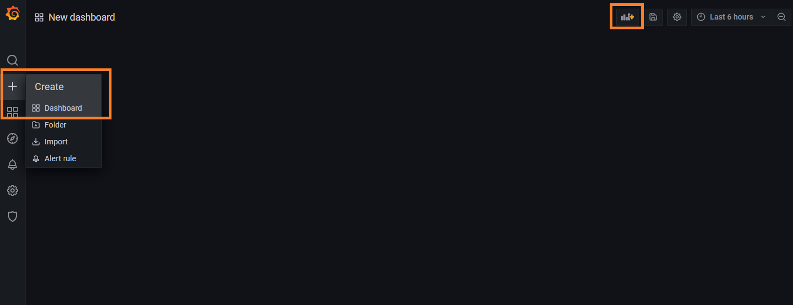
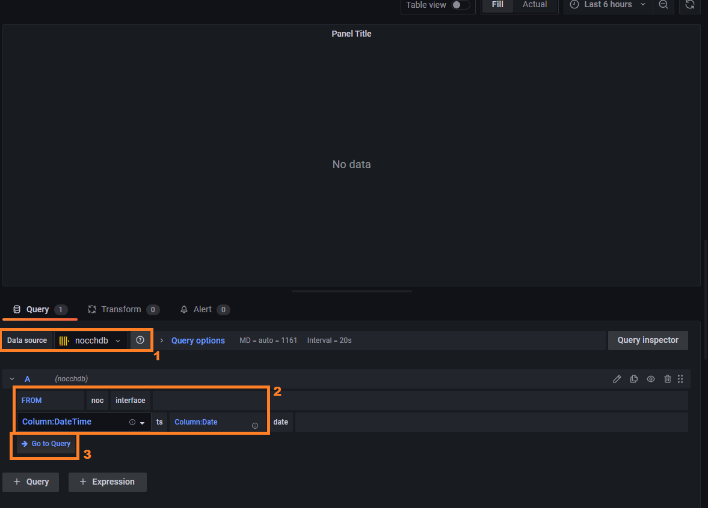
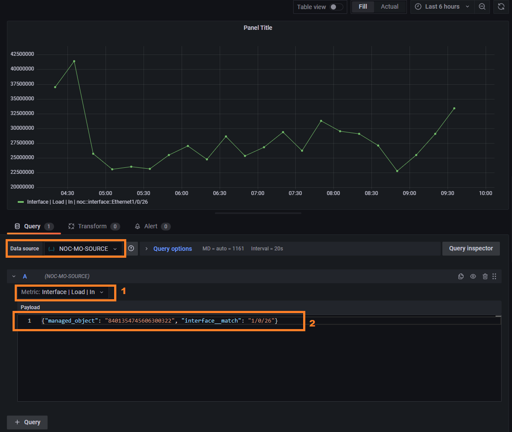
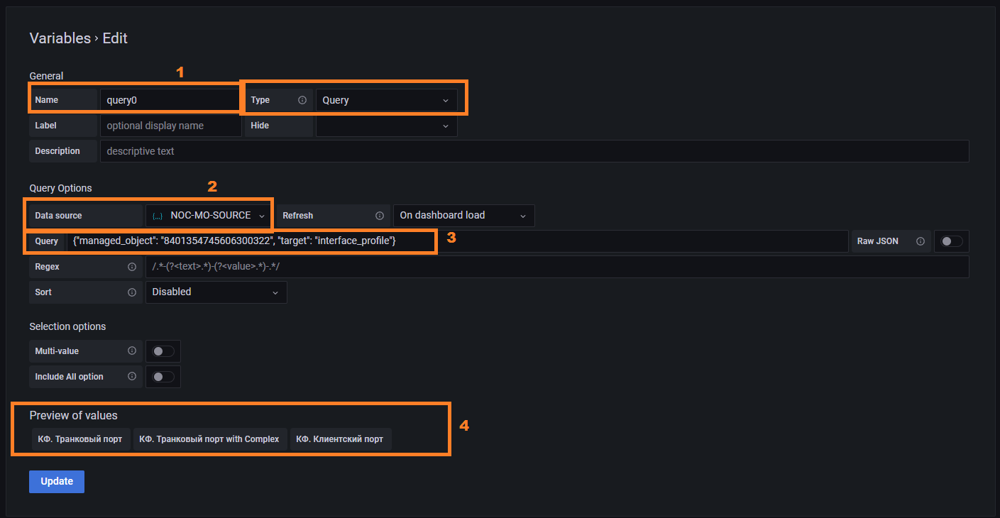
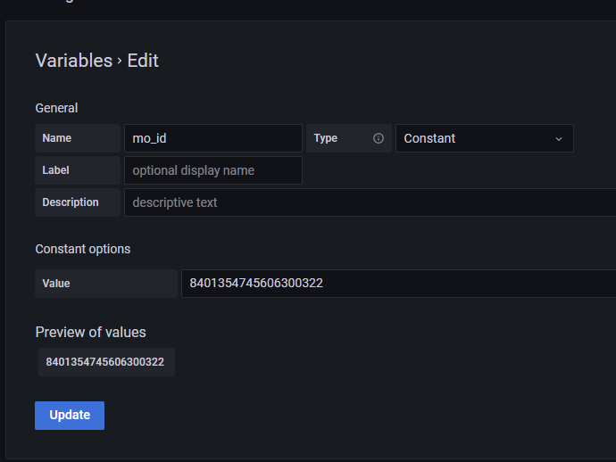
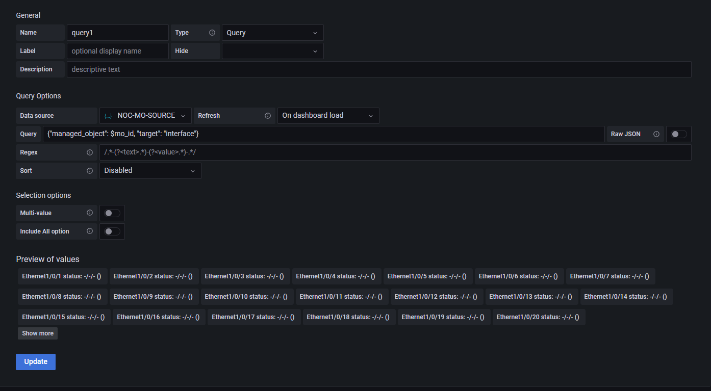

# Собственный статичный дашборд с графиками устройства в НОКе

Для отображения различных графиков оборудования НОК использует возможности [Grafana](https://grafana.com).
При этом все встроенные в систему дашборды формируются динамически и доступны изменения только 
через дописывание кода на [Python](https://www.python.org). При этом, доступны датасурсы
 (`Grafana Datasource`) с использованием которых можно построить собственный дашборд.

## Возможности

Для использования доступны 2 Датасурса (`Datasource`):

* Функционал графаны для создания дашборда
* Для работы доступны 2 источника (`Datasource`):
  * `Clickhouse` - позволяет делать запросы напрямую в метрическую БД - [Clickhouse](https://clickhouse.com/docs/en/intro/). 
  * `JSON` - позволяет запрашивать данные через специальный `API`
* Пользователи НОКа создаются в графане, что позволяет раздавать права (на дашборды)
* Возможность доступа к данным из внешней графаны

## Создание дашборда

Зайти в графану можно двумя путями:

1. По кнопке **Графики** (`Graph`) в форме `Managed Object`
2. По ссылке `https://<noc_host>/ui/grafana/`

Слева нажать на значок **плюс** на *левой панели*, по умолчанию это доступно любому пользователю.
Откроется пустой дашборд. Далее необходимо добавить панели с графиками, переменные и строки.



При добавлении панели необходимо выбрать с каким из датасурсов будет проходить работа

### Clickhouse Datasource

Позволяет выполнять запросы в `Clickhouse` и на их основе строить графики. 
Используется плагин [Vertamedia Clickhouse Datasource](https://grafana.com/grafana/plugins/vertamedia-clickhouse-datasource/).

!!! info
    Для использования необходимо иметь представление о структуре таблиц с метриками.

1. При добавлении панели необходимо выбрать `Datasource` - **nocchdb**
2. Далее заполнить параметры `FROM` запроса:
   * база данных - `noc`
   * таблица - соответствует [Metric Scope](../metrics-reference/index.md)
   * Колонка с `timestamp` - `ts`
3. После станет доступна кнопка перехода к запросу - `Go to Query`



Самый простой способ построить запрос - скопировать из уже построенных дашбордов.
Устройство (`Managed Object`) выбирается по идентификатору `BI ID`, его можно увидеть в форме 
и он подставляется в условие (`WHERE`) как `managed_object = BIID`. Также в запрос необходимо включить переменные плагина:

* `$timeSeries` - передаёт время в корректном формате
* `$timeFilter` - условие по времени, подставляется из выбранного в графане интервала
* `$table` - название таблицы из настроек панели

Например, запрос графика по интерфейсу будет выглядеть как

```sql title="Запрос загрузки интерфейса из таблицы interface"

SELECT $timeSeries as t, argMax(load_in, t) as Input, argMax(load_out, t) as Output
FROM $table 
WHERE managed_object = $bi_id and interface='Eth 1/0/1' and subinterface == '' and queue = '' and traffic_class = '' and $timeFilter 
GROUP BY t ORDER BY t
```

Запрос данных по `Uptime`

```sql title="Запрос Uptime оборудования из таблицы object"

SELECT $timeSeries as t, avg(sys_uptime) as `Uptime` 
FROM $table 
WHERE managed_object=$bi_id and $timeFilter 
GROUP BY t ORDER BY t
```

!!! hints
    Информация о доступных таблицах и их структуре можно найти в разделе [MetricScope](../metrics-reference/index.md)

### JSON Datasource

Используется плагин [simpod-json](https://grafana.com/grafana/plugins/simpod-json-datasource/) 
и сервис [GrafanaDS](../services-reference/grafanads.md). 
Набор данных ограничен доступными через `API` сервиса [GrafanaDS](../services-reference/grafanads.md), 
но может быть расширен путём добавления новых `target` через [custom](../custom/index.md).

1. При добавлении панели необходимо выбрать `Datasource` - **NOC-MO-SOURCE**
2. В выпадающем списке выбираем интересующую метрику (*доступна одна метрика на запрос*)
3. Заполняем поле запроса, указанные в нём условия попадут в условия (`WHERE`) запроса.



!!! attention
    Значения необходимо всегда заключать в кавычки. JSON обрезает числа больше 32 бит.

Обязательное поле - `target`, через него задаётся набор доступных условий. 
Доступны следующие `target`:

| Target            | Запрос | Переменные | Описание                                                                               | Условия                                                                                                                                                             |
| ----------------- | ------ | ---------- | -------------------------------------------------------------------------------------- | ------------------------------------------------------------------------------------------------------------------------------------------------------------------- |
| labels            | x      | v          | Доступные метки [Label](../concepts/label/index.md)                                    | -                                                                                                                                                                   |
| managed_object    | v      | v          | Запрос устройства [ManagedObject](../concepts/managed-object/index.md)                 | * `labels` - набор меток </br> `administrative_domain` - З.О.                                                                                                       |
| interface_profile | x      | v          | Запрос профилей интерфейсов [InterfaceProfile](../concepts/interface-profile/index.md) | * `managed_object` - идентификатор устройства                                                                                                                       |
| interface         | v      | v          | Запрос имён интерфейсов                                                                | * `managed_object` - идентификатор устройства </br> * `name` - имя интерфейса (регулярное выражение) </br> * `interface_profile` - идентификатор профиля интерфейса |

Запрос графика по загрузке интерфейса на устройстве:

```json
{"managed_object": "8401354745606300322", "interface__match": "1/0/26"}
```

Запрос графика по `Uptime`

```json
{"managed_object": "8401354745606300322"}
```


## Добавление переменных

Через задание переменных можно шаблонизировать дашборд. Добавление происходит в меню `Variables`, 
оно доступно через настройки дашборда (шестерёнка справа от кнопки добавления панели). 



1. Заполнить поле с именем переменой, по нему она будет доступна для обращения. 
   Тип `Query` позволит обращаться с запросом к `datasource`
2. Выбираем **NOC-MO-SOURCE**
3. Вписываем запрос, например запросить профили интерфейсов для устройства 
    `{"managed_object": "8401354745606300322", "target": "interface_profile"}`
4. Видимо результат. Если произошла ошибка, то результат окажется пустым

В запросе можно использовать значения других переменных, например добавим переменную `mo_id`



И сошлёмся на неё в другой переменной, для запроса интерфейсов. Сылки идут через значок доллара перед именем


