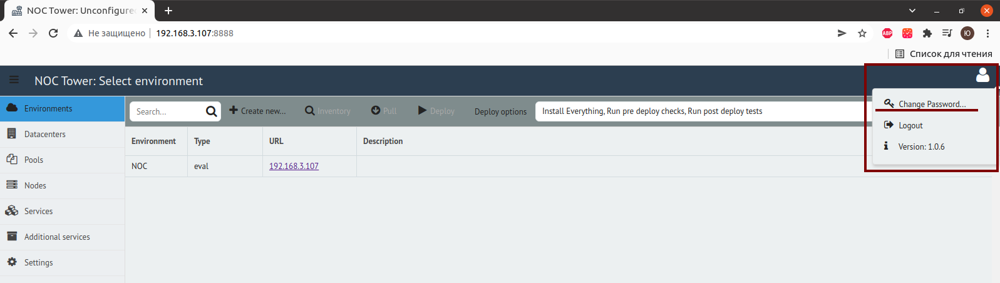
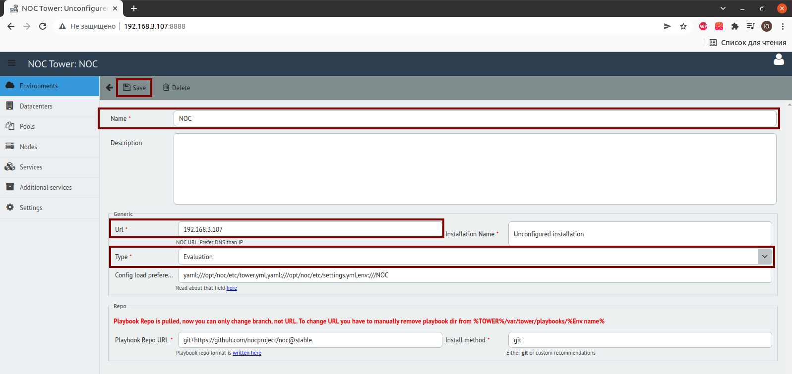
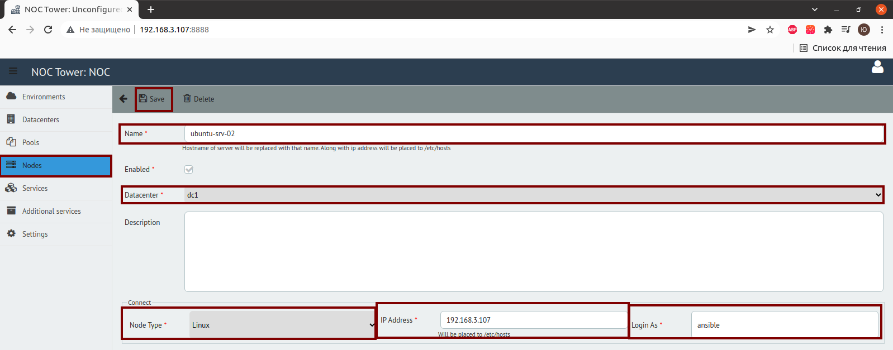
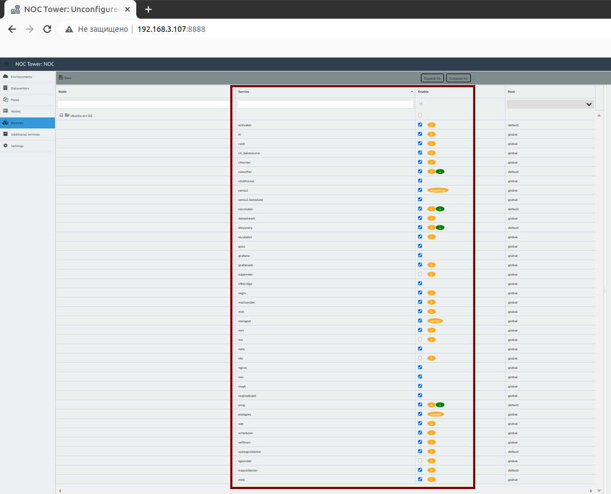
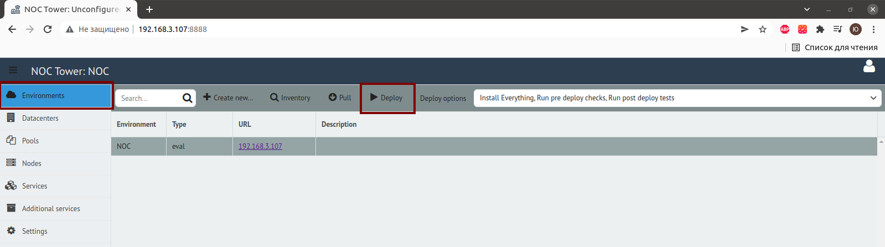

# NOC Deploy Howto

## Change Administrator's Password

Click `Change Password ...` in the top-right corner.

## Create Environment

* Select `Environmens` > `Create New`
* Fill fields:
   
    * `Url`: Place DNS name for NOC. Use IP-address of the server if DNS name is absent.
    * `Type`: Select either `Evaluation` or `Production`.
  
* Press `Save` button.

## Create Datacenter

* Select `Datacenters` > `Create New`
* Fill fields:
   
    * `Name`: Unique datacenter name (`dc1` for example)
  
* Press `Save`

## Download Fresh Playbooks

Download fresh installation scenarios:

* Select `Environments` > `Pull`.
* Wait for `Pull complete` message.

## Add Nodes

* Select `Nodes` > `Create New`
* Fill fields:

    * `Name`: Server hostname (i.e. `centos-7-02`).
    * `Datacenter`: Select datacenter. Refer to [Create Datacenter](#create-datacenter) stage.
    * `Node Type`: Select

        * `Linux`: for Linux-based systems.
        * `FreeBSD`: for FreeBSD

    * `IP Address`: Primary IP address of the server.
    * `Login As`: User name, select `ansible`

* Press `Save`.

## Select Services

### Single-node Installation

* Check following services:

    * [activator](../services-reference/activator.md)
    * [bi](../services-reference/bi.md)
    * [card](../services-reference/card.md)
    * [ch_datasource](../services-reference/datasource.md)
    * [chwriter](../services-reference/chwriter.md)
    * [classifier](../services-reference/classifier.md)
    * clickhouse
    * consul
    * consul-template
    * [correlator](../services-reference/correlator.md)
    * [datastream](../services-reference/datastream.md)
    * [discovery](../services-reference/discovery.md)
    * [escalator](../services-reference/escalator.md)
    * goss
    * grafana
    * [grafanads](../services-reference/grafanads.md)
    * liftbridge
    * [login](../services-reference/login.md)
    * [mailsender](../services-reference/mailsender.md)
    * [mib](../services-reference/mib.md)
    * mongod
    * [mrt](../services-reference/mrt.md)
    * nats
    * nginx
    * noc
    * [ping](../services-reference/ping.md)
    * postgres
    * [sae](../services-reference/sae.md)
    * [scheduler](../services-reference/scheduler.md)
    * [selfmon](../services-reference/selfmon.md)
    * [syslogcollector](../services-reference/syslogcollector.md)
    * [trapcollector](../services-reference/trapcollector.md)
    * [web](../services-reference/web.md)

* Preess `Save`

### Multi-node Installation

!!! todo

	Describe

## Deploy

* Select `Environments` tab.
* Press `Deploy` button.
* Wait for deploy to finish.
