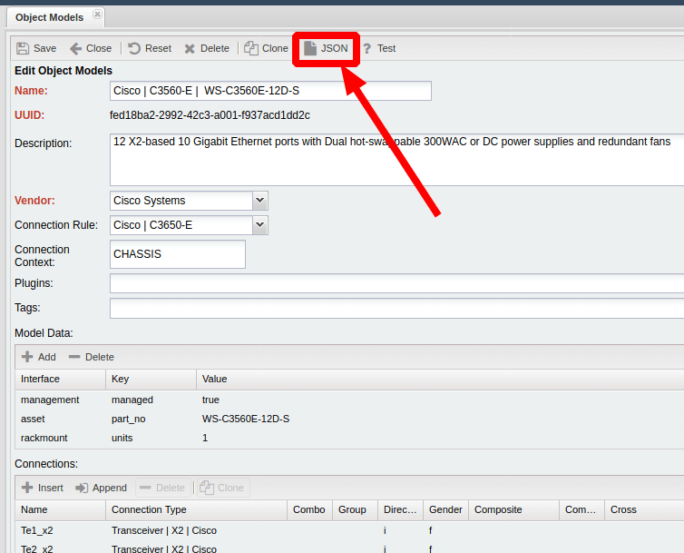
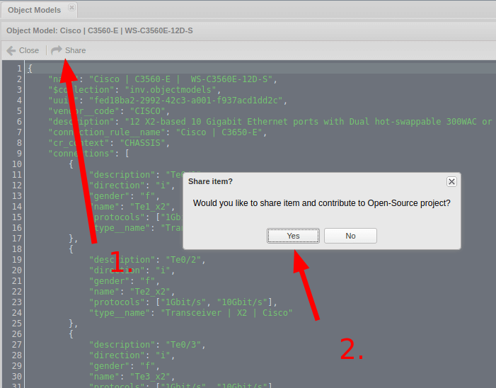
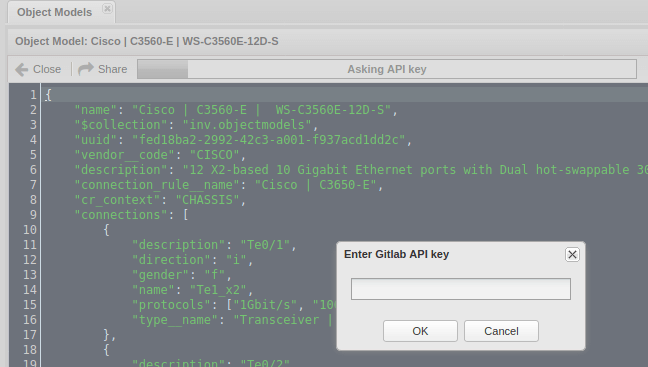
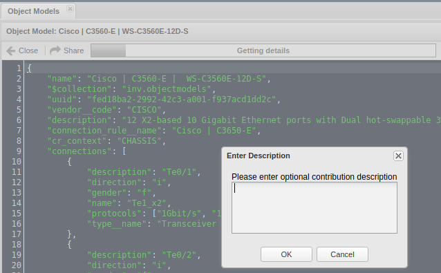
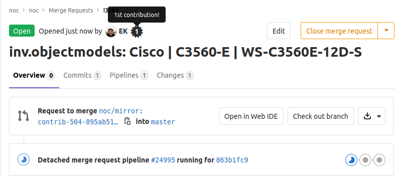

# How to Share Collections from NOC Web Interface

NOC is the open-source product, so every contribution is valuable for us.
Collections is an important part of NOC, so we provide an easy way
to share your collection models with the community.

Consider you have got a self-made collection, for example a new model of switch or connection rule or etc.
Follow the steps:

1. Register at our [Gitlab](https://code.getnoc.com/)
2. Create a [Personal Access Token](https://code.getnoc.com/profile/personal_access_tokens>) with `api` scope checked.
   Remember it!
3. Open a model, that you want to share in NOC web interface, for example:
   
4. Use the Force, Luke, and fill up all the forms.
   
   
   
5. Then NOC will send file (your browser should have access to the Internet) to the repository and opens a Merge Request.
   Some browsers will prevent open a new popup, so check this moment.
   
6. Congratulations with your contribution and thank you.

## Changing or Restoring API Token
In case if you forgot your token or you want to change it:

```
$ ./noc shell
from noc.core.mongo.connection import connect
connect()
from noc.main.models.apitoken import APIToken
from noc.aaa.models.user import User
user = User.objects.get(username="YOUR_NOC_LOGIN")
token = APIToken.objects.filter(type="noc-gitlab-api", user=user.id).first()
token.token = "NEW_TOKEN"
token.save()
```