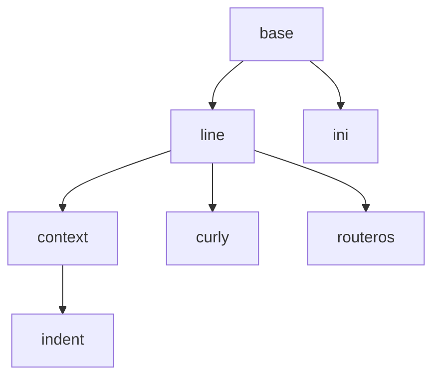

# Config Tokenizer

`Tokenizing` is the process of transforming input device configuration
to a stream of the `tokens`. Tokenizer accepts raw config and yields
lines of parsed `tokens`. For example, raw config:

```
  interface Fa0/1
    description Some interface
    ip address 10.0.0.1 255.255.255.0
```

converted into:

```
  ["interface", "Fa0/1"]
  ["interface", "Fa0/1", "description", "Some", "interface"]
  ["interface", "Fa0/1", "ip", "address", "10.0.0.1", "255.255.255.0"]
```

Tokenizer must fulfill the following requirements:

* Knows nothing about the meaning of config
* Low memory usage. Output tokens must be yielded whenever ready
* Backward references should be avoided. Tokenizer should operate on the current window
  just like tape. Forward and backward rewinds must be avoided.
* Output tokens should be grouped and analyzed easy
* Original context should be preserved whenever possible. See at expanding `interface Fa0/1` in the following lines
* Each line of tokens should be further processed independently of each other

It may seem that you need a separate tokenizer for each platform. Luckily you are not.
Though various configuration formats have different meaning, almost all
of them maintains some `code style`. Like some languages are indent-based (Python)
and some are curly-bracket-based (C, PHP), and some even all-parenthesis (LISP),
there are well distinguishable groups of syntaxes. So the real device configurations
are grouped in large syntax families with very few exceptions. Usually, you can
choose one of the existing tokenizers and apply some configuration rather than
create your own tokenizer for a new platform from zero ground.

## Tokenizers

Builtin tokenizers are collected in the `noc.core.confdb.tokenizer` package.
Tokenizer classes form an hierarchy:




#### line

**line**(eol="\n", tab_width=0, line_comment=None, inline_comment=None, keep_indent=False, string_quote=None, rewrite=None)

    Basic tokenizer, converting line of config into the line of tokens,
    separating by spaces and
    grouping strings together into single tokens and removing comments.
    Line tokenizer is suitable when each line of configuration is
    completely self-sufficient and does not depend on previous or
    following lines.
    Though usable by itself, usually used as base class for more
    advanced tokenizers.

    :param eol: End-of-line separator.
    :param tab_width: When non-zero replace tabs with `tab_width` spaces
    :param line_comment: When non-empty sets the sequence which
        starts whole-line comments. I.e. line containing starting spaces
        followed with `line_comment` are completely removed from output.
        (Like `!` in Cisco IOS comments)
    :param inline_comment: When non-empty sets the sequence which
        starts inline comments. Unlike the `line_comments` which cover
        whole line, `inline_comment` yields non-empty parts of
        lines before `inline_comments`
        (Like `#` in Python or `//` in C).
    :param keep_indent: When False removes leading spaces. When True retains
        leading spaces as single token containing only spaces.
    :param string_quote: When non-empty group tokens together when
        enclosed in `string_quote`. (Like `"` in Python).
    :param rewrite: List of tuples of (compiled regular expression, replacement)
        to fix input formatting glitches.


#### context

**context**(end_of_context=None, contexts=None, **kwargs)

    Descendant of :ref:`line<dev-confdb-tokenizer-line>` tokenizer.
    Adds extra ability to determine and stack current
    contexts from previous lines and apply current
    context to each output line of tokens automatically.

    Accepts all parameters of :ref:`line<dev-confdb-tokenizer-line>`
    with extra new parameters:

    :param end_of_context: When non-empty sets explicit context
        termination sequence (Like `}` or `end`). When explicit context
        termination token found at the start of the line, current context
        closed and removed from stack of context and previous context
        became current
    :param contexts: When non-empty sets a list of explicit start
        of context matching strings. When found from the start of the
        line the new context is automatically created and pushed to
        the top of the stack


#### indent

**indent**(end_of_context=None, **kwargs)

    Descendant of :ref:`context<dev-confdb-tokenizer-context>`. Context
    are detected by start of line indents, like the Python programming
    language and the :ref:`IOS-like<profile-Cisco.IOS>` configs.

    Accepts all parameters of :ref:`line<dev-confdb-tokenizer-context>`
    but forcefully sets `keep_indent` parameter.


#### curly

**curly**(start_of_context="{", end_of_context="}", explicit_eol=None, **kwargs)

    Descendant of :ref:`line<dev-confdb-tokenizer-line>` tokenizer.
    Adds extra ability to determine and stack current
    contexts from previous lines and apply current
    context to each output line of tokens automatically.
    Context are starting with `start_of_context` sequence
    and closed by `end_of_context` sequence.
    Unlike :ref:`context<dev-confdb-tokenizer-indent>` tokenizer
    context starts and ends are always explicit. Name `curly`
    hints to C-style programming languages with their curly braces `{}`
    which is good choice for :ref:`JUNOS-line<profile-Juniper.JUNOS>` configs.

    :param start_of_context: Explicit start of context sequence (Like `{`)
    :param end_of_context: Explicit end of context sequence (Like `}`)


#### ini

**ini**()

    Basic tokenizer capable of parsing Microsoft Windows INI files.
    See Python's `ConfigParser <https://docs.python.org/2.7/library/configparser.html>`_
    module for details

#### routeros

**routeros**()

    Descendant of :ref:`line<dev-confdb-tokenizer-line>` tokenizer
    adapted to handle :ref:`MikroTik RouterOS<profile-MikroTik.RouterOS>`
    config


#### Profile Integration

<!-- prettier-ignore -->
!!! todo

    Refer to Profile API

Following profile parameters are responsible for tokenizer configuration:

**config_tokenizer**

    String containing name of config tokenizer to use. Refer to
    :ref:`Tokenizers<dev-confdb-tokenizers>` section for possible values
    and for recommendations.

**config_tokenizer_settings**

    Optional dict, containing config tokenizer settings.
    Refer to
    :ref:`Tokenizers<dev-confdb-tokenizers>` section for possible
    values explanation.

**get_config_tokenizer**(cls, object):

    Classmethod returning actual config tokenizer name and its
    settings for selected managed object. Returns
    (`config_tokenizer`, `config_tokenizer_settings`) by default.
    Should be overriden in profile if tokenizer or settings
    depends on platform or software version.

    :param object: ManagedObject reference
    :returns: tuple of (config tokenizer name, config tokenizer settings).
        Must return (None, None) if platform is not supported.


#### Custom Tokenizer API

Custom tokenizers must be inherited from `noc.core.confdb.tokenizer.base.BaseTokenizer` class
or any of its descendancies. First you must define tokenizer name


```
 name
    Unique name of tokenizer.
```

Example::

    class MyTokenizer(BaseTokenizer):
        name = "mytokenizer"

Tokenizer configuration passed as parameters to class constructor.


**__init__**(self, data, param1=default1, .., paramN=defaultN)
```
    :param data: String containing device configuration
    :param param1: Custom configuration parameter #1 with default value
    :param paramN: Custom configuration parameter #N with default value
```

It is advised to call superclass' constructor::

    class MyTokenizer(BaseTokenizer):
        ...
        def __init__(self, data, param1=default1, ...):
            super(MyTokenizer, self).__init__(data)


The actual tokenizer must be implemented in `__iter__` method

**__iter__**(self):
```
    Iterator yielding tuples of tokens per each line. Tokenizer
    should analyze `self.data` variable and call `yield` operator
    per each matched line of tokens
```
