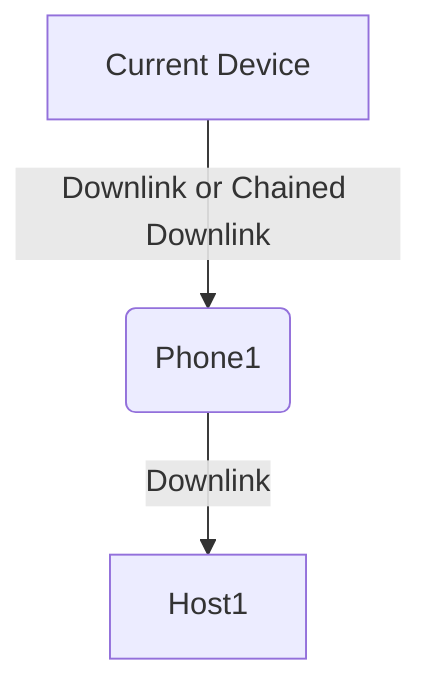

# xMAC

**Extend MAC (xMAC)** is a method designed for a class of devices that do not inherently support topological protocols. Several observations can be made about these devices:

- All we can know about these devices is their MAC address.
- These devices do not support the subsequent connection of other devices to themselves (in essence, they have only one port).
- They are directly connected to a switch port.

These devices include client Customer Premises Equipment (CPE), video cameras, computers, and IP phones. This method is specifically designed for them because it **does not require confirmation of the link from the other side**. To use this method, follow these steps:

1. Create two interface profiles (`Interface Profile`):
   - `CPE. Downlink`: In this profile, set the `MAC Discovery Policy` to `Direct Downlink`.
   - `CPE. Uplink`: In this profile, set the `MAC Discovery Policy` to `Direct Uplink`.
2. Assign interfaces of switches to which `CPE` devices are connected to the `CPE. Downlink` profile. Assign interfaces of `CPE` devices that face the switch to the `CPE. Uplink` profile.
3. Enable the `xMAC` protocol and MAC address polling in the switch's object profile (`Object Profile`).
4. During polling, if a MAC address of a device is detected on a port with the `CPE. Downlink` profile, the linking procedure is initiated. The interface to which the link is connected from below is determined by the `CPE. Uplink` interface profile.

**Warning**: If a CPE has two interfaces marked with the "Direct Uplink" profile, the link will not be established because the system won't be able to determine which interface to connect to.

In the `MAC Discovery Policy`, there is also a setting called `Chained Downlink`. It is used in cases where two devices are connected in a chain: `Switch -> IP Phone -> Computer`. The settings for this scenario are similar to the previous one, but for the device in the middle, the port facing the end device should be assigned the "Interface Profile" with the `Chained Downlink` setting. If we detect `2 MAC` addresses during polling, we establish the chain accordingly.

## Requirements

* [get_chassis_id](../../scripts-reference/get_chassis_id.md) script for both neighboring and current devices
* xMAC polling enabled in the [Managed Object Profile](../../concepts/managed-object-profile/index.md#Box(Полный_опрос)) settings
* xMAC method configured in the *Topology Building Methods* of the [Segment Profile](../../concepts/network-segment-profile/index.md)
* Configuration of the `MAC Discovery Policy` in the `Interface Profile`
