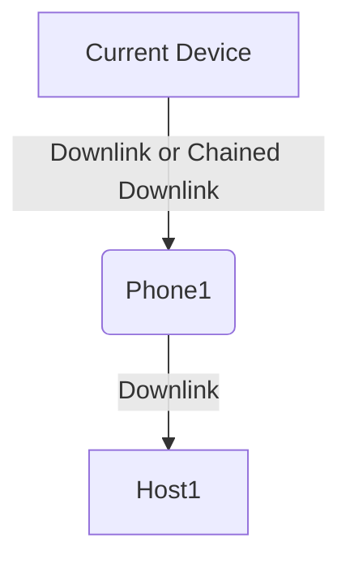

# xMAC

`Extend MAC`  Есть класс устройств по умолчанию не поддерживающий топологические протоколы, но о них можно сделать несколько утверждений:

* Всё что мы можем знать об этих устройствах это `MAC` адрес
* Устройства не поддерживают последующее подключение к себе иных устройств (условно, обладают одним портом)
* Подключаются непосредственно к порту коммутатора

К таким устройствам относят: Клиентские CPE, Видеокамеры, Компьютеры, IP телефоны. Именно для них предназначен данный метод, т.к. он не **требует подтверждения линка с другой стороны** Для него требуется:

Работает следующим образом. Мы создаём 2 профиля интерфейсов (`Interface Profile`):

* `CPE. Downlink` - в нём настройку `Политика сбора MAC адресов` [MAC Discovery Policy](../../concepts/interface-profile/index.md) выставляем в `Direct Downlink`
* `CPE. Uplink` - в нём настройку `Политика сбора MAC адресов` [MAC Discovery Policy](../../concepts/interface-profile/index.md) выставляем в `Direct Uplink`

Дальше профилем `CPE. Downlink` размечаем интерфейсы коммутаторов к которым подключены `CPE`, 
а `CPE. Uplink` интерфейсы `CPE`, которые смотрят в сторону коммутатора. 
Далее включаем в `Профиле объектов` (`Object Profile`) коммутатора протокол `xMAC` и опрос `MAC адресов`. 
Если во время опроса за портом с `CPE. Downlink` обнаружится MAC адрес устройства, то запустится процедура соединения (`Linking`). 
Интерфейс к которому подключаться снизу будет определён по профилю интерфейса `CPE. Uplink`.

<!-- prettier-ignore -->
!!! Warning
    Если на CPE обнаружится 2 интерфейса покрашенных профилем с выставленным `Direct Uplink`, то линк не построится, т.к. система не сможет определить к какому из интерфейсов подключаться!

Также в `Политика сбора MAC адресов` (`MAC Disovery Policy`) присутствует настройка `Chained Downlink`, 
используется для случая когда 2 устройства подключены по цепочке: `Коммутатора -> IP Телефон -> Компьютер`. 
Настройки делаются аналогично предыдущему пункту, но для устройства посередине порт в сторону конечной железки красится `профилем интерфейса` (`Interface Profile`) с 
настройкой `Chained Downlink`. Если мы видим при опросе `2 MAC` адреса, то выстраиваем цепочку.

## Требования

* Скрипт [get_chassis_id](../../scripts-reference/get_chassis_id.md) для соседнего и [get_chassis_id](../../scripts-reference/get_chassis_id.md) для текущего
* Опрос xMAC включён в профиле объектов [Managed Object Profile](../../concepts/managed-object-profile/index.md#Box(Полный_опрос))
* Метод xMAC в *Методах построения топологии* [Segment Profile](../../concepts/network-segment-profile/index.md)
* Настройки  `Политика сбора MAC адресов` (`MAC Disovery Policy`) в `Профиле Интерфейса` (`Interface Profile`)
