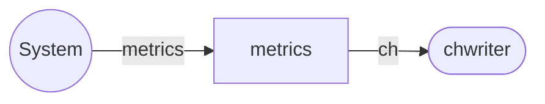

# metrics service

`metrics` services receives telemetry data from the system, performs
normalization, activated computational graph (CDAG) and spools result
to the [chwriter](chwriter.md) service.

## Service Properties

Sharded
: {{ yes }}

Pooled
: {{ no }}

Databases
: mongo

## Processed streams

### Input Streams

| Stream                                               | Description             |
| ---------------------------------------------------- | ----------------------- |
| [metrics](../../../dev/reference/streams/metrics.md) | Incoming telemetry data |

### Output streams

| Stream                                     | Description                      |
| ------------------------------------------ | -------------------------------- |
| [ch](../../../dev/reference/streams/ch.md) | Data to be written to clickhouse |

## Configuration

`metrics` service may be configured via [metrics]() config section.
