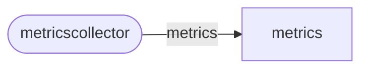

# metricscollector service

`metricscollector` services receives telemetry data from `noc-agent`,
normalizes and checks them and spools the result to the [metrics](metrics.md)
service.

## Service Properties

Sharded
: {{ yes }}

Pooled
: {{ no }}

Databases
: mongo

## Processed streams

### Output Streams

| Stream                                               | Description               |
| ---------------------------------------------------- | ------------------------- |
| [metrics](../../../dev/reference/streams/metrics.md) | Normalized telemetry data |

## Configuration

`metricscollector` service may be configured via [[metricscollector]](../config/metricscollector.md)
config section.
