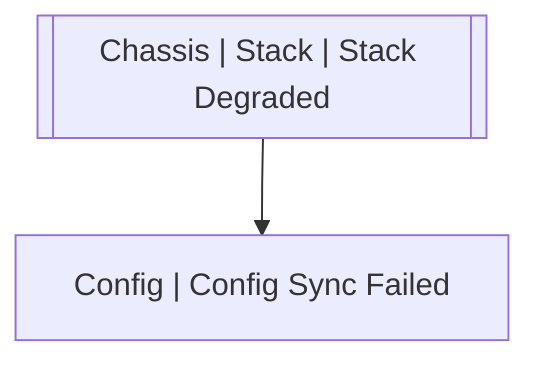

# Chassis | Stack | Stack Degraded

## Symptoms

## Probable Causes

## Recommended Actions

## Variables

Variable | Description | Default
--- | --- | ---
unit | Unit number | {{ no }}

## Alarm Correlation

Scheme of correlation of `Chassis | Stack | Stack Degraded` alarms with other alarms is on the chart. 
Arrows are directed from root cause to consequences.

### Consequences
`Chassis | Stack | Stack Degraded` alarm may be root cause of

Alarm Class | Description
--- | ---
[Config \| Config Sync Failed](../../config/config-sync-failed.md) | Stack Degraded

## Events

### Opening Events
`Chassis | Stack | Stack Degraded` may be raised by events

Event Class | Description
--- | ---
[Chassis \| Stack \| Stack Degraded](../../../event-classes/chassis/stack/stack-degraded.md) | dispose

### Closing Events
`Chassis | Stack | Stack Degraded` may be cleared by events

Event Class | Description
--- | ---
[Chassis \| Stack \| Stack is Raised](../../../event-classes/chassis/stack/stack-is-raised.md) | dispose
