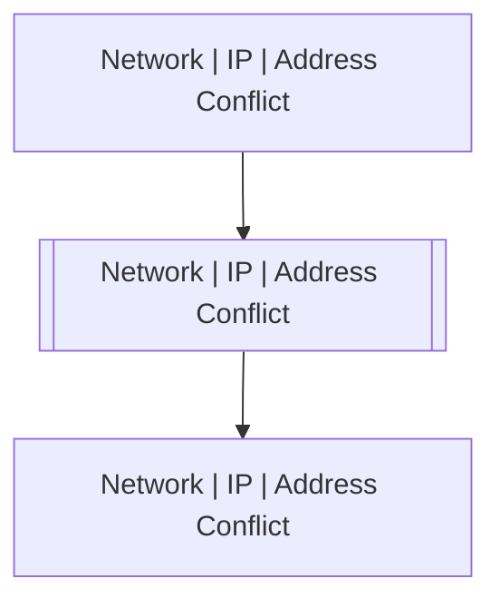

# Network | IP | Address Conflict

## Symptoms

## Probable Causes

## Recommended Actions

## Variables

Variable | Description | Default
--- | --- | ---
ip | Conflicting IP | {{ no }}
mac | MAC | {{ no }}
interface | Interface | {{ no }}

## Alarm Correlation

Scheme of correlation of `Network | IP | Address Conflict` alarms with other alarms is on the chart. 
Arrows are directed from root cause to consequences.

### Root Causes
`Network | IP | Address Conflict` alarm may be consequence of

Alarm Class | Description
--- | ---
[Network \| IP \| Address Conflict](address-conflict.md) | Address Conflict

### Consequences
`Network | IP | Address Conflict` alarm may be root cause of

Alarm Class | Description
--- | ---
[Network \| IP \| Address Conflict](address-conflict.md) | Address Conflict

## Events

### Opening Events
`Network | IP | Address Conflict` may be raised by events

Event Class | Description
--- | ---
[Network \| IP \| Address Conflict](../../../event-classes/network/ip/address-conflict.md) | dispose
