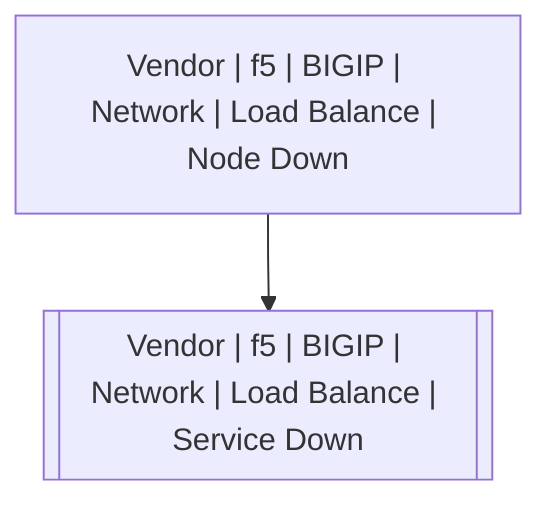

# Vendor | f5 | BIGIP | Network | Load Balance | Service Down

## Symptoms

## Probable Causes

## Recommended Actions

## Variables

Variable | Description | Default
--- | --- | ---
node | IP or hostname | {{ no }}
port | Service port | {{ no }}

## Alarm Correlation

Scheme of correlation of `Vendor | f5 | BIGIP | Network | Load Balance | Service Down` alarms with other alarms is on the chart. 
Arrows are directed from root cause to consequences.

### Root Causes
`Vendor | f5 | BIGIP | Network | Load Balance | Service Down` alarm may be consequence of

Alarm Class | Description
--- | ---
[Vendor \| f5 \| BIGIP \| Network \| Load Balance \| Node Down](node-down.md) | Node down

## Events

### Opening Events
`Vendor | f5 | BIGIP | Network | Load Balance | Service Down` may be raised by events

Event Class | Description
--- | ---
[Vendor \| f5 \| BIGIP \| Network \| Load Balance \| Service Down](../../../../../../event-classes/vendor/f5/bigip/network/load-balance/service-down.md) | dispose

### Closing Events
`Vendor | f5 | BIGIP | Network | Load Balance | Service Down` may be cleared by events

Event Class | Description
--- | ---
[Vendor \| f5 \| BIGIP \| Network \| Load Balance \| Service Up](../../../../../../event-classes/vendor/f5/bigip/network/load-balance/service-up.md) | dispose
