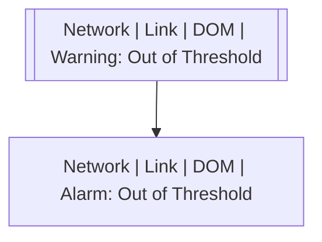

# Network | Link | DOM | Warning: Out of Threshold

## Symptoms

Connection lost

## Probable Causes

## Recommended Actions

## Variables

Variable | Description | Default
--- | --- | ---
interface | Physical port | {{ no }}
threshold | Threshold type | {{ no }}
sensor | Measured name | {{ no }}
ovalue | Operating value | {{ no }}
tvalue | Threshold value | {{ no }}
description | Interface description | `=InterfaceDS.description`

## Alarm Correlation

Scheme of correlation of `Network | Link | DOM | Warning: Out of Threshold` alarms with other alarms is on the chart. 
Arrows are directed from root cause to consequences.

### Consequences
`Network | Link | DOM | Warning: Out of Threshold` alarm may be root cause of

Alarm Class | Description
--- | ---
[Network \| Link \| DOM \| Alarm: Out of Threshold](alarm-out-of-threshold.md) | Warning: Out of Threshold

## Events

### Opening Events
`Network | Link | DOM | Warning: Out of Threshold` may be raised by events

Event Class | Description
--- | ---
[Network \| Link \| DOM \| Warning: Out of Threshold](../../../../event-classes/network/link/dom/warning-out-of-threshold.md) | dispose

### Closing Events
`Network | Link | DOM | Warning: Out of Threshold` may be cleared by events

Event Class | Description
--- | ---
[Network \| Link \| DOM \| Warning: Out of Threshold Recovered](../../../../event-classes/network/link/dom/warning-out-of-threshold-recovered.md) | dispose
