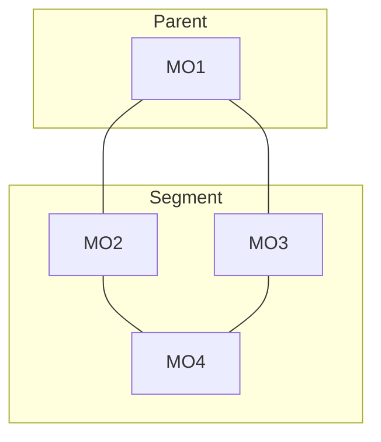

# Network Segment Profile

Network Segment Profile is a group settings for [Network Segment](../network-segment/index.md)

## Uplink Policy

[Segment Uplinks](../network-segment/index.md#segment-uplinks) calculation
is configured via `Uplink Policy` setting. `Uplink Policy` is the
list of methods in order of preference. NOC tries the methods one-by-one
until finds any appropriate Network Segment's uplinks.

### Segment Hierarchy

`Connectivity` provided by parent segment. Uplinks are all objects
from parent segment having links to segment.

Consider the scheme:

Lets `MO1` belong to `Parent Segment`, while `MO2`, `MO3` and `MO4` are
in current `Segment`. The table of `Uplinks` and `Downlinks`:

| Object | Uplinks  | Downlinks |
| ------ | -------- | --------- |
| MO2    | MO1, MO4 | MO4       |
| MO3    | MO1, MO4 | MO4       |
| MO4    | MO2, MO3 | MO2, MO3  |

### Object Level

Objects with greatest [level](../managed-object-profile/index.md#level)
is elected as uplinks. Objects can belong both to segment and neighbor segments.

### All Segment Objects

All Segment's Objects provide full network `Connectivity`. Any segment
neighbor is uplink.

### Lesser Management Address

Segment's Object with lesser management address is elected as Uplink

### Greater Management Address

Segment's Object with greater management address is elected as Uplink
