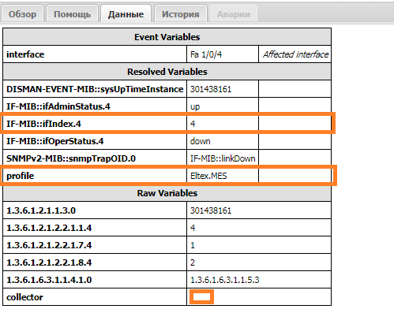
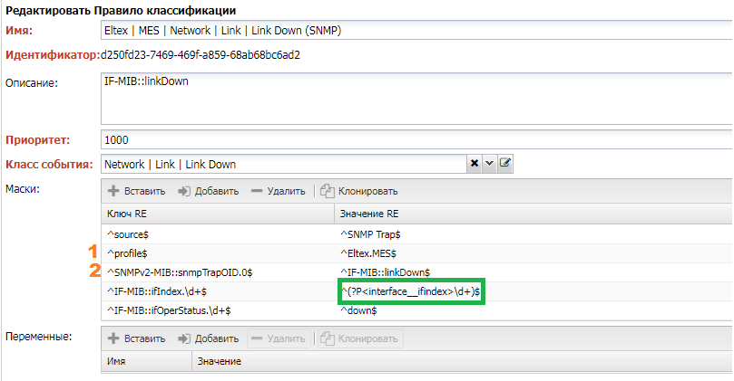

# Fault Management

The main task of Fault Management is to receive, process, and respond to events. Events can result from the operation of equipment, user actions, equipment errors, and other sources. A functioning network can generate thousands of events per minute. The FM module allows real-time:

- Receiving event messages from various sources:
    - ICMP - device availability checks
    - SNMP - receiving SNMP Traps
    - Syslog - receiving Syslog from devices
    - Metric Thresholds - threshold-based events
    - Discovery Results - device discovery results
    - Synchronization Messages with devices
- Classifying events based on rules
- Enriching events with data from the system
- Creating alarms based on events
- Correlating alarms and automatically determining the root cause
- Reacting to alarms:
    - Sending notifications
    - Initiating diagnostics
    - Escalation
- Grouping alarms
- Working with alarms in the user interface
- Analyzing alarms based on the BI subsystem

When working with events, the following terms are used:

- Event
- Event Class - the value of an event
- Event Classification - the process of analyzing an event, culminating in assigning a class
- Alarm - an event that requires a response
- Alarm Class - the value of an alarm
- Alarm Correlation - the process of determining the root cause of an alarm
- Root Cause Analysis (RCS) - determining the root cause of an issue

## Event Collection

Events enter the system through various means. Sources can be individual services (collectors) as well as internal system events. Let's explore the available event sources:

| Source                                                         | Active    | Protocol | Event Class                                                                                                                      | Alarm Class                                                 |
| -------------------------------------------------------------- | --------- | -------- | -------------------------------------------------------------------------------------------------------------------------------- | ----------------------------------------------------------- |
| [ping](../services-reference/ping.md)                          | {{ yes }} | ICMP     | -                                                                                                                                | `NOC | Managed Object | Ping Failed`                        |
| [trapcollector](../services-reference/trapcollector.md)        | {{ no }}  | SNMP     | By Rule                                                                                                                          | By Rule                                                     |
| [syslogcollector](../services-reference/syslogcollector.md)    | {{ no }}  | Syslog   | By Rule                                                                                                                          | By Rule                                                     |
| [Metric Threshold](../discovery-reference/periodic/metrics.md) | {{ yes }} | -        | [Threshold Profile](../concepts/threshold-profile/index.md)                                                                      | [Threshold Profile](../concepts/threshold-profile/index.md) |
| [Config Validation](../discovery-reference/box/config.md)      | {{ yes }} | -        | [Config Validation Rules](../configuration-management/index.md#Creating%20Validation%20Policies%20Based%20on%20ConfDB%20Queries) |
| [Alarm Discovery](../discovery-reference/periodic/alarms.md)   | {{ yes }} | CLI      | By Rule                                                                                                                          | By Rule                                                     |
| [Discovery](../discovery-reference/box/index.md)               | {{ yes }} | CLI      | -                                                                                                                                | -                                                           |

## Event Processing

Further event processing can follow two paths:

1. For events from devices, it's Classifier -> Correlator.
2. Internal system events are directed straight to the Correlator.

### Event Class

To work with an event in the system, it's important to understand its significance. Traditionally, the Event Class is used for this purpose [Event Class](../concepts/event-class/index.md). Additionally, event-specific settings are associated with the event class, dictating how the event should be handled. The system includes several special classes:

* `Unknown | Default` - The default class for events (the `Drop` rule is set).

### Event Classification

The task of the classification stage is to determine which [Event Class](../concepts/event-class/index.md) the incoming event belongs to and act according to the settings specified in it. To determine the event class, a set of classification rules [Event Classification Rule](../concepts/event-classification-rule/index.md) is used, located in the `Fault Management -> Setup -> Classification Rules` menu.

Events are sent to the classifier one by one [events](../streams-reference/events.md) and are transmitted in JSON format, with the content of the `data` field being filled at the source:

* `source` - Event source:
    * `syslog` - Syslog collector
    * `SNMP Trap` - SNMP Trap collector
    * `system` - Some system services (`ping`, `discovery`)
    * `other` - Unknown source
* `collector` - Pool [Pool](../concepts/pool/index.md)
* Specific data (dependent on the source):
    * `message` - Contains the syslog message
    * `1.3.6.1.6.3.1.1.4.1.0` (`snmpTrapOID`) - OID
    * ...
    
Example of a Syslog event:
```json
{"ts":1637243036,"object":"61088","data":{"source":"syslog","collector":"default","message":"%AAA-I-DISCONNECT: User CLI session for user user1 over telnet , source Y.Y.Y.Y destination  X.X.XX.X  TERMINATED."}}

```

Example of SNMP Trap:

```json
{"ts":1637243038,"object":"45324","data":{"source":"SNMP Trap","collector":"default","1.3.6.1.2.1.1.3.0":"973858","1.3.6.1.6.3.1.1.4.1.0":"1.0.8802.1.1.2.0.0.1","1.0.8802.1.1.2.1.2.2":"3","1.0.8802.1.1.2.1.2.3":"1","1.0.8802.1.1.2.1.2.4":"0","1.0.8802.1.1.2.1.2.5":"1"}}
```

For the incoming event, a suitable rule is found by comparing data with the template. Rules are traversed in ascending order of priority. It is important to note that in the absence of corresponding MIBs in the rules, numerical representations of OIDs should be used.

!!! info

    In the absence of MIBs in the rules, numerical representations of OIDs should be used.

#### Classification Rule Structure

The primary working component of a classification rule [Classification Rule](../concepts/event-classification-rule/index.md) is a set of templates used for comparing messages. These templates consist of a collection of regular expressions applied to the field name and its value in the message's `data` field. The rule is considered a match if all the regular expressions match. *Named groups* become event variables.

For example, let's take a look at a classification rule for an `SNMP Trap` of the `Link Down` class.

The event looks like this:



- `Raw Variables` - variables received from the collector in the `data` field.
- `Resolved Variables` - variables for which a corresponding [MIB](../glossary/index.md#mib) has been found and added by the classifier. For instance, the variable `profile` was added by the classifier from the device's data (`ManagedObject`).
- `Event Variables` - variables included in the event (configured in the class).

Let's examine the rule under which this event falls (you can find it on the `History` tab):



1. The `source` matches `SNMP Trap`, indicating that the rule is intended only for events received via `SNMP`.
2. `profile` specifies that the rule is only for devices with the `Eltex.MES` adapter.
3. The rule for a specific `Trap` is identified through the `Trap OID`.
4. Next are fields specific to the particular `Trap`, where `IF-MIB::ifIndex.\d+` extracts the interface index.
5. The use of the `interface__ifindex` construct tells the system to find the `interface` variable based on the `ifindex` of the interface.
6. Through `IF-MIB::ifOperStatus`, it is noted that we are interested in the interface going `down`.

In the case of `Syslog`, the main variable is `message`, which contains the message text.

#### Event Filtering

To protect the system from overly verbose devices, you can configure event filtering rules. There are two types of event filtering:

* Ignored Patterns. `Fault Management -> Setup -> Ignored Patterns`
* Ignored Rules. `Fault Management -> Setup -> Ignored Rules`

Currently, Ignored Rules are not in use and do not function.

Patterns only work with `Syslog` and `SNMP Trap` events. Right after receiving a message, the values of the `message` or `1.3.6.1.6.3.1.1.4.1.0` fields are checked against the regular expression specified in the pattern. If there is a match, the event is discarded.

#### Event Deduplication

This mechanism allows you to exclude duplicate events within a specified time interval. The interval itself is configured in the Event Class [Event Class](../concepts/event-class/index.md) and operates as follows:

1. If the `Deduplication Window` setting is greater than 0.
2. For each incoming event, a fingerprint is calculated, which includes the device, event class, and variables.
3. If there is a registered fingerprint within the `Deduplication Window` interval from the time of the current event, event processing is stopped.

? `allowed_time_drift`

#### Event Duplicates

This mechanism allows you to track event duplicates from equipment. When a duplicate is detected, instead of creating a new event, the duplicate counter (`repeats`) in the event is incremented. To make this work, you need to mark variables based on which duplicates will be counted:

1. If the `Suppression Window` setting is greater than 0.
2. For each incoming event, a fingerprint is calculated, which includes the device, event class, and variables marked as `Match Suppress`.
3. If there is a registered fingerprint within the `Deduplication Window` interval from the time of the current event, the `repeats` counter is increased for the event.

#### Event Time-to-Live (TTL)

This mechanism involves removing events after a specified time. After the time specified in the `TTL` setting of the Event Class [Event Class](../concepts/event-class/index.md) elapses, the event will be removed from the system. If the event has been passed to the correlator, expiration is canceled.

#### Disposition Rules

The further fate of an event is determined in the settings of the Disposition Rule for the Event Class [Event Class](../concepts/event-class/index.md). It acts as a routing table. After matching an event with the class, a sequential check of disposition rules begins. When a condition (`condition`) matches, the specified action is executed.

### Alarm Classes

Events that require a response are called *alarms*. For alarms, there are separate Alarm Classes (`Alarm Class`) that describe their significance for the system with a distinct set of settings. Alarms support escalation to external trouble ticket systems, analytics, and notifications.

### Alarm Correlation

The primary task of the correlator is to reduce the number of events by establishing the root cause (correlation) and grouping them. This allows signaling to the operator only what is worth paying attention to, filtering out less important events by assigning severity levels (`severity`).

Events are sent to the correlator [correlator](../services-reference/correlator.md) sequentially through the [dispose](../streams-reference/dispose.md).

The correlator identifies relationships between events from different sources, correlates them, and groups them, resulting in alarm events - **Alarms**.

#### Correlation by Rules

The table with correlation rules is placed in the Alarm Class [Alarm Class](../concepts/alarm-class/index.md) in the "Root Cause" section:

* **Name** - the name of the rule.
* **Root Cause** - a reference to the root cause alarm class.
* **Window** - the interval within which the search for the root cause is performed.
* **Condition** - conditions for checking the applicability of the rule. It's expressed in Python with access to the alarm through the 'alarm' variable. For example, 'alarm.vars.get('link') is not None'.
* **Match Condition** - additional criteria for matching the root cause ('Root'). The expression for querying the current alarm is available through the 'alarm' variable. For example, searching for alarms on the same device - '{"managed_object":"alarm.managed_object.id"}'.

After creating the alarm, the correlator sequentially goes through the records in the table. If the condition ('Condition') is successfully checked, a search is performed for an active alarm within the window ('Window') using the alarm class specified in the root cause ('Root') and the matching criteria ('Match Condition'). The found alarm is indicated as the root cause, and the search is then terminated.

As an example, let's consider possible root causes of equipment unavailability ('NOC | Managed Object | Ping Failed').

Three possible variants are indicated - 'Power Failed,' 'Total Power Loss,' and 'System Reboot.' The condition is expressed as a Python expression - always returning true. The matching criteria restrict the search for alarms on the same device ('managed_object').

#### Correlation by Topology

Correlation by topology uses the collected network topology [Topology](../topology-processing-features/index.md) to determine the root cause of an alarm. It is performed within the scope of a single alarm class and only based on device topology (`ManagedObject`). It is enabled by the 'Topology RCA' setting in the alarm class. Currently, it is only activated for the 'NOC | Managed Object | Ping Failed' class, which describes device unavailability via 'ICMP' from the system.

The algorithm is quite simple. When building the device topology, the upstream direction [Uplink](../topology-processing-features/index.md#Расчёт%20направления%20вверх) is calculated for them. A search is then made for the 'NOC | Managed Object | Ping Failed' alarm on the upstream device. If it is found, it is considered the root cause for the current alarm.

<!-- prettier-ignore -->
!!! todo

    Clarify whether correlation by topology or rules is performed first.

### Severity and Weight

After detecting an alarm on specific equipment, the system calculates the weight **Weight** of the alarm and determines in which severity interval of the base importance values **Severity** the alarm falls. The weight is calculated using a formula that takes into account the impact on associated components through *weight coefficients*:

* Device [ManagedObject](../concepts/managed-object/index.md). The weight coefficient is set in the object profile [Managed Object Profile](../concepts/managed-object-profile/index.md#FM).
* Interfaces of the device [Interface](../concepts/interface/index.md). The weight coefficient is set in the interface profile [Interface Profile](../concepts/interface-profile/index.md).
* Services associated with the device [Service](../concepts/service/index.md). The weight coefficient is set in the service profile [Service Profile](../concepts/service-profile/index.md).
* Subscribers associated with the device [Subscribers](../concepts/subscriber/index.md). The weight coefficient is set in the subscriber profile [Subscriber Profile](../concepts/subscriber-profile/index.md).

<!-- prettier-ignore -->
!!! info

    The weight of subordinates is added to the weight of the root cause in addition to its own weight.

Severity levels [Severity](../concepts/alarm-severity/index.md) of alarms are configured in the menu `Fault Management -> Setup -> Alarm Severities`. It specifies the minimum weight required to set the corresponding severity. The following default levels are provided:

* `CRITICAL` - The highest severity level of the alarm.
* `MAJOR` - Major alarm.
* `MINOR` - Minor alarm.
* `WARNING` - An event requiring operator attention.
* `INFO` - Informational.
* `IGNORE` - A normal event that does not affect the network's status.

### Escalation and Notifications

### Grouping

### Visualization