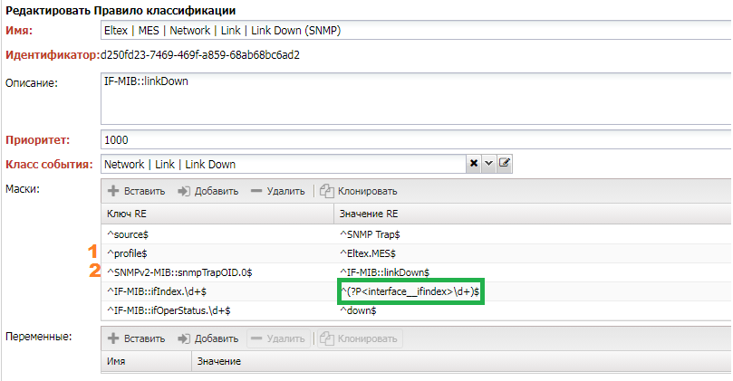

# Fault Management

Основная задача `Fault Management` приём, обработка и реакция на события. 
События (`Event`) могут в результате работы оборудования, действий пользователя, ошибок оборудования и других. 
Работающая сеть может создавать тысячи событий в минуту. Модуль `FM` позволяет в режиме реального времени:

* Приём сообщений о событиях из различных источников:
    * ICMP - проверка доступности устройства
    * SNMP - приём `SNMP Trap`
    * Syslog - приём `Syslog` с устройства
    * Пороги по метрикам (`Metric Threshold`)
    * Результаты опроса устройства (`Discovery`)  
    * Синхронизация сообщений с устройством
* Классификация событий на основе правил
* Обогащение событий данными из системы
* Создание на основе событий аварийного сообщения
* Корреляция аварий и автоматическое определение первопричины (`Root Cause`)
* Реакция на аварию:
    * Отправка уведомления
    * Запуск диагностики
    * Эскалация
* Группировка аварий
* Работа с авариями в интерфейсе пользователя
* Аналитика по авариям на основе подсистемы BI

При работе с событиями используются термины:

* Событие (`Event`) - 
* Класс события `Event Class` - значение события
* Классификация события (`Event Classification`) - процесс анализа события, завершается присвоением класса
* Авария (`Alarm`) - Событие, требующее реакции
* Класс аварии `Alarm Class` - значение аварии
* Корреляция аварии `Alarm Correlation` - процесс определение первопричины аварии
* Определение первопричины (`RCS`, `Root-cause analyses`)


## Сбор событий

События поступают в систему различными путями. Источниками могут быть отдельные как сервисы (коллекторы) так и 
внутренни события системы. Рассмотрим доступные источники событий:

| Источник                                                       | Активный  | Протокол | Класс события                                                                                                                     | класс аварии                                                      |
| -------------------------------------------------------------- | --------- | -------- | --------------------------------------------------------------------------------------------------------------------------------- | ----------------------------------------------------------------- |
| [ping](../services-reference/ping.md)                          | {{ yes }} | ICMP     | -                                                                                                                                 | `NOC  |  | Managed Object |  | Ping Failed`                       |
| [trapcollector](../services-reference/trapcollector.md)        | {{ no }}  | SNMP     | By Rule                                                                                                                           | By Rule                                                           |
| [syslogcollector](../services-reference/syslogcollector.md)    | {{ no }}  | Syslog   | By Rule                                                                                                                           | By Rule                                                           |
| [Metric Threshold](../discovery-reference/periodic/metrics.md) | {{ yes }} | -        | [Threshold Profile](../concepts/threshold-profile/index.md)                                                                       | [Threshold Profile](../concepts/threshold-profile/index.md)       |
| [Config Validation](../discovery-reference/box/config.md)      | {{ yes }} | -        | [Config Validation Rules](../configuration-management/index.md#Создание%20политики%20валидации%20на%20основе%20запросов%20ConfDB) |
| [Alarm Discovery](../discovery-reference/periodic/alarms.md)   | {{ yes }} | CLI      | By Rule                                                                                                                           | By Rule                                                           |
| [Discovery](../discovery-reference/box/index.md)               | {{ yes }} | CLI      | -                                                                                                                                 | -                                                                 |


## Обработка событий

Дальнейшая обработка события может пойти двумя путями:

1. Для событий из устройств это `Классификатор` -> `Коррелятор`
2. Внутренние события системы направляются непосредственно в `Коррелятор`


### Класс События

Для работы с событием системе важно понимать его значение. Традиционно, для этого используется Класс События [Event Class](../concepts/event-class/index.md). 
Также к классу события привязываются настройки касательно дальнейшей работы с событием. В системе предусмотрены 
несколько специальных классов:

* `Unknown | Default` - класс по умолчанию для событий (выставлено правило `Drop`)


### Классификация событий

Задача этапа классификации определить какому классу [Event Class](../concepts/event-class/index.md) 
принадлежит поступившее событие и действовать согласно указанным в нём настройкам. Для определения класса события 
используется набор правил классификации [Event Classification Rule](../concepts/event-classification-rule/index.md), 
расположенных в меню `Управление авариями (Fault Management) -> Настройка (Setup) -> Правила классификации (Classification Rule)`.

События в классификатор поступают по очереди [events](../streams-reference/events.md). Передаются в формате `JSON` 
и отличаются содержимым поля `data`, заполняемым на источнике:

* `source`- источник события:
    * `syslog` - коллектор `Syslog`
    * `SNMP Trap` - коллектор `SNMP Trap`
    * `system` - некоторые системные сервисы (`ping`, `discovery`)
    * `other` - неизвестный источник
* `collector` - пул [Pool](../concepts/pool/index.md)
* Специфичные данные (зависят от источника):
    * `message` - содержит сообщение `syslog`
    * `1.3.6.1.6.3.1.1.4.1.0` (`snmpTrapOID`) - OID 
    * `...`

Пример события `Syslog`:
```json
{"ts":1637243036,"object":"61088","data":{"source":"syslog","collector":"default","message":"%AAA-I-DISCONNECT: User CLI session for user user1 over telnet , source Y.Y.Y.Y destination  X.X.XX.X  TERMINATED."}}

```

Пример события `SNMP Trap`:

```json

{"ts":1637243038,"object":"45324","data":{"source":"SNMP Trap","collector":"default","1.3.6.1.2.1.1.3.0":"973858","1.3.6.1.6.3.1.1.4.1.0":"1.0.8802.1.1.2.0.0.1","1.0.8802.1.1.2.1.2.2":"3","1.0.8802.1.1.2.1.2.3":"1","1.0.8802.1.1.2.1.2.4":"0","1.0.8802.1.1.2.1.2.5":"1"}}
```

Для поступившего события происходит поиск подходящего правила путём сравнения `data` с шаблоном. 
Обход правил идёт в порядке возрастания приоритета. Важно учитывать, что при наличии в системе соответствующих `MIB` 
в правилах, вместо `OID` можно использовать их текстовые представления.

<!-- prettier-ignore -->
!!! info

    В отсутствии MIB в правилах необходимо использовать числовые представление OID

#### Структура правила классификации

Основная рабочая часть правила классификации [Classification Rule](../concepts/event-classification-rule/index.md) 
это набор шаблонов, по которым идёт сравнение сообщения. Представляют собой набор регулярных выражений 
для наложения на название поля и его значение в `data` сообщения. Правило считается совпавшим если 
совпали все регулярные выражения. *Именованные группы* становятся переменными события.

Например, рассмотрим правило классификации для `SNMP Trap` класса `Link Down`.

Событие выглядит следующим образом:


* `Raw Variables` - переменные пришедшие из коллектора в поле `data`
* `Resolved Variables` - переменные для которых нашёлся соответствующий [MIB](../glossary/index.md#mib) и добавленные классификатором. Например, переменная `profile` была добавлена классификатором (`classifier`) из данных устройства (`ManagedObject`)
* `Event Variables` - переменные попавшие в событие (настраиваются в классе)

Рассмотрим правило, под которое попало данное событие (его можно увидеть на вкладке История `History`):



1. Источник (`source`) соответствует `SNMP Trap`. Фиксирует что правило написано только для событий пришедших по `SNMP`
2. `profile` фиксирует что правило только для устройств с адаптером `Eltex.MES`
3. Правило для конкретного `Trap` фиксируем через `Trap OID`
4. Дальше идут поля специфичные для конкретного `Trap`, из поля `IF-MIB::ifIndex.\d+` извлекается индекс интерфейса.
5. Использование конструкции `interface__ifindex` говорит системе, что переменную `interface` необходимо найти на основе `ifindex` интерфейса 
6. Через `IF-MIB::ifOperStatus` фиксируем что нас интересует падение интерфейса - `down`.

В случае `Syslog` основной переменной будет `message`, в которой будет содержаться сообщение

#### Фильтрация событий

Для ограждения системы от особо разговорчивых устройств можно настроить правила фильтрации событий. 
Они бывают 2 видов:

* Шаблоны игнорирования (`Ignored Patterns`). `Fault Management -> Setup -> Ignored Patterns`
* Правила игнорирования (`Ignored Rules`). `Fault Management -> Setup -> Ignored Rules`

Правила игнорирования на текущий момент не используются и не работают.

Шаблоны работают только с событиями `Syslog` и `SNMP Trap`. Сразу после приёма сообщения 
происходит проверка значений полей `message` или `1.3.6.1.6.3.1.1.4.1.0` на соответствие указанному 
в шаблоне регулярному выражению. При совпадении событие отбрасывается

#### Дедупликация событий

Механизм позволяет исключать повторы событий в рамках заданного интервала времени. Сам интервал настраивается 
в Классе События [Event Class](../concepts/event-class/index.md) и действует следующим образом:

1. Если настройка `Deduplication Window` больше 0
2. Для каждого входящего события считается отпечаток (`fingerprint`), входит устройство, класс события и переменные
3. Если в интервале `Deduplication Window` от времени текущего события есть зарегистрированный отпечаток `fingerprint`, то прекращаем обработку события

? `allowed_time_drift`

#### Повторы событий

Механизм позволяет учитывать повторы события со стороны оборудования. При обнаружении повтора вместо заведения 
нового события увеличивает счётчик повторов (`repeats`) в событии. Для работы необходимо отметить переменные, 
на основе которых будет считаться повтор:

1. Если настройка `Suppression Window` больше 0
2. Для каждого входящего события считается отпечаток (`fingerprint`), входит устройство, класс события и переменные, отмеченные `Match Suppress`
3. Если в интервале `Deduplication Window` от времени текущего события есть зарегистрированный отпечаток `fingerprint`, то для события увеличивается счётчик `repeats`


#### Время жизни события (TTL)

Механизм удаления событий спустя какое-то время. По прошествии времени, указанного в настройке `TTL` класса события [Event Class](../concepts/event-class/index.md) 
событие будет удалено из системы. Если произошла передача события в коррелятор, то устаревание отменяется.

#### Правила размещения (Disposition Rule)

Дальнейшая судьба события определяется в настройках `Disposition Rule` класса события [Event Class](../concepts/event-class/index.md). 
Это своего рода таблица маршрутизации. После сопоставления события с классом начинается последовательный обход правил размещения 
и при совпадении условия (`condition`) выполняется указанное действие.

### Классы аварий

События, требующие реакции называются *аварийными* или **Авариями**. Для них существуют отдельные Классы Аварий (`Alarm Class`), 
описывающие их значение для системы с отдельным набором настроек. Для аварий поддерживается эскалация во внешние системы ТТ, аналитика и уведомления.

### Корреляция аварий

Основная задача коррелятора, это сокращение числа событий путём установления первопричины (корреляции) и группировки. 
Это позволяет сигнализировать оператору только о том, на что стоит обратить внимание, отсеивая менее важное путём выставление важности (`severity`). 

События в коррелятор [correlator](../services-reference/correlator.md) поступают по
очереди [dispose](../streams-reference/dispose.md) 

Коррелятор ищет связи между событиями их разных источников, осуществляет их корреляцию и группировку, 
получая на выходе аварийные события - **Аварии**.

#### Корреляция по правилам

Таблица с правилами корреляции размещаются в Классе аварии [Alarm Class](../concepts/alarm-class/index.md) в разделе `Root Cause`:

* **Имя** (`Name`) - название правила
* **Первопричина** (`Root`) - ссылка на класс аварии первопричины
* **Окно** (`Window`) - интервал, внутри которого производится поиск первопричины
* **Условие** (`Condition`) - условия проверки применимости правила. Выражение `Python`, доступ к аварии через переменную `alarm`. Например `alarm.vars.get('link') is not None`
* **Критерий совпадения** (`Match Condition`) - дополнительные критерии совпадения с первопричиной (`Root`). Выражение для запроса текущая авария доступна через переменную `alarm`. Например поиск аварий по тому же устройству - `{"managed_object":"alarm.managed_object.id"}`

После создания аварии коррелятор последовательно проходит записи из таблицы при успешной проверке условия (`Condition`), производится 
поиск активной аварии внутри окна (`Window`), классом аварии указанным в первопричине (`Root`)  и критериями совпадения (`Match Condition`). 
Найденная авария указывается как первопричина, после этого поиск прекращается.

Для примера рассмотрим возможные первопричины недоступности оборудования (`NOC | Managed Object | Ping Failed`)

Указано 3 возможных варианта - `Power Failed`, `Total Power Loss` и `System Reboot`. Условие сделано в виде выражения `Python` - 
всегда возвращает истину. Критерий совпадения ограничивает поиск аварий по тому же устройству (`managed_object`). 


#### Корреляция по топологии

Корреляция по топологии использует собранную топологию сети [Topology](../topology-processing-features/index.md) для определения первопричины аварии. 
Она производится в пределах одного класса аварии и только по топологии устройств (`ManagedObject`). 
Включается настройкой `Topology RCA` в классе аварии. На текущий момент активирована только для класса `NOC | Managed Object | Ping Failed`, описывающий 
недоступность устройства по `ICMP` со стороны системы.

Алгоритм достаточно прост, при построении топологии устройств для них высчитываются направление вверх 
[Uplink](../topology-processing-features/index.md#Расчёт%20направления%20вверх). Происходит поиск аварии `NOC | Managed Object | Ping Failed` 
на вышестоящем устройстве. Если она найдена, то считается первопричиной для текущей

<!-- prettier-ignore -->
!!! todo

    уточнить вначале корреляция по топологии или правилам


### Серьёзность и Вес

После обнаружения аварии на конкретном оборудовании, система вычисляет вес **Weight** аварии и в какой интервал базовых значений важности **Severity** попадает авария. 
Вес рассчитывается по формуле, в которой учитывается влияние на связанных с устройством компонент через *весовые коэффициенты*: 

* Устройство [ManagedObject](../concepts/managed-object/index.md). Весовой коэффициент выставляется в профиле объекта [Managed Object Profile](../concepts/managed-object-profile/index.md#FM)
* Интерфейсы устройства [Interface](../concepts/interface/index.md). Весовой коэффициент выставляется в профиле интерфейса [Interface Profile](../concepts/interface-profile/index.md)
* Сервисы связанные с устройством [Service](../concepts/service/index.md). Весовой коэффициент выставляется в профиле сервиса [Service Profile](../concepts/service-profile/index.md)
* Абоненты связанные с устройством [Subscribers](../concepts/subscriber/index.md). Весовой коэффициент выставляется в профиле абонента [Subscriber Profile](../concepts/subscriber-profile/index.md)

<!-- prettier-ignore -->
!!! info

    К весу первопричины аварии помимо собственного добавляются веса подчинённых.

Уровни важности [Severity](../concepts/alarm-severity/index.md) аварии 
настраиваются в меню `Управление авариями (Fault Management) -> Настройки (Setup) -> Важность аварии (Alarm Severities)`. 
В ней указывается минимальный вес необходимые для выставления соответствующей важности. По умолчанию представлены следующие уровни:

* `CRITICAL` - Наивысший уровень важности аварии.
* `MAJOR` - Крупная авария.
* `MINOR` - Авария.
* `WARNING` - Событие, требующее обратить внимание оператора.
* `INFO` - Информирование.
* `IGNORE` - Штатное событие, не влияющее на состояние сети.


### Эскалация и уведомления

<!-- prettier-ignore -->
!!! todo

### Группировка

<!-- prettier-ignore -->
!!! todo

## Визуализация


<!-- prettier-ignore -->
!!! todo