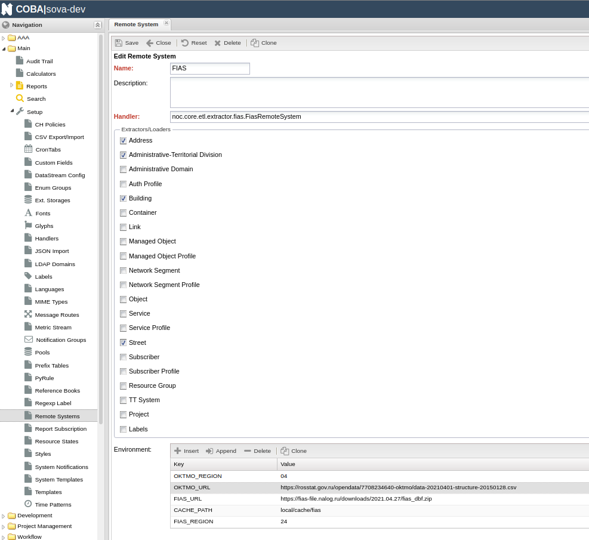

# Загрузка данных ГИС

Сейчас это `etl` процедура, поэтому нужно создать `Remote System` и использовать команды `noc etl extract <Name Remote System>`, `noc etl load <Name Remote System>`.
Загрузка данных ГИС производится в модели Division, Street, Building и Address.
Источники извлечения данных это `ФИАС` и `OKTMO`.

### Environment для Remote System:

- `CACHE_PATH` (каталог для загрузки архивного, csv файлов и извлечения dbf файлов)
- `OKTMO_URL` (url загрузки файла OKTMO)
- `OKTMO_REGION` ([код](oktmo-region-codes.md) региона для OKTMO данных)
- `FIAS_URL` (url загрузки архива ФИАС)
- `FIAS_REGION` ([код](fias-region-codes.md) региона для ФИАС данных)

### Handler для Remote System:

- noc.core.etl.extractor.fias.FiasRemoteSystem

### Checkboxes Extractors/Loaders для Remote System:
(нужно отметить/включить)

- Address
- Administrative-Territorial Division
- Building
- Street

## Пример:

- `Name of Remote System`: `FIAS`
- `Handler`: `noc.core.etl.extractor.fias.FiasRemoteSystem`
- `Extractors/Loaders`: `Address`, `Administrative-Territorial Division`, `Building`, `Street`
- `CACHE_PATH`: `local/cache/fias`
- `OKTMO_URL`: `https://rosstat.gov.ru/opendata/7708234640-oktmo/data-20210401-structure-20150128.csv`
- `OKTMO_REGION`: `04`
- `FIAS_URL`: `https://fias-file.nalog.ru/downloads/2021.04.27/fias_dbf.zip`
- `FIAS_REGION`: `24`



#### Команда извлечения данных:

```angular2html
./noc etl extract FIAS
```

#### Команда загрузки данных:

```angular2html
./noc etl load FIAS
```
