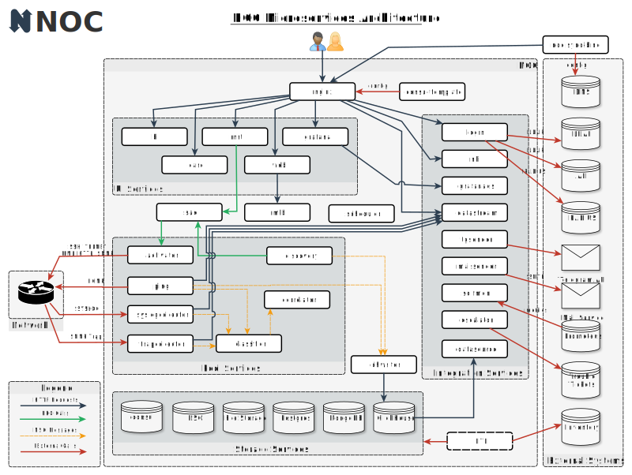

# Microservices Architecture

The NOC is built atop [Microservice Architecture](https://en.wikipedia.org/wiki/Microservices).
Atomic parts of NOC are _microservices_ (or simply _services_) - small
processes performing their own task. _Microservices_ have following properties:

* Each service performs only one particular task
* Each service has well-defined contract (interface offered to other services)
* Services are simple
* Service can request other services
* New services can be added without inflicting existing ones
* Each service has determined resource requirements, including CPU, RAM, disk space and IOPS. This offer transparent scaling process according to your workload.

NOC groups services to following groups:

* Storage services - databases and file storages holding NOC _state_ or _context_.
The _state_ must survive between restarts. Only storage services
are allowed to write on disk. Other services has no global _context_ and
may be moved between the nodes of cluster.
* UI services - backend for user interface
* Pool services - interacts with network. Several pools can be deployed
to deal with different parts of network.
* Integration Services - a barrier between the NOC and the external world.
Services like *nbi* and *datastream* offer integration interfaces to
access NOC data and perform basic operations initiated by external systems.
Other services can request various external systems to reach the
seamless integration.
* External Services - NOC part of NOC itself. Various existing systems
that can provide services for NOC or use NOC services by themselves.

Top level overview of NOC is on the picture below:

Despite the common belief that microservice architecture is
hard to configure and maintain, NOC provides management tool, called
*Tower* to configure and deploy whole cluster. Tower provided with
complex [Ansible](https://www.ansible.com) playbook to hide all
deployment complexity under the hood.

Microservices offer great flexibility, allowing adjust amount of
launched instances according your workload providing effective
resource utilisation.
