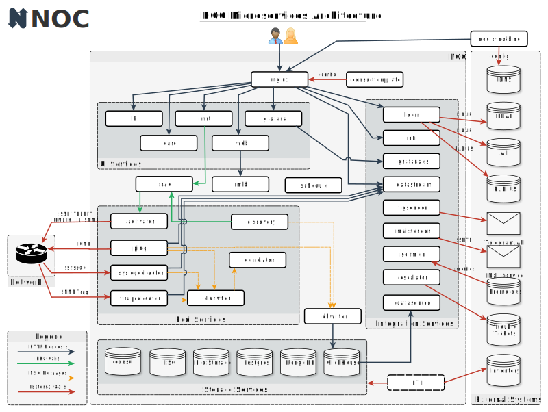

# Микросервисная архитектура

NOC построен на основе [микросервисной архитектуры](https://en.wikipedia.org/wiki/Microservices). Атомные части NOC - это _микросервисы_ (или просто _сервисы_) - небольшие процессы, выполняющие свою собственную задачу. У _микросервисов_ есть следующие свойства:

* Каждый сервис выполняет только одну конкретную задачу
* У каждого сервиса хорошо определен контракт (интерфейс, предоставляемый другим сервисам)
* Сервисы просты
* Сервис может запрашивать другие сервисы
* Новые сервисы могут быть добавлены без ущерба для существующих
* У каждого сервиса есть определенные требования к ресурсам, включая процессор, RAM, дисковое пространство и IOPS. Это предоставляет прозрачный процесс масштабирования в соответствии с вашей нагрузкой.

NOC группирует сервисы следующим образом:

* Сервисы хранения - базы данных и файловые хранилища, содержащие _состояние_ или _контекст_ NOC. _Состояние_ должно сохраняться между перезапусками. Только службы хранения имеют право записи на диск. У других служб нет глобального _контекста_ и их можно перемещать между узлами кластера.
* Сервисы пользовательского интерфейса - бэкенд для пользовательского интерфейса
* Сервисы пула - взаимодействуют с сетью. Можно развернуть несколько пулов, чтобы работать с разными частями сети.
* Сервисы интеграции - барьер между NOC и внешним миром. Службы, такие как *nbi* и *datastream*, предоставляют интеграционные интерфейсы для доступа к данным NOC и выполнения основных операций, инициированных внешними системами. Другие службы могут запрашивать различные внешние системы для обеспечения бесшовной интеграции.
* Внешние службы - часть NOC самого по себе. Различные существующие системы могут предоставлять услуги для NOC или использовать службы NOC самостоятельно.

Общий обзор NOC представлен на следующей картине:

Несмотря на общее мнение о том, что микросервисная архитектура сложна в настройке и обслуживании, NOC предоставляет инструмент управления, называемый *Tower*, для конфигурации и развертывания всего кластера. Tower оснащен сложным набором [Ansible](https://www.ansible.com) для скрытия всей сложности развертывания под капотом.

Микросервисы предоставляют большую гибкость, позволяя регулировать количество запущенных экземпляров в соответствии с вашей нагрузкой и обеспечивая эффективное использование ресурсов.
