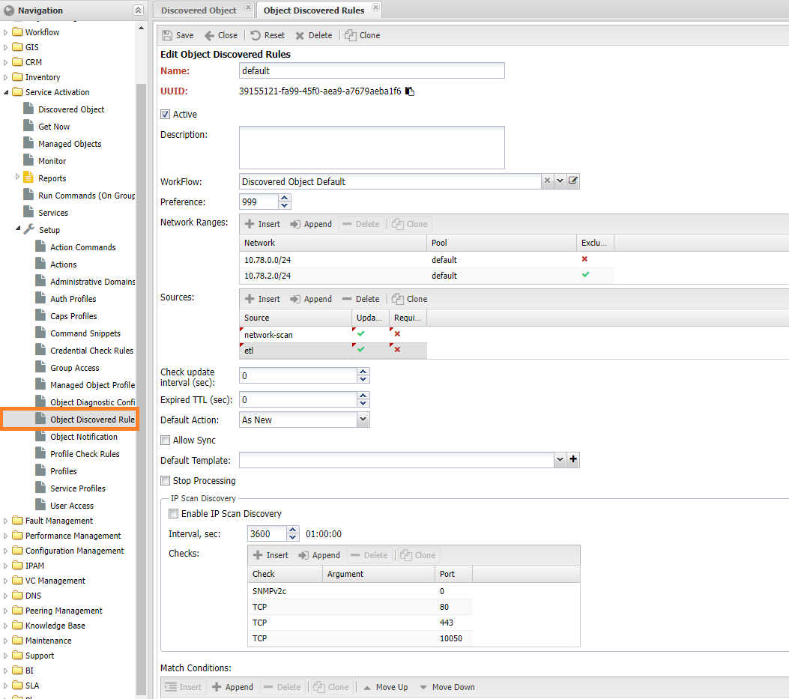
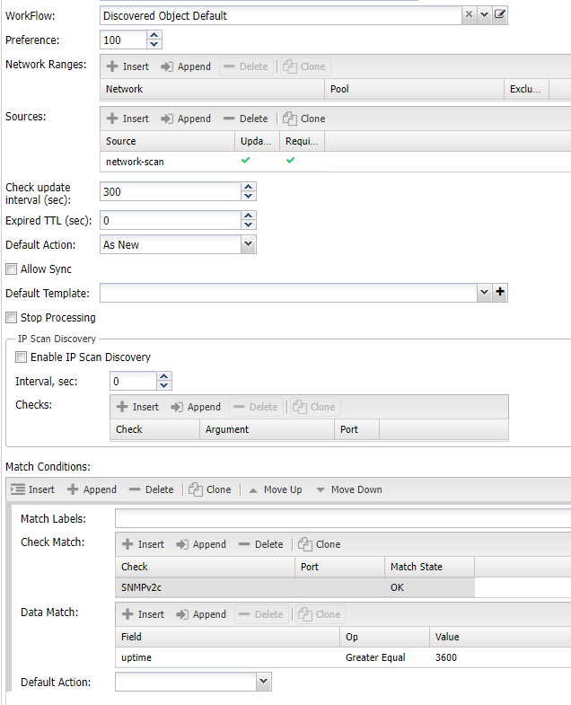

# Выявлением устройств путём опроса IP подсетей

Первоначальное заполнение системы данными достаточно трудоёмкий процесс, требующий значительных затрат времени.  Помимо привычных инструментов: ручное добавление через веб-интерфейс в НОКе доступен опрос *IP сетей* на предмет наличия в них доступных IP адресов. Анализ этих адресов на предмет открытых протоколов позволяет выявлять активное сетевое оборудование, с последующим занесением его в систему в качестве устройств (`Managed Object`). Активный опрос сетей позволяет:

* Автоматизировать занесение устройств (*Managed Object*) в систему
* Актуализировать адреса в `IPAM`, получая их во время опроса сети
* Позволяет обнаруживать изменения в части новых IP адресов

Следующие компоненты системы могут быть источниками данных для опроса:

* **network-scan** - активный опрос сети. Выполняется командой `./noc net-scan`
* **etl** - обмен данными с внешними системами
* **neighbors** - не распознанные системой соседи протоколов сети
* **snmptrap/syslog** - сообщения в систему от неизвестных отправителей
* **manual** - ручной ввод данных

**Обнаруженные адреса** заносятся в систему для дальнейшей обработке - вручную или на основе правил.

<!-- prettier-ignore -->
!!! info 

    Обнаруженные адреса попадают в систему только при наличии настроенного правила, если такового нет они сохраняются во временном хранилище


## Запуск опроса сети

Для запуска опроса необходимо выполнить команду `/noc net-scan` с заданными ключами:

* `--in` = файл с построчным списком подсетей (префикс в отдельной строке)
* `--pool` - задание пула, для которого производится запуск
* `--adm-domain` - ЗО для устройств
* `--jobs` - число доступных потоков для выполнения
* `--dry-run` - выполнить опрос, но не отправлять результаты в систему
* `--print-out` - печатать результаты опроса на консоль
* `--ports` - набор портов для проверки подключения по TCP, разделённых запятыми
* `--checks` набор дополнительных проверок (из доступных `checks`)
* `--community` - перечень snmp community (для версий `v1`,`v2`)
* `--snmp-user` - пользователь для `SNMPv3`
* `--labels` - набор меток, разделённых запятыми
* `--ip-scan` - опрашивать префиксы, отмеченные в `IPAM`
* `--rule` - опрашивать диапазоны, заданные в правиле (*Object Discovery Rule*)
* список IP префиксов для опроса

*Обнаруженные адреса* (доступные по ICMP) направляются для дальней обработки.

### Примеры использования

**Опросить сети 172.16.1.0/24 и 10.11.12.0/24, проверив SNMP v1/v2c/v3 и порты 80,443,10050,4443,6443. Результат не отправлять в систему, а распечатать на экране**

```./noc net-scan --dry-run --print-out --pool default --community public --snmp-user xxx:SHA:key1:AES:key2 --ports 80,443,10050,4443,6443 172.16.1.0/24 10.11.12.0/24```

**Опросить сети, отмеченные в IPAM для сканирования, проверив SNMP v1/v2c с несколькими community. Результат отправить в систему**

```./noc net-scan --pool default --community,my1,my2 public --ip-scan```

**Запустить опрос, согласно настройкам правила default из Object Discovery Rule**

```./noc net-scan --community public --rule 'default'```

## Получения данных из внешних систем

При выгрузке устройств (*Managed Object*) из внешних систем через механизм ETL есть возможность выбрать: создавать из записей устройства (*Managed Object*) или направить их в **найденные** (*Discovered Object*). В этом случае данные опроса *network-scan* и полученные из внешней системы *etl* будут объединены на основе *IP адреса* и пула (*Pool*) и в итоге будут отображаться как одна запись.

> [!NOTE]
>
> В случае источника *network-scan* обнаруженным считается адрес, доступный по `ICMP`, для *etl* обнаруженным считается любой IP адрес

## Обработка результатов

После сбора данных происходит их обработка согласно правилам. При совпадении условий, *IP адрес* заносится в список **найденных устройств** (*Discovered Object*), расположенном в меню *Service Activation -> Discovered Object*. В соответствии с настройками записям присваивается одно из доступных состояний (столбец *State*):

* *New* - новая запись. Состояние по умолчанию для всех записей
* *Approved* - подтверждённая запись. Выставляется для записей, готовых для синхронизации. Может быть выставлена автоматически, либо вручную.
* *Ignored* - необходимо игнорировать запись при синхронизации
* *Removed* - готовая к удалению запись. Запись, для которой время последнего опроса превышает интервал *expired*


Помимо текущего состояния, отображаются следующие сведения:

* **Адрес** (*Address*) - IP адрес записи
* **Пул** (*Pool*) - системный пул, в котором была зарегистрирована запись
* **Изменена** (*Is Dirty*) - флаг изменения, сигнализирует об изменении записи и необходимости её синхронизации
* **Синхронизирована** (*Is Synced*) - флаг синхронизации, показывает что на базе записи было создано устройство (*Managed Object*)
* *Имя IP адреса* (*Hostname*) - обнаруженной имя IP адреса
* **Правило** (*Rule*) - назначенное правило
* **Проверки** (*Checks*) - список проверок, с отображением результатов
* *Метки* (*Labels*) - набор меток, соответствующий записи

Также для **Найденных устройств** (*Discovered Object*),  на панели инструментов доступны следующие действия:

* `(1)` **Поиск** - поиск происходит по полям:
  * *hostname* - имя адреса
  * *description* - описание
  * *address* - при указании префикса в формате `X.X.X.X/YY` поиск будет идти по подсетям

* `(2)` Показать **панель фильтрации** (*Filtering List*)
* `(3)` **Групповые операции** (*Group Operation*) - позволяет массовое изменение статусов (*State*)
* `(4)` **Синхронизировать запись** (*Sync Records*) - позволяет вручную запустить синхронизацию записи. Для выполнения необходимо выбрать шаблон, либо будет взят шаблон из правила (*Object Discovery Rule*)
* `(5)` *Scan* - запуск ручного сканирования **Не реализовано**

<!-- prettier-ignore -->
!!! info 

    Действия выполняются для всех записей с отметкой в крайнем левом столбце

## Правила обработки результатов

Всем обнаруженным IP адреса (*IP Address*) сопоставляются правила (*Object Discovery Rule*), если подходящего правила не нашлось, то обнаруженный адрес помещается во временное хранилище, до появления подходящего правила. Настройка правил расположена в меню *Service Activation -> Setup -> Object Discovery Rules*, и содержит следующие пункты:



* **Имя** (*name*) - наименование правила
* **Описание** (*description*)
* **Активное** (*Is active*) - правило находится в работе
* **Приоритет** (*preference*) - приоритет обработки правила: ниже - раньше
* **Диапазоны** (*Network Ranges*) - список диапазонов IP подсетей, подпадающих под правило
  * Диапазон (*Network*) - диапазон IP адресов. Задаётся в виде префикса, либо через дефис: `10.0.0.2 - 10.0.0.50`
  * *pool* - ссылка на системный пул (*Pool*)
  * *exclude* - исключить диапазон из обработки
* **Процесс** (*Workflow*) - процесс по которому происходит движение
* **Источники** (*Sources*) - перечень источников с указанием приоритета. При отсутствии считается что подходит *любой*
  * *source* - источник записи
  * *remote_system* - внешняя система, из которой поступила запись (работает для источника `etl`)
  * *update_last_seen* - обновлять время последнего обнаружения для этого источника
  * *Требуется* (*is_required*) - обязательное наличие источника для совпадения записи
* **Критерии** (*Conditions*) - настройка критериев совпадения правила
  * *Метки* (*Match Labels*) - набор меток для совпадения критерия. Должны совпасть все указанные
  * *Проверки* (*Match Checks*) - критерий на базе проверок
      * Проверка (*Check*)
      * *Порт* (*Port*)
      * Состояние (*match_state*)
         * *ok* - проверка завершилась успехом
         * *fail* - проверка завершилась провалом
         * *any* - любой результат проверки
  * *Данные* (*Match Data*) - критерий на базе данных
    * *field* - название поля: `hostname`, `description`, `uptime`
    * *op* - операция для совпадения
       * `regex` - по регулярному выражению
       * `contains` - содержит
       * `==` - соответствует
       * `!=` - не равное
       * `gte` - больше либо равно (текстовые данные будут сравниваться как текст)
       * `lte` - меньше либо равно (текстовые данные будут сравниваться как текст)
    * *value* - значение для сравнения
* *Включить опрос диапазона* (*enable_ip_scan_discovery*) - включить опрос диапазонов
* *Интервал опроса диапазона* (*ip_scan_discovery_interval*) - интервал проверки диапазонов
* **Проверки** (*Checks*) - настройки проверок при опросе
  * *Проверка* (*Check*) - выполняемая проверка
  * *Порт* (*Port*) - TCP порт
  * *Аргумент* (*Arg*) - дополнительный аргумент (для проверки)
* *Действие по умолчанию* (*Default Action*) - выполнить действие при совпадении правила
  * *new* - зарегистрировать запись как новую
  * *approve* - подтвердить запись
  * *ignore* - игнорировать запись
  * *skip* - пропустить правило (перейти к следующему)
* *Sync on Approved* - запустить синхронизацию при подтверждении записи. Требует чтобы был указан *шаблон*(*Default Template*)
* *Шаблон по умолчанию* (*Default Template*) - шаблон для синхронизации записи

Правила обрабатываются в порядке возрастания поля **приоритет** (*Priority*), по первому совпадению оно назначается IP адресу. Для совпадения проверяются следующие критерии:

* Соответствие IP адреса диапазону из раздела **Диапазоны**. Пустой раздел считается совпадающим с *любым* адресом
* Далее проверяется **Источники** (*Source*), если не выставлена галочка *Требуется* (*Is requred*) значит должен быть любой источник из списка. При отсутствии настроенных источников считается что подходит *любой*
* После источников сравниваются **Критерии** (*Conditions*):
  * По меткам
  * По проверкам

В критериях *по данным* (*Data*) доступны следующие:

* *hostname* - имя IP адреса
* *description* - описание устройства (при опросе значение `sysDescr`)
* *uptime* - аптайм устройства (только при наличии SNMP)

### Разрешение конфликтов источников

При получении записей из нескольких источников может возникнуть ситуация, когда часть атрибутов есть в нескольких из них. Например это поле `hostname` может быть получено с устройства, в таком случае приоритет задаётся положением источников в настройке `source` - при совпадении атрибутов приоритет отдаётся тому, чей источник выше. В случае же отсутствия настроек в поле `source` используется приоритет по умолчанию:

* *network-scan*
* *neighbors*
* *etl*
* *manual*

### Дедупликация

У одного устройства может быть больше одного IP адреса, в этом возможна ситуация при синхронизации для каждой записи  создастся отдельное *устройство* (*Managed Object*). Поэтому предусмотрен механизм проверки соответствия IP адресов одному устройству. Это делается путём сравнения доступных идентификаторов: `hostname` и `chassis_id`. У записи принадлежащие одному устройству выставляется указатель на родительскую, которая и используется для синхронизации.

### Сигналы

### Глобальные настройки

Для работы с обнаруженными адресами существует несколько глобальный настроек в разделе `network_scan` конфигурации. Текущие значения можно увидеть командой `./noc config dump network_scan`:

* `purgatorium_ttl` - время устаревания записей по обнаруженным адресам. Записи, старше указанного времени исключаются из работы

### Шаблоны устройств

Данных полученных при обнаружении не достаточно для создания устройства (*Managed Obejct*), из обязательного состава доступны:

* Адрес (*Address*)
* Пул (*Pool*)
* *hostname*

Для указания остальных атрибутов используется **Шаблоны** (*Model Template*). Расположены в меню *Основные -> Настройки -> Model Template* (*Main -> Setup -> Model Template*). В колонке `Name (2)`  указывается имена атрибутов для устройства (*Managed Object*), в `Default Expression` значение по умолчанию для соответствующего атрибута. В примере это идентификаторы соответствующих записей из справочников.


Для создания устройства обязательными являются следующие атрибуты:

* *administrative_domain* - Зона ответственности
* *object profile* - Профиль объекта
* *segment* - сегмент сети
* *auth_profile* - профиль авторизации, если не используется подбор реквизитов доступа

### Примеры настроек

Под приведённый выше пример, подпадают записи из сети `10.78.0.0/24`, также в нём настроен опрос данной сети с проверками `SNMPv2` и портов TCP 80,443,10050`.

В примере ниже настроено игнорирование всех адресов, полученных из любой *внешней системы* (*etl*) с именем (*hostname*) совпадающем с шаблоном `\S+(INITIATOR|initiator)\S*`.


В примере ниже, описаны любые адреса (без ограничений по диапазону), полученные в ходе опроса сети (*network-scan*), прошедшие проверку по `SNMPv2c` и аптаймом больше часа.



## Занесение результатов с IPAM

Результаты опроса адресом можно использовать для актуализации **IPAM**, для этого в *профиле префикса* (*Prefix Profile*) необходимо разрешить создавать адреса из обнаруженных, отметив галочку (*IP Discovery (Ping)*), после этого раз в 5 минут процедура синхронизации будет запрашивать обнаруженные адреса и создавать на их основе записи в IPAM.


## Автоматический запуск сканирования

<!-- prettier-ignore -->
!!! warning 

    Данный функционал на текущий момент не реализован

