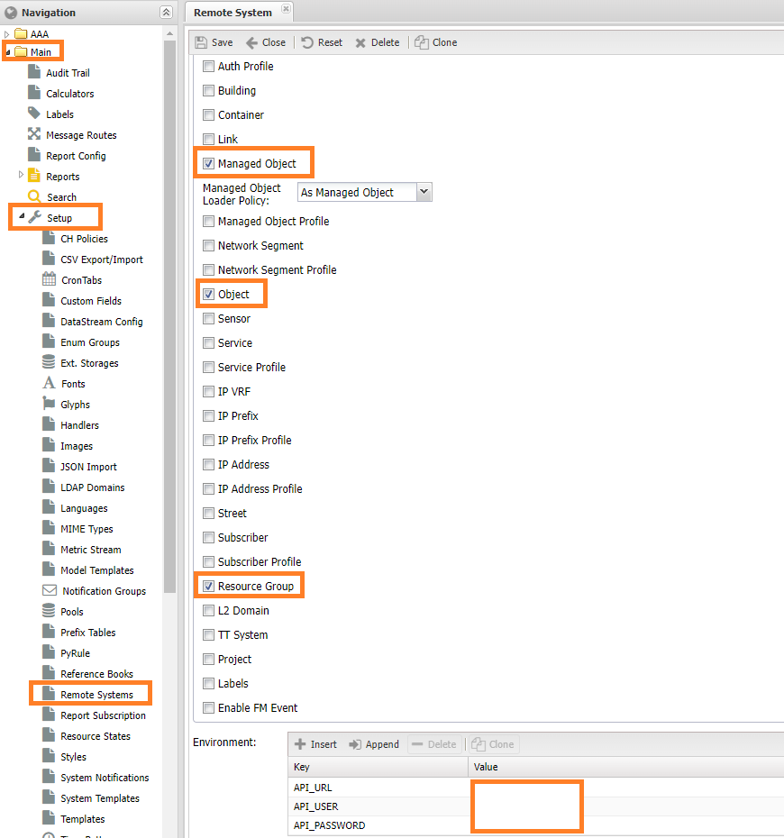

# Подключение vCenter как источника данных для NOC

Виртуализация на базе продуктов *VMWare* достаточно распространённая технология в инфраструктуре. В отличие от традиционных сетевых устройств - коммутаторы, маршрутизаторы, хосты присутствует некоторые отличия в работе с ней:

1. Специфика *гипервизора* (*Hypervisor*), представляющего собой контейнер (*Container*) с сетевым оборудованием и другими хостами.
2. Сбор данных осуществляется с ПО *vCenter*, представляющим собой систему управления для кластера *гипервизоров* (*Hypervisors*)
3. Возможность миграции хостов (*vHost*) между гипервизорами

Для работы с *vCenter* задействуются следующие компоненты НОКа:

1. Механизм *ETL* для выгрузки устройств (*Managed Object*) вида *гипервизор* (*Hypervisor*) и *виртуальная машина* (*vMachine*)
2. Опрос гипервизоров идёт через механизм контроллера (*Controller*), когда взаимодействие при запуске скрипта профиля (*SA Profile*) происходит с *vCenter*
3. Механизм SA использует отдельный метод - **vim**, являющийся обёрткой надо библиотекой [pyvmomi](https://github.com/vmware/pyvmomi)

!!! warning

    Для работы с vCenter необходимо установить библиотеку *pyvmomi* на хостах с процессами *активаторов* (*Activator*) НОКа командой `./bin/pip install pyvmomi` выполненной из папки НОКа. После установки перезапустить систему.

Рассмотри по пунктам как начать работу с *vCenter* в НОКе.

## Добавление внешней системы

Благодаря механизму *ETL* НОК может забирать информацию по составу кластера интегрируясь с *vCenter*. В составе НОКа есть адаптер для интеграции, расположенный в `noc.core.etl.extractor.vcenter.VCenterRemoteSystem`. Для его задействования необходимо настроить **Внешнюю систему** (*Remote System*), раздел меню *Основные (Main) -> Настройки (Setup) -> Внешние системы (Remote System)*. В нём выполнить следующие шаги:

1. Нажать кнопку *Добавить* (*Add*). Откроется форма добавления системы
2. Внести данные в представленные поля:
    1. **Имя** (*Name*) может быть любое слово, в инструкции используется `VCENTER`
    2. **Обработчик** (*Handler*) - путь до адаптера, вводим `noc.core.etl.extractor.vcenter.VCenterRemoteSystem`
    3. Среди представленных галочек отмечаем следующие: `Managed Object`, `Object`, `Resource Group`
    4. В поле **Environment** вносим реквизиты подключения к *vCenter*:
        1. *API_URL* - имя (или IP адрес) на котором установлен *vCenter*
        2. *API_USER* - пользователь для доступа
        3. *API_PASSWORD* - пароль пользователя
3. Получим форму, заполненную аналогично скриншоту ниже
4. Нажимаем кнопка *Сохранить* (*Save*)



Если всё прошло без ошибок в списке должна отобразиться добавленная запись с указанным именем.

При загрузке устройствам (*Managed Object*) назначается **Профиль Аутентификации** (*Auth Profile*) - `default.vcenter`. Его необходимо создать заранее, прописал реквизиты доступа (пользователь и пароль) к `vCenter`. Это делается в разделе *Управление устройствами (Service Activation) -> Настройки (Setup) -> Профиль Аутентификации (Auth Profile)*.

Также загруженные устройства размещаются в **Зоне ответственности** (*Administrative Domain*) - `default` и **Сегменте** (*Network Segment*) - `ALL`. Они всегда присутствуют в системе, но лучше убедиться что их не удалили (или переименовали). Сделать это можно в разделах *Управление устройствами (Service Activation) -> Настройки (Setup) -> Зона ответственности (Administrative Domain)* и *Учёт объектов (Inventory) -> Настройки (Setup) -> Сегменты сети (Network Segment)*.

Для настроек используются следующие **профили объекта** (*Object Profile*):

* `host.vcenter.default` - для vCenter
* `host.hypervisor.default` - для гипервизора *Hypervisor*
* `host.default` - для хоста

## Выгрузка данных

После добавления внешней системы необходимо запустить процедуру выгрузки данных. Это делается через консольную команду `./noc etl`. Для её запуска необходимо перейти в папку с установленным НОКом - `/opt/noc` и проделать следующие шаги:

1. Запустить получения данных из *vCenter* командой `./noc etl extract VCENTER`, вместо `VCENTER` необходимо указать имя, заданное при добавлении внешней системы.
2. Проверить что какие-то записи выгрузились можно командой `./noc etl diff --summary VCENTER`, на экране отобразится статистика по полученным записям.
3. После окончания синхронизации (при отсутствии ошибок) выполняем проверку данных командой `./noc etl check VCENTER`. В случае обнаружения ошибок, необходимо вернуться на предыдущий шаг и проверить произведённые настройки.
4. Для загрузки полученных записи в систему следует выполнить команду `./noc etl load VCENTER`

Если всё прошло успешно, то в разделе устройств (*Managed Object*) NOCa, появляется записи соответствующие гипервизорам (*Hypervisor*), виртуальным машинам (*Virtual Machine*) и запись для *vCenter*. Для них указан соответствующие *профиль* (*SA Profile*):

* *VMWare.vCenter* - для vCenter
* *VMWare.vHost* - для гипервизора
* *VMWare.vMachine* - для виртуальной машины

## Опрос оборудования

После появления устройств (*Managed Object*) можно активировать соответствующие опросы в *Профилях объектов* (*Object Profile*). Реализованы следующие опросы

| Профиль           | версия |  ИД  | интерфейсы | LLDP | NRI  |
| ----------------- | :----: | :--: | :--------: | :--: | ---- |
| *VMWare.vCenter*  |   v    |  x   |     x      |  x   | x    |
| *VMWare.vHost*    |   v    |  v   |     v      |  v   | v    |
| *VMWare.vMachine* |   v    |  v   |     v      |  x   | v    |

Для построения связей (*Link*) между гипервизором и сетью поддерживается протокол *LLDP*, для его работы необходимо активировать соответствующую опцию на гипервизоре. Для связей между гипервизором и виртуальной машиной используется протокол **NRI**, поскольку они описаны в конфигурации *vCenter*.

## Доработка скриптов для работы с vim

Для взаимодействия скриптов с *vCenter* используется библиотека  [pyvmomi](https://github.com/vmware/pyvmomi), вызов происходит через обращение `self.vim` в скрипте, например, получение данных о *vCenter* выглядит следующим образом:

```python
    def execute_cli(self):
        v = self.vim.content.about
        return {
            "vendor": "VMWare",
            "platform": str(v.name),
            "version": v.version,
        }

```

## Режим работы без использования vCenter

!!! warning

    На данные момент такая возможность не реализована
